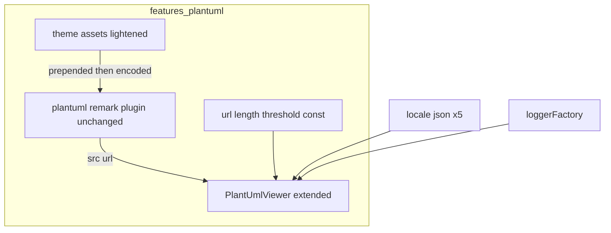
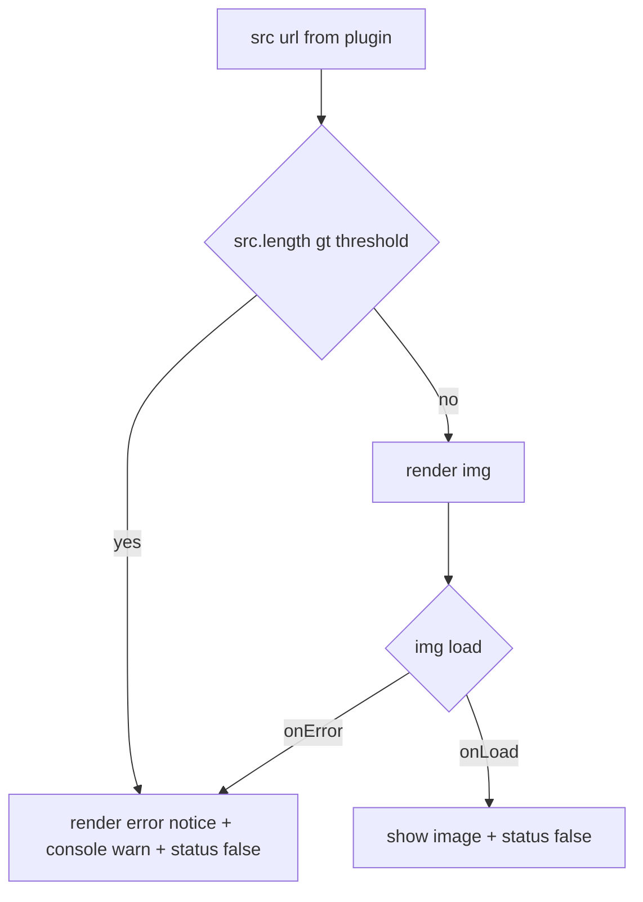

# Technical Design — plantuml-large-diagram-get

## Overview
**Purpose**: GET経路のPlantUML描画で、大きい図の体験を2点改善する ── (1) 付加テーマを軽量化してエンコード後URLを縮め、より多くの図を描画可能にする。(2) それでも上限を超える図には、分かりやすい画面エラー＋コンソール警告を出し「バグではなく制限」であることを伝える。
**Users**: 自前サーバを持たない利用者（公開plantuml.com / GROWI.cloud 含む全ユーザー）。
**Impact**: `features/plantuml` 内の**テーマ資産の縮小**と**`PlantUmlViewer` の拡張**のみ。GET送信・エンコード方式・auto-scroll等の枠組みは不変。極端に巨大な図の完全描画は別spec `plantuml-post-optin`（POST）が担う。

### Goals
- テーマ軽量化でエンコード後URLを短縮（ダークモード維持・図種別CSSなし）。
- 軽量化の効きを**実測**で確認（基準図が描画可能になるか）。
- GET描画失敗時に**分かりやすいエラー表示＋console警告**（onErrorを主判定、固定・安全側の閾値を保険）。

### Non-Goals
- POST送信による根本回避（別spec `plantuml-post-optin`）。
- 図の種類に応じたCSS切替（決定事項として不採用）。
- テーマの完全撤去（不採用。ダークモード維持のため）。
- サーバ/プロキシのURL長上限そのものの変更、閾値の設定化（固定）。

## Boundary Commitments

### This Spec Owns
- テーマ資産 `themes/carbon-gray-{common,light,dark}.puml.ts` の**内容の軽量化**（単一・静的テーマのまま縮小）。
- `PlantUmlViewer` の**URL長プリチェック**・**描画失敗検知（onError）**・**エラー表示UI**・**console警告**。
- 判定閾値の**固定定数**、およびエラーメッセージの**i18n（5ロケール）**。

### Out of Boundary
- POST経路・送信方式設定（`plantuml-post-optin`）。
- GET経路のエンコード実装（`@akebifiky/remark-simple-plantuml`）・URL生成の枠組み。
- 図種別スタイル選択、閾値の設定化。

### Allowed Dependencies
- 既存 `loggerFactory`（`~/utils/logger`、Mermaid手本）、`next-i18next` の `useTranslation`。
- 既存テーマ import 経路（`plantuml.ts` の `import ... from '../themes/carbon-gray-*.puml'`）は不変（中身だけ縮小）。
- ロケール資産 `apps/app/public/static/locales/*/translation.json`。

### Revalidation Triggers
- `PlantUmlViewer` の props 追加（もしあれば）→ `renderer.tsx` のマッピング／`PlantUmlViewer.spec.tsx`。
- 閾値定数の配置・値変更 → 参照箇所。
- テーマ資産から削除した要素に依存していた図の見た目（ダーク/ライト）→ 目視回帰。

## Architecture

### Existing Architecture Analysis
- `plantuml.ts`(:29) がテーマを図ソース先頭へ前置 → `@akebifiky/remark-simple-plantuml` が `image` ノード化（`node.url = <baseUrl>/svg/<deflate+base64>`）→ 2nd visit(:50-64) が `src = node.url` を `hName:'plantuml'` 要素の `hProperties.src` に格納。`plantumlUri.length===0` で早期return(:43)。
- `PlantUmlViewer.tsx`(32行): props は `src` のみ。`<div [status]='true'></div>`。onLoad/onErrorとも `handleLoaded` が status を `'false'` にするだけ（成否を区別しない）。
- テーマ資産は**素のTS文字列モジュール**（`export default style`）。特別なローダ無し ＝ **文字列編集で縮小可**。common(12.8KB) の `<style>` beta図ブロック(:446-698) と light/dark の未使用パレットが主要な重量。
- 手本: `MermaidViewer`(logger＋status遷移)、`DrawioViewerWithEditButton`(`useTranslation`/`t`)。

### Architecture Pattern & Boundary Map


**Architecture Integration**
- Selected pattern: **既存拡張（Extend）**。新アーキ・新依存なし。テーマは中身縮小、`PlantUmlViewer` に判定＋エラーUIを追加。
- **onError主・閾値保険**: 実際の描画失敗（onError）を真の判定とし、閾値は「明らかに巨大なURL」を先回りで弾く**極端に高い固定値**（誤検知回避。詳細は url-length threshold const 節）。
- 既存維持: ``描画、`GROWI_IS_CONTENT_RENDERING_ATTR` の status遷移、rehype-sanitize（`src` 許可は不変）。

### 依存方向（強制）
`consts(閾値)` / `locales` / `logger` → `PlantUmlViewer`。テーマ資産は `plantuml.ts` が import（既存・不変）。`PlantUmlViewer` はテーマを知らない（テーマは既に `src` にエンコード済み）。

### Technology Stack
| Layer | Choice | Role | Notes |
|---|---|---|---|
| Frontend | React（既存） | URL長プリチェック＋失敗検知＋エラーUI | `PlantUmlViewer` 拡張、新規依存なし |
| i18n | next-i18next（既存） | エラーメッセージ | 5ロケールにキー追加 |
| Logging | loggerFactory（既存） | console警告 | Mermaid手本 |
| Theme assets | `.puml.ts` 文字列（既存） | 軽量化 | 文字列編集のみ、ローダ不要 |

## File Structure Plan

### 変更ファイル
- `features/plantuml/themes/carbon-gray-common.puml.ts` — **軽量化の主対象**。`<style>` ブロック(:446-697) のうち**真の非UML系図の定義のみ削除**（board/gantt/json/mindmap/salt/wbs/wire/yaml）。⚠️ **`sequenceDiagram`(:452-458) と `timingDiagram`(:608-627) はUML図なので残す**（sequence の参加者間隔は削除済み `skinparam ParticipantPadding` の代替。消すと退行）。重複 `$primary_scheme()` sub-block を整理。UML主要要素の skinparam とダーク配色に効く定義は残す。パレット削減は**「style削除→参照grep→未参照のみ削除」の順**（例: timing を残すと `$RED_80` が必要）。
- `features/plantuml/themes/carbon-gray-light.puml.ts` / `carbon-gray-dark.puml.ts` — 参照されていないパレット階調を整理（`$GRAY/$LIGHT/$DARK/$PRIMARY` 等の実使用分は残す＝ダークモード維持）。
- `features/plantuml/components/PlantUmlViewer.tsx` — (1) `src.length > 閾値` のプリチェックで画像を出さずエラーUIへ、(2) `onError` を `handleLoaded` から分離し `useState` のエラーフラグ→エラーUI、(3) `useTranslation` でメッセージ、(4) `loggerFactory` で warn、(5) 成功/失敗/超過いずれも `GROWI_IS_CONTENT_RENDERING_ATTR` を `'false'` に遷移。
- `apps/app/public/static/locales/{en_US,ja_JP,fr_FR,ko_KR,zh_CN}/translation.json` — エラーメッセージ用キーを5ロケール追加。

### 新規ファイル
- `features/plantuml/consts.ts` — `PLANTUML_GET_URL_MAX_LENGTH`（固定・安全側の閾値）を定義（単一の出所）。

> エラーUIは当面 `PlantUmlViewer.tsx` 内のプレースホルダ要素として実装（小規模）。肥大化する場合のみ小コンポーネントへ抽出。`plantuml.ts` は変更しない（テーマは中身のみ縮小、判定はViewer側）。

## System Flows

### GET描画の判定フロー

**決定**
- 真の判定は **onError**（環境の実上限に依存する失敗を確実に捕捉、誤検知ゼロ）。閾値は**明らかに巨大なURLの先回り**（無駄なリクエスト回避）。
- エラー時も status を `'false'` にする（auto-scroll退行防止）。

## Requirements Traceability
| Requirement | Summary | Components | Flows |
|---|---|---|---|
| 1.1/1.2/1.3 | テーマ軽量化でURL短縮（公開サーバでも有効） | theme assets | prepend→encode |
| 2.1/2.2 | ダークモード配色維持 | theme assets（palette 残置） | — |
| 3.1 | 図種別CSS切替なし（単一静的） | theme assets | — |
| 4.1 | 描画挙動の後方互換 | theme assets, PlantUmlViewer | — |
| 5.1 | 軽量化の効きを実測 | theme assets（測定手順/テスト） | — |
| 6.1 | onErrorで失敗検知→エラー表示 | PlantUmlViewer | onError |
| 6.2 | 閾値超過は先回りでエラー | PlantUmlViewer, consts | threshold |
| 7.1/7.2 | 分かりやすいメッセージ＋対処 | PlantUmlViewer, locales | error |
| 7.3 | console警告 | PlantUmlViewer, logger | error |
| 7.4 | 他の図/本文を妨げない | PlantUmlViewer（図単位） | — |
| 7.5 | メッセージのi18n(5ロケール) | locales | — |
| 8.1/8.2 | 閾値=固定・安全側（onErrorが真判定） | consts, PlantUmlViewer | threshold |

## Components and Interfaces

| Component | Layer | Intent | Req | Contracts |
|---|---|---|---|---|
| theme assets (lightened) | Client/asset | テーマ縮小・ダーク維持・単一静的 | 1,2,3,4,5 | State |
| url-length threshold const | Client/const | 固定・安全側の判定値 | 6.2,8 | State |
| PlantUmlViewer (extended) | Client/UI | プリチェック＋失敗検知＋エラーUI＋警告 | 4,6,7,8 | State |
| oversize error message (i18n) | Client/i18n | 5ロケールのメッセージ | 7 | State |

### theme assets（軽量化）— 変更
**Responsibilities & Constraints**
- 単一・静的テーマを縮小。**ダーク配色（light/dark のパレット値）と主要UML要素の skinparam は残す**。削除は**真の非UML系図の `<style>` 定義**（board/gantt/json/mindmap/salt/wbs/wire/yaml）と未参照パレットに限る。⚠️ `<style>` 内の **`sequenceDiagram`（参加者間隔）と `timingDiagram` はUML図なので残す**。パレットは style 削除後に**参照 grep して未参照のみ削除**（未定義変数参照＝PlantUMLエラーを出さない）。
- 図種別の切替ロジックは持たない（全図一律）。前置は文字列そのままなので削減分だけURLが縮む。
- **削減は段階適用し、基準図のエンコード後URL長を都度実測**（Req 5）。目標: 主要サーバ上限（〜6,000〜8,000字）内に収める。残余は本specのエラー表示＋別specのPOSTで受ける。

**Implementation Notes**
- Integration: `plantuml.ts` の import は不変。中身のみ縮小。
- Validation: 削減後にライト/ダークで主要図種の見た目回帰を目視確認。
- Risks: 削りすぎると特定要素が既定色化 → 主要UML要素は残す。

### url-length threshold const — 新規
```typescript
// features/plantuml/consts.ts
export const PLANTUML_GET_URL_MAX_LENGTH: number; // 固定・極端に高い保険値。真の判定は onError。
```
- 値は**どのGET環境でもまず通らない極端に大きい値**に置く（例: 16,000〜32,000字級）。⚠️ 8KB(8192)程度に下げると、**上限を上げた自前GETサーバでは正常な図を誤ブロック**し得るため不可（Req 8.2）。プリチェックは「明らかに巨大なURLの無駄リクエスト回避」に限り、**実際の失敗は onError が捕捉**（Req 6.1）。設定化はしない（Req 8.1）。

### PlantUmlViewer（拡張）— 変更
**Responsibilities & Constraints**
- props は現行の `src` を維持。内部で `src.length > PLANTUML_GET_URL_MAX_LENGTH` を判定（再エンコード不要）。
- 分岐: 超過 or `onError` → **エラーUI**（`t()` メッセージ＋対処）＋ `logger.warn`。正常 → ``。
- いずれの分岐でも `GROWI_IS_CONTENT_RENDERING_ATTR` を `'false'` に遷移（Req 6/8、auto-scroll非退行）。
- 各Viewerは独立（1つの失敗が他の図・本文を妨げない、Req 7.4）。

**Contracts**: State（描画ステータス属性＋内部エラーフラグ）

**Implementation Notes**
- Integration: `next-i18next` `useTranslation` と `loggerFactory('growi:features:plantuml:PlantUmlViewer')` を追加（Mermaid手本）。
- Validation: onError/閾値超過/正常 の3分岐で status='false' を担保。
- Risks: status遷移漏れ→auto-scroll退行（テストで固定）。

### oversize error message（i18n）— 変更
- 5ロケール（en/ja/fr/ko/zh）の `translation.json` にメッセージキーを追加。
- **画面メッセージは汎用の対処のみ**（「URL長上限のため表示できない可能性」＋**図の分割・簡略化**）。
- **POST/自前サーバの推奨は本specに含めない**。POST推奨メッセージは別spec `plantuml-post-optin` が（POST利用可能な文脈で）担う。→ 本specは spec間の出荷順に依存しない。
- 技術的原因（URL長超過の可能性）は console 警告（Req 7.3）側に出す。

## Error Handling
- **クライアント**: `onError` または `src.length` 超過を捕捉し、当該図をエラーUIへ差し替え（Req 6.1/6.2/7）。他の図・本文は不影響（Req 7.4）。`logger.warn` で原因を出力（Req 7.3）。
- ページ本文の描画は妨げない。ネットワーク実失敗（サーバ拒否/切断）も onError で同じUIに集約。

## Testing Strategy

### Unit / Component
- `plantuml.spec.ts`: 軽量化後テーマが**削除ブロックを含まない**（例: `mindmapDiagram` 等の非UML `<style>` 文字列が消えている）／テーマ前置後の**ソース長が縮小**していること（light/dark両方、`it.each`）。
- `PlantUmlViewer.spec.tsx`:
  - 正常: `fireEvent.load` → `` 表示、status='false'（現行維持, 4.1）。
  - onError: `fireEvent.error` → **エラーUI表示**＋status='false'（6.1, 7）。※現行はstatusのみ検証なので拡張。
  - 閾値超過: 閾値超の `src` を渡す → 画像を出さずエラーUI（6.2, 8）。
  - i18n: `useTranslation` をモック（`t=>key`）しメッセージ描画を検証（7.5）。
  - console: `logger.warn` 呼び出しを検証（7.3）。

### 実測（Req 5・設計〜実装の検証）
- 軽量化テーマ ＋ 基準図（今回の問い合わせ図）を `plantuml-encoder` で符号化し、**エンコード後URL長が目標（<主要上限）に収まるか**を測るスクリプト/テストを1本。段階削減の判断根拠にする。

### 目視回帰
- ライト/ダークで主要図種（class/sequence/activity/component/state/note）が崩れないこと。

## Security / Performance（要点）
- Security: 追加の外部通信・入力経路なし（`src` は既存のサニタイズ済み経路）。エラーUIは静的テキスト＋i18n。
- Performance: テーマ縮小でURL・ページ転送が減る（全図で軽くなる）。閾値プリチェックは無駄な失敗リクエストを削減。
