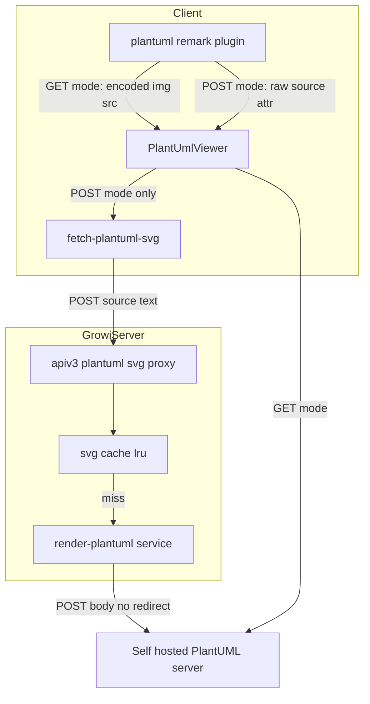
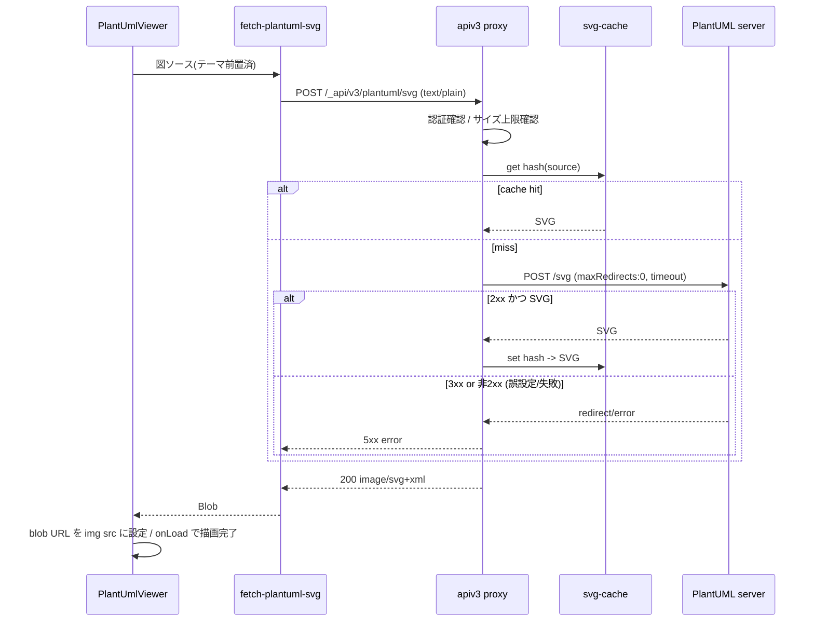

# Technical Design — plantuml-post-optin

## Overview
**Purpose**: 大きなPlantUML図がエンコード後URLの長さ超過で描画に失敗する問題を、図ソースをリクエストボディに載せて送信する **POST経路の追加（opt-in）** で根本解消する。
**Users**: 自前PlantUMLサーバを運用するGROWI管理者が設定でPOSTを有効化し、その配下の閲覧者が大きな図をリネームや分割なしに閲覧できる。
**Impact**: 既定は現行のGET（`">`）を維持。POST有効時のみ、GROWIサーバ内の描画プロキシを経由してSVGを取得し、``（blob URL）で表示する経路が追加される。

### Goals
- 送信方式（GET/POST）を管理者設定で切替可能にする（既定GET）。
- POST時、GET方式でURL長超過となる図を正しく描画する。
- 既存のGET経路・描画結果・パフォーマンスを一切変更しない。
- 受信SVGの安全な表示、送信先の限定、描画経路の悪用・過負荷対策を満たす。

### Non-Goals
- GET方式におけるテーマのURL軽量化（別spec）。
- 公開 plantuml.com でのPOST対応（サーバ側非対応＝実測により不可能）。
- PlantUMLサーバ自体の構築・運用手順の提供。
- 管理画面へのUI追加（本specは環境変数ベースの設定に限定。UI化は将来課題）。

## Boundary Commitments

### This Spec Owns
- 新設定 `app:plantumlHttpMethod`（`get` | `post`、既定 `get`）の定義とクライアント伝播。
- PlantUML描画の送信方式分岐（`features/plantuml` 配下の remark プラグインと表示コンポーネント）。
- 新設のサーバ側描画プロキシ（図ソース受領 → `PLANTUML_URI` へPOST → SVG返却）とそのSVGキャッシュ。
- POST経路のアクセス制御・入力サイズ/タイムアウト上限・誤設定検知。

### Out of Boundary
- GET経路の内部実装（`@akebifiky/remark-simple-plantuml` によるエンコード）と現行テーマ前置ロジックの見直し。
- PlantUMLサーバの提供・バージョン管理・ネットワーク到達性。
- 管理画面のUI/フォーム追加。

### Allowed Dependencies
- 設定伝播チェーン: `config-definition` → `configuration-props` → `RendererConfig`(interface) → `rendererConfigAtom` → `renderer.tsx`。
- サーバHTTP: 既存 `axios`（`ogp.ts` の外部取得パターンに準拠）。
- apiv3 ルート登録機構（`server/routes/apiv3/index.js`）と既存の認証/検証ミドルウェア。
- 既存テーマ資産 `features/plantuml/themes/*.puml.ts`。

### Revalidation Triggers
- `RendererConfig` の形状変更（`plantumlHttpMethod` 追加）→ `RendererConfig` を参照する全テスト/モック（例 `PageContentRenderer.spec.tsx`）。
- 新apiv3エンドポイント契約（`POST /_api/v3/plantuml/svg`）の変更 → クライアント取得ユーティリティ。
- `<plantuml>` カスタム要素の属性追加 → `sanitizeOption`（rehype-sanitize 許可リスト）。

## Architecture

### Existing Architecture Analysis
- PlantUML描画は `features/plantuml/` に集約。remark プラグイン [plantuml.ts](../../../apps/app/src/features/plantuml/services/plantuml.ts) が code ブロックにテーマを前置し、`@akebifiky/remark-simple-plantuml` で `GET /svg/<deflate+base64>` URL を持つ `<plantuml src>` 要素を生成。[PlantUmlViewer.tsx](../../../apps/app/src/features/plantuml/components/PlantUmlViewer.tsx) が `` として描画し、`GROWI_IS_CONTENT_RENDERING_ATTR` で auto-scroll と連携。
- 設定 `app:plantumlUri`（既定 `https://www.plantuml.com/plantuml`）は SSR props（`configuration-props.ts`）→ `RendererConfig` → Jotai atom → `renderer.tsx` で remark プラグインへ渡る。
- 外部HTTP取得の前例は [ogp.ts](../../../apps/app/src/server/routes/ogp.ts)（apiv3レベルで `axios` により取得しバイナリを返す）。
- **維持すべき統合点**: `<plantuml>` → `PlantUmlViewer` のマッピング、rehype-sanitize 許可リスト合成、rendering-status 属性ライフサイクル。

### Architecture Pattern & Boundary Map



**Architecture Integration**:
- Selected pattern: **サーバサイド・レンダリングプロキシ**（ブラウザ→GROWI→PlantUMLサーバ）。CORS回避、PlantUMLサーバの秘匿、サーバ側キャッシュ、誤設定検知を一箇所で担保。
- Feature 境界: 追加コードは `features/plantuml/{client,server}` に閉じる。設定伝播のみ既存チェーンに1項目追加。
- 既存パターン維持: `` 描画（GET/POST共通）、rendering-status 属性、rehype-sanitize 合成。
- 新コンポーネント根拠: プロキシ（CORS/秘匿/検知）、キャッシュ（Req 5）、クライアント取得ユーティリティ（POST→blob）。

### 依存方向（強制）
`interfaces/constants`（型・エンドポイント定数） → `config` → `server(cache → render → proxy route)` / `client(fetch-util → viewer)`。クライアントとサーバは共有する型・エンドポイント定数・契約のみで結合し、相互に実装を import しない。

### Technology Stack

| Layer | Choice / Version | Role in Feature | Notes |
|-------|------------------|-----------------|-------|
| Frontend | React（既存） | POST時のSVG取得と `` 描画 | 新規 `fetch-plantuml-svg` ユーティリティ |
| Backend | Express apiv3（既存） | 描画プロキシ `POST /_api/v3/plantuml/svg` | `ogp.ts` パターン準拠 |
| HTTP client | axios（既存） | PlantUMLサーバへ生テキストPOST | `maxRedirects: 0`, `timeout` 設定 |
| Cache | lru-cache（新規依存） | `hash(source)` → SVG のTTL/件数上限付きキャッシュ | 代替: モジュール内 `Map`。`.claude/rules/package-dependencies.md` に従い `dependencies` へ |
| Hash | node:crypto（標準） | ソースの sha256 でキャッシュキー生成 | 追加依存なし |

## File Structure Plan

### 新規ファイル
```
apps/app/src/features/plantuml/
├── interfaces/
│   └── post-rendering.ts        # 送信方式型('get'|'post')、エンドポイントパス定数、サイズ/タイムアウト上限定数（client/server共有）
├── client/services/
│   └── fetch-plantuml-svg.ts    # 図ソースをプロキシへPOSTしSVG Blobを返す（クライアント）
└── server/
    ├── routes/
    │   └── svg.ts               # apiv3 factory: POST受領→検証/サイズ制限→cache→render→SVG返却
    └── services/
        ├── render-plantuml.ts   # axiosでPLANTUML_URIへ生テキストPOST（maxRedirects:0, timeout）→SVG
        └── svg-cache.ts         # lru-cache（key: sha256(source)）。単一責務のキャッシュ
```

### 変更ファイル
- `server/service/config-manager/config-definition.ts` — `app:plantumlHttpMethod` を CONFIG_KEYS と defineConfig に追加（`envVarName: 'PLANTUML_HTTP_METHOD'`, 既定 `'get'`）。
- `interfaces/services/renderer.ts` — `RendererConfig` に `plantumlHttpMethod: 'get' | 'post'` を追加。
- `pages/general-page/configuration-props.ts` — `plantumlHttpMethod` を props 化（通常/share-link 両方）。
- `states/server-configurations/server-configurations.ts` — `rendererConfigAtom` 既定に `plantumlHttpMethod: 'get'` を追加。
- `client/services/renderer/renderer.tsx` — remark プラグイン登録3箇所へ `plantumlHttpMethod` を受け渡し。
- `features/plantuml/services/plantuml.ts` — `PlantUMLPluginParams` 拡張。POST時は encoded GET URL を生成せず、テーマ前置後の生ソースを `<plantuml>` 要素の属性に載せる分岐。`sanitizeOption` に新属性を許可。
- `features/plantuml/components/PlantUmlViewer.tsx` — POST時は `fetch-plantuml-svg` でSVGを取得し blob URL を `` に設定（rendering-status維持、unmountでrevoke）。GET時は現行のまま。
- `server/routes/apiv3/index.js` — `svg.ts` factory を `/plantuml` にマウント。
- テスト: `plantuml.spec.ts`, `PlantUmlViewer.spec.tsx`, `PageContentRenderer.spec.tsx`(mock更新), `config-definition.spec.ts`(key一覧), 新規 `server/routes/svg.integ.ts`。

## System Flows

### POST描画フロー（キャッシュ・誤設定検知含む）


**フロー上の決定**:
- **誤設定検知（9.3）**: `maxRedirects: 0`。POST対応サーバは200でSVGを直接返す。公開plantuml.com等は302を返すため、3xx/非2xxを一律「失敗」として扱い、黙って誤描画しない。
- **XSS（4.1）**: SVGは常に ``（blob URL）で描画。画像コンテキストではSVG内スクリプトは実行されないため、インラインSVG用サニタイザは不要。
- **過負荷（10.2）**: プロキシは本文サイズ上限超で 413、上流タイムアウトで 5xx を返し中止。

## Requirements Traceability

| Requirement | Summary | Components | Interfaces | Flows |
|-------------|---------|------------|------------|-------|
| 1.1 | 未設定は既定GET | config-definition, renderer.tsx | `plantumlHttpMethod`(既定'get') | — |
| 1.2 | POST設定で以降POST | plantuml.ts, PlantUmlViewer | plugin params | POST描画 |
| 1.3 | 変更可能な構成項目 | config-definition | env `PLANTUML_HTTP_METHOD` | — |
| 2.1 | ソースをbody送信 | fetch-plantuml-svg, proxy, render-plantuml | `POST /_api/v3/plantuml/svg` | POST描画 |
| 2.2 | 大きい図を描画 | proxy, render-plantuml | 同上 | POST描画 |
| 2.3 | 文字数/命名に非依存 | render-plantuml | body経由 | POST描画 |
| 3.1 | GET経路は現行同一 | plantuml.ts(GET分岐), PlantUmlViewer(GET分岐) | 既存 `` | — |
| 3.2 | 既定環境を不変 | config-definition(既定'get') | — | — |
| 4.1 | スクリプト非実行 | PlantUmlViewer | `` 描画 | POST描画 |
| 4.2 | 送信先の限定 | render-plantuml | `PLANTUML_URI` 固定 | POST描画 |
| 5.1 | 再表示が高速 | svg-cache | cache get/set | POST描画 |
| 5.2 | 上流へ重複要求しない | svg-cache, proxy | cache hit分岐 | POST描画 |
| 6.1 | 図単位のエラー表示 | PlantUmlViewer | error状態 | POST描画 |
| 6.2 | 他図の描画継続 | PlantUmlViewer | 独立描画 | — |
| 7.1/7.2 | ライト/ダーク維持 | plantuml.ts(テーマ前置) | 既存テーマ資産 | — |
| 8.1 | auto-scroll非退行 | PlantUmlViewer | `GROWI_IS_CONTENT_RENDERING_ATTR` | POST描画 |
| 9.1 | POST対応に依存 | render-plantuml | — | POST描画 |
| 9.2 | 非対応を明示 | config-definition(説明/docs) | env説明 | — |
| 9.3 | 誤設定を検知 | render-plantuml | `maxRedirects:0`/非2xx失敗 | POST描画 |
| 10.1 | 閲覧同等のアクセス制御 | proxy(route) | 認証ミドルウェア | POST描画 |
| 10.2 | サイズ/時間上限 | proxy, render-plantuml | 上限定数, `timeout` | POST描画 |

## Components and Interfaces

| Component | Domain/Layer | Intent | Req Coverage | Key Dependencies (P0/P1) | Contracts |
|-----------|--------------|--------|--------------|--------------------------|-----------|
| plantumlHttpMethod config | Config | 送信方式のサーバ設定とクライアント伝播 | 1.1,1.3,3.2 | config chain (P0) | State |
| plantuml.ts (remark) | Client/transform | GET/POST分岐で `<plantuml>` 要素生成 | 1.2,3.1,7.1,7.2 | RendererConfig (P0) | State |
| PlantUmlViewer | Client/UI | GET=`` / POST=fetch+blob描画、状態管理 | 3.1,4.1,6.1,6.2,8.1 | fetch-plantuml-svg (P0) | State |
| fetch-plantuml-svg | Client/service | プロキシへPOSTしSVG Blobを取得 | 2.1 | proxy contract (P0) | Service |
| plantuml svg proxy | Server/route | 受領→認証/サイズ→cache→render→SVG | 2.1,2.2,5.2,10.1,10.2 | render, cache (P0) | API |
| render-plantuml | Server/service | `PLANTUML_URI` へ生テキストPOST | 2.2,2.3,4.2,9.1,9.3,10.2 | axios (P0), PLANTUML_URI (P0) | Service |
| svg-cache | Server/service | `hash(source)`→SVG のTTL/上限キャッシュ | 5.1,5.2 | lru-cache (P1) | State |

### Client

#### plantuml.ts (remark plugin) — 拡張
**Responsibilities & Constraints**
- `PlantUMLPluginParams` に `plantumlHttpMethod` を追加。GET時は現行通り encoded URL の `<plantuml src>` を生成。POST時はテーマ前置後の**生ソース**を `<plantuml data-plantuml-source="…">`（属性名は実装で確定）に載せ、`src` は付与しない。
- `sanitizeOption` に POST用属性を追加（rehype-sanitize 許可リスト）。
- **Boundary**: テーマ前置ロジックは現行を再利用（GET/POST共通）。エンコード（`@akebifiky`）はGET時のみ。

**Contracts**: State
```typescript
type PlantumlHttpMethod = 'get' | 'post';
type PlantUMLPluginParams = {
  plantumlUri: string;
  plantumlHttpMethod: PlantumlHttpMethod;
  isDarkMode?: boolean;
};
```

#### PlantUmlViewer — 拡張
**Responsibilities & Constraints**
- GET時: 現行の ``（不変）。
- POST時: マウント時に `fetchPlantumlSvg(source)` を呼び、取得したBlobから `URL.createObjectURL` で blob URL を生成し `` に設定。`onLoad` で描画完了、失敗で error 状態（Req 6.1）。unmount 時に `URL.revokeObjectURL`。
- `GROWI_IS_CONTENT_RENDERING_ATTR` のライフサイクルは両モードで維持（Req 8.1）。各 Viewer は独立に描画・失敗（Req 6.2）。

**Contracts**: State（描画ステータス属性）／内部で Service を消費

#### fetch-plantuml-svg — 新規
**Contracts**: Service
```typescript
// 図ソース(テーマ前置済)をプロキシへPOSTし、SVGのBlobを返す
function fetchPlantumlSvg(source: string, signal?: AbortSignal): Promise<Blob>;
```
- Precondition: `source` は非空。エンドポイントは共有定数（`interfaces/post-rendering.ts`）。
- Postcondition: 2xxならSVG Blob。非2xxは reject（Viewerがerror状態化）。

### Server

#### plantuml svg proxy (apiv3 route factory) — 新規
**Responsibilities & Constraints**
- `POST /_api/v3/plantuml/svg`。閲覧と同等のアクセス制御（Req 10.1）と本文サイズ上限（Req 10.2, 超過は413）を適用。
- `svg-cache` を参照し、hit ならSVGを即返却（Req 5）。miss なら `render-plantuml` を呼び、成功時のみキャッシュ。
- **Boundary**: 送信先の決定・上流通信は `render-plantuml` に委譲（プロキシは制御・キャッシュのみ）。

**Contracts**: API

##### API Contract
| Method | Endpoint | Request | Response | Errors |
|--------|----------|---------|----------|--------|
| POST | /_api/v3/plantuml/svg | `text/plain` 本文＝図ソース | 200 `image/svg+xml` | 400 空, 401/403 認証, 413 サイズ超過, 502 上流失敗/誤設定, 504 タイムアウト |

#### render-plantuml — 新規
**Contracts**: Service
```typescript
// PLANTUML_URI の /svg へ生テキストをPOSTし、SVG文字列を返す
function renderPlantumlSvg(source: string): Promise<string>;
```
- 送信先は `configManager.getConfig('app:plantumlUri')` に固定（Req 4.2, SSRF防止。ユーザー指定URLは受けない）。
- `axios.post(urljoin(plantumlUri, '/svg'), source, { responseType: 'text', maxRedirects: 0, timeout })`。
- 3xx/非2xx/タイムアウトは例外（Req 9.3 誤設定検知・Req 10.2）。
- **Dependencies**: External: PlantUMLサーバ — SVG生成 (P0)。Outbound: axios (P0)。

#### svg-cache — 新規
**Contracts**: State
```typescript
// key: sha256(source) / value: SVG文字列
interface SvgCache {
  get(key: string): string | undefined;
  set(key: string, svg: string): void;
}
```
- `lru-cache` で `max`（件数上限）と `ttl` を設定（メモリ境界。Req 5, 10.2の一部）。値は成功SVGのみ。

## Error Handling

### Error Strategy
- **クライアント**: `fetchPlantumlSvg` の reject / 画像 `onError` を Viewer が捕捉し、当該箇所を error 状態表示（Req 6.1）。他 Viewer は独立（Req 6.2）。ページ本文の描画は妨げない。
- **サーバ（プロキシ）**: 入力空=400、サイズ超過=413、認証=401/403、上流の3xx/非2xx=502、タイムアウト=504。

### Error Categories and Responses
- User Errors(4xx): 空ソース/サイズ超過/未認証 → 明示的ステータスで拒否。
- System Errors(5xx): 上流失敗/タイムアウト → 中止しエラー返却、Viewerでエラー表示（graceful degradation）。
- 誤設定(9.3): POST非対応サーバの302等 → 5xx扱いで「黙って誤描画しない」。

### Monitoring
- プロキシは失敗（上流ステータス/タイムアウト/サイズ超過）を logger で記録（原因調査容易化）。SVG本文はログに残さない。

## Testing Strategy

### Unit Tests
- `plantuml.spec.ts`: `plantumlHttpMethod: 'get'` で現行同一の encoded `<plantuml src>` を生成（3.1）。`'post'` で `src` を付与せず生ソース属性を出力し、`sanitizeOption` が新属性を許可（1.2, 4.1準備）。
- `svg-cache`: 同一ソースで set 後 get がヒット、異なるソースで別キー（5.1, 5.2）。
- `render-plantuml`: 送信先が `plantumlUri` 固定であること、302応答/タイムアウトが例外化されること（4.2, 9.3, 10.2）— axios をモック。

### Integration Tests
- `server/routes/svg.integ.ts`: POSTでSVG 200（上流モック）／キャッシュヒットで上流未呼出（5.2）／本文サイズ超過で413（10.2）／未認証で拒否（10.1）／上流302で502（9.3）。

### Component Tests
- `PlantUmlViewer.spec.tsx`: POST分岐で `fetchPlantumlSvg` を呼び blob URL を `` に設定、成功で rendering-status 完了（8.1）、失敗で error 状態（6.1）。GET分岐は現行不変（3.1）。
- `PageContentRenderer.spec.tsx`: `mockRendererConfig` に `plantumlHttpMethod` 追加（型整合）。

### Manual/E2E（クリティカルパス）
- 自前PlantUMLサーバ＋`PLANTUML_HTTP_METHOD=post` で、GETでは414となる大きい図がリネームなしで描画される（2.1, 2.2）。ライト/ダークでテーマ反映（7.1, 7.2）。

## Security Considerations
- **SSRF**: 送信先は `PLANTUML_URI` に固定し、リクエスト由来のURLは一切使わない（4.2）。
- **XSS**: SVGは ``（blob URL）でのみ描画。画像コンテキストのためSVG内スクリプトは非実行（4.1）。インラインSVG化はしない。
- **悪用/DoS**: 描画経路は閲覧と同等のアクセス制御下（10.1）。本文サイズ上限（413）と上流タイムアウト（504）、キャッシュ件数/TTL上限でリソースを保護（10.2）。レート制限はsteeringの一般方針に委ねる。

## Performance & Scalability
- **キャッシュ**: `hash(source)` キーのLRU（TTL＋件数上限）。同一図の再表示は上流描画を回避（5.1, 5.2）。POSTはHTTPブラウザキャッシュを失うが、サーバ側キャッシュで再描画コストを吸収。
- **既知トレードオフ / Open Question**: テーマ（約14KB）をクライアントが前置して送るため、図が多いページではSSR HTML本文が増える。将来、プロキシ側でテーマを前置（クライアントは生ソース＋darkMode送信）してDOM負荷を下げる最適化余地あり。ただしテーマ資産のサーバ共有（`.puml.ts` のサーバ解決）に整合性確認が必要なため、v1はクライアント前置を採用。
