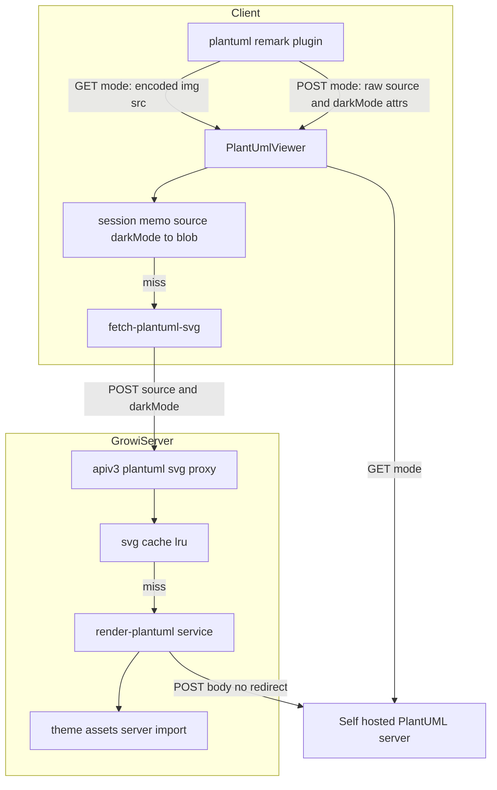
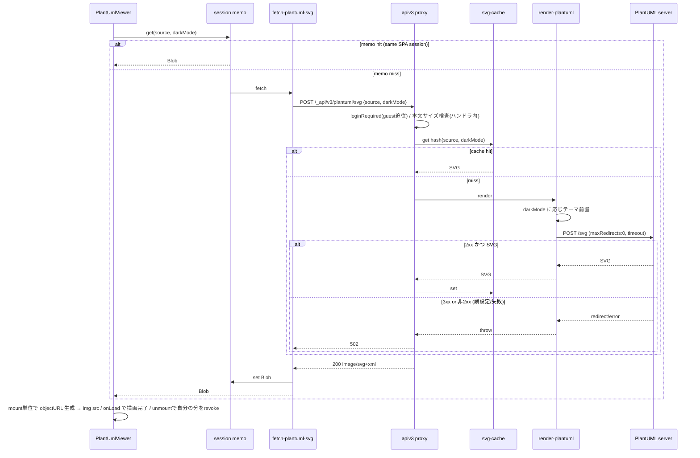

# Technical Design — plantuml-post-optin

## Overview
**Purpose**: 大きなPlantUML図がエンコード後URLの長さ超過で描画に失敗する問題を、図ソースをリクエストボディに載せて送信する **POST経路の追加（opt-in）** で根本解消する。
**Users**: 自前PlantUMLサーバを運用するGROWI管理者が設定でPOSTを有効化し、その配下の閲覧者が大きな図をリネームや分割なしに閲覧できる。
**Impact**: 既定は現行のGET（`">`）を維持。POST有効時のみ、GROWIサーバ内の描画プロキシを経由してSVGを取得し、``（blob URL）で表示する経路が追加される。

### Goals
- 送信方式（GET/POST）を管理者設定で切替可能にする（既定GET）。
- POST時、GET方式でURL長超過となる図を正しく描画する。
- 既存のGET経路・描画結果・パフォーマンスを一切変更しない。
- 受信SVGの安全な表示、送信先の限定、描画経路の悪用・過負荷対策を満たす。

### Non-Goals
- GET側の大きい図対応（テーマ軽量化＋上限超過時のエラー表示。別spec `plantuml-large-diagram-get`）。
- 公開 plantuml.com でのPOST対応（サーバ側非対応＝実測により不可能）。
- PlantUMLサーバ自体の構築・運用手順の提供。
- 管理画面へのUI追加（本specは環境変数ベースの設定に限定。UI化は将来課題）。
- POSTモードにおける SSR／印刷／PDF一括エクスポート（`bulk-export-pdf-rendering`）での図描画（**既知の限界**）。POST描画は client hydration 後の非同期取得のため、静的HTMLやサーバ側レンダリング経路には図が載らない。GETモードは従来どおり `` で機能する。puppeteer 経由エクスポートでの動作可否は実装時に要検証（動かない場合は限界として明記）。

## Boundary Commitments

### This Spec Owns
- 新設定 `app:plantumlHttpMethod`（`get` | `post`、既定 `get`）の定義とクライアント伝播。
- PlantUML描画の送信方式分岐（`features/plantuml` 配下の remark プラグインと表示コンポーネント）。
- 新設のサーバ側描画プロキシ（生ソース＋darkMode受領 → テーマ前置 → `PLANTUML_URI` へPOST → SVG返却）とそのSVGキャッシュ。
- POST経路のアクセス制御・入力サイズ/タイムアウト上限・誤設定検知。

### Out of Boundary
- GET経路の内部実装（`@akebifiky/remark-simple-plantuml` によるエンコード）と現行テーマ前置ロジックのGET側見直し。
- PlantUMLサーバの提供・バージョン管理・ネットワーク到達性。
- 管理画面のUI/フォーム追加。
- ページ単位のアクセス権限照合（本経路はページ文脈を持たない。インスタンスのゲスト許可ポリシーに追従する粗粒度制御に留める）。

### Allowed Dependencies
- 設定伝播チェーン: `config-definition` → `configuration-props` → `RendererConfig`(interface) → `rendererConfigAtom` → `renderer.tsx`。
- サーバHTTP: 既存 `axios`（`ogp.ts` の外部取得パターンに準拠）。
- apiv3 ルート登録機構（`server/routes/apiv3/index.js`）と既存の認証（`loginRequired`）／検証ミドルウェア。
- 既存テーマ資産 `features/plantuml/themes/*.puml.ts`（サーバ側からも import 可能な純粋な文字列モジュール）。

### Revalidation Triggers
- `RendererConfig` の形状変更（`plantumlHttpMethod` 追加）→ `RendererConfig` を参照する全テスト/モック（例 `PageContentRenderer.spec.tsx`）。
- 新apiv3エンドポイント契約（`POST /_api/v3/plantuml/svg`）の変更 → クライアント取得ユーティリティ。
- `<plantuml>` カスタム要素の属性追加 → `sanitizeOption`（rehype-sanitize 許可リスト）。
- テーマ資産のサーバ側 import 可否が崩れた場合 → プロキシのテーマ前置。

## Architecture

### Existing Architecture Analysis
- PlantUML描画は `features/plantuml/` に集約。remark プラグイン [plantuml.ts](../../../apps/app/src/features/plantuml/services/plantuml.ts) が code ブロックにテーマを前置し、`@akebifiky/remark-simple-plantuml` で `GET /svg/<deflate+base64>` URL を持つ `<plantuml src>` 要素を生成。[PlantUmlViewer.tsx](../../../apps/app/src/features/plantuml/components/PlantUmlViewer.tsx) が `` として描画し、`GROWI_IS_CONTENT_RENDERING_ATTR` で auto-scroll と連携。
- 設定 `app:plantumlUri`（既定 `https://www.plantuml.com/plantuml`）は SSR props（`configuration-props.ts`）→ `RendererConfig` → Jotai atom → `renderer.tsx` で remark プラグインへ渡る。
- 外部HTTP取得の前例は [ogp.ts](../../../apps/app/src/server/routes/ogp.ts)（apiv3レベルで `axios` により取得しバイナリを返す）。
- テーマ資産 `themes/carbon-gray-*.puml.ts` は文字列を default export する純粋なTSモジュールで、ブラウザ専用依存を持たない（サーバ側 import 可能）。
- **維持すべき統合点**: `<plantuml>` → `PlantUmlViewer` のマッピング、rehype-sanitize 許可リスト合成、rendering-status 属性ライフサイクル。

### Architecture Pattern & Boundary Map



**Architecture Integration**:
- Selected pattern: **サーバサイド・レンダリングプロキシ**（ブラウザ→GROWI→PlantUMLサーバ）。CORS回避、PlantUMLサーバの秘匿、テーマ前置の集約、サーバ側キャッシュ、誤設定検知を一箇所で担保。
- **B1（プロキシが直接SVGを返す1往復）を採用**。B2（ハッシュを返し別GETで配信）はマルチインスタンス構成でGET側がキャッシュミス（別インスタンス）→404になり得るため不採用。B1は各POSTが本文完結で、キャッシュはあくまで最適化（miss時は手元の本文から再描画）なので水平スケールに堅牢。
- Feature 境界: 追加コードは `features/plantuml/{client,server}` に閉じる。設定伝播のみ既存チェーンに1項目追加。
- 既存パターン維持: `` 描画（GET/POST共通）、rendering-status 属性、rehype-sanitize 合成。

### 依存方向（強制）
`interfaces/constants`（型・エンドポイント定数） → `config` → `server(theme → cache → render → proxy route)` / `client(fetch-util → memo → viewer)`。クライアントとサーバは共有する型・エンドポイント定数・契約のみで結合し、相互に実装を import しない。

### Technology Stack

| Layer | Choice / Version | Role in Feature | Notes |
|-------|------------------|-----------------|-------|
| Frontend | React（既存） | POST時のSVG取得と `` 描画、セッション内メモ | 新規 `fetch-plantuml-svg` ＋メモ |
| Backend | Express apiv3（既存） | 描画プロキシ `POST /_api/v3/plantuml/svg` | `ogp.ts` パターン準拠、`loginRequired` で保護 |
| HTTP client | axios（既存） | PlantUMLサーバへ生テキストPOST | `maxRedirects: 0`, `timeout` 設定 |
| Cache | lru-cache（新規依存） | `hash(source, darkMode)` → SVG のTTL/件数上限付きキャッシュ | `.claude/rules/package-dependencies.md` に従い `dependencies` へ |
| Hash | node:crypto（標準） | ソース＋darkMode の sha256 でキャッシュキー生成 | 追加依存なし |

## File Structure Plan

### 新規ファイル
```
apps/app/src/features/plantuml/
├── interfaces/
│   └── post-rendering.ts        # 送信方式型('get'|'post')、エンドポイントパス定数、リクエスト/レスポンス型、サイズ/タイムアウト上限定数（client/server共有）
├── client/services/
│   └── fetch-plantuml-svg.ts    # 生ソース+darkModeをプロキシへPOSTしSVG Blobを返す＋セッション内メモ（source,darkMode→blob URL）
└── server/
    ├── routes/
    │   └── svg.ts               # apiv3 factory: 認証→サイズ制限→cache→render→SVG返却
    └── services/
        ├── render-plantuml.ts   # テーマ前置→axiosでPLANTUML_URIへ生テキストPOST（maxRedirects:0, timeout）→SVG
        └── svg-cache.ts         # lru-cache（key: sha256(source+darkMode)）。単一責務のキャッシュ
```
> テーマは `render-plantuml.ts` が既存 `features/plantuml/themes/*.puml.ts` をサーバ側 import して前置する（クライアントはテーマを持たない）。

### 変更ファイル
- `server/service/config-manager/config-definition.ts` — `app:plantumlHttpMethod` を CONFIG_KEYS と defineConfig に追加（`envVarName: 'PLANTUML_HTTP_METHOD'`, 既定 `'get'`）。
- `interfaces/services/renderer.ts` — `RendererConfig` に `plantumlHttpMethod: 'get' | 'post'` を追加。
- `pages/general-page/configuration-props.ts` — `plantumlHttpMethod` を props 化（通常/share-link 両方）。
- `states/server-configurations/server-configurations.ts` — `rendererConfigAtom` 既定に `plantumlHttpMethod: 'get'` を追加。
- `client/services/renderer/renderer.tsx` — remark プラグイン登録3箇所へ `plantumlHttpMethod` を受け渡し。
- `features/plantuml/services/plantuml.ts` — `PlantUMLPluginParams` 拡張。POST時は encoded GET URL を生成せず、また**テーマを前置せず**、生の図ソースと darkMode を `<plantuml>` 要素の属性に載せる分岐。`sanitizeOption` に新属性を許可。GET時は現行通り（テーマ前置＋encoded src）。
- `features/plantuml/components/PlantUmlViewer.tsx` — POST時は `fetch-plantuml-svg`（メモ経由）でSVGを取得し blob URL を `` に設定（rendering-status維持、unmountでrevoke）。GET時は現行のまま。
- `server/routes/apiv3/index.js` — `svg.ts` factory を `/plantuml` にマウント。
- テスト: `plantuml.spec.ts`, `PlantUmlViewer.spec.tsx`, `PageContentRenderer.spec.tsx`(mock更新), `config-definition.spec.ts`(key一覧), 新規 `server/routes/svg.integ.ts`。

## System Flows

### POST描画フロー（テーマ前置・キャッシュ・誤設定検知・アクセス制御含む）


**フロー上の決定**:
- **アクセス制御（10.1）**: プロキシは `loginRequired`（ゲスト許可はインスタンス設定に追従）で保護し、ページ閲覧と同じ粒度のポリシーに合わせる。ページ単位権限は文脈が無いため対象外。
- **誤設定検知（9.3）**: `maxRedirects: 0`。POST対応サーバは200でSVGを直接返す。公開plantuml.com等は302を返すため、3xx/非2xxを一律「失敗」として扱い、黙って誤描画しない。
- **XSS（4.1）**: SVGは常に ``（blob URL）で描画。画像コンテキストではSVG内スクリプトは実行されないため、インラインSVG用サニタイザは不要。
- **テーマ（7.1/7.2）**: プロキシ（`render-plantuml`）が darkMode に応じテーマを前置。クライアントはテーマを送らないためDOM・転送量が増えない。
- **キャッシュ（5.1/5.2）**: サーバLRU（`hash(source,darkMode)`）で上流再描画を回避。クライアントのセッション内メモ（**`Blob` を保持**）でSPA遷移時の再取得を回避。POSTのためブラウザHTTPキャッシュは効かないが、両キャッシュで実用速度を確保（Req 5はSHOULD）。
- **過負荷（10.2）**: プロキシは**ハンドラ内で本文サイズを検査**し上限超過は413、上流タイムアウトで 5xx を返し中止。※グローバル `bodyParser.json({limit:'50mb'})` がルート前に本文を消費するため、ルート単位パーサの `limit` では413が発火しない。`Content-Length`／`req.body` サイズをハンドラで明示検査する。

## Requirements Traceability

| Requirement | Summary | Components | Interfaces | Flows |
|-------------|---------|------------|------------|-------|
| 1.1 | 未設定は既定GET | config-definition, renderer.tsx | `plantumlHttpMethod`(既定'get') | — |
| 1.2 | POST設定で以降POST | plantuml.ts, PlantUmlViewer | plugin params | POST描画 |
| 1.3 | 変更可能な構成項目 | config-definition | env `PLANTUML_HTTP_METHOD` | — |
| 2.1 | ソースをbody送信 | fetch-plantuml-svg, proxy, render-plantuml | `POST /_api/v3/plantuml/svg` | POST描画 |
| 2.2 | 大きい図を描画 | proxy, render-plantuml | 同上 | POST描画 |
| 2.3 | 文字数/命名に非依存 | render-plantuml | body経由 | POST描画 |
| 3.1 | GET経路は現行同一 | plantuml.ts(GET分岐), PlantUmlViewer(GET分岐) | 既存 `` | — |
| 3.2 | 既定環境を不変 | config-definition(既定'get') | — | — |
| 4.1 | スクリプト非実行 | PlantUmlViewer | `` 描画 | POST描画 |
| 4.2 | 送信先の限定 | render-plantuml | `PLANTUML_URI` 固定 | POST描画 |
| 5.1 | 再表示が高速 | svg-cache, session memo | cache get/set, memo | POST描画 |
| 5.2 | 上流へ重複要求しない | svg-cache, proxy | cache hit分岐 | POST描画 |
| 6.1 | 図単位のエラー表示 | PlantUmlViewer | error状態 | POST描画 |
| 6.2 | 他図の描画継続 | PlantUmlViewer | 独立描画 | — |
| 7.1/7.2 | ライト/ダーク維持 | render-plantuml(テーマ前置) | darkMode param, テーマ資産 | POST描画 |
| 8.1 | auto-scroll非退行 | PlantUmlViewer | `GROWI_IS_CONTENT_RENDERING_ATTR` | POST描画 |
| 9.1 | POST対応に依存 | render-plantuml | — | POST描画 |
| 9.2 | 非対応を明示 | config-definition(説明/docs) | env説明 | — |
| 9.3 | 誤設定を検知 | render-plantuml | `maxRedirects:0`/非2xx失敗 | POST描画 |
| 10.1 | 閲覧同等のアクセス制御 | proxy(route) | `loginRequired`(guest追従) | POST描画 |
| 10.2 | サイズ/時間上限 | proxy, render-plantuml | 上限定数, `timeout` | POST描画 |

## Components and Interfaces

| Component | Domain/Layer | Intent | Req Coverage | Key Dependencies (P0/P1) | Contracts |
|-----------|--------------|--------|--------------|--------------------------|-----------|
| plantumlHttpMethod config | Config | 送信方式のサーバ設定とクライアント伝播 | 1.1,1.3,3.2 | config chain (P0) | State |
| plantuml.ts (remark) | Client/transform | GET/POST分岐で `<plantuml>` 要素生成 | 1.2,3.1 | RendererConfig (P0) | State |
| PlantUmlViewer | Client/UI | GET=`` / POST=fetch+blob描画、状態管理 | 3.1,4.1,6.1,6.2,8.1 | fetch-plantuml-svg (P0) | State |
| fetch-plantuml-svg + memo | Client/service | プロキシへPOSTしSVG Blobを取得、セッション内メモ | 2.1,5.1 | proxy contract (P0) | Service |
| plantuml svg proxy | Server/route | 認証→サイズ→cache→render→SVG | 2.1,2.2,5.2,10.1,10.2 | render, cache (P0) | API |
| render-plantuml | Server/service | テーマ前置→`PLANTUML_URI` へ生テキストPOST | 2.2,2.3,4.2,7.1,7.2,9.1,9.3,10.2 | axios (P0), PLANTUML_URI (P0), theme assets (P1) | Service |
| svg-cache | Server/service | `hash(source,darkMode)`→SVG のTTL/上限キャッシュ | 5.1,5.2 | lru-cache (P1) | State |

### Client

#### plantuml.ts (remark plugin) — 拡張
**Responsibilities & Constraints**
- `PlantUMLPluginParams` に `plantumlHttpMethod` を追加。GET時は現行通りテーマ前置＋encoded URL の `<plantuml src>` を生成。POST時は**テーマを前置せず**、生の図ソースと darkMode を `<plantuml data-plantuml-source data-plantuml-dark>`（属性名は実装で確定）に載せ、`src` は付与しない。
- `sanitizeOption` に POST用属性を追加（rehype-sanitize 許可リスト）。
- **Boundary**: POST時のテーマ前置はサーバ（`render-plantuml`）が担う。GET時のテーマ前置ロジックは不変。

**Contracts**: State
```typescript
type PlantumlHttpMethod = 'get' | 'post';
type PlantUMLPluginParams = {
  plantumlUri: string;
  plantumlHttpMethod: PlantumlHttpMethod;
  isDarkMode?: boolean;
};
```

#### PlantUmlViewer — 拡張
**Responsibilities & Constraints**
- GET時: 現行の ``（不変）。
- POST時: マウント時に `fetchPlantumlSvg(source, darkMode)`（メモ経由）を呼び、取得した**Blobから自身の `objectURL` を生成**して `` に設定。`onLoad` で描画完了、失敗で error 状態（Req 6.1）。**unmount 時は自身が生成した `objectURL` のみ revoke**（メモ保持のBlobは revoke しない）。
- `GROWI_IS_CONTENT_RENDERING_ATTR` のライフサイクルは両モードで維持（Req 8.1）。各 Viewer は独立に描画・失敗（Req 6.2）。

**Contracts**: State（描画ステータス属性）／内部で Service を消費

#### fetch-plantuml-svg + session memo — 新規
**Contracts**: Service
```typescript
// 生の図ソースと darkMode をプロキシへPOSTし、SVGのBlobを返す。
// 同一(source, darkMode)はセッション内メモ（module-level Map）が Promise<Blob> を保持しPOSTを重複排除。
function fetchPlantumlSvg(source: string, darkMode: boolean, signal?: AbortSignal): Promise<Blob>;
```
- Precondition: `source` は非空。エンドポイント/上限は共有定数（`interfaces/post-rendering.ts`）。
- Postcondition: 2xxならSVG Blob。非2xxは reject（Viewerがerror状態化）。
- **所有権（重要）**: メモは **`Promise<Blob>`（=Blob）を保持し、blob URL は保持しない**。`objectURL` の生成/`revokeObjectURL` は各 Viewer が **mount単位**で行う。メモ済みBlobは revoke 対象外。これによりSPA再mountで失効URLを参照するバグを防ぐ（Req 5.1）。

### Server

#### plantuml svg proxy (apiv3 route factory) — 新規
**Responsibilities & Constraints**
- `POST /_api/v3/plantuml/svg`。`loginRequired`（ゲスト許可はインスタンス設定に追従）でページ閲覧と同ポリシーの保護（Req 10.1）。本文サイズは**ハンドラ内で明示検査**し上限超過は413（Req 10.2）。※グローバル body parser（50mb）がルート前に本文を消費するため、ルート単位 `express.json({ limit })` では413が効かない。`Content-Length`/`req.body` サイズをハンドラで検査する。
- **非変更エンドポイント**: ユーザー固有の状態を変更しない（キャッシュはコンテンツ addressable でユーザーに紐づかない）。副作用のある状態変更を伴わないため CSRF トークンは要件としない（GROWI apiv3 の標準認証で足りる）。
- `svg-cache` を参照し、hit ならSVGを即返却（Req 5）。miss なら `render-plantuml` を呼び、成功時のみキャッシュ。
- **Boundary**: テーマ前置・送信先決定・上流通信は `render-plantuml` に委譲（プロキシは認証・制御・キャッシュのみ）。

**Contracts**: API

##### API Contract
| Method | Endpoint | Request | Response | Errors |
|--------|----------|---------|----------|--------|
| POST | /_api/v3/plantuml/svg | JSON `{ source: string, darkMode: boolean }` | 200 `image/svg+xml` | 400 空/不正, 401/403 認証, 413 サイズ超過, 502 上流失敗/誤設定, 504 タイムアウト |

#### render-plantuml — 新規
**Contracts**: Service
```typescript
// darkMode に応じテーマを前置し、PLANTUML_URI の /svg へ生テキストをPOSTしてSVG文字列を返す
function renderPlantumlSvg(source: string, darkMode: boolean): Promise<string>;
```
- テーマは `features/plantuml/themes/*.puml.ts` をサーバ import して前置（Req 7.1/7.2）。
- 送信先は `configManager.getConfig('app:plantumlUri')` に固定（Req 4.2, SSRF防止。リクエスト由来URLは受けない）。
- `axios.post(urljoin(plantumlUri, '/svg'), themedSource, { headers: { 'Content-Type': 'text/plain; charset=UTF-8' }, responseType: 'text', maxRedirects: 0, timeout })`。
- **【重要】文字コード**: `Content-Type: text/plain; charset=UTF-8` を必ず明示する。plantuml-server の `doPost` は `setCharacterEncoding("UTF-8")` を呼ばず、web.xml にエンコーディングフィルタも無いため、**未指定だと既定 ISO-8859-1 で解釈され、日本語を含む図（note等）が文字化けする**（今回の問い合わせは日本語図が対象）。
- 3xx/非2xx/タイムアウトは例外（Req 9.3 誤設定検知・Req 10.2）。
- **Dependencies**: External: PlantUMLサーバ — SVG生成 (P0)。Outbound: axios (P0)。Internal: theme assets (P1)。

#### svg-cache — 新規
**Contracts**: State
```typescript
// key: sha256(source + darkMode) / value: SVG文字列
interface SvgCache {
  get(key: string): string | undefined;
  set(key: string, svg: string): void;
}
```
- `lru-cache` で `max`（件数上限）と `ttl` を設定（メモリ境界。Req 5, 10.2の一部）。値は成功SVGのみ。
- マルチインスタンス構成では各インスタンスが独立にキャッシュを保持（B1のため miss 時も手元の本文から再描画でき、整合性問題は生じない）。

## Error Handling

### Error Strategy
- **クライアント**: `fetchPlantumlSvg` の reject / 画像 `onError` を Viewer が捕捉し、当該箇所を error 状態表示（Req 6.1）。他 Viewer は独立（Req 6.2）。ページ本文の描画は妨げない。
- **サーバ（プロキシ）**: 入力空/不正=400、サイズ超過=413、認証=401/403、上流の3xx/非2xx=502、タイムアウト=504。

### Error Categories and Responses
- User Errors(4xx): 空/不正ソース・サイズ超過・未認証 → 明示的ステータスで拒否。
- System Errors(5xx): 上流失敗/タイムアウト → 中止しエラー返却、Viewerでエラー表示（graceful degradation）。
- 誤設定(9.3): POST非対応サーバの302等 → 502扱いで「黙って誤描画しない」。

### Monitoring
- プロキシは失敗（上流ステータス/タイムアウト/サイズ超過）を logger で記録（原因調査容易化）。図ソース本文はログに残さない。

## Testing Strategy

### Unit Tests
- `plantuml.spec.ts`: `'get'` で現行同一のテーマ前置＋encoded `<plantuml src>` を生成（3.1）。`'post'` で `src` を付与せず、テーマ非前置の生ソース＋darkMode属性を出力し、`sanitizeOption` が新属性を許可（1.2, 4.1準備, 7系はサーバ委譲）。
- `svg-cache`: 同一(source,darkMode)で set 後 get ヒット、darkMode 違いで別キー（5.1, 5.2, 7.1/7.2）。
- `render-plantuml`: 送信先が `plantumlUri` 固定、テーマが darkMode で切替、**`Content-Type` に `charset=UTF-8` を付与**、302応答/タイムアウトが例外化（4.2, 7, 9.3, 10.2）— axios をモック。日本語を含む図で文字化けしないこと（少なくとも UTF-8 指定を検証）。
- `fetch-plantuml-svg`: 同一(source,darkMode)の2回目がメモから返りPOSTを重複しない（5.1）。

### Integration Tests
- `server/routes/svg.integ.ts`: POSTでSVG 200（上流モック）／キャッシュヒットで上流未呼出（5.2）／本文サイズ超過で413（10.2）／未認証（ゲスト非許可時）で拒否（10.1）／上流302で502（9.3）。

### Component Tests
- `PlantUmlViewer.spec.tsx`: POST分岐で `fetchPlantumlSvg` を呼び自身の `objectURL` を `` に設定、成功で rendering-status 完了（8.1）、失敗で error 状態（6.1）。unmountで自分の `objectURL` のみ revoke、**再mount時にメモ由来Blobから再取得して壊れない**（5.1所有権）。GET分岐は現行不変（3.1）。
- `PageContentRenderer.spec.tsx`: `mockRendererConfig` に `plantumlHttpMethod` 追加（型整合）。

### Manual/E2E（クリティカルパス）
- 自前PlantUMLサーバ＋`PLANTUML_HTTP_METHOD=post` で、GETでは414となる大きい図がリネームなしで描画（2.1, 2.2）。ライト/ダークでテーマ反映（7.1, 7.2）。

## Security Considerations
- **アクセス制御（10.1）**: プロキシは `loginRequired`（ゲスト許可はインスタンス設定に追従）で保護。ページ閲覧が匿名可のインスタンスでのみ匿名描画を許可し、非公開インスタンスでは要ログイン。ページ単位権限は文脈が無いため対象外（Out of Boundary）。
- **CSRF**: 本エンドポイントはユーザー固有状態を変更しない（キャッシュはコンテンツ addressable）。副作用が無いため CSRF トークンは要件としない。GROWI apiv3 標準の認証で足りる。
- **SSRF**: 送信先は `PLANTUML_URI` に固定し、リクエスト由来URLは一切使わない（4.2）。
- **XSS**: SVGは ``（blob URL）でのみ描画。画像コンテキストのためSVG内スクリプトは非実行（4.1）。インラインSVG化はしない。
- **悪用/DoS（10.2）**: **ハンドラ内サイズ検査による413**、上流タイムアウト（504）、キャッシュ件数/TTL上限でリソースを保護。レート制限は既存 `features/rate-limiter/`（グローバル適用）で自動被覆され、必要なら `API_RATE_LIMIT_*` env で当エンドポイントを厳格化。

## Performance & Scalability
- **キャッシュ**: サーバ側 `hash(source,darkMode)` LRU（TTL＋件数上限）で上流描画を回避（5.1, 5.2）。クライアントのセッション内メモ（**`Blob` 保持、blob URLは非保持**）でSPA遷移時の再取得を回避。POSTはブラウザHTTPキャッシュを失うが、両キャッシュで再描画コストを吸収（Req 5はSHOULDのため許容）。
- **B1採用の根拠**: 各POSTが本文完結でマルチインスタンスに堅牢。B2（別GET配信）は水平スケール時にGET側キャッシュミス→404の失敗モードがあるため不採用。
- **テーマ**: サーバ側前置に集約したため、図が多いページでもクライアントDOM・転送量は増えない（Issue解消）。
- **運用前提（nginx等の前段プロキシ）**: POSTはURL長制限を解消するが、上限は前段プロキシのリクエストボディ長へ移る。自前サーバ前段の nginx は `client_max_body_size` 既定 **1MB** を超えると **413** になるため、大きい図を通すには引き上げが必要。design/docs に運用注記として明記し、必要なら `render-plantuml`/proxy のサイズ上限（Req 10.2）とも整合させる。
