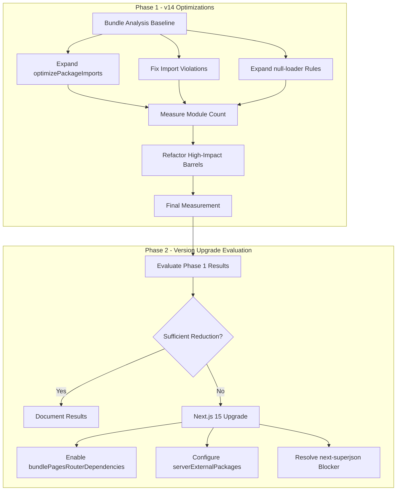
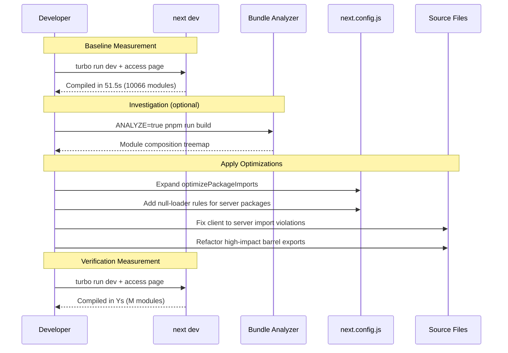

# Design Document: reduce-modules-loaded

## Overview

**Purpose**: This feature reduces the excessive module count (10,066 modules) compiled for the `[[...path]]` catch-all page in `apps/app`, improving developer experience through faster compilation times and a tighter development feedback loop.

**Users**: GROWI developers working on `apps/app` will benefit from significantly reduced `turbo run dev` compilation times when accessing pages during local development.

**Impact**: Changes the current build configuration, import patterns, and potentially the Next.js version to eliminate unnecessary module loading — particularly server-side modules leaking into the client compilation graph.

### Goals
- Reduce the `[[...path]]` page module count from 10,066 to a significantly lower number (target: measurable reduction with before/after metrics)
- Identify and fix server-side module leakage into client bundle
- Optimize barrel export patterns to prevent full module tree traversal
- Evaluate and apply Next.js official configuration options for module reduction
- If beneficial, upgrade Next.js to unlock `bundlePagesRouterDependencies` and `serverExternalPackages`

### Non-Goals
- Migration from Pages Router to App Router
- Complete elimination of barrel exports across the entire codebase
- Turbopack adoption in Phase 1 (deferred to Phase 2b due to webpack config incompatibility; see `research.md` — Turbopack Compatibility section)
- Performance optimization beyond module count reduction (runtime perf, SSR latency, etc.)

## Architecture

### Existing Architecture Analysis

GROWI `apps/app` uses Next.js 14 with Pages Router, Webpack, and the following relevant configuration:

| Mechanism | Current State | Gap |
|-----------|--------------|-----|
| `optimizePackageImports` | 11 `@growi/*` packages | Not expanded to third-party or internal barrel-heavy modules |
| null-loader (client exclusion) | `mongoose`, `dtrace-provider`, `mathjax-full` | 30+ server-only packages not covered |
| `next/dynamic` + LazyLoaded pattern | Well-implemented for modal components | Already correct — not a primary contributor |
| `@next/bundle-analyzer` | Installed, not routinely used | Useful for investigating module composition, but NOT for measuring dev compilation module count |
| `bundlePagesRouterDependencies` | Not configured | Requires Next.js 15+ |
| `serverExternalPackages` | Not configured | Requires Next.js 15+ |

**Confirmed Import Violations**:
1. `src/client/components/RecentActivity/ActivityListItem.tsx` → `~/server/util/locale-utils` (server boundary violation)
2. `src/client/components/InAppNotification/.../PageBulkExportJobModelNotification.tsx` → `~/models/serializers/.../page-bulk-export-job.ts` → `import mongoose from 'mongoose'` (server module via serializer)

**High-Impact Barrel Exports**:
- `src/states/ui/editor/index.ts` — 7 wildcard re-exports
- `src/features/page-tree/index.ts` — 3-level cascading barrels (15+ modules)
- `src/utils/axios/index.ts` — re-exports entire axios library

### Architecture Pattern & Boundary Map

**Selected pattern**: Phased configuration-driven optimization with incremental structural fixes

The optimization is divided into two phases. Phase 1 operates within the current Next.js 14 + Webpack architecture. Phase 2 evaluates and optionally executes a Next.js version upgrade based on Phase 1 results.



**Domain boundaries**:
- Build Configuration (`next.config.js`) — config-only changes, zero code risk
- Import Graph (source files) — import path fixes, moderate risk
- Framework Version (Next.js/React) — major upgrade, high risk

**Existing patterns preserved**: Pages Router, `getServerSideProps`, Jotai/SWR state management, feature-based directory structure

### Technology Stack

| Layer | Choice / Version | Role in Feature | Notes |
|-------|------------------|-----------------|-------|
| Build System | Next.js ^14.2.35 (Phase 1) / ^15.x (Phase 2) | Module bundling, compilation | Webpack bundler |
| Bundler | Webpack 5 (via Next.js) | Module resolution, tree-shaking | Turbopack deferred to Phase 2b |
| Analysis | `@next/bundle-analyzer` | Baseline and verification measurement | Already installed |
| Linting | Biome (existing) | Import boundary enforcement | Optional ESLint rule for server/client boundary |

## System Flows

### Phase 1: Optimization Flow



## Requirements Traceability

| Requirement | Summary | Components | Interfaces | Flows |
|-------------|---------|------------|------------|-------|
| 1.1-1.4 | Next.js config research | ConfigResearch | — | Phase 1 |
| 2.1-2.3 | Module count root cause analysis | DevCompilationMeasurement | — | Phase 1 |
| 3.1-3.3 | Server-side leakage prevention | ImportViolationFix, NullLoaderExpansion | — | Phase 1 |
| 3.4 | serverExternalPackages | NextjsUpgrade | next.config.js | Phase 2 |
| 4.1-4.4 | Barrel export and package import optimization | OptimizePackageImportsExpansion, BarrelExportRefactor | — | Phase 1 |
| 5.1-5.4 | Next.js version evaluation and upgrade | NextjsUpgrade | next.config.js | Phase 2 |
| 6.1-6.3 | Compilation time and module count reduction | — (outcome) | — | Both |
| 7.1-7.3 | Lazy loading verification | LazyLoadVerification | — | Phase 1 |

## Components and Interfaces

| Component | Domain | Intent | Req Coverage | Key Dependencies | Contracts |
|-----------|--------|--------|--------------|-----------------|-----------|
| DevCompilationMeasurement | Build | Measure dev module count as primary metric; bundle analyzer for investigation | 1.4, 2.1-2.3, 6.1 | Dev server log (P0), `@next/bundle-analyzer` (P1) | — |
| OptimizePackageImportsExpansion | Build Config | Expand barrel file optimization coverage | 1.1, 4.3, 4.4 | `next.config.js` (P0) | Config |
| NullLoaderExpansion | Build Config | Exclude additional server packages from client bundle | 3.1, 3.2 | `next.config.js` (P0) | Config |
| ImportViolationFix | Source | Fix confirmed client-to-server import violations | 3.1, 3.2, 3.3 | Source files (P0) | — |
| BarrelExportRefactor | Source | Refactor high-impact barrel exports to direct exports | 4.1, 4.2 | State/feature barrel files (P1) | — |
| LazyLoadVerification | Build | Verify lazy-loaded components excluded from initial compilation | 7.1-7.3 | Bundle analysis output (P1) | — |
| NextjsUpgrade | Framework | Evaluate and execute Next.js 15 upgrade | 5.1-5.4, 3.4 | next-superjson (P0 blocker), React 19 (P0) | Config |
| ConfigResearch | Documentation | Document Next.js config options and applicability | 1.1-1.3 | — | — |

### Build Configuration Domain

#### DevCompilationMeasurement

| Field | Detail |
|-------|--------|
| Intent | Measure dev compilation module count and time as the primary DX metric; use bundle analyzer as a supplementary investigation tool |
| Requirements | 1.4, 2.1, 2.2, 2.3, 6.1 |

**Responsibilities & Constraints**
- Record dev compilation output (`Compiled /[[...path]] in Xs (N modules)`) as the **primary success metric**
- Use `@next/bundle-analyzer` (`ANALYZE=true`) only as a **supplementary investigation tool** to understand which modules are included and trace import chains — NOT as the success metric
- Establish baseline before any optimization, then measure after each step
- Note: dev compilation does NOT tree-shake, so module count reflects the full dependency graph — this is exactly the metric we want to reduce

**Important Distinction**:
- `next dev` module count = modules webpack processes during on-demand compilation (no tree-shaking) → **this is what makes dev slow**
- `next build` + ANALYZE = production bundle after tree-shaking → useful for investigation but does NOT reflect dev DX

**Dependencies**
- External: `@next/bundle-analyzer` — supplementary investigation tool (P1)
- Inbound: Dev server compilation log — primary metric source (P0)

**Contracts**: —

**Implementation Notes**
- Primary measurement: `turbo run dev` → access page → read `Compiled /[[...path]] in Xs (N modules)` from log
- Clean `.next` directory before each measurement for consistent results
- Supplementary: `ANALYZE=true pnpm run app:build` to inspect module composition when investigating specific leakage paths
- Repeat measurement 3 times and take median to account for system variability

#### OptimizePackageImportsExpansion

| Field | Detail |
|-------|--------|
| Intent | Expand `optimizePackageImports` in `next.config.js` to cover barrel-heavy internal and third-party packages |
| Requirements | 1.1, 4.3, 4.4 |

**Responsibilities & Constraints**
- Add packages identified by bundle analysis as barrel-heavy contributors
- Maintain the existing 11 `@growi/*` entries
- Identify third-party packages with barrel exports not in the auto-optimized list

**Dependencies**
- Outbound: `next.config.js` `experimental.optimizePackageImports` — config array (P0)
- Inbound: BundleAnalysis — identifies which packages need optimization

**Contracts**: Config [x]

##### Configuration Interface

Current configuration to extend:

```typescript
// next.config.js — experimental.optimizePackageImports
// Existing entries preserved; new entries added based on bundle analysis
const optimizePackageImports: string[] = [
  // Existing @growi/* packages (11)
  '@growi/core',
  '@growi/editor',
  '@growi/pluginkit',
  '@growi/presentation',
  '@growi/preset-themes',
  '@growi/remark-attachment-refs',
  '@growi/remark-drawio',
  '@growi/remark-growi-directive',
  '@growi/remark-lsx',
  '@growi/slack',
  '@growi/ui',
  // Candidates for addition (validate with bundle analysis):
  // - Third-party packages with barrel exports not in auto-list
  // - Internal directories if supported by config
];
```

**Implementation Notes**
- Zero-risk config change — does not affect runtime behavior
- Validate each addition with before/after module count measurement
- Some packages may already be auto-optimized by Next.js (check against the auto-list in docs)

#### NullLoaderExpansion

| Field | Detail |
|-------|--------|
| Intent | Expand null-loader rules in webpack config to exclude additional server-only packages from client bundle |
| Requirements | 3.1, 3.2 |

**Responsibilities & Constraints**
- Add null-loader rules for server-only packages confirmed to appear in client bundle by bundle analysis
- Maintain existing rules for `dtrace-provider`, `mongoose`, `mathjax-full`
- Only add packages that are actually present in the client bundle (verify with bundle analysis first)

**Dependencies**
- Outbound: `next.config.js` `webpack()` config — null-loader rules (P0)
- Inbound: BundleAnalysis — confirms which server packages are in client bundle

**Contracts**: Config [x]

##### Configuration Interface

```typescript
// next.config.js — webpack config, client-side only (!options.isServer)
// Existing patterns preserved; candidates added after bundle analysis verification
const serverPackageExclusions: RegExp[] = [
  /dtrace-provider/,   // existing
  /mongoose/,          // existing
  /mathjax-full/,      // existing
  // Candidates (add only if confirmed in client bundle):
  // /@elastic\/elasticsearch/,
  // /passport/,
  // /@aws-sdk\//,
  // /@azure\//,
  // /@google-cloud\//,
  // /openai/,
  // /@opentelemetry\//,
  // /ldapjs/,
  // /nodemailer/,
  // /multer/,
  // /socket\.io/,
];
```

**Implementation Notes**
- Must verify each package appears in client bundle before adding rule (avoid unnecessary config)
- null-loader replaces module content with empty module — no runtime impact for correctly excluded packages
- If a package is accidentally excluded that IS needed on client, it will cause runtime errors — test thoroughly

### Source Code Domain

#### ImportViolationFix

| Field | Detail |
|-------|--------|
| Intent | Fix confirmed client-to-server import violations that cause server modules to leak into client bundle |
| Requirements | 3.1, 3.2, 3.3 |

**Responsibilities & Constraints**
- Fix the confirmed import violation in `ActivityListItem.tsx` (`~/server/util/locale-utils`)
- Fix the serializer import in `PageBulkExportJobModelNotification.tsx` (pulls in mongoose)
- Ensure fixed modules maintain identical functionality
- Establish a pattern for preventing future violations

**Dependencies**
- Inbound: BundleAnalysis — identifies import chains causing leakage (P0)

**Contracts**: —

##### Confirmed Violations to Fix

| File | Violation | Fix Strategy |
|------|-----------|-------------|
| `src/client/components/RecentActivity/ActivityListItem.tsx` | Imports `getLocale` from `~/server/util/locale-utils` | Extract `getLocale` to a client-safe utility module (the function only needs `date-fns/locale`, no server deps) |
| `src/client/components/InAppNotification/.../PageBulkExportJobModelNotification.tsx` | Imports serializer that has `import mongoose from 'mongoose'` | Split serializer: server-side `stringifySnapshot` stays in `~/models/`; client-side `parseSnapshot` moves to client-accessible module |
| `src/stores/in-app-notification.ts` | Imports `~/models/serializers/.../user` | Verify this serializer is clean (confirmed: no mongoose import). Low priority. |

**Implementation Notes**
- The `getLocale` function itself has no server dependencies — only `date-fns/locale` and `@growi/core/dist/interfaces`. The file's location in `~/server/util/` is misleading; extracting it to `~/utils/` or `~/client/util/` resolves the violation.
- For the serializer split: `parseSnapshot` is a pure JSON parsing function; `stringifySnapshot` uses mongoose and should remain server-only.
- Consider adding a lint rule to prevent `src/client/**` or `src/components/**` from importing `src/server/**`.

#### BarrelExportRefactor

| Field | Detail |
|-------|--------|
| Intent | Refactor high-impact barrel export files to reduce unnecessary module tree traversal |
| Requirements | 4.1, 4.2 |

**Responsibilities & Constraints**
- Refactor after verifying that `optimizePackageImports` expansion does not already resolve the issue
- Prioritize files with highest module count impact (determined by bundle analysis)
- Maintain backward compatibility — consumers should not need to change their import paths unless necessary

**Dependencies**
- Inbound: OptimizePackageImportsExpansion — determines which barrels are already optimized (P1)
- Inbound: BundleAnalysis — quantifies barrel impact (P1)

**Contracts**: —

##### Target Barrel Files (Priority Order)

| File | Issue | Refactor Strategy |
|------|-------|-------------------|
| `src/utils/axios/index.ts` | `export * from 'axios'` re-exports entire library | Replace with specific named exports used by consumers |
| `src/states/ui/editor/index.ts` | 7 wildcard `export *` | Convert to named re-exports; or verify `optimizePackageImports` handles it |
| `src/features/page-tree/index.ts` | 3-level cascading barrel (15+ modules) | Flatten to single-level named exports; or consumers import directly from submodules |
| `src/states/page/index.ts` | 2 wildcard + named exports | Convert to named re-exports if still problematic after config optimization |

**Implementation Notes**
- Attempt `optimizePackageImports` expansion first — if it handles barrel files for `@growi/*` packages effectively, many of these refactors become unnecessary
- For `utils/axios/index.ts`, the `export * from 'axios'` pattern is universally problematic; this should be fixed regardless of other optimizations
- Barrel refactoring may require updating import paths across many files — use IDE refactoring tools and verify with `turbo run lint:typecheck`

### Build Verification Domain

#### LazyLoadVerification

| Field | Detail |
|-------|--------|
| Intent | Verify that lazy-loaded components are correctly excluded from initial page compilation |
| Requirements | 7.1, 7.2, 7.3 |

**Responsibilities & Constraints**
- Verify the existing `*LazyLoaded` pattern (dynamic.tsx + useLazyLoader) does not contribute to initial module count
- Confirm `index.ts` files in lazy-loaded component directories only re-export from `dynamic.tsx`
- Check bundle analysis output for any lazy-loaded component modules in the initial bundle

**Dependencies**
- Inbound: BundleAnalysis — verifies exclusion from initial bundle (P1)

**Contracts**: —

**Implementation Notes**
- Gap analysis confirms the LazyLoaded pattern is already well-implemented
- This component is primarily a verification step, not a fix
- If any lazy-loaded components are found in the initial bundle, the fix follows the existing `dynamic.tsx` pattern

### Framework Upgrade Domain (Phase 2)

#### NextjsUpgrade

| Field | Detail |
|-------|--------|
| Intent | Evaluate and optionally execute Next.js 15 upgrade to unlock `bundlePagesRouterDependencies` and `serverExternalPackages` |
| Requirements | 5.1, 5.2, 5.3, 5.4, 3.4 |

**Responsibilities & Constraints**
- Only proceed if Phase 1 results indicate insufficient module reduction
- Address the `next-superjson` compatibility blocker before upgrading
- Use the official `@next/codemod` for automated migration
- Maintain React 18 compatibility with Pages Router (backward compat available in v15)

**Dependencies**
- External: `next-superjson` — SWC plugin compatibility (P0 blocker)
- External: React 19 — peer dependency (P0, but backward compat available)
- External: `@next/codemod` — migration automation (P1)

**Contracts**: Config [x]

##### Configuration Interface (Post-Upgrade)

```typescript
// next.config.js — New v15 options
const nextConfig = {
  // Enable automatic server-side dependency bundling for Pages Router
  bundlePagesRouterDependencies: true,
  // Exclude heavy server-only packages from bundling
  serverExternalPackages: [
    'mongoose',
    // Additional packages based on bundle analysis
  ],
};
```

##### Known Blockers

| Blocker | Severity | Mitigation |
|---------|----------|------------|
| `next-superjson` SWC plugin broken in v15 | Critical | Research alternatives: manual superjson in getServerSideProps, or use `superjson` directly without SWC plugin |
| `I18NextHMRPlugin` (webpack plugin) | Medium | Only affects dev HMR for i18n; can use `--webpack` flag for dev |
| React 19 peer dependency | Low | Pages Router has React 18 backward compat in v15 |
| `@next/font` removal | Low | Codemod available; switch to `next/font` |

**Implementation Notes**
- Run codemod first: `npx @next/codemod@canary upgrade latest`
- Test with `--webpack` flag to isolate bundler-related issues from framework issues
- The `bundlePagesRouterDependencies: true` setting is the highest-value v15 feature for this spec — it automatically bundles server-side deps, which combined with `serverExternalPackages` provides fine-grained control
- Research `next-superjson` alternatives during Phase 1 to have a mitigation ready

## Testing Strategy

### Verification Tests (Module Count — Primary DX Metric)
- **Primary**: Run `turbo run dev`, access page, record `Compiled /[[...path]] in Xs (N modules)` from log before and after each optimization step
- **Supplementary**: Run `ANALYZE=true pnpm run app:build` only when investigating specific module composition (e.g., tracing which server modules appear in client bundle)
- Clean `.next` directory before each measurement; repeat 3 times, take median

### Regression Tests
- `turbo run lint:typecheck --filter @growi/app` — verify no type errors from import changes
- `turbo run lint:biome --filter @growi/app` — verify no lint violations
- `turbo run test --filter @growi/app` — verify all existing tests pass
- `turbo run build --filter @growi/app` — verify production build succeeds
- Manual smoke test: access `[[...path]]` page and verify all functionality works (page rendering, editing, navigation, modals)

### Phase 2 Additional Tests
- All Phase 1 tests
- `npx @next/codemod@canary upgrade latest --dry` — preview upgrade changes
- Test superjson serialization: verify `getServerSideProps` data correctly serialized/deserialized for all page routes
- Test i18n HMR: verify locale changes reflect in dev mode (may degrade if I18NextHMRPlugin is removed)

## Performance & Scalability

**Target Metrics**:
- **Primary (DX metric)**: Dev compilation module count for `[[...path]]` page (baseline: 10,066 modules)
- **Secondary (DX metric)**: Dev compilation time for `[[...path]]` page (baseline: 51.5s)
- **Supplementary (investigation only)**: Production bundle composition via `@next/bundle-analyzer`

> **Important**: The primary metric is the dev compilation log, NOT the production bundle analyzer. Dev compilation does not tree-shake, so the module count directly reflects what makes development slow. Production bundle analysis is useful for tracing import chains but does not represent the dev experience.

**Measurement Protocol**:
1. Clean `.next` directory (`rm -rf apps/app/.next`)
2. Run `turbo run dev`
3. Navigate to `/` or any wiki page path in the browser
4. Record `Compiled /[[...path]] in Xs (N modules)` from the terminal log
5. Repeat 3 times, take median value
6. Record results in a comparison table for each optimization step

## Supporting References

### Server-Only Package Candidates for null-loader

From `apps/app/package.json`, the following packages are server-only and should be excluded from client bundle if they appear there:

| Category | Packages |
|----------|----------|
| Database | `mongoose`, `mongodb`, `mongoose-gridfs`, `mongoose-paginate-v2`, `mongoose-unique-validator` |
| Search | `@elastic/elasticsearch7`, `@elastic/elasticsearch8`, `@elastic/elasticsearch9` |
| Auth | `passport`, `passport-github2`, `passport-google-oauth20`, `passport-ldapauth`, `passport-saml` |
| Cloud Storage | `@aws-sdk/client-s3`, `@aws-sdk/s3-request-presigner`, `@azure/storage-blob`, `@google-cloud/storage` |
| AI | `openai`, `@azure/openai` |
| Identity | `@azure/identity`, `ldapjs` |
| File Upload | `multer`, `multer-autoreap` |
| Email | `nodemailer`, `nodemailer-ses-transport` |
| Real-time | `socket.io`, `y-socket.io`, `y-mongodb-provider` |
| Session/Cache | `connect-redis`, `redis` |
| Observability | `@opentelemetry/*` (8 packages) |

> Only add null-loader rules for packages confirmed present in the client bundle by bundle analysis.

### Auto-Optimized Packages (No Need to Add to optimizePackageImports)

The following packages are automatically optimized by Next.js and should NOT be added to the config:
`lucide-react`, `date-fns`, `lodash-es`, `ramda`, `antd`, `react-bootstrap`, `ahooks`, `@ant-design/icons`, `@headlessui/react`, `@headlessui-float/react`, `@heroicons/react/*`, `@visx/visx`, `@tremor/react`, `rxjs`, `@mui/material`, `@mui/icons-material`, `recharts`, `react-use`, `@material-ui/*`, `@tabler/icons-react`, `mui-core`, `react-icons/*`, `effect`, `@effect/*`
