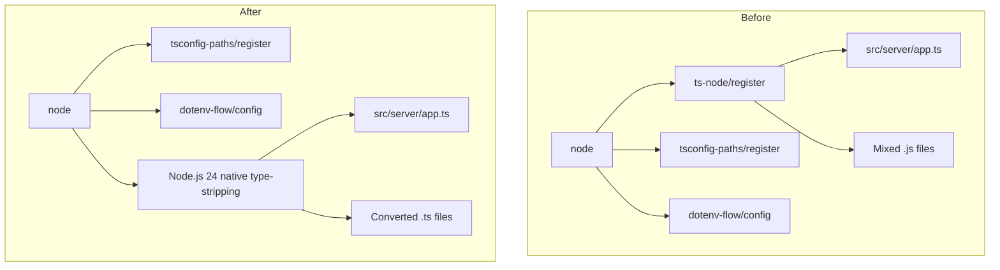

# Design Document: Remove ts-node

## Overview

**Purpose**: This feature removes the `ts-node` runtime dependency from `apps/app` development and CI scripts, replacing it with Node.js 24's native TypeScript type-stripping. This eliminates the Next.js 15 hook conflict where `nextApp.prepare()` destroys `require.extensions['.ts']` registered by ts-node.

**Users**: GROWI developers and CI pipeline will use Node.js 24 native TypeScript execution for the dev server, migrations, and REPL.

**Impact**: Changes the TypeScript execution mechanism from ts-node (SWC transpilation) to Node.js built-in type erasure. Requires renaming ~64 `.js` files to `.ts` and removing the hook conflict workaround.

### Goals
- Remove `ts-node/register/transpile-only` from `apps/app` dev/CI scripts
- Eliminate the `require.extensions['.ts']` hook save/restore workaround
- Maintain path alias resolution (`~/`, `^/`) without code changes
- Maintain `dotenv-flow/config` preloading behavior
- Clean up `ts-node` configuration from `apps/app/tsconfig.json`

### Non-Goals
- Migrating `apps/slackbot-proxy` (blocked by decorator dependency on `@tsed/*` and TypeORM — deferred to separate work)
- Removing `ts-node` from root `package.json` `devDependencies` (still needed by slackbot-proxy)
- Removing `@swc/core` or `tsconfig-paths` from root (used by other tools)
- Changing the production build pipeline (already compiles to JavaScript via `tsc`)

## Architecture

### Existing Architecture Analysis

The current dev server execution chain is:

```
node -r ts-node/register/transpile-only -r tsconfig-paths/register -r dotenv-flow/config src/server/app.ts
```

This loads three preload modules:
1. **ts-node/register/transpile-only** — registers `.ts` extension handler via `require.extensions['.ts']`, transpiles TypeScript to JavaScript using SWC
2. **tsconfig-paths/register** — patches `Module._resolveFilename` to resolve `~/` and `^/` path aliases from `tsconfig.json` `paths`
3. **dotenv-flow/config** — loads `.env*` files into `process.env`

The hook conflict occurs when Next.js 15 loads `next.config.ts`: it registers its own `require.extensions['.ts']` hook, then `deregisterHook()` deletes it — which also destroys ts-node's previously registered hook. The current workaround in `crowi/index.ts` saves and restores the hook around `nextApp.prepare()`.

### Architecture Pattern & Boundary Map



**Architecture Integration**:
- **Selected pattern**: Remove ts-node from the preload chain; rely on Node.js 24 built-in `.ts` extension handler
- **Existing patterns preserved**: `tsconfig-paths/register` for path aliases (independent of ts-node), `dotenv-flow/config` for env loading
- **New components rationale**: None — this is a removal/simplification, not an addition
- **Steering compliance**: Follows GROWI's Node.js 24 target (`"node": "^24"`)

### Technology Stack

| Layer | Choice / Version | Role in Feature | Notes |
|-------|------------------|-----------------|-------|
| Runtime | Node.js 24 | Native TypeScript type-stripping | Default in Node.js 24, no flags needed |
| Path Resolution | tsconfig-paths 4.2.0 | Runtime `~/` and `^/` alias resolution via `Module._resolveFilename` | Already in use; independent of ts-node (see `research.md`) |
| Env Loading | dotenv-flow 3.2.0 | `.env` file loading via `-r` flag | No changes needed |
| Removed | ts-node 10.9.2 | No longer used in `apps/app` | Remains in root for slackbot-proxy |

## Requirements Traceability

| Requirement | Summary | Components | Interfaces | Flows |
|-------------|---------|------------|------------|-------|
| 1.1–1.3 | Dev/CI scripts start without ts-node | PackageJsonScripts | — | Dev startup |
| 1.4–1.5 | Remove ts-node config from tsconfig.json | TsconfigCleanup | — | — |
| 1.6 | Replace ts-node composite script | PackageJsonScripts | — | — |
| 2.1–2.4 | Path aliases resolve correctly | PathAliasResolution | — | Module resolution |
| 3.1–3.3 | Hook conflict workaround removed | HookWorkaroundRemoval | — | Next.js setup |
| 4.1–4.3 | Mixed .js files continue working | JsToTsConversion | — | — |
| 5.1–5.2 | dotenv-flow continues loading | PackageJsonScripts | — | Dev startup |
| 6.1–6.2 | project-dir-utils detects config | — (already implemented) | — | — |
| 7.1 | Remove ts-node from root devDeps | — (deferred: slackbot-proxy) | — | — |
| 7.2 | Evaluate tsconfig-paths removal | — (retained: still used) | — | — |
| 7.3 | Evaluate @swc/core removal | — (retained: VSCode debug, pdf-converter) | — | — |
| 8.1–8.4 | CI jobs pass | PackageJsonScripts | — | CI pipeline |

## Components and Interfaces

| Component | Domain/Layer | Intent | Req Coverage | Key Dependencies | Contracts |
|-----------|--------------|--------|--------------|------------------|-----------|
| PackageJsonScripts | Build Config | Replace ts-node composite script with native TS execution | 1.1–1.3, 1.6, 5.1–5.2, 8.1–8.4 | tsconfig-paths (P0), dotenv-flow (P0) | — |
| TsconfigCleanup | Build Config | Remove ts-node config sections from tsconfig.json | 1.4–1.5 | — | — |
| HookWorkaroundRemoval | Server Runtime | Delete require.extensions save/restore workaround | 3.1–3.3 | Next.js (P0) | — |
| JsToTsConversion | Server Source | Rename .js → .ts for files with ESM import syntax | 4.1–4.3, 2.3 | — | — |
| EnumToConstConversion | Server Source | Convert UploadStatus enum to const object | — (enabler) | — | Service |
| PathAliasResolution | Module Resolution | Retain tsconfig-paths/register for ~/  and ^/ aliases | 2.1–2.4 | tsconfig-paths (P0) | — |

### Build Config

#### PackageJsonScripts

| Field | Detail |
|-------|--------|
| Intent | Replace the `ts-node` composite script in `apps/app/package.json` with a native Node.js 24 equivalent |
| Requirements | 1.1–1.3, 1.6, 5.1–5.2, 8.1–8.4 |

**Responsibilities & Constraints**
- Replace `"ts-node": "node -r ts-node/register/transpile-only -r tsconfig-paths/register -r dotenv-flow/config"` with `"node-dev": "node -r tsconfig-paths/register -r dotenv-flow/config"`
- Rename the script from `ts-node` to `node-dev` to avoid confusion (ts-node is no longer used)
- Update all 4 callers that reference `pnpm run ts-node` → `pnpm run node-dev`: `dev`, `launch-dev:ci`, `dev:migrate-mongo`, `repl`

**Dependencies**
- Outbound: tsconfig-paths/register — path alias resolution (P0)
- Outbound: dotenv-flow/config — env variable loading (P0)
- External: Node.js 24 — native `.ts` execution (P0)

**Implementation Notes**
- `nodemon --exec pnpm run node-dev --inspect` pattern continues to work since nodemon only watches file changes and re-executes the command

#### TsconfigCleanup

| Field | Detail |
|-------|--------|
| Intent | Remove the `ts-node` configuration section from `apps/app/tsconfig.json` |
| Requirements | 1.4–1.5 |

**Responsibilities & Constraints**
- Remove the `"ts-node": { "transpileOnly": true, "swc": true, "compilerOptions": { ... } }` section
- The `compilerOptions.module: "CommonJS"` and `moduleResolution: "Node"` settings inside `ts-node` are ts-node-specific overrides; the base config uses `"module": "ESNext"` and `"moduleResolution": "Bundler"` which are correct for the build pipeline
- Note: `apps/slackbot-proxy/tsconfig.json` cleanup is deferred (out of scope)

### Server Runtime

#### HookWorkaroundRemoval

| Field | Detail |
|-------|--------|
| Intent | Remove the `require.extensions['.ts']` save/restore workaround in `crowi/index.ts` |
| Requirements | 3.1–3.3 |

**Responsibilities & Constraints**
- Delete lines 557–566 in `src/server/crowi/index.ts` (the `savedTsHook` / `require.extensions` block)
- Node.js 24 native type-stripping does not register `require.extensions['.ts']` — it uses an internal mechanism that Next.js cannot destroy
- After removal, the Next.js setup block simplifies to just `this.nextApp = next({ dev }); await this.nextApp.prepare();`

**Dependencies**
- Inbound: Next.js 15 `nextApp.prepare()` — the trigger for the former conflict (P0)

### Server Source

#### JsToTsConversion

| Field | Detail |
|-------|--------|
| Intent | Rename `.js` files with ESM `import` syntax to `.ts` so they execute correctly under Node.js 24 native type-stripping |
| Requirements | 4.1–4.3, 2.3 |

**Responsibilities & Constraints**
- Rename 52 files that use ESM `import` syntax (which ts-node currently transpiles to CJS)
- Optionally rename the remaining 12 pure CJS files for consistency (recommended)
- No content changes needed inside files — ESM `import` + `module.exports` is valid TypeScript, and `require()` is valid with `esModuleInterop: true`
- Use `git mv` for each rename to preserve git history

**File Categories** (see `research.md` for full audit):

| Category | Count | Action |
|----------|-------|--------|
| Pure ESM (import/export only) | 8 | Rename `.js` → `.ts` |
| Mixed (ESM import + module.exports) | 44 | Rename `.js` → `.ts` |
| Pure CJS (require/module.exports only) | 12 | Rename `.js` → `.ts` (optional, for consistency) |

**Implementation Notes**
- All internal imports of these files use path aliases (`~/`, `^/`) or relative paths without extensions — `tsconfig-paths` and Node.js resolution handle `.ts` extension matching
- Imports referencing these files from `.ts` callers already omit the extension, so no caller changes are needed
- A dedicated commit for renames (before any code changes) preserves `git blame` accuracy

#### EnumToConstConversion

| Field | Detail |
|-------|--------|
| Intent | Convert `enum UploadStatus` to a const object pattern compatible with Node.js 24 native type-stripping |
| Requirements | — (enabler for 1.1–1.3) |

**Responsibilities & Constraints**
- Convert in `src/server/service/file-uploader/multipart-uploader.ts`
- The enum is used as value comparisons only (`UploadStatus.BEFORE_INIT`, etc.) — no reverse mapping (`UploadStatus[0]`) detected
- Consumers: `multipart-uploader.spec.ts`, `gcs/multipart-uploader.ts`, `aws/multipart-uploader.ts`

**Contracts**: Service [x]

##### Service Interface

Current:
```typescript
export enum UploadStatus {
  BEFORE_INIT,
  IN_PROGRESS,
  COMPLETED,
  ABORTED,
}
```

Target:
```typescript
export const UploadStatus = {
  BEFORE_INIT: 0,
  IN_PROGRESS: 1,
  COMPLETED: 2,
  ABORTED: 3,
} as const;

export type UploadStatus = (typeof UploadStatus)[keyof typeof UploadStatus];
```

- Preconditions: All consumers use `UploadStatus.MEMBER_NAME` syntax (no numeric access)
- Postconditions: `UploadStatus.BEFORE_INIT === 0`, `UploadStatus.IN_PROGRESS === 1`, etc. — identical runtime values
- Invariants: Consumers require no changes — `UploadStatus` as both value and type is preserved by the dual declaration

### Module Resolution

#### PathAliasResolution

| Field | Detail |
|-------|--------|
| Intent | Retain `tsconfig-paths/register` for runtime path alias resolution without ts-node |
| Requirements | 2.1–2.4 |

**Responsibilities & Constraints**
- `tsconfig-paths/register` is loaded via `node -r tsconfig-paths/register` before the application entry point
- It patches `Module._resolveFilename` to intercept `~/` and `^/` imports and resolve them against `tsconfig.json` `paths`
- This mechanism is independent of ts-node (see `research.md` — zero ts-node dependency, works via standard CJS module resolution)
- Node.js 24 native type-stripping does not interfere with `Module._resolveFilename` patching

**Dependencies**
- External: tsconfig-paths 4.2.0 — CJS module resolver patch (P0)
- External: `apps/app/tsconfig.json` `paths` config — alias definitions (P0)

**Implementation Notes**
- No code changes needed — the existing `tsconfig-paths/register` mechanism continues to work identically
- The only change is removing `ts-node/register/transpile-only` from the preload chain

## Testing Strategy

### Unit Tests
- `multipart-uploader.spec.ts` — verify `UploadStatus` const conversion preserves all value comparisons and error behaviors
- Existing server-side unit tests — run full suite to detect any breakage from `.js` → `.ts` renames

### Integration Tests
- Dev server startup (`pnpm run dev`) — verify server starts, loads Next.js, serves pages
- CI launch (`pnpm run launch-dev:ci`) — verify health check passes
- Migration scripts (`pnpm run dev:migrate`) — verify database migrations execute
- REPL (`pnpm run repl`) — verify interactive session starts

### Smoke Tests
- Path alias resolution: verify `~/` and `^/` imports resolve correctly in renamed `.ts` files
- `dotenv-flow` loading: verify `.env` variables are available at startup
- Next.js `next.config.ts` loading: verify no hook conflict without the workaround code

### CI Pipeline
- `ci-app-lint` — typecheck and biome pass with renamed files
- `ci-app-test` — all tests pass
- `ci-app-launch-dev` — dev server starts and responds
- `test-prod-node24 / build-prod` — production build succeeds (unaffected but verified)

## Migration Strategy

The migration is executed in ordered commits to preserve git history and enable bisection:


1. **Commit 1**: Convert `enum UploadStatus` to `const` object (isolated, testable)
2. **Commit 2**: `git mv` all `.js` → `.ts` renames (pure rename, no content changes — preserves blame)
3. **Commit 3**: Rename `ts-node` script to `node-dev`, remove `ts-node/register/transpile-only`, update all 4 callers
4. **Commit 4**: Remove hook workaround from `crowi/index.ts`
5. **Commit 5**: Remove `ts-node` section from `apps/app/tsconfig.json`

Rollback: Each commit is independently revertible. If issues arise, revert commits 3–5 to restore ts-node execution while keeping the file renames.
