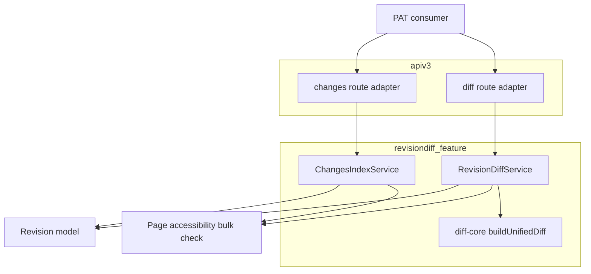
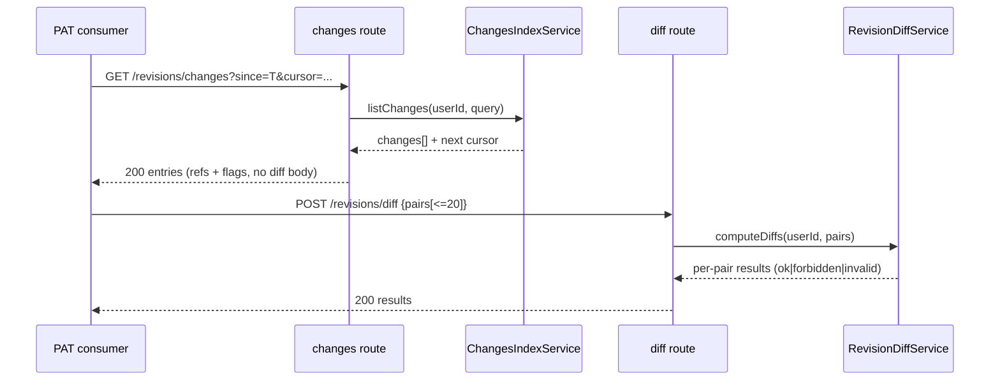

# Technical Design — revision-diff-api

## Overview

**Purpose**: PAT で認証した利用者が「自分が最近編集した内容」を全ページ横断・増分で取得できる2本の汎用 API を GROWI 本体に追加する。
**Users**: 最初の利用者は外部取り込み処理（PrimaVista の agent-memory-ingest-growi）。ただし両 API は特定利用者に依存しない汎用部品とし、GROWI 自身や他の consumer も使える。
**Impact**: 既存 apiv3 / revision モデル / PAT 認証基盤を変更せず拡張する。新規ルート2本・新規サービス・revisions への複合インデックス追加（migration）を加える。

### Goals
- 本人の変更を全ページ横断・期間指定・安定ページングで「版ペア参照＋メタ」として返す（差分本文は返さない）。
- 複数ページの版ペアをバッチで受け、ペアごとに権限検証して unified diff を返す。
- 既存の apiv3 規約・PAT 認証・ページ閲覧権限判定を再利用し、新たな認可機構を作らない。

### Non-Goals
- consumer（agent-memory-ingest-growi）側の取り込み・SDK 実装。
- GROWI 画面 UI の変更、既存クライアント差分表示（RevisionDiff）のサーバ移行。
- admin 監査ログ（activity）・user-activities の改修。
- 差分の永続化・キャッシュ層の新設（本 spec は都度計算）。

## Boundary Commitments

### This Spec Owns
- 2つの HTTP 契約: `GET /api/v3/revisions/changes`（Changes Index）と `POST /api/v3/revisions/diff`（Revision Diff）。
- 「本人の変更の発見ロジック」: 著者横断クエリ、連続編集の run まとめ、baseline 算出、cursor ページング、閲覧可否/削除フラグ付け。
- 「版ペア→unified diff」のサーバ側計算と、ペア単位の独立認可。
- revisions への複合インデックス `{ author: 1, createdAt: -1 }` の追加（migration）。
- 既存 `revisions.js` の `/:id` ルートを24桁hex制約に狭める最小改修（新ルートが衝突しないため）。

### Out of Boundary
- ページ閲覧アクセス制御そのもの（既存 Page 判定に従うだけ。新たな権限ルールは作らない）。
- PAT 発行・scope 体系・`accessTokenParser` 本体（再利用のみ、改変しない）。
- 差分の HTML 化・表示（クライアント責務）。
- consumer の同期状態管理（前回同期時刻の保持は consumer 側）。

### Allowed Dependencies
- `Revision` モデル（読み取りのみ）。
- `Page` のページ閲覧権限判定（一括判定経路を利用）。
- 既存 apiv3 ミドルウェア: `accessTokenParser([SCOPE.READ.FEATURES.PAGE], { acceptLegacy: true })`、`loginRequired`、`apiV3FormValidator`、`res.apiv3()/res.apiv3Err()`。
- `configManager`（`app:revisionDiffMaxLookbackSeconds` の読み取りのみ。遡及上限の取得に使用）。
- `diff`(v5) ライブラリ（unified diff 生成）。
- 依存方向: `interfaces` → `service`（＋`diff-core`）→ `routes`。route は service にのみ依存し、上位（route）から下位（model/page）へのみ参照する。service が route を import してはならない。

### Revalidation Triggers
以下の変更は consumer（agent-memory-ingest-growi 等）に再検証を要求する:
- `ChangeIndexEntry` / `RevisionDiffResult` のスキーマ形状変更。
- cursor トークンの意味・互換性の変更。
- ページング順序（昇順）や run まとめ規則の変更。
- 必要 scope の変更（`read:features:page` 以外への変更）。
- バッチ上限値の縮小。

## Architecture

### Existing Architecture Analysis
- 既存 `apiv3/revisions.js` は `/revisions/list`・`/revisions/:id` を提供（`SCOPE.READ.FEATURES.PAGE` 必須）。本 spec は同じ `/revisions` 名前空間に2ルート(`/changes`・`/diff`)を追加する。既存 `/:id` は1セグメントなら何でも拾うワイルドカードのため、`GET /revisions/changes` がそのまま既存 `/:id`（MongoId 検証で 400）に飲み込まれる。これを避けるため既存 `/:id` を **24桁hex 制約**（`/:id([0-9a-fA-F]{24})`）に変更し、`changes` が構造的にマッチしないようにする（Express 4.21 系で利用可。詳細は route の Implementation Note）。
- revision は prev ポインタ無し・`pageId` のみ index。差分はクライアントのみが計算（サーバ未実装）。
- 応答は `res.apiv3()/res.apiv3Err()`、swagger は JSDoc。本 spec も踏襲。

### Architecture Pattern & Boundary Map



**Architecture Integration**:
- Selected pattern: feature モジュール（薄いルート層＋サービス層）。理由は責務分離と単体テスト容易性、legacy 非改変。
- Domain boundaries: 「発見（ChangesIndexService）」と「差分（RevisionDiffService）」を分離。閲覧権限判定は両者が共有する一括判定経路に集約。
- Existing patterns preserved: apiv3 ミドルウェア順・応答ヘルパ・swagger・PAT scope。
- New components rationale: 著者横断発見ロジックと run まとめは既存に無いため新設。サーバ側差分は `diff` を pure function でラップ。
- Steering compliance: feature-based 配置、named export、pure function 抽出、immutability、英語コメント。

### Technology Stack

| Layer | Choice / Version | Role in Feature | Notes |
|-------|------------------|-----------------|-------|
| Backend / Services | Express apiv3 (既存) | 2ルートの薄いアダプタ | 新規依存なし |
| Backend / Logic | TypeScript service 層（新規） | 発見・run まとめ・差分・認可 | feature モジュール |
| Diff | `diff` v5.0.0（既存依存） | `createPatch` で unified diff 生成 | サーバ側で新規利用 |
| Data / Storage | MongoDB / Mongoose（既存） | revisions 読み取り＋複合インデックス追加 | `$setWindowFields` は 5.0+（GROWI 6.x で可） |

## File Structure Plan

### Directory Structure
```
apps/app/src/features/revision-diff/
├── interfaces/
│   ├── changes-index.ts        # ChangeIndexEntry, ChangesIndexQuery, ChangesIndexResult
│   └── revision-diff.ts        # RevisionDiffPairInput, RevisionDiffRequest, RevisionDiffResult
└── server/
    ├── diff-core.ts            # pure: buildUnifiedDiff(pagePath, fromBody, toBody, contextLines)
    ├── cursor.ts               # pure: encode/decode keyset cursor (createdAt,_id)
    ├── service/
    │   ├── changes-index-service.ts   # 著者横断クエリ・run まとめ・baseline・flag・ページング
    │   └── revision-diff-service.ts   # ペア単位認可＋差分計算
    └── routes/
        ├── changes.ts          # GET /revisions/changes (validation+middleware → service)
        └── diff.ts             # POST /revisions/diff  (validation+middleware → service)
```

### Modified Files
- `apps/app/src/server/routes/apiv3/index.*` — 新ルータ2本を `/revisions` 配下にマウント。
- `apps/app/src/server/routes/apiv3/revisions.js` — 既存 `/:id` を `/:id([0-9a-fA-F]{24})` に制約（1行）。これにより `/revisions/changes` が `/:id` に飲み込まれず新ルータへ届き、ルータ登録順への依存も消える。副作用は「非 ObjectId 1セグメントが 400→404」のみ。
- `apps/app/src/migrations/<timestamp>-add-revision-author-createdat-index.js` — NEW migration: revisions に `{ author: 1, createdAt: -1 }` を作成。
- `apps/app/src/server/models/revision.ts` — schema に同複合インデックス宣言を追加（migration と整合、コードと DB 定義の単一ソース化）。

> 各ファイルは単一責務。`diff-core.ts`・`cursor.ts` はフレームワーク非依存の pure function（単体テスト容易）。route は薄いアダプタに徹し、ロジックは service に置く。

## System Flows

### Consumer 増分同期フロー（① → ②）



**Key decisions**: ① はメタのみ・cursor 昇順で全件をページ送り。consumer は `accessible && !deleted` のペアのみ ② に渡す。② は① 由来か否かに依らずペア単位で独立認可する。

### run まとめ・ページング（Req 4, Req 3）
- run = 同一ページの版列において、他著者の版に中断されない「本人の連続編集」。
- 各本人版の「同一ページ直前版（著者問わず）」を一括取得（`$setWindowFields` partition by pageId / `$shift`。最小 MongoDB 6.0 確定のため常に利用可）し、直前版の著者が本人でなければ run の開始とみなす。
- baseline = run 開始版の直前版（無ければ null＝新規作成）、to = run の最終版。
- **ページング単位は run（エントリ）**。本人版を `(createdAt, _id)` 昇順に走査し、**完結した run のみ** emit する（run の全構成版が確定してから1エントリにし、run の途中でページ境界が来ないようにする）。cursor は emit 済み最終 run の `to` 版 `(createdAt, _id)`。
- **既出 run は不変**: 一度返した run の `from`/`to` は後から変わらない。合間に増えた本人編集は cursor より後の **新しい run** として次ページ以降に現れるだけ（過去 run の境界を書き換えない）。これにより「合間に版が増えても重複・取りこぼし無し」(3.3) と「他著者割込みで分割」(4.2) を両立する。
- **境界の扱い**: `limit` 末尾で未完の run（まだ後続の本人版が続きうる）は emit せず**次ページへ繰り越す**（cursor は最後に emit した完結 run の `to` 版を指す）。時間窓の右端（`toDate`／現在時刻）では、窓内で見えている範囲を run の完結とみなして emit し、窓より後の編集は次回同期（`since` 前進）で**新 run**として現れる。結合テストの期待値はこの規則に固定する。
- **cursor の適用位置（実装上の正確性・重要）**: cursor は **DB クエリではなく `paginateRuns` 内の in-memory で適用**する。run の baseline（`fromRevisionId`）は run 開始版の「直前版」で cursor より前の時刻になりうるため、DB 側で cursor より前の版を除外すると、cursor をまたぐ run の baseline が壊れる（直前版を取りこぼし、本人の途中版を誤って baseline にする）。さらに run 単位 keyset の cursor を DB の版単位フィルタに置き換えると、最新版時刻が他ページの run より早い run を丸ごと取りこぼす。よって窓内の run は毎ページ全量を再計算し、cursor は run 単位 keyset で in-memory 適用する。`paginateRuns` は入力を `(latestUpdatedAt, toRevisionId)` 昇順に**自前でソート**してからページングする（`buildRuns` の戻りはページ初出順であり keyset 順ではないため）。
- **合間編集の扱い（実装の特性）**: ページング途中に既出 run と連続する本人編集が増えた場合、その run は次ページで「`to` 版が前進した別エントリ（baseline は全履歴由来で正確）」として再出現する。同一エントリの重複や取りこぼしは生じない（`to` が異なる新エントリ）。内容範囲は一部重なりうるが、差分の再取得は安全側（取りこぼしより望ましい）。

## Requirements Traceability

| Requirement | Summary | Components | Interfaces | Flows |
|-------------|---------|------------|------------|-------|
| 1.1–1.5 | 本人変更の期間指定取得（メタのみ・空・範囲不正） | ChangesIndexService, changes route | `GET /revisions/changes`, ChangesIndexResult | ①→② |
| 2.1–2.2 | 本人固定（userId 入力無視） | ChangesIndexService, changes route | listChanges(userId,…) | — |
| 3.1–3.5 | cursor 安定ページング・順序・終端 | ChangesIndexService, cursor.ts | ChangesIndexResult.next | ①→② |
| 4.1–4.3 | 連続編集まとめ・他者割込み分割・新規作成 baseline | ChangesIndexService | ChangeIndexEntry.from/to | run まとめ |
| 5.1–5.4 | 閲覧可否/削除フラグ・閲覧不可は path 非開示・除外しない | ChangesIndexService, Page bulk check | ChangeIndexEntry.accessible/deleted/path | — |
| 6.1–6.5 | 複数ページ版ペアの unified diff・文脈行・上限超過拒否 | RevisionDiffService, diff-core, diff route | `POST /revisions/diff`, RevisionDiffResult | ①→② |
| 7.1–7.5 | ペア単位の独立認可（IDOR）・ページ整合・部分成功 | RevisionDiffService, Page bulk check | RevisionDiffResult(union) | ①→② |
| 8.1–8.3 | PAT 認証・未認証/権限不足拒否 | changes route, diff route | accessTokenParser+loginRequired | — |
| 9.1–9.2 | 大規模での実用性・バッチ上限 | revisions index(migration), ChangesIndexService, RevisionDiffService | `{author:1,createdAt:-1}`, MAX_PAIRS | — |
| 10.1–10.4 | 遡及範囲の上限（窓の広さ＝走査量を運用で制御） | changes route, configManager | `app:revisionDiffMaxLookbackSeconds` | — |

## Components and Interfaces

| Component | Domain/Layer | Intent | Req Coverage | Key Dependencies (P0/P1) | Contracts |
|-----------|--------------|--------|--------------|--------------------------|-----------|
| ChangesIndexService | service | 本人変更の発見・run まとめ・flag・ページング | 1,2,3,4,5,9 | Revision (P0), Page bulk check (P0) | Service, API |
| RevisionDiffService | service | ペア単位認可＋unified diff | 6,7,9 | Revision (P0), Page bulk check (P0), diff-core (P0) | Service, API |
| diff-core | pure util | createPatch ラップ | 6 | diff lib (P0) | Service |
| cursor | pure util | keyset cursor encode/decode | 3 | — | Service |
| changes route / diff route | apiv3 adapter | 認証・検証・service 委譲 | 1,6,8 | accessTokenParser (P0) | API |
| revisions index migration | data | 著者横断クエリ最適化 | 9 | MongoDB (P0) | Batch |

### service 層

#### ChangesIndexService

| Field | Detail |
|-------|--------|
| Intent | 認証ユーザー本人の変更を run 単位・cursor ページングで返す |
| Requirements | 1.1, 1.2, 1.3, 1.4, 1.5, 2.1, 2.2, 3.1, 3.2, 3.3, 3.4, 3.5, 4.1, 4.2, 4.3, 5.1, 5.2, 5.3, 5.4, 9.1 |

**Responsibilities & Constraints**
- `author == userId` の版のみを対象（本人固定。userId は route が PAT から確定して渡す）。
- run まとめ・baseline 算出を一括取得で行い、版単位の追加クエリ（N+1）を避ける。
- 結果を run 単位・`(toRevision.createdAt, toRevision._id)` 昇順で返し、cursor で安定継続（完結 run のみ emit、既出 run は不変）。
- 状態判定は索引1ページの pageId 群に対する **bulk 2クエリ**で行う: (1) `findByIdsAndViewer` で閲覧可能 pageId 集合、(2) 生 `Page.find({ _id: { $in } }, { status, path })` で存在と status。判定: (1) に在→`accessible`(path 付与)／(2) に在り `status='deleted'`→`deleted:true`(ゴミ箱)／(2) に在るが(1)に無く `status!='deleted'`→閲覧不可(`accessible:false`)／(2) に無→不在(安全側でエントリを出さない)。
- `accessible===false` または `deleted===true` の場合は `path`・現内容を一切含めない。閲覧不可・削除エントリも除外しない（不在のみ除外）。
- 完全削除されたページは revision も同時削除される（`service/page/index.ts` の `deleteCompletelyOperation` が `Revision.deleteMany`）ため索引に出ない。よって `deleted` はゴミ箱(`status='deleted'`)のみを表す `boolean`。

**Dependencies**
- Outbound: Revision モデル — 版の読み取り・前後関係（P0）
- Outbound: Page 一括閲覧判定 — 対象 pageId 群の可視性解決（P0）
- Outbound: cursor.ts — keyset の encode/decode（P1）

**Contracts**: Service [x] / API [x]

##### Service Interface
```typescript
export interface NormalizedChangesQuery {
  readonly since?: Date;      // inclusive lower bound
  readonly toDate?: Date;     // inclusive upper bound (from fromDate/toDate)
  readonly limit: number;     // resolved (default/max applied at route)
  readonly cursor?: CursorKey; // decoded keyset
}

export interface ChangesIndexService {
  listChanges(userId: string, query: NormalizedChangesQuery): Promise<ChangesIndexResult>;
}
```
- Preconditions: `userId` は認証済み本人。`query` は route で検証・正規化済み（範囲不正は route で 400）。
- Postconditions: `changes` は run 単位・昇順。`next` は続きがあれば cursor、無ければ `null`。`path` は `accessible` のときのみ存在。
- Invariants: 他著者の版を run に含めない。本人以外を対象にしない。同一 run は1エントリかつページ跨ぎで分割されない。既出 run の `from`/`to` は不変（後続編集は新 run になるだけ）。閲覧不可・削除エントリは識別子＋フラグのみで内容非開示。

#### RevisionDiffService

| Field | Detail |
|-------|--------|
| Intent | 版ペアのバッチをペア単位に認可し unified diff を返す |
| Requirements | 6.1, 6.2, 6.3, 6.4, 6.5, 7.1, 7.2, 7.3, 7.4, 7.5, 9.2 |

**Responsibilities & Constraints**
- 各ペアについて: (a) `fromRevisionId`(null 可)・`toRevisionId` が指定 `pageId` の版か検証、(b) 現在 `userId` が当該ページを閲覧可能か検証。
- (b) 不可 → `forbidden`（ページ内容・存在詳細を返さない）。(a) 不整合 or 版/ページ不在 → `invalid`。
- 認可済みペアのみ差分計算。バッチ内の成否は混在可（リクエスト全体は失敗させない）。
- `fromRevisionId === null` → 全文追加として diff 生成。
- ① 由来か否かに依らず毎回独立認可（呼び出し元を信用しない）。

**Dependencies**
- Outbound: Revision モデル — 版本文・所属検証（P0）
- Outbound: Page 一括閲覧判定（P0）
- Outbound: diff-core — unified diff 生成（P0）

**Contracts**: Service [x] / API [x]

##### Service Interface
```typescript
export interface NormalizedDiffRequest {
  readonly pairs: readonly RevisionDiffPairInput[]; // length <= MAX_PAIRS (route 検証)
  readonly contextLines: number;                    // resolved default
}

export interface RevisionDiffService {
  computeDiffs(userId: string, request: NormalizedDiffRequest): Promise<readonly RevisionDiffResult[]>;
}
```
- Preconditions: `request.pairs.length <= MAX_PAIRS`（超過は route で 400）。`userId` は認証済み本人。
- Postconditions: 入力ペアと同数の結果（順序対応）。`ok` は `diff` を含む。`forbidden`/`invalid` は内容を含まない。
- Invariants: ペアごとに独立認可。閲覧不可ページの内容を一切返さない。

### pure util / adapter

#### diff-core / cursor（summary）
```typescript
// diff-core.ts
export const buildUnifiedDiff = (
  pagePath: string,
  fromBody: string, // '' when baseline is null
  toBody: string,
  contextLines: number,
): string;

// cursor.ts
export interface CursorKey { readonly createdAt: Date; readonly id: string; }
export const encodeCursor = (key: CursorKey): string;
export const decodeCursor = (token: string): CursorKey; // throws on malformed → route maps to 400
```
**Implementation Note**: ともにフレームワーク非依存・副作用なし。cursor は不透明トークン（base64）として扱い、内部表現を契約に露出しない。

#### changes route / diff route（summary）

##### API Contract
| Method | Endpoint | Request | Response | Errors |
|--------|----------|---------|----------|--------|
| GET | /api/v3/revisions/changes | query: `since?`, `fromDate?`, `toDate?`, `limit?`, `cursor?` | `{ changes: ChangeIndexEntry[], next: string \| null }` | 400, 401, 403 |
| POST | /api/v3/revisions/diff | body: `{ pairs: RevisionDiffPairInput[], contextLines? }` | `{ results: RevisionDiffResult[] }` | 400, 401, 403 |

**Implementation Note**
- Integration: ミドルウェア順は `accessTokenParser([SCOPE.READ.FEATURES.PAGE], { acceptLegacy: true })` → `loginRequired` → express-validator → `apiV3FormValidator`。`userId = req.user._id`。swagger は JSDoc で付与。apiv3 index に `/revisions` でマウント。
- Validation: 範囲不正（`fromDate > toDate`）・不正 cursor・`pairs.length > MAX_PAIRS`・型不正は 400（`res.apiv3Err`）。
- 遡及上限（Req 10）: changes route で `configManager.getConfig('app:revisionDiffMaxLookbackSeconds')`（秒単位。env `REVISION_DIFF_MAX_LOOKBACK_SECONDS`、既定値 `2592000`＝30日の有限値、運用者が調整可）を読み、`floor = now - maxLookbackSeconds` を求める。実効下限 `lowerBound = max(since, fromDate)` が `floor` より過去なら 400（`lookback-limit-exceeded`、許容上限を提示）。`lowerBound` が未指定なら `floor` を実効下限として採用する（全期間ではなく上限窓）。`toDate`・cursor には影響しない。判定は service ではなく route（検証・正規化の責務）で行い、service には正規化済みの `since` のみ渡す。
- ルート衝突対策（Issue 1）: 既存 `revisions.js` の `/:id` を `/:id([0-9a-fA-F]{24})` に制約することで `GET /revisions/changes` が `/:id` に飲み込まれない。Express 4.21 系で正規表現パラメータ制約が使えることを前提（Express 5 では不可）。制約後はルータ登録順に依存しない。`GET /revisions/changes` が 200 を返す結合テストで担保する。

### DTO 型（interfaces/）
```typescript
// changes-index.ts
export interface ChangeIndexEntry {
  pageId: string;
  path: string | null;            // null iff accessible === false
  fromRevisionId: string | null;  // null = run はページ新規作成から始まる
  toRevisionId: string;
  authorId: string;               // 常に認証ユーザー
  latestUpdatedAt: string;        // ISO 8601 = toRevision.createdAt
  accessible: boolean;
  deleted: boolean;
}
export interface ChangesIndexResult { changes: ChangeIndexEntry[]; next: string | null; }

// revision-diff.ts
export interface RevisionDiffPairInput {
  pageId: string; fromRevisionId: string | null; toRevisionId: string;
}
export interface RevisionDiffRequest { pairs: RevisionDiffPairInput[]; contextLines?: number; }
export type RevisionDiffResult =
  | { pageId: string; toRevisionId: string; status: 'ok'; diff: string }
  | { pageId: string; toRevisionId: string; status: 'forbidden' }
  | { pageId: string; toRevisionId: string; status: 'invalid' };
export interface RevisionDiffResponse { results: RevisionDiffResult[]; }
```

## Data Models

### Logical / Physical Data Model（revisions index）
- 追加インデックス: `{ author: 1, createdAt: -1 }`（複合）。著者横断＋時系列のクエリを支える。
- 既存スキーマ・フィールドは不変更（読み取りのみ）。
- 整合: migration で本番に作成し、schema 宣言でコードと一致させる。大規模コレクションでの作成負荷は migration 実行時に考慮（バックグラウンド作成）。

## Error Handling

### Error Strategy
- 入力エラー（範囲不正・cursor 不正・ペア超過・型不正）は早期に 400（`res.apiv3Err`）。
- 認証/権限は middleware が 401/403 を返す（既存挙動準拠）。
- ② のペア単位の不可・不整合は **200 応答内の per-item status**（`forbidden`/`invalid`）で表現し、リクエスト全体は失敗させない（Req 7.4）。
- セキュリティ: `forbidden`/`invalid` はページの存在・内容・認可失敗を超える詳細を返さない（Req 7.2、5.2）。

### Monitoring
- 既存 apiv3 のロギング基盤（pino / `@growi/logger`）に従う。例外時は context 付きで error ログ、ユーザー向けメッセージは汎用化。

## Testing Strategy

### Unit Tests
- `diff-core.buildUnifiedDiff`: 通常差分／`fromBody=''` の全文追加／`contextLines` 反映（6.2, 6.3, 6.4）。
- `cursor` encode/decode: 往復一致／不正トークンで例外（3.2, 1.5 の cursor 経路）。
- ChangesIndexService run まとめ: 連続編集の集約／他著者割込みでの分割／新規作成 baseline=null（4.1, 4.2, 4.3）。
- ChangesIndexService フラグ: 閲覧不可で path 非開示／削除フラグ／除外しない（5.1, 5.2, 5.3, 5.4）。

### Integration Tests
- **ルーティング**: `GET /api/v3/revisions/changes` が既存 `/:id` に飲み込まれず 200 を返す（`/:id` 24桁hex制約の回帰防止）。既存 `GET /revisions/:id` が正規の revision id で従来どおり動く（1.1, 8.1）。
- `GET /revisions/changes`: 期間指定で本人の全ページ横断変更を返す／空結果／範囲不正 400／userId 入力を無視し本人固定（1.1, 1.3, 1.5, 2.1, 2.2）。
- **run まとめ×ページング**: 自分の連続編集が1エントリに集約／他著者割込みで分割／run がページ境界をまたいでも分割・重複しない／合間に版が増えても既出 run 不変・取りこぼし無し（3.3, 3.4, 4.1, 4.2）。
- **状態フラグ**: 閲覧可は path 付与／閲覧不可は path・内容非開示でフラグのみ／ゴミ箱は `deleted:true`／不在ページは索引に出ない（5.1, 5.2, 5.3, 5.4）。
- `POST /revisions/diff`: 複数ページのペアを unified diff で返す／閲覧不可ペアは forbidden で内容非開示／ペアとページ不整合は invalid／部分成功（6.1, 7.1, 7.2, 7.3, 7.4）。
- 認証: 未認証 401／scope 不足 403（8.1, 8.2, 8.3）。

### Performance/Load
- 大量 revision を持つ本人での `/revisions/changes` 1ページ応答が複合インデックス利用で実用時間内（9.1）。
- `/revisions/diff` が MAX_PAIRS 上限で応答サイズ・時間を抑制（9.2、6.5）。

## Security Considerations
- **本人固定（Req 2）**: 対象ユーザーは PAT 由来の `req.user` に固定。`userId` 等の入力での切替を一切受け付けない。
- **IDOR 対策（Req 7）**: ② は呼び出し元を信用せず、ペアごとに「版がそのページに属するか」「現在閲覧可能か」を独立検証。ObjectId 列挙攻撃を想定。
- **情報非開示（Req 5.2, 7.2）**: 閲覧不可・ゴミ箱ページの現 path・現内容・存在詳細を返さない。① の該当エントリは本人が元々持つ識別子（pageId/revisionId/createdAt）＋フラグのみ。不在 pageId は索引に出さない（安全側）。
- **scope**: `read:features:page` を要求（baseline 認証制御は steering / 既存 middleware に従う）。

## Performance & Scalability
- **複合インデックス必須**: `{ author: 1, createdAt: -1 }`。無いと著者横断クエリが全走査になり大規模 wiki で破綻。
- **N+1 回避**: baseline / run 検出は `$setWindowFields`（partition by pageId）で一括取得（最小 MongoDB 6.0 確定のため利用可）。
- **状態判定は索引1ページあたり bulk 2クエリ固定**: `findByIdsAndViewer` ＋ 生 `Page.find({_id:{$in}},{status,path})`。ページ単位ループ（`isAccessiblePageByViewer` を1件ずつ）を避け N+1 にしない。ゴミ箱/不在の区別は (2) の `status`・存在有無を読むだけで追加クエリ無し。
- **バッチ上限（MAX_PAIRS, 目安 20）**: ② の処理量・応答サイズを予測可能に保つ。正確値は実装定数で確定。
- **ページング毎の窓内再計算（既知の特性）**: cursor を in-memory 適用する（baseline 正確性のため。System Flows 参照）ので、各ページ要求は時間窓内の対象ページの版を再走査して run を再計算する。応答時間は「ページサイズ」ではなく「窓内対象ページの版数」に比例する。実用上は consumer が `since` を前進させる増分同期で窓を絞ることで抑える。加えて `distinct` の対象ページ集合は下限 `max(since, cursor.createdAt)` で絞り、cursor より前にしか編集の無いページを窓走査から外す（前方ページングの走査量を削減）。窓に含めたページは baseline 正確性のため全履歴を走査する（cursor より前の版も含む）点は不可避。極端に大きな単一窓を一括ページングする用途では、`since` の前進を必須とする運用で緩和する。
