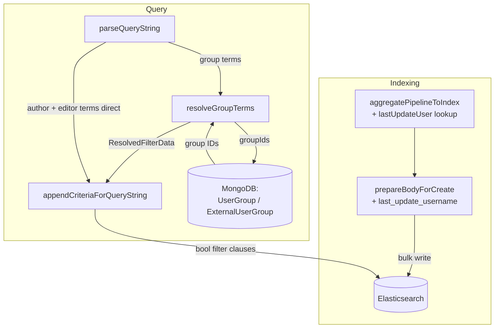
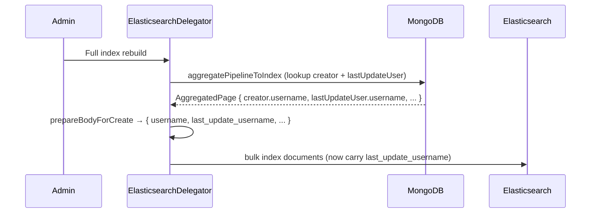
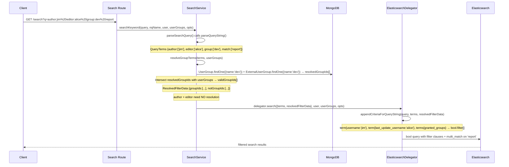

# Design Document: search-filters

## Overview

This feature extends GROWI's existing inline search operator system with three new operators: `author:`, `editor:`, and `group:`. Users type these directly into the search box alongside free-text keywords; the server parses, resolves (group only), and applies them as Elasticsearch filter clauses.

**Users**: GROWI team members who search a large wiki and want to scope results by page creator, last editor, or group membership.

**Impact**: Adds a new indexed Elasticsearch field (`last_update_username`) and wires it through the indexing pipeline, then maps `editor:` directly to it — symmetric with how `author:` maps to the existing `username` field. Modifies server-side files only: `interfaces/search.ts`, `service/search.ts`, `service/search-delegator/elasticsearch.ts`, `service/search-delegator/aggregate-to-index.ts`, `service/search-delegator/bulk-write.d.ts`, and the three ES mapping files (`mappings-es7/8/9.ts`). No client changes. No new URL parameters. No new UI components.

### Goals

- `author:username` filters pages whose creator matches that username (direct ES `username` field — already indexed)
- `editor:username` filters pages last edited by that user via the **new indexed `last_update_username` field** (direct ES `term`, identical pattern to `author:`)
- `group:groupname` filters pages granted to the named group (group name → group ID → intersect with requesting user's groups → ES `granted_groups` clause)
- Negation variants (`-author:`, `-editor:`, `-group:`) consistent with existing `-prefix:` / `-tag:` behavior
- Zero regression on existing operators and existing search behavior

### Non-Goals

- New UI components, filter bars, or dedicated controls
- New URL parameters (all state stays in `?q=`)
- A MongoDB-based fallback for `editor:` — the operator resolves only against the indexed `last_update_username` field
- Automatic backfill/migration of `last_update_username` onto already-indexed pages — a **full index rebuild** is the supported path
- Date-based operators (V2)
- Named query (`nq:`) system changes
- Mobile `SearchOptionModal` changes

---

## Operational Precondition: Full Index Rebuild

The `last_update_username` field exists only on pages indexed **after** the mapping change. Existing indices do not have it.

- Until administrators run a **full index rebuild**, `editor:` returns no results for un-reindexed pages.
- There is **no MongoDB fallback** and **no incremental backfill** — a rebuild is the only supported path to populate the field.
- This precondition must be stated in the release notes so administrators know to rebuild before relying on `editor:`.

`author:` and `group:` are unaffected by this precondition — they use fields (`username`, `granted_groups`) that already exist on indexed documents.

---

## Boundary Commitments

### This Spec Owns

- `QueryTerms` type: 6 new fields (`author`, `not_author`, `editor`, `not_editor`, `group`, `not_group`)
- `ESTermsKey` type: extended to include the 6 new fields
- `ResolvedFilterData` type: new type carrying MongoDB-resolved **group** values only (`groupIds`, `notGroupIds`)
- `SearchableData` type: extended with optional `resolvedFilterData` field
- `parseQueryString()`: regex and branching extended for new operator prefixes; empty-value guard
- `resolveGroupTerms()`: new private method in `SearchService` — MongoDB resolution for `group` / `not_group` terms only
- `searchKeyword()`: resolution step inserted between parse and delegate
- `appendCriteriaForQueryString()`: 6 new filter clause builders (`author`/`editor` as direct `term`; `group` from resolved IDs)
- `AVAILABLE_KEYS` array in `ElasticsearchDelegator`: updated to include new keys
- **New indexed ES field `last_update_username`**:
  - `mappings-es7.ts` / `mappings-es8.ts` / `mappings-es9.ts`: add `last_update_username: { type: 'keyword' }`
  - `aggregate-to-index.ts`: add `lastUpdateUser` `$lookup` + `$unwind` + project `lastUpdateUser.username`
  - `bulk-write.d.ts`: `AggregatedPage` gains `lastUpdateUser?: { username: string }`; `BulkWriteBody` gains `last_update_username?: string`
  - `elasticsearch.ts` `prepareBodyForCreate()`: write `last_update_username: page.lastUpdateUser?.username`

### Out of Boundary

- `UserGroup`, `ExternalUserGroup`, `User`, `Page` models — called read-only, not modified (`UserGroupRelation` / `ExternalUserGroupRelation` are **not** touched — `group:` resolves a group ID and applies it to ES `granted_groups`, so no member-user relation query is needed)
- `editor:` no longer queries MongoDB at search time — `User` and `Page` are **not** read by the resolution step
- Automatic migration/backfill of `last_update_username` — out of scope (rebuild only)
- Client-side code — no changes
- `nq:` named query system — not touched
- `MongoTermsKey` type — new operators are `ESTermsKey` only (no Mongo query path for these)

### Allowed Dependencies

- `UserGroup.findOne({ name })` — read-only
- `ExternalUserGroup.findOne({ name })` — read-only (external groups must be included; see research.md D3)
- `aggregatePipelineToIndex()` — extended to join `lastUpdateUser` (read-only `$lookup` on `users` collection)

### Revalidation Triggers

- `username` ES field renamed or type changed → `author:` clause breaks
- `last_update_username` ES field renamed or type changed → `editor:` clause breaks
- `Page.lastUpdateUser` field renamed, or the indexing `$lookup` for it removed → `last_update_username` stops being populated → `editor:` silently returns nothing
- `UserGroup.name` / `ExternalUserGroup.name` field renamed or type changed → `group:` name lookup breaks
- `granted_groups` ES field renamed or type changed → `group:` clause breaks
- The `IGrantedGroup` shape passed into `searchKeyword()` changes such that `_id` is no longer comparable to a resolved group ID → membership intersect (Req 3.5, 7.5) breaks
- `AVAILABLE_KEYS` or `ESTermsKey` not updated when `QueryTerms` is extended → `validateTerms()` rejects new operators
- The `creator.username` indexing precedent (`aggregate-to-index.ts`, `prepareBodyForCreate`) is refactored → the mirrored `lastUpdateUser` wiring must be updated alongside it

---

## Architecture

### Existing Architecture

`parseQueryString(queryString)` splits the `?q=` value on spaces, matches `prefix:` and `tag:` prefixes via regex, and populates `QueryTerms` arrays. `searchKeyword()` calls `parseSearchQuery()`, then `resolve()` to get `[delegator, data]`, then `delegator.search(data, ...)`. Inside the delegator, `appendCriteriaForQueryString(query, data.terms)` maps each `QueryTerms` array to an ES bool filter clause. Separately, the indexing pipeline (`aggregatePipelineToIndex()` → `prepareBodyForCreate()` → bulk write) projects page fields into ES documents — including `username` from a `creator` `$lookup`.

### Extension Pattern

The three new operators follow the existing query pipeline. `author:` and `editor:` map directly to indexed keyword fields (`username`, `last_update_username`) — no resolution. Only `group:` needs a **resolution step** in `SearchService` (name → ID, intersected with the user's groups). The `editor:` capability additionally requires extending the **indexing pipeline** so `last_update_username` is populated.



**Key decision**: `author:` and `editor:` terms pass straight from parser to ES delegator (no MongoDB at query time). Only `group:` terms are intercepted by `resolveGroupTerms()` in `SearchService` before the delegator is called. `editor:` works only because `last_update_username` is populated at index time.

### Technology Stack

| Layer | Choice / Version | Role in Feature |
|-------|-----------------|-----------------|
| Query parsing | Regex (existing) | Extended to recognise `author:`, `editor:`, `group:` prefixes |
| Indexing | Mongoose aggregation (existing) | New `lastUpdateUser` `$lookup` projects `lastUpdateUser.username` into the ES document as `last_update_username` |
| MongoDB (query time) | Mongoose (existing) | Read-only resolution for `group` only: name → groupId (then intersected in-memory with the user's groups). `editor:` no longer touches MongoDB. |
| Elasticsearch | Existing delegator + new mapping field | New `term` clauses on `username` (author) and `last_update_username` (editor); `terms` clause on `granted_groups` (group). New `last_update_username` keyword field added to all mappings. |

No new dependencies introduced.

---

## File Structure Plan

### Modified Files

```
apps/app/src/server/
├── interfaces/
│   └── search.ts                          # Extend QueryTerms (6 new fields), ESTermsKey;
│                                          #   add ResolvedFilterData (group-only); extend SearchableData
├── service/
│   └── search.ts                          # Extend parseQueryString(); add resolveGroupTerms();
│                                          #   call it in searchKeyword()
└── service/search-delegator/
    ├── elasticsearch.ts                   # Extend appendCriteriaForQueryString(); update AVAILABLE_KEYS;
    │                                      #   write last_update_username in prepareBodyForCreate()
    ├── aggregate-to-index.ts              # Add lastUpdateUser $lookup/$unwind + project lastUpdateUser.username
    ├── bulk-write.d.ts                    # AggregatedPage.lastUpdateUser?; BulkWriteBody.last_update_username?
    └── mappings/
        ├── mappings-es7.ts                # add last_update_username: { type: 'keyword' }
        ├── mappings-es8.ts                # add last_update_username: { type: 'keyword' }
        └── mappings-es9.ts                # add last_update_username: { type: 'keyword' }
```

No new files. All changes are additive to existing files.

---

## System Flow

### Indexing (populating `last_update_username`)



### Query



---

## Requirements Traceability

| Requirement | Summary | Component | Notes |
|-------------|---------|-----------|-------|
| 1.1 | `author:` returns creator pages | `parseQueryString` + `appendCriteriaForQueryString` | `term: { username }` on existing ES field |
| 1.2 | `author:` + keywords combined | `appendCriteriaForQueryString` | AND via separate filter and must clauses |
| 1.3 | `author:` not in full-text | `parseQueryString` | Token not added to `match[]` |
| 1.4 | `author:` empty → ignore | `parseQueryString` | Empty value guard; token dropped |
| 2.1 | `editor:` returns last-editor pages | `parseQueryString` + `appendCriteriaForQueryString` | `term: { last_update_username }` on new ES field |
| 2.2 | `editor:` + keywords combined | `appendCriteriaForQueryString` | AND via bool.filter |
| 2.3 | `editor:` not in full-text | `parseQueryString` | Token not added to `match[]` |
| 2.4 | `editor:` empty → ignore | `parseQueryString` | Empty value guard; token dropped |
| 2.5 | `editor:` resolves via indexed field, not MongoDB | `appendCriteriaForQueryString` | Direct `term` on `last_update_username`; no `resolveGroupTerms` path |
| 2.6 | Indexing populates `last_update_username` | `aggregate-to-index` + `prepareBodyForCreate` | `lastUpdateUser` `$lookup` → `lastUpdateUser.username` → doc field |
| 3.1 | `group:` returns pages granted to group | `resolveGroupTerms` + `appendCriteriaForQueryString` | group name → ID → intersect with user's groups → `granted_groups` clause |
| 3.2 | `group:` + keywords combined | `appendCriteriaForQueryString` | AND via bool.filter |
| 3.3 | `group:` not in full-text | `parseQueryString` | Token not added to `match[]` |
| 3.4 | `group:` empty → ignore | `parseQueryString` | Empty value guard; token dropped |
| 3.5 | Group filter limited to user's own groups | `resolveGroupTerms` | Intersect resolved group IDs with `userGroups`; non-member groups yield `groupIds = []` |
| 4.1 | `-author:` excludes creator | `parseQueryString` + `appendCriteriaForQueryString` | `must_not: { term: { username } }` |
| 4.2 | `-editor:` excludes last editor | `parseQueryString` + `appendCriteriaForQueryString` | `must_not: { term: { last_update_username } }` |
| 4.3 | `-group:` excludes pages granted to group | `resolveGroupTerms` + `appendCriteriaForQueryString` | `must_not: { terms: { granted_groups: notGroupIds } }`; non-member groups silently ignored |
| 4.4 | All constraints AND | `appendCriteriaForQueryString` | All pushed to `bool.filter[]` |
| 5.1 | Multiple operators AND | `appendCriteriaForQueryString` | All in `bool.filter[]` array |
| 5.2 | New + existing operators | `appendCriteriaForQueryString` | All filter clauses merged into same `bool.filter[]` |
| 5.3 | New + keywords | `parseQueryString` + `appendCriteriaForQueryString` | `match[]` populated separately |
| 5.4 | Existing operators unchanged | `parseQueryString` | Existing regex branches unmodified |
| 6.1 | Unknown `author:` → empty | `appendCriteriaForQueryString` | ES `term` on non-existent username → no match |
| 6.2 | Unknown `editor:` → empty | `appendCriteriaForQueryString` | ES `term` on non-existent `last_update_username` → no match (same as author) |
| 6.3 | Unknown `group:` → empty | `resolveGroupTerms` | Both group lookups null → `groupIds = []` → clause skipped → no match |
| 6.4 | Group with no granted pages → empty | `appendCriteriaForQueryString` | `terms: { granted_groups }` matches no documents — natural ES behavior |
| 7.1–7.3 | Access control not widened | Architecture | New clauses pushed to `bool.filter[]` (AND); cannot override existing permission filter already in same array |
| 7.4 | No page existence inference | Architecture | Empty clause = empty result; no metadata exposed |
| 7.5 | Group intersection enforced | `resolveGroupTerms` | Non-member group IDs excluded before ES clause is built |

---

## Components and Interfaces

### Types Layer (`interfaces/search.ts`)

| Component | Intent | Requirements |
|-----------|--------|--------------|
| `QueryTerms` extension | Add 6 new parsed-token arrays | 1.1–1.4, 2.1–2.4, 3.1–3.4, 4.1–4.4 |
| `ResolvedFilterData` | Carry MongoDB-resolved **group** IDs from SearchService to delegator | 3.1, 3.2, 4.3 |
| `SearchableData` extension | Add optional `resolvedFilterData` field | 3.1 |
| `ESTermsKey` extension | Register new keys for validation | 5.4 |

**Contracts**: Service [ ]

```typescript
// Extended QueryTerms — added fields only (existing 8 fields unchanged)
export type QueryTerms = {
  // ... existing fields ...
  author: string[];      // raw usernames from author: tokens — direct ES term on `username`
  not_author: string[];
  editor: string[];      // raw usernames from editor: tokens — direct ES term on `last_update_username`
  not_editor: string[];
  group: string[];       // raw group names from group: tokens — resolved to group IDs (intersected with the user's groups) by SearchService
  not_group: string[];
};

// New type — populated by SearchService.resolveGroupTerms()
// editor no longer requires resolution, so only group IDs are carried here.
export type ResolvedFilterData = {
  groupIds: string[];           // group IDs the user belongs to AND specified in filter
  notGroupIds: string[];
};

// Extended SearchableData
export type SearchableData = {
  queryString: string;
  terms: QueryTerms;
  resolvedFilterData?: ResolvedFilterData; // absent when no group terms present
};
```

---

### Indexing: New `last_update_username` Field

| Field | Detail |
|-------|--------|
| Intent | Populate a new indexed keyword field carrying the page's last-updater username so `editor:` can match it directly |
| Requirements | 2.1, 2.5, 2.6 |

**Contracts**: Service [x]

Mirror the existing `creator` / `username` precedent exactly.

**1. Aggregation (`aggregate-to-index.ts`)** — add after the `creator` `$lookup`/`$unwind`:

```typescript
// join lastUpdateUser
{ $lookup: { from: 'users', localField: 'lastUpdateUser', foreignField: '_id', as: 'lastUpdateUser' } },
{ $unwind: { path: '$lastUpdateUser', preserveNullAndEmptyArrays: true } },
```

and add to the `$project` stage:

```typescript
'lastUpdateUser.username': 1,
```

**2. Types (`bulk-write.d.ts`)**:

```typescript
// AggregatedPage — mirror `creator?`
lastUpdateUser?: { username: string };

// BulkWriteBody — mirror `username?`
last_update_username?: string;
```

**3. Doc body (`elasticsearch.ts` — `prepareBodyForCreate`)** — mirror the `username` line:

```typescript
last_update_username: page.lastUpdateUser?.username,
```

**4. Mappings (`mappings-es7.ts`, `mappings-es8.ts`, `mappings-es9.ts`)** — add alongside `username`:

```typescript
last_update_username: { type: 'keyword' },
```

- **Postcondition**: every document indexed after this change carries `last_update_username` (or omits it when the page has no `lastUpdateUser`).
- **Limitation**: documents indexed before this change do not have the field until a full rebuild (see Operational Precondition).
- **Coverage of all index writes**: both the full rebuild (`addAllPages`) and every incremental write (`syncPageUpdated`, comment add, descendant updates → `updateOrInsertPageById`) funnel through the **same** `updateOrInsertPages()` routine, which uses `aggregatePipelineToIndex()` + `prepareBodyForCreate()`. Extending those two functions is therefore sufficient — no separate incremental body-builder exists, and edits made after the rebuild keep `last_update_username` fresh automatically. There is no second code path to update.

---

### Query Parser (`service/search.ts` — `parseQueryString`)

| Field | Detail |
|-------|--------|
| Intent | Extend token recognition to include `author:`, `editor:`, `group:` prefixes |
| Requirements | 1.1–1.4, 2.1–2.4, 3.1–3.4, 4.1–4.3, 5.3, 5.4 |

**Contracts**: Service [x]

The existing regex is extended to include the three new operator prefixes:

```typescript
// Before (existing):
const matchNegative = word.match(/^-(prefix:|tag:)?(.+)$/);
const matchPositive = word.match(/^(prefix:|tag:)?(.+)$/);

// After (extended):
const matchNegative = word.match(/^-(prefix:|tag:|author:|editor:|group:)?(.+)$/);
const matchPositive = word.match(/^(prefix:|tag:|author:|editor:|group:)?(.+)$/);
```

New branches added in the `if/else` chain:
```typescript
if (matchPositive[1] === 'author:') {
  if (matchPositive[2]) authors.push(matchPositive[2]);   // empty-value guard (Req 1.4)
} else if (matchPositive[1] === 'editor:') {
  if (matchPositive[2]) editors.push(matchPositive[2]);   // empty-value guard (Req 2.4)
} else if (matchPositive[1] === 'group:') {
  if (matchPositive[2]) groups.push(matchPositive[2]);    // empty-value guard (Req 3.4)
}
// Negation mirrors (not_author, not_editor, not_group)
```

- **Postcondition**: tokens with recognized operator prefix are never added to `match[]` (Req 1.3, 2.3, 3.3)
- **Postcondition**: existing `prefix`, `not_prefix`, `tag`, `not_tag`, `match`, `not_match`, `phrase`, `not_phrase` behavior unmodified (Req 5.4)

---

### Resolution Step (`service/search.ts` — `resolveGroupTerms`)

| Field | Detail |
|-------|--------|
| Intent | Resolve `group` names to group IDs intersected with the requesting user's groups. `editor:` and `author:` need no resolution. |
| Requirements | 3.1, 3.2, 4.3, 6.3, 6.4, 7.5 |

**Contracts**: Service [x]

```typescript
private async resolveGroupTerms(terms: QueryTerms, userGroups: IGrantedGroup[]): Promise<ResolvedFilterData>
```

- Called in `searchKeyword()` between `resolve()` and `delegator.search()`
- Returns early with all-empty arrays if no `group`, `not_group` terms present

**Group resolution** (per name in `terms.group` and `terms.not_group`):
```
for each groupName:
  [internalGroup, externalGroup] = await Promise.all([
    UserGroup.findOne({ name: groupName }).lean(),
    ExternalUserGroup.findOne({ name: groupName }).lean(),
  ])
  resolvedIds = [internalGroup?._id, externalGroup?._id].filter(Boolean).map(id => id.toString())
  if resolvedIds is empty → contribute no group IDs (Req 6.3)
  else:
    userGroupIdStrings = userGroups.map(g => g._id.toString())
    validIds = resolvedIds.filter(id => userGroupIdStrings.includes(id))
    if validIds is empty → contribute no group IDs (Req 3.5, 7.5 — user not a member of this group)
    else:
      collect validIds
```

**Implementation Notes**
- `editor:` is intentionally **not** resolved here — it maps directly to the indexed `last_update_username` field in the delegator. No `User` / `Page` queries occur at search time.
- Multiple `group:` tokens accumulate: group IDs are merged across all tokens in the same array before building ES clauses.
- `ExternalUserGroup.findOne({ name })` uses only `name` — since external group names are not globally unique (compound index `{name, provider}`), a `group:` token may match both an internal group and the first external group with that name. This is an acceptable approximation for V1.

---

### ES Clause Builder (`service/search-delegator/elasticsearch.ts`)

| Field | Detail |
|-------|--------|
| Intent | Build and append ES filter clauses for the three new operators |
| Requirements | 1.1–1.3, 2.1–2.3, 3.1–3.2, 4.1–4.4, 5.1–5.4, 6.1–6.4 |

**Contracts**: Service [x]

Method signature extended:
```typescript
appendCriteriaForQueryString(
  query: SearchQuery,
  parsedKeywords: ESQueryTerms,
  resolvedFilterData?: ResolvedFilterData,  // group IDs only
): void
```

New clauses appended to `query.body.query.bool.filter[]`:

| Operator | ES Clause | Condition |
|----------|-----------|-----------|
| `author:jim` | `{ bool: { must: [{ term: { username: 'jim' } }] } }` | `terms.author.length > 0` |
| `-author:jim` | `{ bool: { must_not: [{ term: { username: 'jim' } }] } }` | `terms.not_author.length > 0` |
| `editor:alice` | `{ bool: { must: [{ term: { last_update_username: 'alice' } }] } }` | `terms.editor.length > 0` |
| `-editor:alice` | `{ bool: { must_not: [{ term: { last_update_username: 'alice' } }] } }` | `terms.not_editor.length > 0` |
| `group:dev` | `{ bool: { must: [{ terms: { granted_groups: groupIds } }] } }` | `groupIds.length > 0` |
| `-group:dev` | `{ bool: { must_not: [{ terms: { granted_groups: notGroupIds } }] } }` | `notGroupIds.length > 0` |

- `author:` and `editor:` build their clauses directly from `terms` (no `resolvedFilterData`) — same code shape, different field name.
- When `resolvedFilterData` is absent or a group array is empty, the corresponding `group` clause is not pushed — no-op (Req 5.4 regression safety, 6.3 empty result).
- `AVAILABLE_KEYS` constant updated with all six new `QueryTerms` key names.

---

## Error Handling

| Scenario | Behavior | Requirement |
|----------|----------|-------------|
| Unknown `author:` username | ES `term` on non-existent `username` → 0 results | 6.1 |
| Unknown `editor:` username | ES `term` on non-existent `last_update_username` → 0 results | 6.2 |
| `editor:` on un-reindexed pages | Field absent on old docs → those pages do not match until a full rebuild (documented precondition) | — |
| Unknown `group:` name | Both group lookups return null → `groupIds = []` → clause skipped → 0 results | 6.3 |
| Group user doesn't belong to | Resolved group ID not in `userGroups` → `groupIds = []` → clause skipped → 0 results | 3.5, 7.5 |
| Group with no granted pages | `terms: { granted_groups: [id] }` matches no documents → empty result (natural ES behavior) | 6.4 |
| Empty operator value (`author:`) | Parser drops token; no terms array entry; no ES clause | 1.4, 2.4, 3.4 |
| No `group`/`not_group` terms | `resolvedFilterData` not populated; existing delegator behavior unchanged | 5.4 |
| Page with no `lastUpdateUser` at index time | `last_update_username` omitted from the doc; `editor:` simply never matches it | — |

---

## Testing Strategy

### Unit Tests

| Target | What to verify |
|--------|---------------|
| `parseQueryString('author:jim report')` | `author: ['jim']`, `match: ['report']`; `match` does not contain `author:jim` (Req 1.1, 1.3) |
| `parseQueryString('author: report')` | `author: []` — empty value dropped (Req 1.4) |
| `parseQueryString('-author:jim')` | `not_author: ['jim']`, `author: []` (Req 4.1) |
| `parseQueryString('-editor:alice')` | `not_editor: ['alice']`, `editor: []` (Req 4.2) |
| `parseQueryString('editor:alice group:dev tag:wiki prefix:/team')` | All operators correctly separated; `match: []` (Req 5.2, 5.4) |
| `parseQueryString('regular keyword')` | Existing behavior unchanged (Req 5.4 regression) |
| `resolveGroupTerms` — no group terms | Early return; all-empty arrays; no MongoDB query (Req 5.4) |
| `resolveGroupTerms` — known group, user is member | Both UserGroup + ExternalUserGroup queried; group ID in `userGroups` → returns `groupIds` (Req 3.1) |
| `resolveGroupTerms` — known group, user not member | Group ID not in `userGroups` → `groupIds: []` (Req 3.5, 7.5) |
| `resolveGroupTerms` — unknown group | Both lookups null → `groupIds: []` (Req 6.3) |
| `resolveGroupTerms` — does NOT query `User`/`Page` for editor terms | `editor:` present but no `User.findOne`/`Page.find` calls occur (Req 2.5) |
| `prepareBodyForCreate` with `lastUpdateUser.username` | Output doc has `last_update_username` set (Req 2.6) |
| `prepareBodyForCreate` without `lastUpdateUser` | `last_update_username` is `undefined`; no throw (Req 2.6) |
| `aggregatePipelineToIndex` | Pipeline contains a `lastUpdateUser` `$lookup` and projects `lastUpdateUser.username` (Req 2.6) |
| `appendCriteriaForQueryString` — `author` terms | `bool.filter` contains `term: { username }` (Req 1.1) |
| `appendCriteriaForQueryString` — `not_author` terms | `bool.filter` contains `must_not: { term: { username } }` (Req 4.1) |
| `appendCriteriaForQueryString` — `editor` terms | `bool.filter` contains `term: { last_update_username }` (Req 2.1) |
| `appendCriteriaForQueryString` — `not_editor` terms | `bool.filter` contains `must_not: { term: { last_update_username } }` (Req 4.2) |
| `appendCriteriaForQueryString` — `groupIds` | `bool.filter` contains `terms: { granted_groups: [...] }` (Req 3.1) |
| `appendCriteriaForQueryString` — empty `groupIds` | No `granted_groups` clause added (Req 6.3) |
| `appendCriteriaForQueryString` — no resolvedFilterData | `bool.filter` unchanged from pre-extension behavior (Req 5.4) |

### Integration Tests

| Scenario | What to verify |
|----------|---------------|
| `searchKeyword('author:jim report')` end-to-end | ES query has `bool.filter` with `term: { username: 'jim' }` and `bool.must` with `multi_match` on `report` |
| `searchKeyword('editor:alice report')` end-to-end | ES query has `bool.filter` with `term: { last_update_username: 'alice' }`; no MongoDB resolution fired |
| `searchKeyword('group:dev-team')` end-to-end, user is member | Group ID resolved and present in user's groups; ES query has `terms: { granted_groups: [groupId] }` |
| `searchKeyword('author:jim editor:alice tag:wiki prefix:/team')` | All filter clauses present in `bool.filter`; existing operators unaffected |
| `searchKeyword('author:nonexistent')` | Returns empty result set, not a server error |
| `searchKeyword('editor:nonexistent')` | Returns empty result set, not a server error |
| `searchKeyword('group:nonexistent-group')` | Returns empty result set, not a server error |
| `searchKeyword('group:dev')` where user is not a member of `dev` | Returns empty result; no `granted_groups` clause built (Req 3.5, 7.5) |
| `searchKeyword('group:A group:C')` where user belongs to A but not C | `granted_groups` clause contains only A's ID; C silently excluded (Req 7.5) |
| End-to-end indexing → search | After indexing a page whose `lastUpdateUser` is alice, `editor:alice` returns that page (Req 2.6) |
| Incremental edit refreshes the field | Index a page (editor=alice), then edit it so `lastUpdateUser` becomes bob, then re-index via the incremental path (`updateOrInsertPageById`). `editor:bob` returns the page; `editor:alice` no longer does — confirms incremental writes share the body-builder and keep `last_update_username` fresh (Req 2.6) |
