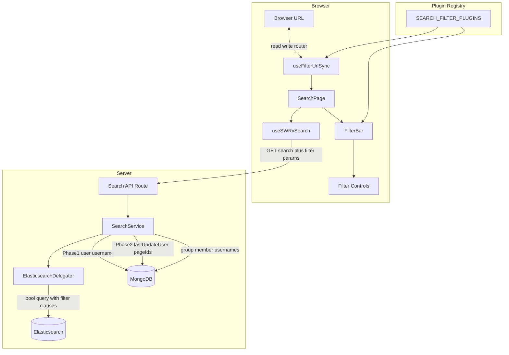
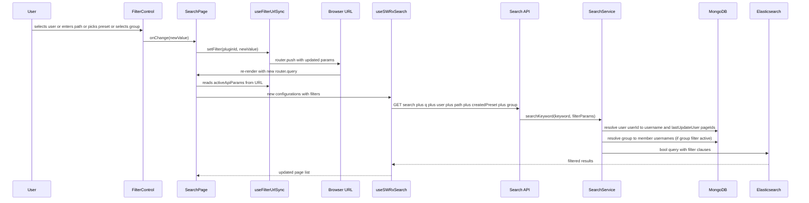
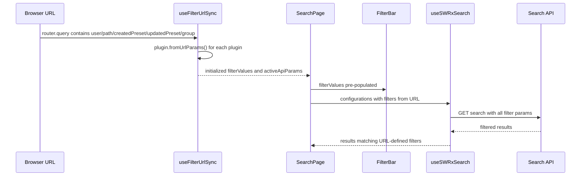

# Design Document: search-filters

## Overview

The Search Filter Bar extends GROWI's search page with structured, discoverable filtering. GROWI team members currently cannot narrow search results by user, path prefix, date range, or group without embedding opaque query operators in the keyword field. This feature adds a `FilterBar` component with five plugin-backed filter controls, bidirectional URL parameter sync, and server-side Elasticsearch integration.

The architecture uses a **Static Plugin Registry**: each filter is a self-contained descriptor (`FilterPlugin<TValue>`) implementing a shared interface. The `FilterBar` is a generic renderer — adding a new filter in the future requires one new file and one registry entry with no changes to the container or the URL sync hook.

The five plugins are: **User** (matches creator OR most recent editor via two-phase MongoDB+ES query), **Path** (prefix match), **Created Date** (4 presets), **Updated Date** (4 presets), and **Group** (filters by creator's group membership via `UserGroupRelation` expansion).

**Users**: GROWI team members on desktop. **Impact**: Extends `SearchPage`, `useSWRxSearch`, `SearchService`, and `ElasticsearchDelegator`; does not change existing keyword/sort/pagination behavior.

### Goals
- Five structured filter controls with active-state indicators (Req 1, 4–8)
- URL parameters as single source of truth for all filter state (Req 3)
- AND-logic combination; each filter sent as a separate API parameter (Req 2, 9)
- User filter matches creator OR last editor without ES schema changes (Req 4.3, 9.2)
- Group filter matches pages by creator membership without ES schema changes (Req 8.3, 9.6)
- Zero new npm dependencies

### Non-Goals
- Free-form date range inputs (only four preset options in scope)
- Tag filter UI; saved/named filter sets; mobile `SearchOptionModal` extension
- Elasticsearch index schema changes (no new fields added)
- Filtering pages by which groups they are *granted to* (Group filter targets creator membership)
- Admin-level filter configuration

---

## Boundary Commitments

### This Spec Owns
- `FilterPlugin<TValue>` interface and the `SEARCH_FILTER_PLUGINS` registry
- `FilterBar` generic container component and its layout within `SearchPage`
- `useFilterUrlSync` hook (URL read/write for all filter keys)
- Five concrete filter plugin implementations (User, Path, Created Date, Updated Date, Group)
- Four filter control components (`UserFilterControl`, `PathFilterControl`, `DatePresetControl`, `GroupFilterControl`)
- `ISearchFilterParams` shared interface (client ↔ server contract)
- `DatePreset` type and `DATE_PRESET_DAYS` mapping (shared between plugin and server)
- `SearchService` extension: user two-phase resolution, group membership expansion, date preset translation, delegation to ES delegator
- `ElasticsearchDelegator` extension: `buildFilterClauses(filterParams)` method
- Search API route extension: accept and forward five new query parameters

### Out of Boundary
- Modifying `SearchOptionModal` (mobile filter experience)
- Tag filter UI; saved/named filter sets
- ES index schema changes (no new ES mapping fields)
- Filtering by `granted_groups` ES field (Group filter is creator-membership based, not page-grant based)
- `UserGroupRelation` model logic — this spec calls the existing `findAllUserIdsForUserGroups()` method but does not modify it
- `useSWRxUserRelatedGroups` — not used or modified

### Allowed Dependencies
- `apps/app/src/features/search/client/` — existing search UI components
- `apps/app/src/stores/search.tsx` — extend `ISearchConfigurations` and `useSWRxSearch`
- `apps/app/src/server/service/search.ts` — extend `SearchService.searchKeyword()`
- `apps/app/src/server/service/search-delegator/elasticsearch.ts` — extend `ElasticsearchDelegator`
- `apps/app/src/server/models/page.ts` — read `Page.lastUpdateUser` field
- `apps/app/src/server/models/user-group-relation.ts` — call `UserGroupRelation.findAllUserIdsForUserGroups()`
- Mongoose `User` model — `findById` (username resolution) and `find` with `$in` (group member usernames)
- `react-bootstrap-typeahead` v6 (existing) — User and Group controls
- Reactstrap v9 `ButtonGroup` — DatePresetControl
- Next.js `useRouter` — URL sync
- Jotai atoms: `isSearchServiceConfiguredAtom`, `isSearchServiceReachableAtom` (read-only)
- `/api/v3/users` and `/api/v3/user-groups` endpoints (existing, read-only)

### Revalidation Triggers
- Shape change in `FilterPlugin<TValue>` (add/remove methods) → all 5 plugin implementations need updating
- Key name change in `ISearchFilterParams` → URL sync hook, SWR hook, and server route all need updating
- ES field rename (`username`, `path.raw`, `created_at`, `updated_at`) → `buildFilterClauses()` needs updating
- Change to `UserGroupRelation.findAllUserIdsForUserGroups()` signature → `SearchService` group resolution needs updating
- Change to `Page.lastUpdateUser` field name → `SearchService` user resolution phase 2 needs updating

---

## Architecture

### Existing Architecture Analysis

- **Client**: `SearchPage` → `useSWRxSearch(keyword, nqName, configurations)` → GET /search
- **Server**: Express route → `SearchService.searchKeyword()` → `ElasticsearchDelegator.search()` → Elasticsearch
- **URL sync**: `keyword-manager.ts` uses `useRouter()` and `beforePopState` for `?q=` param only
- **ES query**: `{ query: { bool: { must: [], must_not: [], filter: [] } } }` — new filter clauses append to `filter[]`
- **User groups**: `UserGroupRelation.findAllUserIdsForUserGroups([groupId])` — existing static method returning user ObjectIds

### Architecture Pattern & Boundary Map



**Key decisions**: `FilterBar` is a pure renderer; `useFilterUrlSync` is the single owner of filter state; `SearchPage` is the integration point. The User filter requires three DB queries (username + lastUpdateUser pages + optionally none if creator found). The Group filter requires two DB queries (member IDs + member usernames).

### Technology Stack

| Layer | Choice / Version | Role in Feature |
|-------|-----------------|-----------------|
| Frontend UI | React + Next.js Pages Router | Filter controls, FilterBar, page integration |
| State / URL | Next.js `useRouter` | Bidirectional URL sync for filter state |
| Data fetching | SWR via `useSWRxSearch` | Carries filter params to server; cache invalidation on filter change |
| User/Group select | react-bootstrap-typeahead v6 (existing) | User and Group filter autocomplete |
| Date presets | Reactstrap v9 `ButtonGroup` (existing) | DatePresetControl — four preset buttons, no date picker library needed |
| Styling | Reactstrap v9 + Bootstrap 5 + CSS Modules | FilterBar layout and control styling |
| Backend | Express.js + SearchService | Filter parameter handling, DB resolution, ES clause building |
| Search index | Elasticsearch (existing delegator) | Extended bool query with filter clauses |
| User resolution | Mongoose `User`, `Page` models | ObjectId → username; lastUpdateUser page IDs |
| Group resolution | `UserGroupRelation.findAllUserIdsForUserGroups()` | Group ObjectId → member user ObjectIds → usernames |

---

## File Structure Plan

### New Files

```
apps/app/src/features/search/
├── interfaces/
│   └── search-filter.ts               # ISearchFilterParams + DatePreset type — shared client+server
├── client/
│   ├── plugins/
│   │   ├── types.ts                   # FilterPlugin<TValue>, FilterControlProps<TValue>
│   │   ├── user-filter-plugin.ts      # FilterPlugin<string | null> — URL key: user
│   │   ├── path-filter-plugin.ts      # FilterPlugin<string> — URL key: path
│   │   ├── date-preset-filter-plugin.ts # createDatePresetPlugin() factory + DatePresetPluginConfig
│   │   └── index.ts                   # SEARCH_FILTER_PLUGINS: readonly FilterPlugin<unknown>[]
│   ├── hooks/
│   │   └── use-filter-url-sync.ts     # URL ↔ filter state bridge (reads/writes router.query)
│   └── components/
│       ├── FilterBar/
│       │   └── index.tsx              # Generic container; iterates SEARCH_FILTER_PLUGINS
│       └── filter-controls/
│           ├── UserFilterControl.tsx      # react-bootstrap-typeahead + /api/v3/users
│           ├── PathFilterControl.tsx      # Debounced text input
│           ├── DatePresetControl.tsx      # Reactstrap ButtonGroup with 4 preset buttons
│           └── GroupFilterControl.tsx     # react-bootstrap-typeahead + /api/v3/user-groups
```

### Modified Files

- `apps/app/src/stores/search.tsx` — add `filters?: ISearchFilterParams` to `ISearchConfigurations`; include in SWR key and API request params
- `apps/app/src/features/search/client/components/SearchPage/SearchPage.tsx` — call `useFilterUrlSync`; render `<FilterBar>`; pass `activeApiParams` into configurations
- `apps/app/src/server/service/search.ts` — add `filterParams?: ISearchFilterParams` argument; implement user and group resolution; pass resolved params to delegator
- `apps/app/src/server/service/search-delegator/elasticsearch.ts` — add `buildFilterClauses()` private method; call it in `search()` and append clauses to `bool.filter[]`
- `apps/app/src/server/routes/apiv3/search.ts` (or equivalent) — extract five new query params; forward to `SearchService`

---

## System Flows

### Flow 1: User Applies a Filter



### Flow 2: Page Load with URL Filter Parameters



---

## Requirements Traceability

| Requirement | Summary | Components | Interfaces / Types | Notes |
|-------------|---------|------------|-------------------|-------|
| 1.1 | FilterBar visible when service configured | `FilterBar`, Jotai atoms | — | Reuses existing `isSearchServiceConfiguredAtom` |
| 1.2 | FilterBar hidden when service unavailable | `FilterBar` (conditional render in SearchPage) | — | — |
| 1.3 | Active-state indicator per filter | `FilterBar`, `FilterPlugin.isEmpty()` | `FilterPlugin<TValue>` | — |
| 1.4 | Clear all → default state | `FilterBar` clear-all, `useFilterUrlSync.clearAllFilters()` | — | — |
| 1.5 | Desktop only; mobile modal unchanged | CSS + `SearchOptionModal` not modified | — | — |
| 2.1 | Multiple active filters → AND logic | `buildFilterClauses()` (appends to `bool.filter[]`) | `ISearchFilterParams` | — |
| 2.2 | Clearing one filter re-runs search | `useFilterUrlSync` → URL update → SWR key change | `ISearchConfigurations` | — |
| 2.3 | No active filters → no regression | `buildFilterClauses()` returns `[]` when params absent | — | — |
| 3.1–3.6 | URL param sync (apply, clear, on-load, back/forward, preserve, malformed) | `useFilterUrlSync` | URL keys: `user`, `path`, `createdPreset`, `updatedPreset`, `group` | Flow 1, Flow 2 |
| 4.1 | User control label + placeholder | `UserFilterControl` | — | — |
| 4.2 | Selected user name shown | `UserFilterControl` | `FilterPlugin<string\|null>` | — |
| 4.3 | Returns creator OR last editor pages | `user-filter-plugin`, server two-phase query | `ISearchFilterParams.user` | Two-phase: username term + page ids |
| 4.4 | Clearing user filter → no restriction | `user-filter-plugin.isEmpty()` | — | — |
| 4.5 | Invalid user URL param → empty state | `fromUrlParams()` returns null; server returns empty on not-found | — | — |
| 5.1–5.4 | Path filter UI + behavior | `path-filter-plugin`, `PathFilterControl` | `ISearchFilterParams.path` | — |
| 6.1 | Four created date presets | `DatePresetControl` (ButtonGroup) | `DatePreset` | Last 7, 30, 90 Days, Last Year |
| 6.2–6.5 | Preset active behavior + URL + clear | `createDatePresetPlugin('created')`, `useFilterUrlSync` | `ISearchFilterParams.createdPreset` | — |
| 6.6 | Invalid preset URL param → empty state | `fromUrlParams()` validates against `DatePreset` union | — | — |
| 7.1–7.6 | Updated date presets (mirror of Req 6) | `createDatePresetPlugin('updated')`, `DatePresetControl` | `ISearchFilterParams.updatedPreset` | — |
| 8.1–8.2 | Group control + name shown | `GroupFilterControl` | `FilterPlugin<string\|null>` | — |
| 8.3 | Returns pages whose creator is group member | `group-filter-plugin`, server group expansion | `ISearchFilterParams.group` | `UserGroupRelation.findAllUserIdsForUserGroups()` |
| 8.4 | Clearing group filter → no restriction | `group-filter-plugin.isEmpty()` | — | — |
| 8.5 | Invalid group URL param → empty state | `fromUrlParams()` returns null; server returns empty on not-found | — | — |
| 9.1 | Active filters sent as API params | `useSWRxSearch` extension | `ISearchConfigurations.filters` | — |
| 9.2 | User filter: creator OR last editor | `SearchService` two-phase + `buildFilterClauses()` `bool.should` | — | See server design |
| 9.3 | Path filter applied | `buildFilterClauses()` prefix clause | — | — |
| 9.4 | Created preset → date range at query time | `buildFilterClauses()` range clause | `DATE_PRESET_DAYS` | — |
| 9.5 | Updated preset → date range at query time | `buildFilterClauses()` range clause | `DATE_PRESET_DAYS` | — |
| 9.6 | Group filter: creator membership expansion | `SearchService` + `UserGroupRelation.findAllUserIdsForUserGroups()` | — | — |
| 9.7 | Absent filter params → no regression | `buildFilterClauses()` returns `[]` | — | — |
| 9.8 | Multiple filters → AND | Appended to `bool.filter[]` array | — | — |
| 9.9 | Invalid user/group → empty result | Early return in `SearchService` if not found | — | — |
| 9.10 | Existing params unaffected | Route handler isolates new params | — | — |

---

## Components and Interfaces

### Plugin Framework Layer

#### FilterPlugin Interface

| Field | Detail |
|-------|--------|
| Intent | Defines the contract every filter plugin must implement |
| Requirements | 1.3, 2.1–2.3, 3.1–3.6, all filter requirements (4–8) |

**Contracts**: Service [x]

```typescript
// apps/app/src/features/search/client/plugins/types.ts

export interface FilterControlProps<TValue> {
  readonly value: TValue;
  readonly onChange: (value: TValue) => void;
}

export interface FilterPlugin<TValue> {
  /** Stable URL param key prefix. Unique across all plugins. */
  readonly id: string;
  /** Display label shown in FilterBar. */
  readonly label: string;
  /** Renders the filter control. FilterBar holds value as `unknown`. */
  renderControl(props: FilterControlProps<TValue>): ReactNode;
  /**
   * Serializes value to URL/API params.
   * MUST return {} (not omit keys) when isEmpty(value) is true.
   */
  toUrlParams(value: TValue): Record<string, string>;
  /**
   * Deserializes from URLSearchParams.
   * MUST return empty default (never throw) for missing or malformed values.
   */
  fromUrlParams(params: URLSearchParams): TValue;
  /** True when the filter has no active selection. Used by FilterBar for badge and clear-all logic. */
  isEmpty(value: TValue): boolean;
}
```

- **Postcondition invariant**: `fromUrlParams(new URLSearchParams(toUrlParams(v)))` preserves `isEmpty` result.
- **toUrlParams empty contract**: `isEmpty(v) === true` → `toUrlParams(v)` returns `{}`. This prevents empty filter values from appearing in the URL.

---

#### Plugin Registry

| Field | Detail |
|-------|--------|
| Intent | Ordered list of all registered filter plugins; single extension point for adding new filters |
| Requirements | 1.1, 1.3, 3.1–3.6 |

```typescript
// apps/app/src/features/search/client/plugins/index.ts

export const SEARCH_FILTER_PLUGINS: readonly FilterPlugin<unknown>[] = [
  userFilterPlugin,
  pathFilterPlugin,
  createdDatePresetPlugin,
  updatedDatePresetPlugin,
  groupFilterPlugin,
] as const;
```

---

#### useFilterUrlSync

| Field | Detail |
|-------|--------|
| Intent | Single hook owning all filter state; bridges URL ↔ React render cycle for every registered plugin |
| Requirements | 3.1–3.6, 2.2 |

**Contracts**: Service [x] / State [x]

```typescript
// apps/app/src/features/search/client/hooks/use-filter-url-sync.ts

export interface UseFilterUrlSyncResult {
  /** Deserialized value per plugin, keyed by plugin.id */
  readonly filterValues: Readonly<Record<string, unknown>>;
  /** Update one plugin's value in the URL */
  readonly setFilter: (pluginId: string, value: unknown) => void;
  /** Remove all filter keys from the URL */
  readonly clearAllFilters: () => void;
  /** Merged non-empty URL params from all active plugins — passed to useSWRxSearch */
  readonly activeApiParams: Readonly<Record<string, string>>;
}

export function useFilterUrlSync(): UseFilterUrlSyncResult;
```

- **State model**: Derived from `router.query` on every render (no separate React state). `filterValues[id]` = `SEARCH_FILTER_PLUGINS.find(p => p.id === id)!.fromUrlParams(new URLSearchParams(query))`.
- **`setFilter`**: Calls `router.push()` spreading current query with the plugin's `toUrlParams(value)`. Empty values (`isEmpty === true`) are removed from the URL (Req 3.2).
- **`clearAllFilters`**: Removes all plugin URL keys from current query via `router.push()`.
- **Back/forward (Req 3.4)**: Registers `router.beforePopState(() => true)` on mount — filter state re-derives from URL after navigation.
- **`activeApiParams`**: `SEARCH_FILTER_PLUGINS.reduce((acc, p) => ({ ...acc, ...p.toUrlParams(filterValues[p.id]) }), {})` — used as `ISearchFilterParams` in `useSWRxSearch`.

---

#### FilterBar

| Field | Detail |
|-------|--------|
| Intent | Generic container; renders a labeled control for each plugin; shows active indicators and clear-all |
| Requirements | 1.1–1.5 |

```typescript
// apps/app/src/features/search/client/components/FilterBar/index.tsx

interface FilterBarProps {
  filterValues: Readonly<Record<string, unknown>>;
  onFilterChange: (pluginId: string, value: unknown) => void;
  onClearAll: () => void;
}

export const FilterBar: FC<FilterBarProps> = ({ filterValues, onFilterChange, onClearAll }) => { ... };
```

- Iterates `SEARCH_FILTER_PLUGINS`, renders `plugin.renderControl({ value: filterValues[plugin.id], onChange })` for each.
- Shows active-state badge when `!plugin.isEmpty(filterValues[plugin.id])` (Req 1.3).
- Renders "Clear All" button when any plugin is active (Req 1.4).
- Styled with CSS Module — no global CSS import (Turbopack Pages Router restriction).
- Does **not** call `useRouter` or own any state. Pure renderer.

---

### Filter Control Components

Summary-only (presentational; no new boundaries).

| Component | Req Coverage | Library | Notes |
|-----------|-------------|---------|-------|
| `UserFilterControl` | 4.1–4.3 | react-bootstrap-typeahead | Async; stores user `_id` as value; shows `user.name`; placeholder "Search by creator or editor..." |
| `PathFilterControl` | 5.1–5.3 | HTML `<input>` | 300 ms debounce before committing |
| `DatePresetControl` | 6.1–6.3, 7.1–7.3 | Reactstrap `ButtonGroup` | Shared by created/updated plugins; four togglable buttons |
| `GroupFilterControl` | 8.1–8.2 | react-bootstrap-typeahead | Async; stores group `_id` as value; shows `group.name` |

**`UserFilterControl` Implementation Note**: On load with a pre-populated URL value (`user=<objectId>`), calls `/api/v3/users?id=<objectId>` to resolve display name. On typing, calls `/api/v3/users?q=<query>` for typeahead suggestions.

**`DatePresetControl` Implementation Note**: Receives `value: DatePreset | null`. Renders four `<Button>` elements (Last 7 Days, Last 30 Days, Last 90 Days, Last Year) as a `ButtonGroup`. Active preset is visually highlighted. Clicking an already-active preset deselects it (clears the filter).

---

### Filter Plugin Implementations

Summary-only (implement `FilterPlugin<TValue>`).

| Plugin File | TValue | URL Key(s) | isEmpty condition |
|------------|--------|-----------|-----------------|
| `user-filter-plugin.ts` | `string \| null` | `user` | `value === null` |
| `path-filter-plugin.ts` | `string` | `path` | `value === ''` |
| `date-preset-filter-plugin.ts` (factory) | `DatePreset \| null` | `createdPreset` or `updatedPreset` | `value === null` |
| `group-filter-plugin.ts` | `string \| null` | `group` | `value === null` |

**`createDatePresetPlugin(config: DatePresetPluginConfig)` factory**:
```typescript
interface DatePresetPluginConfig {
  id: 'created' | 'updated';  // determines URL key ('createdPreset' | 'updatedPreset') and label
  label: string;
}
```
Produces both `createdDatePresetPlugin` and `updatedDatePresetPlugin`. `fromUrlParams` validates against the `DatePreset` union — returns `null` for unrecognized values (Req 6.6, 7.6).

---

### Shared Data Contract

#### ISearchFilterParams + DatePreset

| Field | Detail |
|-------|--------|
| Intent | Shared typed contract between client (API request building) and server (parameter parsing) |
| Requirements | 9.1, 9.2–9.10 |

**Contracts**: API [x]

```typescript
// apps/app/src/features/search/interfaces/search-filter.ts

export type DatePreset = '7d' | '30d' | '90d' | '1y';

/** Maps each preset to the number of days it covers (for server-side range calculation). */
export const DATE_PRESET_DAYS: Record<DatePreset, number> = {
  '7d': 7,
  '30d': 30,
  '90d': 90,
  '1y': 365,
};

export interface ISearchFilterParams {
  /** MongoDB ObjectId string of the selected user (creator OR last editor filter) */
  user?: string;
  /** Page path prefix */
  path?: string;
  /** Created date preset */
  createdPreset?: DatePreset;
  /** Updated date preset */
  updatedPreset?: DatePreset;
  /** MongoDB ObjectId string of the selected user group (filters by creator membership) */
  group?: string;
}
```

- No browser-only or server-only imports — safe for both client and server bundles.
- `DATE_PRESET_DAYS` used by server `buildFilterClauses()` to compute the ES range `gte` value.

---

### Server-Side Extension

#### Search API Route

| Field | Detail |
|-------|--------|
| Intent | Extract five new filter query params and forward to SearchService |
| Requirements | 9.1, 9.7, 9.10 |

**Contracts**: API [x]

##### API Contract Extension

| Method | Endpoint | New Params | Notes |
|--------|----------|-----------|-------|
| GET | /search (existing) | `user`, `path`, `createdPreset`, `updatedPreset`, `group` | All optional; added alongside existing `q`, `sort`, `order`, `limit`, `offset`, `nq` |

**Implementation Notes**:
- Extract params from `req.query`; build `ISearchFilterParams` (omit undefined).
- `createdPreset`/`updatedPreset`: validate against `DatePreset` values before forwarding; silently drop invalid values.
- Pass as `filterParams` to `SearchService.searchKeyword()`.

---

#### SearchService Extension

| Field | Detail |
|-------|--------|
| Intent | Resolve filter identifiers via MongoDB; coordinate filter clause building |
| Requirements | 9.2, 9.6, 9.9 |

**Contracts**: Service [x]

```typescript
// Signature extension — apps/app/src/server/service/search.ts

async searchKeyword(
  keyword: string,
  nqName: string | null,
  user: IUser,
  userGroups: IUserGroup[],
  searchOpts: ISearchOptions,
  filterParams?: ISearchFilterParams,  // NEW — optional, backward-compatible
): Promise<[ISearchResult<unknown>, string | null]>
```

**User filter resolution** (Req 9.2 — creator OR last editor):
```
if filterParams.user present:
  1. User.findById(userId).select('username').lean()
     → if not found: return EMPTY_SEARCH_RESULT  (Req 9.9 / 4.5)
     → store resolvedUsername

  2. Page.find({ lastUpdateUser: userId })
       .select('_id')
       .sort({ updatedAt: -1 })
       .limit(USER_FILTER_PAGE_ID_LIMIT)   // constant = 1000
       .lean()
     → store lastUpdatePageIds[]

  → set resolvedFilterParams.user = { username: resolvedUsername, lastUpdatePageIds }
```

**Group filter resolution** (Req 9.6 — creator membership):
```
if filterParams.group present:
  1. UserGroupRelation.findAllUserIdsForUserGroups([groupId])
     → memberIds[]
     → if memberIds.length === 0: return EMPTY_SEARCH_RESULT

  2. User.find({ _id: { $in: memberIds } }).select('username').lean()
     → memberUsernames[]

  → set resolvedFilterParams.group = { memberUsernames }
```

**Date preset**: Passed through as-is to `ElasticsearchDelegator` — translation to date range happens there using `DATE_PRESET_DAYS`.

**Implementation Notes**:
- `filterParams` optional → existing call sites unchanged (Req 9.7).
- `USER_FILTER_PAGE_ID_LIMIT = 1000` constant: documented limitation — if a user has edited more than 1000 pages as last editor, only the 1000 most recently updated are matched by the last-editor clause.
- Mongoose `CastError` on malformed ObjectId (not valid ObjectId string) → catch and return empty result (Req 9.9).

---

#### ElasticsearchDelegator Extension

| Field | Detail |
|-------|--------|
| Intent | Build and apply Elasticsearch filter clauses from resolved filter params |
| Requirements | 9.2–9.8 |

**Contracts**: Service [x]

```typescript
// New private method — apps/app/src/server/service/search-delegator/elasticsearch.ts

private buildFilterClauses(
  resolvedFilterParams: ResolvedFilterParams,
): object[]
```

Where `ResolvedFilterParams` is the internal type after `SearchService` resolution (usernames and page IDs already resolved, no ObjectIds):

```typescript
// Internal to SearchService / delegator (not exposed as ISearchFilterParams)
interface ResolvedFilterParams {
  user?: { username: string; lastUpdatePageIds: string[] };
  path?: string;
  createdPreset?: DatePreset;
  updatedPreset?: DatePreset;
  group?: { memberUsernames: string[] };
}
```

**ES clause construction** (all appended to `bool.filter[]` for AND logic, Req 9.8):

| Filter | ES Clause |
|--------|-----------|
| user | `{ bool: { should: [{ term: { username: resolvedUsername } }, { ids: { values: lastUpdatePageIds } }], minimum_should_match: 1 } }` |
| path | `{ prefix: { 'path.raw': pathPrefix } }` |
| createdPreset | `{ range: { created_at: { gte: new Date(now - DAYS * 86400000).toISOString() } } }` |
| updatedPreset | `{ range: { updated_at: { gte: new Date(now - DAYS * 86400000).toISOString() } } }` |
| group | `{ terms: { username: memberUsernames } }` |

- When `resolvedFilterParams` is undefined or all values absent → returns `[]` → bool query unchanged (Req 9.7).
- User clause uses `bool.should` with `minimum_should_match: 1` — page matches if creator username matches OR page `_id` is in the lastUpdateUser set.
- Group clause uses `terms` on `username` field — page matches if creator's username is in the member list.

---

### Existing File Modifications

#### useSWRxSearch (stores/search.tsx)

Extend `ISearchConfigurations`:
```typescript
interface ISearchConfigurations {
  limit: number;
  offset: number;
  sort: SORT_AXIS;
  order: SORT_ORDER;
  includeUserPages?: boolean;
  includeTrashPages?: boolean;
  filters?: ISearchFilterParams;  // NEW — optional; undefined = no filter applied
}
```

- SWR key: `configurations` already part of key → `filters` changes automatically invalidate cache.
- Fetcher: spread `configurations.filters` into GET params (omit undefined keys).

#### SearchPage (SearchPage.tsx)

```typescript
// In SearchPage component:
const { filterValues, setFilter, clearAllFilters, activeApiParams } = useFilterUrlSync();

// Render FilterBar below SearchControl, guarded by search service availability:
{isSearchServiceConfigured && isSearchServiceReachable && (
  <FilterBar
    filterValues={filterValues}
    onFilterChange={setFilter}
    onClearAll={clearAllFilters}
  />
)}

// Pass filters into configurations for useSWRxSearch:
const configurations: ISearchConfigurations = {
  // ...existing fields...
  filters: activeApiParams as ISearchFilterParams,
};
```

---

## Data Models

### ISearchFilterParams (client ↔ server boundary)

All filter state transmitted as simple string fields. See Shared Data Contract section above.

### DatePreset (shared value object)

```typescript
type DatePreset = '7d' | '30d' | '90d' | '1y';
```

Client stores this as `FilterPlugin<DatePreset | null>`. URL: `createdPreset=30d`. Server translates via `DATE_PRESET_DAYS` to millisecond offset.

### ResolvedFilterParams (server-internal)

Internal type after `SearchService` resolves all ObjectIds. Never exposed to client. Contains:
- `user?: { username: string; lastUpdatePageIds: string[] }` — after User model lookups
- `group?: { memberUsernames: string[] }` — after `UserGroupRelation` + `User` lookups
- Pass-through: `path`, `createdPreset`, `updatedPreset`

---

## Error Handling

| Scenario | Response | Req |
|----------|----------|-----|
| Unrecognized URL preset value | `fromUrlParams()` returns `null`; filter shows unset | 6.6, 7.6 |
| Unknown user ObjectId in URL | `fromUrlParams()` returns `null`; server returns empty result if reaches SearchService | 4.5, 9.9 |
| Mongoose `CastError` on malformed ObjectId | Caught in `SearchService`; return `EMPTY_SEARCH_RESULT` | 9.9 |
| User not found in DB | Early return `EMPTY_SEARCH_RESULT` before ES query | 9.9 |
| Group not found / no members | `findAllUserIdsForUserGroups` returns `[]` → early return `EMPTY_SEARCH_RESULT` | 9.9 |
| Group members found but none have usernames | `memberUsernames = []` → ES `terms` with empty array → no pages match | 9.9 |
| Search service not configured | `FilterBar` not rendered (guarded by existing Jotai atoms) | 1.2 |
| User has > 1000 last-editor pages | Only 1000 most recently updated included; documented limitation | — |

---

## Testing Strategy

### Unit Tests

| Target | What to verify |
|--------|---------------|
| `FilterPlugin.fromUrlParams()` — all 5 plugins | Valid params → correct value; missing/malformed params → empty default (Req 3.6, 4.5, 6.6, 7.6, 8.5) |
| `FilterPlugin.toUrlParams()` — all 5 plugins | `isEmpty(v) === true` → `toUrlParams(v)` returns `{}`; round-trip invariant holds |
| `createDatePresetPlugin()` factory | Produces plugins with correct URL keys (`createdPreset` vs `updatedPreset`) and correct label |
| `useFilterUrlSync` | Mock router: `setFilter` calls `router.push` with merged params; `clearAllFilters` removes all plugin keys; existing `q`/`sort` params preserved (Req 3.5) |
| `buildFilterClauses()` — user clause | `bool.should` contains `term { username }` and `ids { values }` when both are present; `minimum_should_match: 1` |
| `buildFilterClauses()` — date preset | Range clause uses correct field (`created_at` vs `updated_at`); `gte` value = `now - DAYS * 86400000` |
| `buildFilterClauses()` — group clause | `terms: { username: [...memberUsernames] }` |
| `buildFilterClauses()` — absent params | Returns `[]` (Req 9.7) |
| `SearchService` user resolution | Not-found user → returns `EMPTY_SEARCH_RESULT` without calling delegator (Req 9.9) |
| `SearchService` group resolution | Empty group → returns `EMPTY_SEARCH_RESULT`; non-empty group → passes member usernames to delegator |

### Integration Tests

| Scenario | What to verify |
|----------|---------------|
| User filter → API round-trip | `user=<objectId>` in request; server resolves username + lastUpdatePageIds; ES receives correct `bool.should` clause |
| Created date preset `30d` | Server builds `range: { created_at: { gte: <30-days-ago> } }` |
| Group filter expansion | Group `groupId` → `findAllUserIdsForUserGroups` → usernames → ES `terms: { username: [...] }` |
| AND combination | Two active filters → two entries in `bool.filter[]` |
| No filters → no regression | `searchKeyword()` called without `filterParams` → result identical to current behavior |
| Malformed ObjectId | `CastError` caught; API returns empty results, not 500 |

### E2E Tests (critical user paths)

| Path | What to verify |
|------|---------------|
| Apply User filter → see filtered results | Control shows user name; results contain only pages created or last-edited by that user |
| Apply Created Date preset "Last 30 Days" | Preset button highlighted; results are pages created in last 30 days |
| Apply Group filter → see filtered results | Group name shown; results show only pages whose creator is a member of that group |
| Deep-link with `?user=<id>&group=<id>` | Filters pre-populated on load; correct filtered results shown immediately |
| Back navigation restores filter state | Browser back restores prior filter values and results |
| Clear all filters → full results | All controls reset; results match unfiltered keyword search |

---

## Security Considerations

- **User/Group ObjectId injection**: ObjectId strings are passed to Mongoose `findById` (strongly typed) and ES `term`/`ids` queries (not interpolated into query strings). No injection risk.
- **Path prefix injection**: ES `prefix` query accepts a plain string value. No query DSL injection.
- **Authorization preserved**: Existing `filterPagesByViewer()` in `ElasticsearchDelegator` continues to apply per-user page visibility. Filter clauses are appended to `bool.filter[]` alongside permission filters — a user cannot use the Group filter to access pages they are not authorized to view.
- **lastUpdateUser page ID limit**: The 1000-page cap on User filter's last-editor lookup prevents unbounded MongoDB queries. Documented as a user-visible limitation.
