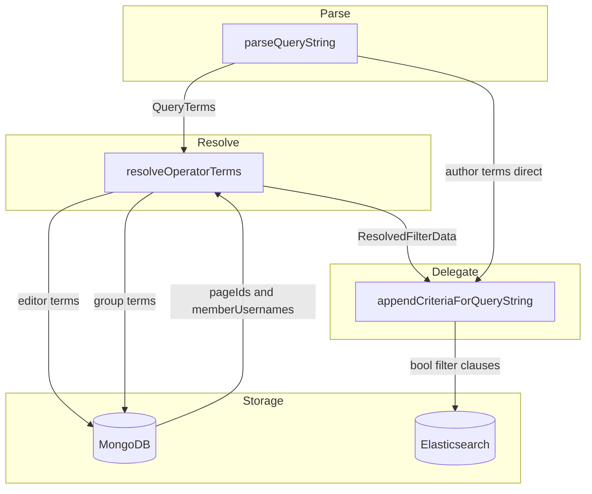
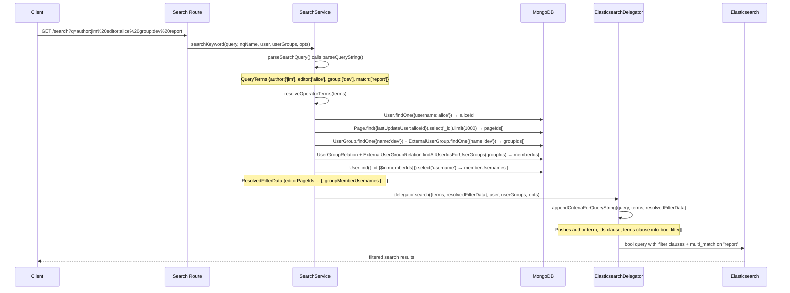

# Design Document: search-filters

## Overview

This feature extends GROWI's existing inline search operator system with three new operators: `author:`, `editor:`, and `group:`. Users type these directly into the search box alongside free-text keywords; the server parses, resolves, and applies them as Elasticsearch filter clauses.

**Users**: GROWI team members who search a large wiki and want to scope results by page creator, last editor, or group membership.

**Impact**: Modifies three server-side files — `interfaces/search.ts`, `service/search.ts`, and `service/search-delegator/elasticsearch.ts`. No client changes. No new URL parameters. No new UI components.

### Goals

- `author:username` filters pages whose creator matches that username (direct ES `username` field — already indexed)
- `editor:username` filters pages last edited by that user (MongoDB pre-resolution → page IDs → ES `ids` clause)
- `group:groupname` filters pages authored by members of the named group (MongoDB pre-resolution → member usernames → ES `terms` clause)
- Negation variants (`-author:`, `-editor:`, `-group:`) consistent with existing `-prefix:` / `-tag:` behavior
- Zero regression on existing operators and existing search behavior

### Non-Goals

- New UI components, filter bars, or dedicated controls
- New URL parameters (all state stays in `?q=`)
- ES index schema changes — `editor:` is resolved via MongoDB, not a new indexed field
- Date-based operators (V2)
- Named query (`nq:`) system changes
- Mobile `SearchOptionModal` changes

---

## Boundary Commitments

### This Spec Owns

- `QueryTerms` type: 6 new fields (`author`, `not_author`, `editor`, `not_editor`, `group`, `not_group`)
- `ESTermsKey` type: extended to include the 6 new fields
- `ResolvedFilterData` type: new type carrying MongoDB-resolved values
- `SearchableData` type: extended with optional `resolvedFilterData` field
- `parseQueryString()`: regex and branching extended for new operator prefixes; empty-value guard
- `resolveOperatorTerms()`: new private method in `SearchService` — MongoDB resolution for `editor` and `group` terms
- `searchKeyword()`: resolution step inserted between parse and delegate
- `appendCriteriaForQueryString()`: 6 new filter clause builders
- `AVAILABLE_KEYS` array in `ElasticsearchDelegator`: updated to include new keys

### Out of Boundary

- ES index mappings — no new fields added (`username` is already indexed; `editor:` avoids schema change via MongoDB resolution)
- `UserGroup`, `ExternalUserGroup`, `User`, `Page`, `UserGroupRelation`, `ExternalUserGroupRelation` models — called read-only, not modified
- Client-side code — no changes
- `nq:` named query system — not touched
- `MongoTermsKey` type — new operators are `ESTermsKey` only (no Mongo query path for these)

### Allowed Dependencies

- `UserGroup.findOne({ name })` — read-only
- `ExternalUserGroup.findOne({ name })` — read-only (external groups must be included; see research.md D3)
- `UserGroupRelation.findAllUserIdsForUserGroups(ids[])` — existing static method, read-only
- `ExternalUserGroupRelation.findAllUserIdsForUserGroups(ids[])` — existing static method, read-only
- `User.findOne({ username })` — read-only (editor resolution step 1)
- `User.find({ _id: { $in: ids } }).select('username')` — read-only (group resolution step 3)
- `Page.find({ lastUpdateUser: userId }).select('_id').limit(EDITOR_PAGE_ID_LIMIT)` — read-only

### Revalidation Triggers

- `username` ES field renamed or type changed → `author:` clause breaks
- `UserGroup.name` field renamed or type changed → `group:` name lookup breaks
- `UserGroupRelation.findAllUserIdsForUserGroups()` or `ExternalUserGroupRelation.findAllUserIdsForUserGroups()` signature changed → `group:` resolution breaks
- `Page.lastUpdateUser` field renamed → `editor:` resolution breaks
- `AVAILABLE_KEYS` or `ESTermsKey` not updated when `QueryTerms` is extended → `validateTerms()` rejects new operators

---

## Architecture

### Existing Architecture

`parseQueryString(queryString)` splits the `?q=` value on spaces, matches `prefix:` and `tag:` prefixes via regex, and populates `QueryTerms` arrays. `searchKeyword()` calls `parseSearchQuery()`, then `resolve()` to get `[delegator, data]`, then `delegator.search(data, ...)`. Inside the delegator, `appendCriteriaForQueryString(query, data.terms)` maps each `QueryTerms` array to an ES bool filter clause.

### Extension Pattern

The three new operators follow the same pipeline with one addition: a **resolution step** in `SearchService` for `editor` and `group` terms. `author` needs no resolution — it maps directly to an already-indexed ES field.



**Key decision**: `author:` terms pass straight from parser to ES delegator (no MongoDB). `editor:` and `group:` terms are intercepted by `resolveOperatorTerms()` in `SearchService` before the delegator is called.

### Technology Stack

| Layer | Choice / Version | Role in Feature |
|-------|-----------------|-----------------|
| Query parsing | Regex (existing) | Extended to recognise `author:`, `editor:`, `group:` prefixes |
| MongoDB | Mongoose (existing) | Read-only resolution: username → userId → pageIds; groupName → memberIds → memberUsernames |
| Elasticsearch | Existing delegator | New `term`, `ids`, `terms` filter clauses in `bool.filter[]` |

No new dependencies introduced.

---

## File Structure Plan

### Modified Files

```
apps/app/src/server/
├── interfaces/
│   └── search.ts              # Extend QueryTerms (6 new fields), ESTermsKey; add ResolvedFilterData; extend SearchableData
├── service/
│   └── search.ts              # Extend parseQueryString(); add resolveOperatorTerms(); call it in searchKeyword()
└── service/search-delegator/
    └── elasticsearch.ts       # Extend appendCriteriaForQueryString(); update AVAILABLE_KEYS
```

No new files. All changes are additive to existing files.

---

## System Flow



---

## Requirements Traceability

| Requirement | Summary | Component | Notes |
|-------------|---------|-----------|-------|
| 1.1 | `author:` returns creator pages | `parseQueryString` + `appendCriteriaForQueryString` | `term: { username }` on existing ES field |
| 1.2 | `author:` + keywords combined | `appendCriteriaForQueryString` | AND via separate filter and must clauses |
| 1.3 | `author:` not in full-text | `parseQueryString` | Token not added to `match[]` |
| 1.4 | `author:` empty → ignore | `parseQueryString` | Empty value guard; token dropped |
| 2.1 | `editor:` returns last-editor pages | `resolveOperatorTerms` + `appendCriteriaForQueryString` | MongoDB → pageIds → `ids` clause |
| 2.2 | `editor:` + keywords combined | `appendCriteriaForQueryString` | AND via bool.filter |
| 2.3 | `editor:` not in full-text | `parseQueryString` | Token not added to `match[]` |
| 2.4 | `editor:` empty → ignore | `parseQueryString` | Empty value guard; token dropped |
| 3.1 | `group:` returns member-authored pages | `resolveOperatorTerms` + `appendCriteriaForQueryString` | MongoDB → memberUsernames → `terms` clause |
| 3.2 | `group:` + keywords combined | `appendCriteriaForQueryString` | AND via bool.filter |
| 3.3 | `group:` not in full-text | `parseQueryString` | Token not added to `match[]` |
| 3.4 | `group:` empty → ignore | `parseQueryString` | Empty value guard; token dropped |
| 4.1 | `-author:` excludes creator | `parseQueryString` + `appendCriteriaForQueryString` | `must_not: { term: { username } }` |
| 4.2 | `-editor:` excludes last editor | `resolveOperatorTerms` + `appendCriteriaForQueryString` | `must_not: { ids: { values: notEditorPageIds } }` |
| 4.3 | `-group:` excludes group members | `resolveOperatorTerms` + `appendCriteriaForQueryString` | `must_not: { terms: { username: notGroupMemberUsernames } }` |
| 4.4 | All constraints AND | `appendCriteriaForQueryString` | All pushed to `bool.filter[]` |
| 5.1 | Multiple operators AND | `appendCriteriaForQueryString` | All in `bool.filter[]` array |
| 5.2 | New + existing operators | `appendCriteriaForQueryString` | All filter clauses merged into same `bool.filter[]` |
| 5.3 | New + keywords | `parseQueryString` + `appendCriteriaForQueryString` | `match[]` populated separately |
| 5.4 | Existing operators unchanged | `parseQueryString` | Existing regex branches unmodified |
| 6.1 | Unknown `author:` → empty | `appendCriteriaForQueryString` | ES `term` on non-existent username → no match |
| 6.2 | Unknown `editor:` → empty | `resolveOperatorTerms` | `User.findOne()` null → `editorPageIds = []` → no ES match |
| 6.3 | Unknown `group:` → empty | `resolveOperatorTerms` | Both group lookups null → `memberUsernames = []` → no ES match |
| 6.4 | Group with no members → empty | `resolveOperatorTerms` | `findAllUserIdsForUserGroups` returns `[]` → `memberUsernames = []` |

---

## Components and Interfaces

### Types Layer (`interfaces/search.ts`)

| Component | Intent | Requirements |
|-----------|--------|--------------|
| `QueryTerms` extension | Add 6 new parsed-token arrays | 1.1–1.4, 2.1–2.4, 3.1–3.4, 4.1–4.4 |
| `ResolvedFilterData` | Carry MongoDB-resolved values from SearchService to delegator | 2.1, 2.2, 3.1, 3.2, 4.2, 4.3 |
| `SearchableData` extension | Add optional `resolvedFilterData` field | 2.1, 3.1 |
| `ESTermsKey` extension | Register new keys for validation | 5.4 |

**Contracts**: Service [ ]

```typescript
// Extended QueryTerms — added fields only (existing 8 fields unchanged)
export type QueryTerms = {
  // ... existing fields ...
  author: string[];      // raw usernames from author: tokens
  not_author: string[];
  editor: string[];      // raw usernames from editor: tokens — resolved to pageIds by SearchService
  not_editor: string[];
  group: string[];       // raw group names from group: tokens — resolved to memberUsernames by SearchService
  not_group: string[];
};

// New type — populated by SearchService.resolveOperatorTerms()
export type ResolvedFilterData = {
  editorPageIds: string[];
  notEditorPageIds: string[];
  groupMemberUsernames: string[];
  notGroupMemberUsernames: string[];
};

// Extended SearchableData
export type SearchableData = {
  queryString: string;
  terms: QueryTerms;
  resolvedFilterData?: ResolvedFilterData; // absent when no editor/group terms present
};
```

---

### Query Parser (`service/search.ts` — `parseQueryString`)

| Field | Detail |
|-------|--------|
| Intent | Extend token recognition to include `author:`, `editor:`, `group:` prefixes |
| Requirements | 1.1–1.4, 2.1–2.4, 3.1–3.4, 4.1–4.3, 5.3, 5.4 |

**Contracts**: Service [x]

The existing regex is extended to include the three new operator prefixes:

```typescript
// Before (existing):
const matchNegative = word.match(/^-(prefix:|tag:)?(.+)$/);
const matchPositive = word.match(/^(prefix:|tag:)?(.+)$/);

// After (extended):
const matchNegative = word.match(/^-(prefix:|tag:|author:|editor:|group:)?(.+)$/);
const matchPositive = word.match(/^(prefix:|tag:|author:|editor:|group:)?(.+)$/);
```

New branches added in the `if/else` chain:
```typescript
if (matchPositive[1] === 'author:') {
  if (matchPositive[2]) authors.push(matchPositive[2]);   // empty-value guard (Req 1.4)
} else if (matchPositive[1] === 'editor:') {
  if (matchPositive[2]) editors.push(matchPositive[2]);   // empty-value guard (Req 2.4)
} else if (matchPositive[1] === 'group:') {
  if (matchPositive[2]) groups.push(matchPositive[2]);    // empty-value guard (Req 3.4)
}
// Negation mirrors (not_author, not_editor, not_group)
```

- **Postcondition**: tokens with recognized operator prefix are never added to `match[]` (Req 1.3, 2.3, 3.3)
- **Postcondition**: existing `prefix`, `not_prefix`, `tag`, `not_tag`, `match`, `not_match`, `phrase`, `not_phrase` behavior unmodified (Req 5.4)

---

### Resolution Step (`service/search.ts` — `resolveOperatorTerms`)

| Field | Detail |
|-------|--------|
| Intent | Resolve `editor` usernames to page IDs and `group` names to member usernames via MongoDB |
| Requirements | 2.1, 2.2, 3.1, 3.2, 4.2, 4.3, 6.2, 6.3, 6.4 |

**Contracts**: Service [x]

```typescript
private async resolveOperatorTerms(terms: QueryTerms): Promise<ResolvedFilterData>
```

- Called in `searchKeyword()` between `resolve()` and `delegator.search()`
- Returns early with all-empty arrays if no `editor`, `not_editor`, `group`, `not_group` terms present

**Editor resolution** (per username in `terms.editor` and `terms.not_editor`):
```
for each username:
  user = await User.findOne({ username }).select('_id').lean()
  if user is null → contribute no page IDs (Req 6.2)
  else:
    pages = await Page.find({ lastUpdateUser: user._id })
                      .select('_id')
                      .sort({ updatedAt: -1 })
                      .limit(EDITOR_PAGE_ID_LIMIT)   // constant = 1000
                      .lean()
    collect page._id strings
```

**Group resolution** (per name in `terms.group` and `terms.not_group`):
```
for each groupName:
  [internalGroup, externalGroup] = await Promise.all([
    UserGroup.findOne({ name: groupName }).lean(),
    ExternalUserGroup.findOne({ name: groupName }).lean(),
  ])
  groupIds = [internalGroup?._id, externalGroup?._id].filter(Boolean)
  if groupIds is empty → contribute no usernames (Req 6.3)
  else:
    [internalMemberIds, externalMemberIds] = await Promise.all([
      UserGroupRelation.findAllUserIdsForUserGroups(groupIds),
      ExternalUserGroupRelation.findAllUserIdsForUserGroups(groupIds),
    ])
    memberIds = deduplicated union of both
    if memberIds is empty → contribute no usernames (Req 6.4)
    else:
      users = await User.find({ _id: { $in: memberIds } }).select('username').lean()
      collect user.username strings
```

**Implementation Notes**
- `EDITOR_PAGE_ID_LIMIT = 1000` — documented limitation: if a user's last-edit history exceeds 1000 pages, only the 1000 most recently updated are matched.
- Multiple `editor:` or `group:` tokens accumulate: page IDs and member usernames are merged across all tokens in the same array before building ES clauses.
- `ExternalUserGroup.findOne({ name })` uses only `name` — since external group names are not globally unique (compound index `{name, provider}`), a `group:` token may match both an internal group and the first external group with that name. This is an acceptable approximation for V1.

---

### ES Clause Builder (`service/search-delegator/elasticsearch.ts`)

| Field | Detail |
|-------|--------|
| Intent | Build and append ES filter clauses for the three new operators |
| Requirements | 1.1–1.3, 2.1–2.2, 3.1–3.2, 4.1–4.4, 5.1–5.4, 6.1–6.4 |

**Contracts**: Service [x]

Method signature extended:
```typescript
appendCriteriaForQueryString(
  query: SearchQuery,
  parsedKeywords: ESQueryTerms,
  resolvedFilterData?: ResolvedFilterData,  // NEW
): void
```

New clauses appended to `query.body.query.bool.filter[]`:

| Operator | ES Clause | Condition |
|----------|-----------|-----------|
| `author:jim` | `{ bool: { must: [{ term: { username: 'jim' } }] } }` | `terms.author.length > 0` |
| `-author:jim` | `{ bool: { must_not: [{ term: { username: 'jim' } }] } }` | `terms.not_author.length > 0` |
| `editor:alice` | `{ bool: { must: [{ ids: { values: editorPageIds } }] } }` | `editorPageIds.length > 0` |
| `-editor:alice` | `{ bool: { must_not: [{ ids: { values: notEditorPageIds } }] } }` | `notEditorPageIds.length > 0` |
| `group:dev` | `{ bool: { must: [{ terms: { username: groupMemberUsernames } }] } }` | `groupMemberUsernames.length > 0` |
| `-group:dev` | `{ bool: { must_not: [{ terms: { username: notGroupMemberUsernames } }] } }` | `notGroupMemberUsernames.length > 0` |

- When `resolvedFilterData` is absent or an array is empty, the corresponding clause is not pushed — no-op (Req 5.4 regression safety, 6.2–6.4 empty result).
- `AVAILABLE_KEYS` constant updated with all six new `QueryTerms` key names.

---

## Error Handling

| Scenario | Behavior | Requirement |
|----------|----------|-------------|
| Unknown `author:` username | ES `term` on non-existent username → 0 results | 6.1 |
| Unknown `editor:` username | `User.findOne()` returns null → `editorPageIds = []` → clause skipped → 0 results | 6.2 |
| Unknown `group:` name | Both group lookups return null → `memberUsernames = []` → clause skipped → 0 results | 6.3 |
| Group with no members | `findAllUserIdsForUserGroups` returns `[]` → `memberUsernames = []` → 0 results | 6.4 |
| `editor:` user > 1000 last-edited pages | Only 1000 most recently updated matched; documented limit | — |
| Empty operator value (`author:`) | Parser drops token; no terms array entry; no ES clause | 1.4, 2.4, 3.4 |
| All operators absent | `resolvedFilterData` not populated; existing delegator behavior unchanged | 5.4 |

---

## Testing Strategy

### Unit Tests

| Target | What to verify |
|--------|---------------|
| `parseQueryString('author:jim report')` | `author: ['jim']`, `match: ['report']`; `match` does not contain `author:jim` (Req 1.1, 1.3) |
| `parseQueryString('author: report')` | `author: []` — empty value dropped (Req 1.4) |
| `parseQueryString('-author:jim')` | `not_author: ['jim']`, `author: []` (Req 4.1) |
| `parseQueryString('editor:alice group:dev tag:wiki prefix:/team')` | All operators correctly separated; `match: []` (Req 5.2, 5.4) |
| `parseQueryString('regular keyword')` | Existing behavior unchanged (Req 5.4 regression) |
| `resolveOperatorTerms` — known editor | Returns non-empty `editorPageIds` (Req 2.1) |
| `resolveOperatorTerms` — unknown editor | `User.findOne()` null → `editorPageIds: []` (Req 6.2) |
| `resolveOperatorTerms` — known group | Both UserGroup + ExternalUserGroup queried; returns `groupMemberUsernames` (Req 3.1) |
| `resolveOperatorTerms` — unknown group | Both lookups null → `groupMemberUsernames: []` (Req 6.3) |
| `resolveOperatorTerms` — empty group | `findAllUserIdsForUserGroups` returns `[]` → `groupMemberUsernames: []` (Req 6.4) |
| `appendCriteriaForQueryString` — `author` terms | `bool.filter` contains `term: { username }` (Req 1.1) |
| `appendCriteriaForQueryString` — `not_author` terms | `bool.filter` contains `must_not: { term: { username } }` (Req 4.1) |
| `appendCriteriaForQueryString` — non-empty `editorPageIds` | `bool.filter` contains `ids: { values: [...] }` (Req 2.1) |
| `appendCriteriaForQueryString` — empty `editorPageIds` | No `ids` clause added (Req 6.2) |
| `appendCriteriaForQueryString` — `groupMemberUsernames` | `bool.filter` contains `terms: { username: [...] }` (Req 3.1) |
| `appendCriteriaForQueryString` — no resolvedFilterData | `bool.filter` unchanged from pre-extension behavior (Req 5.4) |

### Integration Tests

| Scenario | What to verify |
|----------|---------------|
| `searchKeyword('author:jim report')` end-to-end | ES query has `bool.filter` with `term: { username: 'jim' }` and `bool.must` with `multi_match` on `report` |
| `searchKeyword('group:dev-team')` end-to-end | MongoDB resolution produces member usernames; ES query has `terms: { username: [...] }` |
| `searchKeyword('author:jim tag:wiki prefix:/team')` | All three filter clauses present in `bool.filter`; existing operators unaffected |
| `searchKeyword('author:nonexistent')` | Returns empty result set, not a server error |
| `searchKeyword('group:nonexistent-group')` | Returns empty result set, not a server error |
