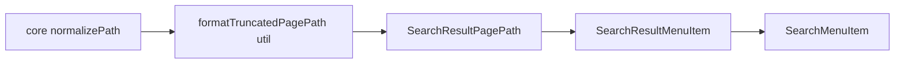
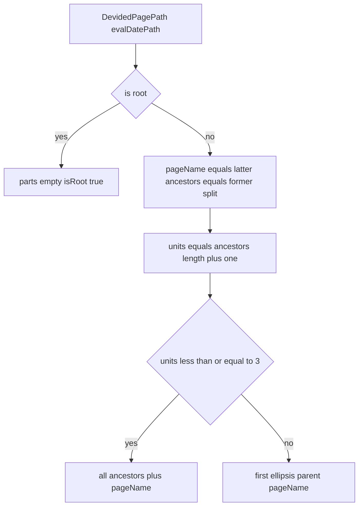

# 技術設計書 — search-modal-path-truncation

## Overview

**Purpose**: 全文検索モーダル（Search Modal / クイック検索）の検索結果に表示されるページパスを、Notion 風の中間省略表示に変更し、深い階層・長いセグメント名でもモーダルのレイアウトが崩れないようにする。

**Users**: GROWI 利用者がクイック検索で結果を一覧する際、各行のパスを 1 行で見渡して目的ページを素早く判別できるようになる。

**Impact**: 現状、モーダルのパスは共有コンポーネント `PagePathLabel`（@growi/ui）で `former/` + 太字 `latter` を単一 `<span>` に出力し、`text-break text-wrap` で複数行に折り返している。本設計では、検索フィーチャー内に新規の表示コンポーネントと純粋関数を追加し、`SearchResultMenuItem` のパス表示部分のみを差し替える。共有コンポーネントには手を入れない。

### Goals
- パスの表示単位数が 4 以上のとき「先頭セグメント / … / 親セグメント / ページ名」で表示する（中間省略）。
- パス表示を常に 1 行に収め、階層の深さ・セグメント長（CJK 含む）に関わらず横幅がモーダル内容幅を超えない。
- 省略された行はホバーでフルパスを確認できる。
- **ページ名の決定規則は現行を踏襲する**（末尾が日付 `/YYYY[/MM[/DD]]` の場合は日付をまとめて 1 単位のページ名として太字表示）。
- 検索結果行のクリック遷移・既読数など、パス以外の既存挙動を変更しない。

### Non-Goals
- 全文検索結果ページ（`/_search`）のパス表示は対象外（既に独自の省略を持つ）。
- 検索クエリ挙動（検索対象・マッチ方式・件数・データ取得）は対象外。
- 共有コンポーネント `PagePathLabel`（@growi/ui）および `DevidedPagePath`（@growi/core）の実装変更は行わない（`DevidedPagePath` は利用のみ）。

## Boundary Commitments

### This Spec Owns
- 検索モーダルの各結果行における**ページパスの表示形式**（中間省略の判定・レンダリング・1 行制御・ホバーでのフルパス提示）。
- 中間省略の判定を行う純粋関数（`path` 文字列 → 表示パーツ列）。
- 上記表示コンポーネント専用の CSS（1 行固定・オーバーフロー安全網）。

### Out of Boundary
- `PagePathLabel`（@growi/ui）/ `DevidedPagePath`・`LinkedPagePath` の実装。
- 検索結果のデータ取得（`useSWRxSearch`）・検索 API・ハイライト HTML。
- 全文検索結果ページおよびモーダル外のパンくず・ページツリー表示。
- 検索モーダルのレイアウト骨格（`SearchModal` の Modal/Downshift 構造）。

### Allowed Dependencies
- `@growi/core/dist/utils` の `normalizePath`（パス正規化）。
- `@growi/core/dist/models` の `DevidedPagePath`（`evalDatePath` によるページ名決定に利用のみ。実装は変更しない）。
- `@growi/ui/dist/components` の `UserPicture`（既存の行構成要素として利用のみ）。
- 既存の検索結果データ `item.data.path`（プレーン文字列。追加取得なし）。
- React / Bootstrap ユーティリティクラス / SCSS module（既存パターン）。

### Revalidation Triggers
- 検索結果データの `path` の形（プレーン文字列 → HTML ハイライト付き等）が変わる場合。
- 行レイアウト（`SearchMenuItem` の flex 構成、footprint 表示）が変わる場合。
- 中間省略の判定ルール（保持セグメントやしきい値）を変更する場合。

## Architecture

### Existing Architecture Analysis
- レンダリング連鎖: `SearchModal` → `SearchResultMenuItem` → `SearchMenuItem`（行の flex ラッパー）→ 現状は `PagePathLabel`。
- 行は `<li className="d-flex align-items-center ...">`。子は `UserPicture`（固定）→ パス `<span className="ms-3 text-break text-wrap">`（現状折り返し）→ footprint（既読数）`<span>` の 3 要素。
- パスは `PagePathLabel` に `isPathIncludedHtml` を渡していないため**プレーン文字列**（HTML ハイライトなし）。したがって新コンポーネントは `dangerouslySetInnerHTML` を用いず、プレーンなセグメント文字列として安全にレンダリングできる。
- 保持すべき統合点: 行 `<li>` のクリック遷移（Downshift `getItemProps`）、既読数表示。これらは `SearchMenuItem`/`SearchResultMenuItem` 側にあり、本変更はパス `<span>` 内部の差し替えに限定するため影響しない。

### Architecture Pattern & Boundary Map
- **選択パターン**: フィーチャーローカルの「純粋ロジック + 薄い表示アダプタ」分離（coding-style: framework wrapper から純粋関数を抽出）。
- **新規コンポーネントの根拠**: 共有 `PagePathLabel` は多数の消費者を持つため、中間省略という検索モーダル固有の要求を共有側に持ち込むと API 拡大・回帰リスクが大きい。フィーチャー内に閉じた新規コンポーネントとして実装し、影響範囲をモーダルに限定する。
- **依存方向**: `util（純粋関数）` → `presentational component` → `SearchResultMenuItem（既存）`。util は React 非依存で最左（他レイヤーから import されるが上位を import しない）。



### Technology Stack

| Layer | Choice / Version | Role in Feature | Notes |
|-------|------------------|-----------------|-------|
| Frontend | React 18 / Next.js 14 (Pages Router) | 表示コンポーネント | 既存スタック |
| Frontend | SCSS module | 1 行固定・ellipsis 安全網 | 既存パターン（`*.module.scss`） |
| Shared util | `@growi/core/dist/utils` `normalizePath` | パス正規化 | 既存依存 |
| Shared model | `@growi/core/dist/models` `DevidedPagePath` | ページ名決定（末尾日付束ね） | 既存依存・利用のみ |

新規ライブラリ追加なし。ツールチップはネイティブ `title` 属性を用いる（reactstrap `Tooltip` は不使用。[ui-pitfalls](../../../apps/app/.claude/rules/ui-pitfalls.md) の `useId`→`target` 問題を回避し、実装を最小化する）。

## File Structure Plan

### Directory Structure
```
apps/app/src/features/search/client/
├── utils/
│   ├── format-truncated-page-path.ts        # 純粋関数: path → 表示パーツ列 + フルパス
│   └── format-truncated-page-path.spec.ts    # 純粋関数のユニットテスト
└── components/
    ├── SearchResultPagePath.tsx              # 表示コンポーネント（パス span を所有）
    ├── SearchResultPagePath.module.scss      # 1 行固定・ellipsis 安全網の CSS
    └── SearchResultPagePath.spec.tsx         # コンポーネントの contract テスト（RTL）
```

### Modified Files
- `apps/app/src/features/search/client/components/SearchResultMenuItem.tsx` — パス表示部の `<span className="ms-3 text-break text-wrap"><PagePathLabel .../></span>` を `<SearchResultPagePath path={item.data.path} />` に差し替え。行内で幅が正しく縮むよう、パス要素に flex 伸縮（`flex-grow` + `min-width: 0`）を持たせ、footprint span には縮小防止（`flex-shrink-0`）を付与する。`PagePathLabel` の import を削除。

> `PagePathLabel`（@growi/ui）・`SearchMenuItem`・SCSS 変数等の共有資産は変更しない。

## System Flows

中間省略の判定は純粋関数内の分岐で完結する。



判定ルール（決定事項）:
- ページ名（`pageName`）は `new DevidedPagePath(path, false, true)` の `latter`（末尾日付は 1 単位に束ねる現行規則）。祖先セグメント（`ancestors`）は `former` を `/` 分割し空要素を除いたもの。root（`/`）は `isRoot: true`。
- 表示単位数 = `ancestors.length + 1`（ページ名）。`<= 3` は全単位表示（中間に隠せる祖先が無い）。`>= 4` は先頭祖先・親（＝末尾の祖先）・ページ名を残し、中間の祖先を `…` に畳む。ちょうど 4 は中間の祖先 1 個のみ省略。
- CSS の 1 行 ellipsis（横幅安全網）は判定とは独立に常時適用され、保持したどの単位が長くてもオーバーフローさせない。

## Requirements Traceability

| Requirement | Summary | Components | Interfaces | Flows |
|-------------|---------|------------|------------|-------|
| 1.1, 1.2 | 4 セグ以上で先頭+…+親+ページ名、3 要素を常に保持 | formatTruncatedPagePath, SearchResultPagePath | `TruncatedPagePath` | 判定フロー |
| 1.3 | ページ名を現行規則（日付束ね）で決定し太字強調 | formatTruncatedPagePath, SearchResultPagePath | `DevidedPagePath.latter`, `PagePathPart.isPageName` | 判定フロー |
| 1.4 | 省略記号 … を視覚的に区別 | SearchResultPagePath | `PagePathPart.type='ellipsis'` | — |
| 2.1 | 3 セグ以下は全表示 | formatTruncatedPagePath | `TruncatedPagePath.parts` | 判定フロー |
| 2.2 | ルートは現行表現 | formatTruncatedPagePath, SearchResultPagePath | `isRoot` | 判定フロー |
| 2.3 | ちょうど 4 セグは中間 1 個省略 | formatTruncatedPagePath | `parts` | 判定フロー |
| 3.1, 3.3 | 1 行固定・深さ/長さに依らずオーバーフローしない | SearchResultPagePath.module.scss, SearchResultMenuItem | — | — |
| 3.2 | 保持セグメントが長い場合 ellipsis 切り詰め | SearchResultPagePath.module.scss | — | — |
| 4.1, 4.2 | 省略時ホバーでフルパス | SearchResultPagePath | `title` 属性 / `fullPath` | — |
| 5.1 | クリック遷移維持 | SearchResultMenuItem（非改変部） | Downshift `getItemProps` | — |
| 5.2 | 既読数等パス以外維持 | SearchResultMenuItem | — | — |
| 5.3 | 追加リクエストなし | formatTruncatedPagePath | `item.data.path` のみ | — |

## Components and Interfaces

| Component | Domain/Layer | Intent | Req Coverage | Key Dependencies | Contracts |
|-----------|--------------|--------|--------------|------------------|-----------|
| formatTruncatedPagePath | util (pure) | path → 表示パーツ列 + フルパス | 1.1, 1.2, 1.3, 2.1, 2.2, 2.3, 5.3 | DevidedPagePath (P0), normalizePath (P0) | Service (pure fn) |
| SearchResultPagePath | UI (presentational) | パーツ列を 1 行で描画し title を付与 | 1.1, 1.3, 1.4, 3.x, 4.x | formatTruncatedPagePath (P0) | State (props only) |

### util (pure)

#### formatTruncatedPagePath

| Field | Detail |
|-------|--------|
| Intent | パス文字列を、中間省略済みの表示パーツ列とフルパスに変換する純粋関数 |
| Requirements | 1.1, 1.2, 2.1, 2.2, 2.3, 5.3 |

**Responsibilities & Constraints**
- 入力 `path`（プレーン文字列）を `new DevidedPagePath(path, false, true)` に渡し、`isRoot` / `former` / `latter` を得る（`latter` = 末尾日付束ねを含むページ名）。
- root: `isRoot: true`, `parts: []`, `fullPath: '/'`。
- 非 root: `pageName = latter`、`ancestors = normalizePath(former)` を `/` 分割し空要素除去。表示単位数 `units = ancestors.length + 1`。
  - `units <= 3`: 全 `ancestors` を `segment` パーツ化し、末尾に `pageName`（`isPageName: true`）を付す。
  - `units >= 4`: `[ancestors[0] segment, ellipsis, ancestors[last] segment(親), pageName segment(isPageName:true)]`。
- `fullPath` は正規化済みフルパス（`former` + `latter` を復元、または `normalizePath(path)`）。
- React 非依存・副作用なし。DOM 計測やネットワークアクセスを行わない（5.3）。

**Contracts**: Service [x]

##### Service Interface
```typescript
export type PagePathPart =
  | { readonly type: 'segment'; readonly text: string; readonly isPageName: boolean }
  | { readonly type: 'ellipsis' };

export interface TruncatedPagePath {
  readonly isRoot: boolean;
  readonly parts: readonly PagePathPart[]; // '/' 区切りで描画される順序付きパーツ
  readonly fullPath: string;               // 正規化済みフルパス（ツールチップ用）
}

export const formatTruncatedPagePath = (path: string): TruncatedPagePath;
```
- Preconditions: `path` は文字列（空文字・`/`・相対/絶対いずれも許容）。ハイライト HTML を含まないプレーン文字列であること。
- Postconditions: `isRoot === true` のとき `parts` は空。表示単位数 `>= 4` のとき `parts` にちょうど 1 個の `ellipsis` を含む。末尾の `segment` は常に `isPageName: true`（非 root 時）で、その `text` は `DevidedPagePath.latter`（日付束ねを含む）と一致する。
- Invariants: 入力を変更しない（immutability）。同一入力で同一出力（純粋）。

### UI (presentational)

#### SearchResultPagePath

| Field | Detail |
|-------|--------|
| Intent | `formatTruncatedPagePath` の結果を 1 行の flex 行として描画し、フルパスを `title` で提示する薄い表示コンポーネント |
| Requirements | 1.1, 1.3, 1.4, 3.1, 3.2, 3.3, 4.1, 4.2 |

**Dependencies**
- Outbound: `formatTruncatedPagePath` — 表示パーツ算出 (P0)
- External: なし（ネイティブ `title` 使用）

**Contracts**: State [x]（props のみ、内部状態なし）

Props:
```typescript
interface SearchResultPagePathProps {
  readonly path: string;
}
```

**Implementation Notes**
- **描画**: root は `/` を現行同様に表示（2.2）。非 root は先頭に `/`、以降 `segment` を `/` 区切りで描画。`isPageName` のセグメントは `<strong>` で太字（1.3）。`ellipsis` パーツは中間省略と分かる独立要素（`…`、muted 表示）として描画（1.4）。ハイライト HTML を含まないためプレーンテキストとして描画する。
- **1 行安全網（3.x）**: ルート要素は 1 行固定（`white-space: nowrap; overflow: hidden`）。各 `segment` に `text-overflow: ellipsis; overflow: hidden; min-width: 0`。`flex-shrink` で縮小優先度を制御し、先頭・親セグメントを先に縮め、ページ名は最後に縮む（`flex-shrink` を小さく）ことで、どのセグメントが長くても 1 行内に収める。区切り `/` と `…` は縮小・折り返し不可（`flex-shrink: 0; white-space: nowrap`）。CSS 値の詳細は `*.module.scss` で定義。
- **行レイアウト連携**: `SearchResultMenuItem` の `<li>`（`d-flex`）内で本要素が可変幅を占めるよう `flex-grow: 1; min-width: 0`。footprint（既読数）は縮小しないよう `flex-shrink-0`。
- **ツールチップ（4.x）**: ルート要素へ `title={fullPath}` を常時付与する。中間省略は静的に判定できるが、CSS の per-segment ellipsis は実行時の幅依存で発生し得るため、DOM 計測を避けつつ「省略時に必ずフルパスを提示する（4.1）」を満たす最小実装として、常に `title` を付与する（非省略の短いパスでは可視文字列と一致するだけで害はない）。
- **非破壊（5.x）**: 本要素はパス `<span>` の内部のみを所有し、`<li>` のクリック遷移（`getItemProps`）・footprint 表示には関与しない。

## Testing Strategy

### Unit Tests（`format-truncated-page-path.spec.ts`）
- root（`/`・空文字）→ `isRoot: true`, `parts: []`（2.2）。
- 1〜3 セグメント → 全セグメント表示、末尾のみ `isPageName`、`ellipsis` を含まない（2.1）。
- ちょうど 4 セグメント → `ellipsis` 1 個、先頭・親（`segments[2]`）・ページ名（`segments[3]`）を保持（2.3）。
- 深い階層（例: 祖先 5 + ページ名）→ 先頭 + `ellipsis` + 親 + ページ名（1.1, 1.2）。
- **日付パス（現行規則の踏襲）**: 日付束ねは「日付より前に祖先 2 セグメント以上」の条件で発動する（`DevidedPagePath` の実挙動）。`/notes/2024/01/01` は祖先が `notes` の 1 個のみのため**束ねられず** former=`/notes/2024/01`・latter=`01`（単位数 4 → `notes / … / 01 / 01`）。`/team/notes/2024/01/01` は束ねられ latter=`2024/01/01`（単位数 4 → `team / … / notes / 2024/01/01`）。`/Projects/team/notes/2024/01/01` → `先頭=Projects / … / 親=notes / ページ名=2024/01/01`。いずれもページ名 `text` が `DevidedPagePath.latter` と一致すること（1.3）。
- 長い CJK セグメントを含む入力でもパーツ構造が壊れないこと（内容そのままを保持）。
- 末尾/先頭スラッシュ等の正規化前後で期待どおり分割されること。

### Component Tests（`SearchResultPagePath.spec.tsx`, RTL）
- 4 セグ以上でページ名が `<strong>`、`…` が独立要素として描画される（1.3, 1.4）。
- ルート要素に `title` としてフルパスが付与される（4.1, 4.2）。
- root パスで `/` が描画される（2.2）。
- 契約観点で「1 行に収める CSS クラス/構造が適用されている」ことを確認（essential-test-design に従い、実装詳細のスパイではなく可観測な構造を検証）。

### E2E/UI（任意・既存 smoke の範囲）
- 検索モーダルで深いパスの結果を表示し、折り返さず 1 行で収まること、クリックで該当ページへ遷移すること（5.1）。

## Open Questions / Risks

- **ページ名の日付束ねは現行踏襲**: `DevidedPagePath` の `evalDatePath` を利用してページ名（`latter`）を決定するため、日付で終わるページ（例 `/notes/2024/01/01`）はページ名 `2024/01/01` を太字表示する現行挙動を維持する。中間省略は祖先パスに対してのみ働く。→ 浅いパスは現行と完全一致、深いパスは日付ページ名を保ったまま祖先中間のみ `…` に畳む。
- **CSS 縮小優先度の詰め**: `flex-shrink` による「ページ名を最後に縮める」挙動はライト/ダーク両テーマ・各種幅で目視検証が必要（実装時に確認）。ページ名が日付束ね（`2024/01/01`）の場合も 1 単位として扱われ、長い場合は 1 行内で ellipsis 切り詰めされる。
