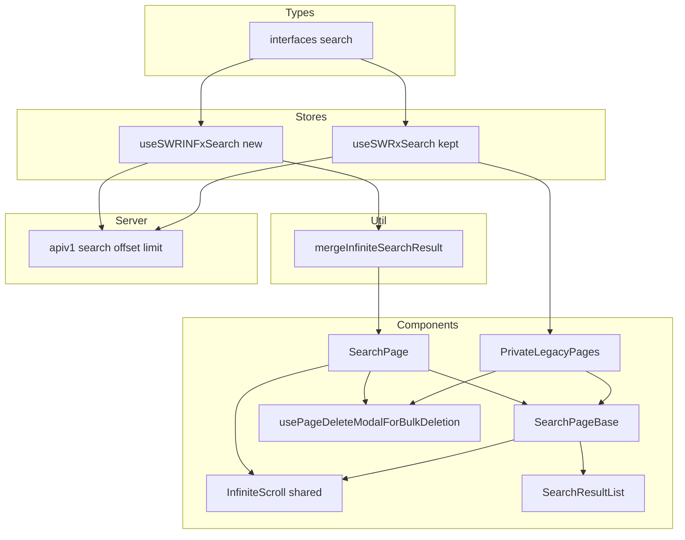
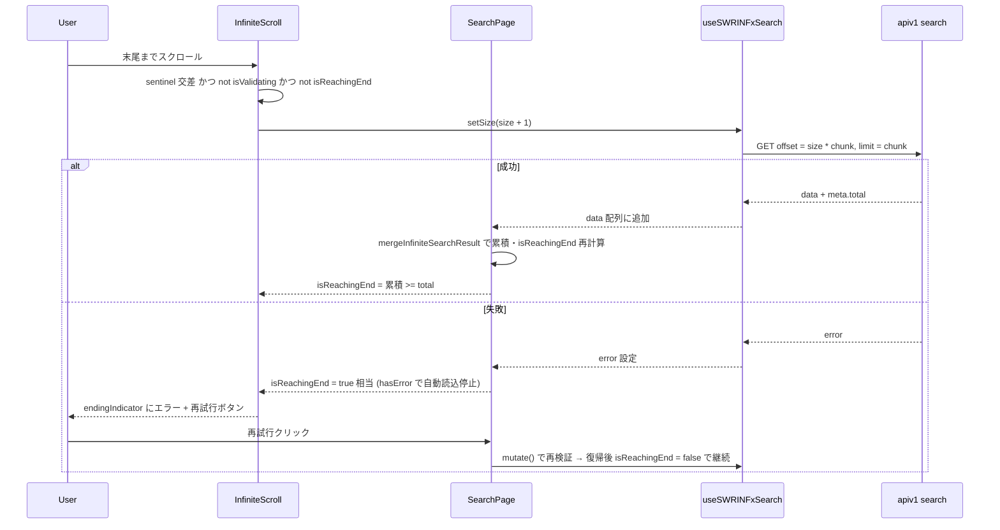
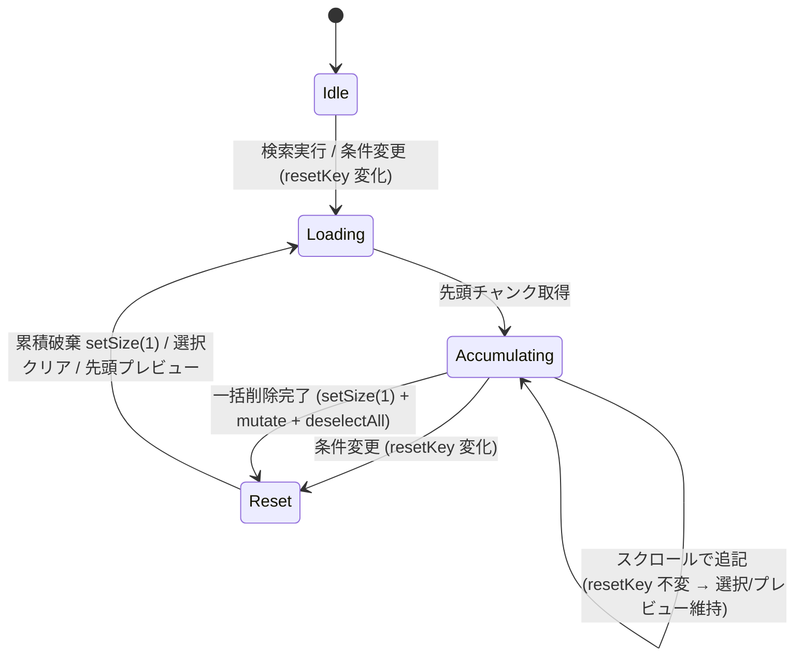

# 技術設計書 — search-result-infinite-scroll

## Overview

**Purpose**: 検索を行うユーザーに対し、フルページ検索結果（`/_search`）の一覧を、ページ番号操作なしにスクロールだけで連続閲覧できる infinite scroll 体験を提供する。

**Users**: GROWI のウィキ利用者（検索結果を閲覧するユーザー）と、検索結果からページを一括管理するページ管理権限ユーザー。

**Impact**: 現在の offset/limit ベースのページ番号ページネーション（`PaginationWrapper`）による「1ページ分だけ表示」方式を、`useSWRInfinite` + 既存 `InfiniteScroll` コンポーネントによる「累積表示」方式へ置き換える。これに伴い、共有コンポーネント `SearchPageBase` の選択・右ペインプレビュー・一括削除ロジックを「累積した結果」を前提として再設計する。検索クエリ・スコアリング・サーバ側の検索ロジックは変更しない。

### Goals
- 検索結果一覧をスクロールで連続読み込みできるようにする（番号ページャの廃止）
- 累積前提で選択・全選択・一括削除・右ペインプレビューが正しく動作する
- 共有資産（`useSWRxSearch`、`SearchPageBase`、`PrivateLegacyPages`）を回帰させない
- 既存の GROWI infinite scroll パターン（`RecentChanges` / `PageTimeline`）を踏襲する

### Non-Goals
- Elasticsearch の検索クエリ・スコアリング・検索ロジックの変更
- 並び替え・フィルタ（絞り込み）UI 自体の仕様変更
- 「検索ヒット全件（未読み込み分を含む `total` 全件）」の一括選択（Gmail 式全件選択バナー）
- infinite scroll と番号ページャの切替式提供
- 検索モーダル・タイプアヘッド・AI アシスタント検索の表示方式（`useSWRxSearch` 消費者）の変更

## Boundary Commitments

### This Spec Owns
- フルページ検索結果ページ（`SearchPage`）の一覧表示方式（infinite scroll 化）
- infinite scroll 用の検索取得フック `useSWRINFxSearch`（新規）
- 累積結果の合成ユーティリティ（flatten・件数集計・`isReachingEnd` 判定）
- `SearchPageBase` の累積対応拡張（`resetKey` によるリセット制御、infinite scroll 描画スロット）
- `usePageDeleteModalForBulkDeletion` の累積リスト対応化

### Out of Boundary
- `useSWRxSearch`（通常 `useSWR`）の内部実装 — **温存**する。infinite scroll 用は別フックを新設
- `PrivateLegacyPages` の番号ページャ・表示件数セレクタ — 現状の挙動を**維持**（本スペックは非回帰のみ担保）
- サーバ側検索 API（apiv1 `/search`）の実装 — offset/limit 契約を**そのまま利用**
- `InfiniteScroll` コンポーネント内部 — 既存契約のまま利用（改変しない）

### Allowed Dependencies
- 既存 apiv1 `/search`（`apiGet`）: `q`/`nq`/`limit`/`offset`/`sort`/`order` を受け、`{ data, meta: { total, hitsCount, took } }` を返す
- 既存 `InfiniteScroll`（`src/client/components/InfiniteScroll.tsx`）: `SWRInfiniteResponse` を受けて IntersectionObserver で `setSize` を駆動
- `swr/infinite` の `useSWRInfinite`
- `SearchResultList` / `SearchResultContent` / `OperateAllControl`（既存、変更なし）
- 依存方向: `interfaces/search`（型）→ `stores/search`（フック）→ `features/search/.../util`（合成）→ `SearchPageBase` → `SearchPage`。左のレイヤーのみ import する。

### Revalidation Triggers
- `IFormattedSearchResult` の shape 変更（`meta.total` / `data` の意味変更）→ 合成ユーティリティ・`isReachingEnd` 判定の再検証
- `SearchPageBase` の props 契約変更（`resetKey` / `infiniteScroll` / `pages` の意味）→ `PrivateLegacyPages` の再検証
- `usePageDeleteModalForBulkDeletion` の引数型変更 → 両消費者（`SearchPage` / `PrivateLegacyPages`）の再検証
- apiv1 `/search` の offset/limit・meta 契約変更 → `useSWRINFxSearch` の再検証

## Architecture

### Existing Architecture Analysis
- **共有フック `useSWRxSearch`（`src/stores/search.tsx`）**: 6 消費者（検索モーダル `SearchResultMenuItem`、`SearchTypeahead`、AI 検索、`PrivateLegacyPages`、`SearchPage`、内部）。単一ページ取得前提のため **useSWRInfinite への直接変換は不可** → 新フックを併設する。
- **共有コンポーネント `SearchPageBase` / `usePageDeleteModalForBulkDeletion`**: `SearchPage` と `PrivateLegacyPages` が共有。`PrivateLegacyPages` は番号ページャを意図的に維持 → `SearchPageBase` の既存挙動を非回帰に保つ。
- **リセット衝突点**: `SearchPageBase` は現在 `useEffect([pages])` で（a）選択 Set のクリア、（b）右ペインを `pages[0]` に設定、を行う。累積方式では `pages` が append のたびに変化するため、この 2 つが「新規検索でのみ発火」するよう **`resetKey` 依存へ切り替える**。
- **既存 infinite scroll パターン**: `RecentChanges` は `useSWRInfinite` + `data.flatMap(...)` + `InfiniteScroll` + 消費側 `isReachingEnd` 計算。検索結果は `meta.total` を持つため `累積件数 >= total` で明快に判定できる。

### Architecture Pattern & Boundary Map



**Architecture Integration**:
- **Selected pattern**: 既存の `useSWRInfinite` + `InfiniteScroll` パターンを踏襲（`RecentChanges` に整合）。新フックは併設し、共有コンポーネントはデータ駆動プロップで拡張。
- **Domain/feature boundaries**: 取得（stores）／合成（util）／表示・選択（components）を分離。infinite scroll 固有の状態は `SearchPage` が保持し、`SearchPageBase` は「累積 `pages` と `resetKey` を受け取る純粋な表示・選択レイヤー」に留める。
- **Existing patterns preserved**: 番号ページャ経路（`PrivateLegacyPages`）、`useSWRxSearch`、`InfiniteScroll` 内部、`SearchResultList`/`SearchResultContent` はそのまま。
- **New components rationale**: `useSWRINFxSearch`（共有フックを壊さず infinite 取得を提供）、`mergeInfiniteSearchResult`（累積合成を純粋関数化しテスト可能に）。
- **Steering compliance**: モード名ハードコードを避け `resetKey`（データ駆動）で制御。フレームワーク wrapper から純粋ロジック（getKey/合成）を抽出（coding-style 準拠）。

### Technology Stack

| Layer | Choice / Version | Role in Feature | Notes |
|-------|------------------|-----------------|-------|
| Frontend | React 18 / Next.js Pages Router | 検索結果ページ UI | 既存 |
| Data fetching | SWR `useSWRInfinite`（`swr/infinite`） | 累積取得・`setSize` 駆動 | 既存依存、新規利用箇所 |
| UI infra | 既存 `InfiniteScroll`（IntersectionObserver） | センチネル交差で追加読込 | 改変せず利用 |
| Backend | apiv1 `/search`（Elasticsearch delegator） | offset/limit 検索取得 | **変更なし** |

新規外部依存なし（`swr` は既存）。

## File Structure Plan

### New Files
```
apps/app/src/features/search/client/util/
└── infinite-search-result.ts        # 累積合成の純粋関数: flatten + 件数集計 + isReachingEnd/isEmpty
apps/app/src/features/search/client/util/
└── infinite-search-result.spec.ts   # 上記のユニットテスト
```

### Modified Files
- `apps/app/src/stores/search.tsx` — `useSWRINFxSearch`（新規フック）と `getSearchInfiniteKey`（純粋な getKey、テスト用に export）を追加。`useSWRxSearch` は**変更しない**。チャンクサイズ定数を共有化。
- `apps/app/src/stores/search.spec.ts`（無ければ新規） — `getSearchInfiniteKey` のユニットテスト。
- `apps/app/src/features/search/client/components/SearchPage/SearchPage.tsx` — `useSWRINFxSearch` に切替。`searchPager`/`PaginationWrapper` を廃止し `InfiniteScroll` を配線。累積 `pages` と `resetKey` を `SearchPageBase` へ渡す。追加読込失敗時の `hasError`/`onRetry` と、削除完了時の `setSize(1)+mutate`+選択クリアを実装。
- `apps/app/src/features/search/client/components/SearchPage/SearchPageBase.tsx` — props に `resetKey`（必須）と `infiniteScroll`（任意）を追加。リセット系 `useEffect` の依存を `[pages]` から `resetKey` へ変更。`infiniteScroll` 指定時は `SearchResultList` を `InfiniteScroll` でラップ、未指定時は従来どおり `searchPager` を描画。`usePageDeleteModalForBulkDeletion` の第1引数を `IPageWithSearchMeta[] | undefined`（累積リスト）へ一般化。
- `apps/app/src/features/search/client/components/PrivateLegacyPages.tsx` — `SearchPageBase` の新 props に追随（`resetKey = keyword|sort|order|offset` を渡す／削除フックへ `data?.data` を渡す）。番号ページャ挙動は維持。
- `apps/app/src/features/search/client/components/SearchPage/SearchPage.spec.tsx`（無ければ新規） — 主要ふるまいのコンポーネントテスト。

> `SearchResultList` / `SearchResultContent` / `OperateAllControl` / `InfiniteScroll` は変更しない。

## System Flows

### 追加読み込みとエラー時停止



**Key Decisions**:
- `isReachingEnd` に `hasError` を OR することで、エラー時の `setSize` 連続再発火（タイトなリトライループ）を防ぐ（RN1 の解決）。
- 再試行は `endingIndicator` 内の明示ボタン→`mutate()`。復帰後は通常のスクロール追加読込が再開する（要件 1.6 の「再試行できる状態を維持」を満たす）。

### 検索条件変更・削除後のリセット



## Requirements Traceability

| Requirement | Summary | Components | Interfaces | Flows |
|-------------|---------|------------|------------|-------|
| 1.1 | 検索実行で先頭チャンク表示 | useSWRINFxSearch, SearchPage | getSearchInfiniteKey | 追加読込 |
| 1.2 | 末尾スクロールで次チャンク追記 | InfiniteScroll, SearchPage | setSize | 追加読込 |
| 1.3 | 読込中インジケータ | InfiniteScroll | loadingIndicator | 追加読込 |
| 1.4 | total 到達で停止 | mergeInfiniteSearchResult | isReachingEnd | 追加読込 |
| 1.5 | 0件表示・追加読込しない | SearchResultListHead, merge | isEmpty | 追加読込 |
| 1.6 | 失敗時エラー通知・再試行維持 | SearchPage, InfiniteScroll | hasError, onRetry, mutate | 追加読込(失敗) |
| 2.1 | 番号ページャ非表示 | SearchPage, SearchPageBase | infiniteScroll slot | — |
| 2.2 | 超過分はスクロール提供 | InfiniteScroll | setSize | 追加読込 |
| 3.1 | 1回最大20件（既定） | useSWRINFxSearch | chunkSize = showPageLimitationL ?? 20 | 追加読込 |
| 3.2 | 件数セレクタ非提供 | SearchPage | （SearchResultListHead のセレクタ復活させない） | — |
| 4.1 | 全選択=読込済み全件 | SearchPageBase | selectAll over accumulated pages | リセット |
| 4.2 | 全解除 | SearchPageBase | deselectAll | リセット |
| 4.3 | 追記分は未選択・既存維持 | SearchPageBase | resetKey 依存化 | 追加読込 |
| 4.4 | 選択件数更新（checkbox 変更時＋append 時） | SearchPageBase, SearchPage | onSelectedPagesByCheckboxesChanged | 追加読込 |
| 4.5 | 一部選択で indeterminate（append 追従） | SearchPageBase, SearchPage, OperateAllControl | loaded 件数変化で再通知 → setIndeterminate | 追加読込 |
| 4.6 | 全選択で checked（append 追従） | SearchPageBase, SearchPage, OperateAllControl | loaded 件数変化で再通知 → select | 追加読込 |
| 5.1 | 選択済み読込分のみ削除対象 | usePageDeleteModalForBulkDeletion | pages 引数一般化 | リセット |
| 5.2 | 0件時は削除無効 | SearchPage | disabled=selectedCount===0 | — |
| 5.3 | 削除後は先頭から再取得 | SearchPage | setSize(1)+mutate | リセット |
| 6.1 | 新規検索で先頭プレビュー | SearchPageBase | 2段構成: resetKey 変化でクリア＋初回データ到着で先頭選択 | リセット |
| 6.2 | 選択結果をプレビュー | SearchPageBase | onPageSelected | — |
| 6.3 | 追記でプレビュー維持 | SearchPageBase | 適用済み resetKey 記録で再選択を抑止 | 追加読込 |
| 7.1 | 条件変更で累積破棄・先頭再読込 | SearchPage | setSize(1) | リセット |
| 7.2 | 条件変更で選択クリア | SearchPageBase | resetKey 変化で選択リセット | リセット |

## Components and Interfaces

| Component | Domain/Layer | Intent | Req Coverage | Key Dependencies (P0/P1) | Contracts |
|-----------|--------------|--------|--------------|--------------------------|-----------|
| useSWRINFxSearch | Stores | infinite 検索取得 | 1.1, 1.2, 3.1 | apiv1 search (P0), useSWRInfinite (P0) | State |
| getSearchInfiniteKey | Stores(pure) | ページごとの SWR key/停止判定 | 1.1, 1.4 | — | Service |
| mergeInfiniteSearchResult | Util(pure) | 累積合成・件数・停止判定 | 1.4, 1.5 | interfaces/search (P1) | Service |
| SearchPageBase | Components | 表示・選択・プレビュー（累積対応） | 4.x, 6.x, 2.1 | InfiniteScroll (P0), SearchResultList (P0) | State |
| usePageDeleteModalForBulkDeletion | Components | 累積リストからの一括削除 | 5.1 | page-delete modal (P0) | Service |
| SearchPage | Components | infinite 状態統括・配線 | 1.x, 2.x, 5.x, 7.x | 上記全て (P0) | State |

### Stores（取得層）

#### useSWRINFxSearch / getSearchInfiniteKey

| Field | Detail |
|-------|--------|
| Intent | 共有 `useSWRxSearch` を温存したまま、infinite scroll 用の累積取得を提供する |
| Requirements | 1.1, 1.2, 1.4, 3.1 |

**Responsibilities & Constraints**
- `useSWRInfinite` で apiv1 `/search`（offset/limit）を呼び、`IFormattedSearchResult` のページ配列を返す
- SWR key の名前空間を `useSWRxSearch`（`'/search'`）と衝突させないため `'/search/infinite'` を用いる
- チャンクサイズは `showPageLimitationL ?? INITIAL_PAGIONG_SIZE(20)` の固定値（セッション内一定・ユーザー変更手段なし）
- offset は `pageIndex * chunkSize`。前ページが `chunkSize` 未満なら以降の key を `null` にして過剰取得を止める

**Contracts**: State [x] / Service [x]（pure key 関数）

##### Service Interface
```typescript
// getKey は純粋関数として抽出（テスト可能）
export const getSearchInfiniteKey = (
  pageIndex: number,
  previousPageData: IFormattedSearchResult | null,
  keyword: string | null,
  chunkSize: number,
  configurations: Omit<ISearchConfigurationsFixed, 'offset' | 'limit'>,
): readonly ['/search/infinite', string, number, Omit<ISearchConfigurationsFixed, 'offset' | 'limit'>] | null;
// 返り値 null の条件:
//  - keyword が空
//  - previousPageData != null かつ previousPageData.data.length < chunkSize (末尾到達)

export const useSWRINFxSearch = (
  keyword: string | null,
  nqName: string | null,
  configurations: Omit<ISearchConfigurations, 'offset'>,
): SWRInfiniteResponse<IFormattedSearchResult, Error>;
```
- Preconditions: `keyword` が null/空なら SWR は無効（fetch しない）
- Postconditions: `data` は取得済みページの配列（各要素が 1 チャンク分の `IFormattedSearchResult`）
- Invariants: `data[0].meta.total` は全ページで一貫（検索条件が同じ間）

**Implementation Notes**
- Integration: fetcher は既存 `useSWRxSearch` と同じ `apiGet('/search', { q, nq, limit, offset, sort, order })` を用いる（`createSearchQuery` も共用）
- Validation: `revalidateFirstPage: false` で append 時に先頭を無駄に再検証しない（`RecentChanges` に整合）
- Risks: key 名前空間の衝突（→ `'/search/infinite'` で回避）

### Util（合成層）

#### mergeInfiniteSearchResult

| Field | Detail |
|-------|--------|
| Intent | SWRInfinite の `data` 配列から、描画用の累積リストと停止判定を純粋に導出する |
| Requirements | 1.4, 1.5 |

**Contracts**: Service [x]（pure）

##### Service Interface
```typescript
export type MergedSearchResult = {
  pages: IPageWithSearchMeta[];   // 累積 flatten 済み
  loadedCount: number;            // 読み込み済み件数
  total: number;                  // meta.total（先頭ページ由来）
  took?: number;
  isEmpty: boolean;               // data 取得済み かつ total === 0
  isReachingEnd: boolean;         // data 取得済み かつ loadedCount >= total
};

export const mergeInfiniteSearchResult = (
  data: IFormattedSearchResult[] | undefined,
): MergedSearchResult;
```
- Postconditions: `data == null`（ローディング前）なら `pages: []`, `isEmpty: false`, `isReachingEnd: false`
- Invariants: `pages` は `data.flatMap(r => r.data)`（`data?.flat()` ではない）

### Components（表示・選択層）

#### SearchPageBase（拡張）

| Field | Detail |
|-------|--------|
| Intent | 累積 `pages` と `resetKey` を受け、選択・全選択・右ペインプレビューを提供。infinite/legacy 両経路をデータ駆動で描き分ける |
| Requirements | 2.1, 4.1–4.6, 6.1–6.3, 7.2 |

**Responsibilities & Constraints**
- **選択クリア effect**（現 L157-172）の依存を `[pages]` → **`[resetKey]`** に変更する。選択クリアはデータ非依存（空 Set 化＋件数0通知）なので resetKey 一本で足りる。append（`resetKey` 不変）では発火せず選択を維持（4.3）、新規検索/条件変更（`resetKey` 変化）でのみクリア（7.2）。
- **プレビュー初期選択 effect**（現 L147-154）は `pages[0]` を読む**データ依存**処理のため、`[resetKey]` 単純付け替えは不可（resetKey 変化時点で新 `pages` は未到着）。**2段構成**にする: (a) `resetKey` 変化で即座にプレビューをクリア、(b) 「当該 `resetKey` に対する最初のデータ到着時に一度だけ」`pages[0]` を選択する。実装は直近適用済み `resetKey` を `ref` で記録し、未適用かつ `pages.length > 0` のとき先頭を選択して ref を更新する。これにより新規検索で先頭表示（6.1）、append でプレビュー維持（6.3）を両立する。
- **全選択ヘッダ状態の append 追従**: select-all の checked/indeterminate は現状 checkbox 変更時にのみ `onSelectedPagesByCheckboxesChanged` 経由で再計算される。append では checkbox イベントが発火しないため、全件選択済み状態でスクロール追記すると実態は「一部選択」でもヘッダが checked のまま残る。これを防ぐため、**累積件数（`pages.length`）変化を契機に、現在の選択件数と累積件数を親へ再通知する effect を追加**する（`resetKey` 不変でも loaded 件数変化時は再計算）。これにより 4.5（一部選択→indeterminate）/4.6（全選択→checked）を append 後も満たす。
- `infiniteScroll` prop が渡された場合は `SearchResultList` を `InfiniteScroll` でラップして描画（`searchPager` は描画しない）。渡されない場合は従来どおり `searchPager`（番号ページャ）を描画（legacy 非回帰）
- `selectAll` は与えられた `pages`（infinite では累積）を走査するため、実装変更なしで「読み込み済み全件」を選択する
- pages が空/未取得の場合のプレビュークリアは維持

**Contracts**: State [x]

##### State Management
```typescript
// 追加・変更する props（デルタ）
type SearchPageBaseInfiniteProps = {
  swrInfiniteResponse: SWRInfiniteResponse<IFormattedSearchResult, Error>;
  isReachingEnd: boolean;   // 累積 >= total || hasError
  hasError: boolean;
  onRetry: () => void;      // endingIndicator の再試行ボタン
};

type Props = {
  // 既存
  pages?: IPageWithSearchMeta[];           // infinite では累積リスト
  searchingKeyword?: string;
  onSelectedPagesByCheckboxesChanged?: (selectedCount: number, totalCount: number) => void;
  searchControl: React.ReactNode;
  searchResultListHead: JSX.Element;
  // 変更・追加
  resetKey: string;                        // NEW(必須): 変化で選択/プレビューをリセット
  infiniteScroll?: SearchPageBaseInfiniteProps; // NEW(任意): 指定時は InfiniteScroll 経路
  searchPager?: React.ReactNode;           // legacy 経路のみ使用
};
```
- State model: `selectedPageIdsByCheckboxes`（Set）、`selectedPageWithMeta`（プレビュー対象）は現状維持。リセット契機のみ変更
- Concurrency strategy: 追加読込中も選択状態は保持（`resetKey` 不変のため effect が発火しない）

**Implementation Notes**
- Integration: `InfiniteScroll` へ `swrInifiniteResponse`/`isReachingEnd`/`endingIndicator`（`hasError` 時は再試行 UI）を渡す。センチネルは既存 `overflow-y-scroll` コンテナ内に入る
- Validation: `resetKey` は同一検索中に安定し、条件変更で必ず変化すること（`SearchPage` 側で保証）
- Risks: IntersectionObserver の root はビューポート（`InfiniteScroll` 既定）。2ペイン+内部スクロール構成での交差は実機確認（RN4）

#### usePageDeleteModalForBulkDeletion（一般化）

| Field | Detail |
|-------|--------|
| Intent | 単一 `IFormattedSearchResult` 前提を、累積リスト `IPageWithSearchMeta[]` 前提へ一般化 |
| Requirements | 5.1 |

**Contracts**: Service [x]

##### Service Interface
```typescript
export const usePageDeleteModalForBulkDeletion: (
  pages: IPageWithSearchMeta[] | undefined,   // was: IFormattedSearchResult | undefined
  ref: React.MutableRefObject<(ISelectableAll & IReturnSelectedPageIds) | null>,
  onDeleted?: OnDeletedFunction,
) => () => void;
// 内部: pages.filter(p => selectedIds.has(p.data._id)) を削除対象に渡す
```
- 両消費者の適合: `SearchPage` は累積 `merged.pages`、`PrivateLegacyPages` は `data?.data` を渡す

#### SearchPage（統括）

| Field | Detail |
|-------|--------|
| Intent | infinite scroll 状態（`useSWRINFxSearch` の `size`/`error`）を統括し、`SearchPageBase` へ配線する |
| Requirements | 1.1–1.6, 2.1–2.2, 3.2, 5.2–5.3, 7.1 |

**Responsibilities & Constraints**
- `useSWRINFxSearch` を用い、`mergeInfiniteSearchResult(data)` で累積 `pages`/`isReachingEnd`/`isEmpty` を導出
- `resetKey` を検索アイデンティティ（`keyword` + `sort` + `order` + フィルタ）から生成（offset を含めない＝append で不変）
- `PaginationWrapper`/`searchPager` を撤去し、`infiniteScroll` prop（`isReachingEnd = merged.isReachingEnd || hasError`）を渡す
- 検索実行/条件変更時: `setSize(1)`（累積破棄・先頭再読込）
- 一括削除完了時: `setSize(1)` + `mutate()` + `deselectAll`（選択クリア）
- 削除ボタンは `selectedCount === 0` で無効

**Contracts**: State [x]

**Implementation Notes**
- Integration: 既存の `OperateAllControl`（全選択/indeterminate）配線は `totalCount = 累積 pages.length` で不変のまま機能
- Validation: `SearchResultListHead` の 0 件表示（`total === 0`）を維持。コメントアウト済み表示件数セレクタは**復活させない**（3.2）
- Risks: 削除後 `setSize(1)` と `mutate` の順序（先に size を戻してから再検証）

## Error Handling

### Error Strategy
- **追加読込失敗（システムエラー 5xx/ネットワーク）**: `swrInfiniteResponse.error` を検知し `hasError` を立てる。`isReachingEnd` に OR して自動 `setSize` を停止（リトライループ防止）。`endingIndicator` にエラーメッセージ＋「再試行」ボタンを表示。再試行は `mutate()` で再検証し、成功後はスクロール追加読込が再開する。
- **検索サービス未設定/到達不能**: 既存 `SearchPageBase` の案内表示（`isSearchServiceConfigured` / `isSearchServiceReachable`）をそのまま維持。
- **0 件**: エラーではなく `isEmpty` として 0 件表示（既存 `SearchResultListHead`）。

### Monitoring
- 既存の SWR エラーおよびクライアントロガーに委譲。本フィーチャー固有の新規監視は追加しない。

## Testing Strategy

### Unit Tests
- `getSearchInfiniteKey`: (1) `keyword` 空で `null`、(2) `previousPageData.data.length < chunkSize` で `null`（末尾到達＝1.4）、(3) `pageIndex * chunkSize` が offset に反映（1.1/1.2）、(4) key 先頭が `'/search/infinite'`（名前空間分離）。
- `mergeInfiniteSearchResult`: (1) 複数ページを `flatMap` で平坦化し `loadedCount` 一致、(2) `loadedCount >= total` で `isReachingEnd=true`、未満で `false`（1.4）、(3) `total===0` で `isEmpty=true` かつ `isReachingEnd=true`（1.5）、(4) `data==null` で空・非停止。

### Component Tests (RTL)
- `SearchPageBase`: `resetKey` 不変のまま `pages` を追加 → 選択状態・プレビュー選択が維持される（4.3/6.3）。`resetKey` 変更 → 選択クリア・先頭プレビュー（7.2/6.1）。`selectAll` で累積全件が選択される（4.1）。
- `SearchPageBase` プレビュー2段構成: `resetKey` 変化直後（新 `pages` 未到着）はプレビューがクリアされ、その後の初回データ到着で `pages[0]` が選択される。append（同一 `resetKey`）では再選択されない（6.1/6.3）。
- `SearchPageBase` 全選択 append 追従: 全件選択済み（checked）状態で未選択の `pages` を追記 → select-all が indeterminate に遷移する（4.5）。追記分も選択済みなら checked を維持（4.6）。
- `SearchPage`: (1) 番号ページャ（`PaginationWrapper`）が描画されない（2.1）、(2) 追加読込エラー時にエラー＋再試行が表示され自動読込が止まる、再試行で `mutate` 呼出（1.6）、(3) 一括削除は選択済み読込分のみをモーダルに渡し、`selectedCount===0` で削除ボタン無効（5.1/5.2）、(4) 削除完了で `setSize(1)`＋選択クリア（5.3/7.2）。
- IntersectionObserver をモックし、センチネル交差で `setSize(size+1)` が呼ばれる（1.2）。

### 非回帰（Regression）
- `PrivateLegacyPages`: `SearchPageBase` の新 props（`resetKey`/`infiniteScroll` 未指定）で番号ページャが従来どおり描画・機能する（ページ遷移で選択リセット）。

### 実機確認（Validation Hook）
- devcontainer 実機でフルページ検索を行い、スクロールで追加読込が発火すること（RN4: IntersectionObserver × 2ペイン内部スクロールの交差）を目視確認する。
