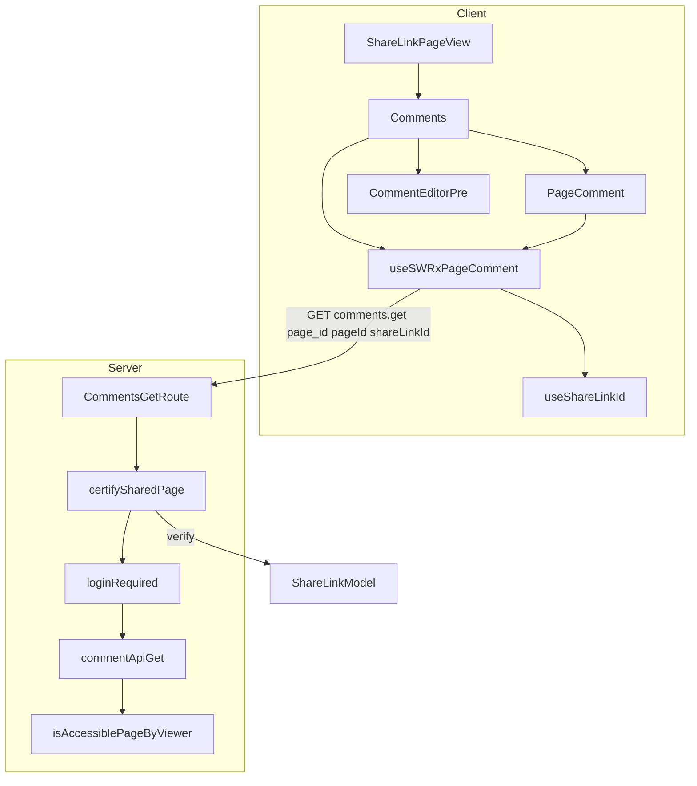
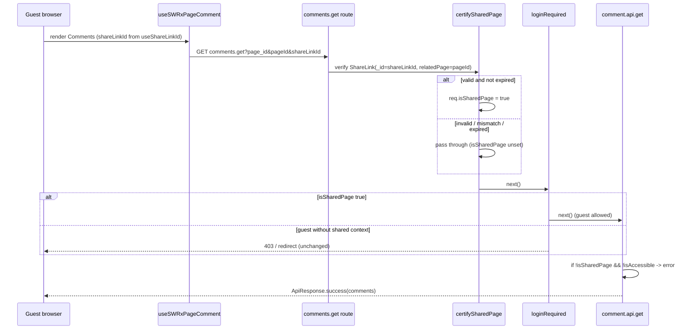

# Technical Design — share-link-comments

## Overview

**Purpose**: 共有リンク（`/share/{shareLinkId}`）ページを訪れた閲覧者（未ログインのゲストを含む）が、共有対象ページに投稿済みのコメントを**閲覧**できるようにする。

**Users**: 共有リンクを受け取ったゲスト／外部協力者が、ページ本文に加えてコメントの議論文脈を把握できるようになる。

**Impact**: 現在 `ShareLinkPageView` にはコメント領域が存在しない。本機能は (1) UI にコメント領域を read-only で追加し、(2) クライアントの取得フックに共有リンク文脈を伝播させ、(3) サーバーの `/comments.get` を共有リンク閲覧者に開放する。書き込み（投稿・更新・削除）は従来どおりゲスト不可のまま据え置く。

実装は Redmine チケットに対応する 3 タスク群に整理する:
1. Comments コンポーネントの有効化（read-only 描画）
2. `useSWRxPageComment` の改善（共有リンク文脈の伝播）
3. `isAccessiblePageByViewer` 問題の解決（`/comments.get` の認可）

### Goals
- 有効な共有リンク経由でゲストが対象ページのコメント一覧を閲覧できる。
- 共有リンクページ上に投稿・返信・削除手段を一切出さない（read-only）。
- 既存パターン（`/page/info`・`/revisions/list`）と一貫した query ベースの共有リンク認可を採用する。

### Non-Goals
- 共有リンク経由のコメント投稿・更新・削除（従来どおり拒否を維持）。
- 通常（非共有）ページのコメント機能の挙動変更。
- 共有リンクの発行・期限・有効性そのものの仕様変更。
- CopyDropdown 等の「パーマリンク」表記の整理（別件）。

## Boundary Commitments

### This Spec Owns
- `ShareLinkPageView` におけるコメント領域の描画（read-only）。
- `Comments` コンポーネントの `isReadOnly` 入口（投稿フォーム抑止と `PageComment` への伝播）。
- `useSWRxPageComment` における共有リンク文脈（`shareLinkId` / `pageId`）のリクエスト伝播と SWR キャッシュキー。
- `/comments.get`（`comment.api.get`）の共有リンク閲覧者に対するアクセス判定の分岐。

### Out of Boundary
- 共有リンク認可の検証ロジック本体（`certify-shared-page.js` は既存を**無改修で再利用**）。
- `comments.add` / `comments.update` / `comments.remove`（書き込み系は不変）。
- 共有ページ本文取得・`ShareLink` モデル・期限判定（既存基盤に依存）。
- 通常ページの `PageView` / コメント描画経路。

### Allowed Dependencies
- 既存ミドルウェア `certify-shared-page.js`（query の `pageId` + `shareLinkId` を検証し `req.isSharedPage` を設定）。
- 既存 `login-required.ts`（`isGuestAllowed && req.isSharedPage` でゲスト通過）。
- 既存クライアントフック `useShareLinkId()`（hydrate 済み atom）。
- 既存 `PageComment` の `isReadOnly` プロパティ。

### Revalidation Triggers
- `certify-shared-page.js` が読むクエリパラメータ名（`pageId` / `shareLinkId`）の変更。
- `comment.api.get` のレスポンス形（`ApiResponse.success/error`）の変更。
- `useSWRxPageComment` の戻り値型・SWR キー構造の変更（`PageComment` / `Comments` 両呼び出し元に影響）。

## Architecture

### Existing Architecture Analysis

GROWI には共有リンク認可の確立パターンが 2 系統あり、本設計は **query ベース**を採用する（`research.md` 参照）:

- **採用（query ベース）**: `certify-shared-page.js` が `req.query.pageId` + `req.query.shareLinkId` を読み、`ShareLink.findOne({ _id: shareLinkId, relatedPage: pageId })` と `isExpired()` を検証して `req.isSharedPage = true` を設定。`/page/info`（`get-page-info.ts`）・`/revisions/list`（`revisions.js`）が採用。`comments.get` も JS 駆動 API のため同型に乗せられる。
- **不採用（referer ベース）**: `certify-shared-page-attachment/` は `` 等で query を制御できない添付ファイル向け。コメント取得には不要。

ハンドラ側のアクセス判定は `revisions.js` の `!isSharedPage && !isAccessiblePageByViewer` 形に統一する。

### Dependency Direction

```
States/atoms (useShareLinkId)
  → Stores (useSWRxPageComment)
    → Client components (Comments → PageComment / CommentEditorPre)
      → View (ShareLinkPageView)

Server: routes/index.js (route wiring)
  → middlewares (certify-shared-page, login-required)
    → comment.api.get (handler)
      → Page.isAccessiblePageByViewer (model)
```

各層は左の層のみに依存する。クライアントとサーバーは `/_api/comments.get` の契約でのみ結合する。

### Architecture Pattern & Boundary Map



**Key Decisions**:
- `Comments` は read-only 時に `CommentEditorPre` を描画せず、`isReadOnly` を `PageComment` へ伝播する（投稿・返信・削除導線が全て消える）。
- `useSWRxPageComment` は内部で `useShareLinkId()` を呼び、`Comments` / `PageComment` 双方の呼び出しで同一 SWR キーを共有する。
- 認可検証は `certify-shared-page.js` に委譲し、`comment.api.get` は `isSharedPage` を尊重する分岐のみ追加（ページ一致・期限はミドルウェアが担保）。

### Technology Stack

| Layer | Choice / Version | Role in Feature | Notes |
|-------|------------------|-----------------|-------|
| Frontend | React 18 + SWR | コメント領域の描画と取得 | 既存 `Comments` / `useSWRxPageComment` を拡張 |
| Frontend State | Jotai (`useShareLinkId`) | 共有リンクID の供給 | hydrate 済み atom、無改修 |
| Backend | Express (apiv1Router) | `/comments.get` のルーティングと認可 | 既存 `certify-shared-page.js` を挿入 |
| Data | Mongoose (`ShareLink`, `Comment`, `Page`) | 共有リンク検証・コメント取得 | 既存モデル、無改修 |

## File Structure Plan

### Modified Files

**Task 1 — Comments 有効化（read-only 描画）**
- `apps/app/src/client/components/Comments.tsx` — `CommentsProps` に `isReadOnly?: boolean` を追加。`PageComment` へ伝播し、`isReadOnly` 時は `CommentEditorPre` ブロックを描画しない。
- `apps/app/src/components/ShareLinkPageView/ShareLinkPageView.tsx` — `next/dynamic`（`ssr: false`）で `Comments` を読み込み、`!isNotFound` かつ `page.revision != null` の分岐内（本文の直後・footer の前）に read-only で描画。

**Task 2 — useSWRxPageComment 改善**
- `apps/app/src/stores/comment.tsx` — `useSWRxPageComment` 内で `useShareLinkId()` を取得。SWR キーに `shareLinkId` を含め、取得時のクエリに `pageId` と（存在時のみ）`shareLinkId` を付与するパラメータビルダを追加。`update` / `post` は不変。

**Task 3 — isAccessiblePageByViewer 問題の解決**
- `apps/app/src/server/routes/index.js` — `certifySharedPage`（`require('../middlewares/certify-shared-page')(crowi)`）を生成し、`/comments.get` ルートの `loginRequired` の**前**に挿入。
- `apps/app/src/server/routes/comment.js` — `comment.api.get` のアクセス判定を `if (!req.isSharedPage && !(await Page.isAccessiblePageByViewer(pageId, req.user)))` に変更。

### New Files (tests)
- `apps/app/src/server/routes/comment.integ.ts`（または既存 integ への追記）— `/comments.get` の共有リンク認可に対する統合テスト（下記 Testing Strategy）。

> `certify-shared-page.js` は**無改修**。クライアントが `pageId` を併送することでパラメータ名（`comment.api.get` は `page_id`、ミドルウェアは `pageId`）の不一致を吸収する。

## System Flows

共有リンク経由ゲストのコメント取得フロー（非共有経路との分岐を含む）:



ゲートは 2 段: (1) `certifySharedPage` が共有リンクとページの一致・有効期限を判定、(2) `comment.api.get` が `isSharedPage` を尊重して viewer チェックをバイパス。両者とも false の通常ゲストは従来どおり拒否される。

## Requirements Traceability

| Requirement | Summary | Components | Interfaces | Flows |
|-------------|---------|------------|------------|-------|
| 1.1 | 共有ページでコメント一覧表示 | ShareLinkPageView, Comments | `CommentsProps` | comments.get フロー |
| 1.2 | コメント0件でも空表示・非エラー（「Comments」見出し＋空リストを表示し、追加実装は不要。`PageComment` が0件で空を返す既存挙動を踏襲） | Comments, PageComment（既存挙動） | — | — |
| 1.3 | トップページは非表示 | Comments（既存 `isTopPage` ガード） | — | — |
| 1.4 | 取得失敗が本文表示を阻害しない | ShareLinkPageView | SWR error 分離 | — |
| 1.5 | 共有無効時は非表示 | ShareLinkPageView（既存 `disableLinkSharing`） | — | — |
| 2.1 | 投稿フォーム非表示 | Comments（`isReadOnly`） | `CommentsProps.isReadOnly` | — |
| 2.2–2.4 | 投稿/更新/削除拒否 | 既存 add/update/remove（無改修） | — | — |
| 2.5 | 書き込み認証要件の維持 | routes/index.js（無改修部分） | — | — |
| 3.1 | 共有文脈での取得許可 | comment.api.get, certifySharedPage | `comments.get` API | comments.get フロー |
| 3.2 | 権限不可ページでも許可 | comment.api.get（バイパス） | — | comments.get フロー |
| 3.3 | 投稿者情報の安全化 | comment.api.get（既存 `serializeUserSecurely`） | — | — |
| 4.1 | 共有文脈なしは拒否 | comment.api.get（`!isSharedPage` 分岐） | — | comments.get フロー |
| 4.2 | ページ不一致は不許可 | certifySharedPage（`relatedPage` 一致検証） | — | comments.get フロー |
| 4.3 | 期限切れ/無効は不許可 | certifySharedPage（`isExpired()`） | — | comments.get フロー |
| 5.1 | 通常ページ機能の維持 | PageView（無改修） | — | — |
| 5.2 | 非共有経路の判定維持 | comment.api.get（`isSharedPage` false 時は従来通り） | — | — |

## Components and Interfaces

| Component | Domain/Layer | Intent | Req Coverage | Key Dependencies | Contracts |
|-----------|--------------|--------|--------------|------------------|-----------|
| Comments | Client UI | コメント領域の描画と read-only 制御 | 1.1, 2.1 | useSWRxPageComment (P0), PageComment (P0) | State |
| ShareLinkPageView | Client View | 共有ページに Comments を配置 | 1.1, 1.4, 1.5 | Comments (P0), useCurrentPageData (P0) | — |
| useSWRxPageComment | Client Store | 共有リンク文脈を伴うコメント取得 | 3.1 | useShareLinkId (P0), apiGet (P0) | Service, API |
| comments.get route | Server Routing | 認可ミドルウェアの結線 | 3.1, 4.1 | certify-shared-page (P0), login-required (P0) | API |
| comment.api.get | Server Handler | isSharedPage を尊重した取得判定 | 3.1, 3.2, 4.1 | Page model (P0) | Service |

### Client Layer

#### Comments

| Field | Detail |
|-------|--------|
| Intent | コメント領域を描画し、read-only 時に投稿導線を抑止する |
| Requirements | 1.1, 2.1 |

**Responsibilities & Constraints**
- `isReadOnly` を受け取り `PageComment` に伝播する。
- `isReadOnly === true` のとき `CommentEditorPre`（投稿フォーム）を描画しない。
- 既存の `isTopPage` ガード（1.3）は維持。

**Contracts**: State [x]

```typescript
type CommentsProps = {
  pageId: string;
  pagePath: string;
  revision: IRevisionHasId;
  isReadOnly?: boolean; // default false（既存呼び出し元の挙動を変えない）
  onLoaded?: () => void;
};
```

**Implementation Notes**
- Integration: `ShareLinkPageView` からは `isReadOnly` を渡す。`PageView` からの既存呼び出しは `isReadOnly` 省略で従来どおり（5.1）。
- Validation: `PageComment` は既に `isReadOnly` で返信ボタン・返信エディタ・削除モーダルを抑止するため UI 側の追加対応は不要。
- Risks: 投稿フォーム抑止は `!isDeleted && !isReadOnly` の条件追加のみ。

#### ShareLinkPageView

| Field | Detail |
|-------|--------|
| Intent | 共有ページ本文の直後に read-only な Comments を配置する |
| Requirements | 1.1, 1.4, 1.5 |

**Responsibilities & Constraints**
- `next/dynamic`（`ssr: false`）で `Comments` を読み込む（既存 `PageView` のパターンに準拠）。
- `!isNotFound && page.revision != null` の分岐内に描画。`isNotFound` / `disableLinkSharing` / 取得失敗時は本文表示を阻害しない（1.4, 1.5）。

**Implementation Notes**
- Integration: `pageId={page._id}`, `pagePath={pagePath}`, `revision={page.revision}`, `isReadOnly` を渡す。
- Risks: `page.revision` の null ガードを既存 `Contents` と同様に行う。

### Server Layer

#### comments.get route（routes/index.js）

**Contracts**: API [x]

##### API Contract
| Method | Endpoint | Request (query) | Response | Errors |
|--------|----------|-----------------|----------|--------|
| GET | `/_api/comments.get` | `page_id`（既存）, `pageId`（共有時）, `shareLinkId`（共有時）, `revision_id`（任意） | `ApiResponse.success({ comments })` | `ok:false`（アクセス不可時、HTTP200 踏襲） |

**Implementation Notes**
- Integration: `const certifySharedPage = require('../middlewares/certify-shared-page')(crowi);` を生成し、`/comments.get` の `accessTokenParser → certifySharedPage → loginRequired → comment.api.get` の順に挿入。
- Validation: `certifySharedPage` は `pageId`/`shareLinkId` が揃わない通常リクエストでは何もせず `next()`（非共有経路は不変、5.2）。
- Risks: 既存 `accessTokenParser` / `loginRequired` の順序を保持する。

#### comment.api.get（comment.js）

**Contracts**: Service [x]

**Responsibilities & Constraints**
- `req.isSharedPage` が真のときは viewer アクセスチェックをバイパスする。
- ページ一致・期限はミドルウェアが担保済みのため、ハンドラは追加検証しない。
- 投稿者情報は既存 `serializeUserSecurely` で安全化（3.3）。

```typescript
// 変更前: if (!isAccessible) -> error
// 変更後:
const isAccessible =
  req.isSharedPage === true ||
  (await Page.isAccessiblePageByViewer(pageId, req.user));
if (!isAccessible) {
  return res.json(ApiResponse.error('Current user is not accessible to this page.'));
}
```

**Implementation Notes**
- Integration: `revisions.js` と同形の分岐に統一。
- Risks: `isSharedPage` は `certify-shared-page.js` のみが設定するため、他経路で誤って真にならない。

## Error Handling

### Error Strategy
- **取得不可（4.1）**: `isSharedPage` false かつ viewer アクセス不可のとき、既存どおり `ApiResponse.error(...)`（HTTP 200, `ok:false`）を返す。クライアントは SWR エラーとして扱い、本文表示は阻害しない（1.4）。
- **無効/期限切れ/不一致（4.2, 4.3）**: `certify-shared-page.js` が `isSharedPage` を立てないため、上記の取得不可経路に合流して拒否される。
- **クライアント取得失敗（1.4）**: `Comments` 描画は本文（`PageContentRenderer`）と独立しているため、コメント取得エラーが本文表示に波及しない。

### Monitoring
- 既存 `comment.api.get` のロガーを踏襲。新規ログは追加しない。

## Testing Strategy

### Unit Tests
1. `Comments`：`isReadOnly` 省略時は `CommentEditorPre` を描画、`isReadOnly=true` で非描画（2.1）。
2. `Comments`：`isReadOnly` を `PageComment` に伝播すること（2.1）。
3. `useSWRxPageComment`：`shareLinkId` 非null時、クエリに `pageId` と `shareLinkId` を含み、SWR キーが `shareLinkId` で分離される（3.1）。
4. `useSWRxPageComment`：`shareLinkId` null時は従来クエリ（`page_id` のみ）で `pageId`/`shareLinkId` を送らない（5.2）。

### Integration Tests（`/comments.get`）
1. 有効な共有リンク（`pageId`+`shareLinkId` 一致）でゲストがコメントを取得できる（3.1, 3.2）。
2. `shareLinkId` なしの未ログインは従来どおり拒否される（4.1, 5.2）。
3. `shareLinkId` と `pageId` が不一致のとき許可されない（4.2）。
4. 期限切れ共有リンクでは許可されない（4.3）。
5. **書き込みの非開放（負のテスト）**: 有効な `shareLinkId` を伴っても未ログインの `comments.add` は拒否される（2.2）。`comments.update` / `comments.remove` も同様にゲスト拒否のまま（2.3, 2.4）。read-only 境界がサーバー側で保持されることを保証する。

### E2E/UI Tests
1. 共有リンクページを未ログインで開き、既存コメントが表示され、投稿フォームが存在しない（1.1, 2.1）。
2. 共有リンク機能無効化時、共有ページにコメントが表示されない（1.5）。

## Security Considerations

- **情報露出の限定**: コメント取得許可は `certify-shared-page.js` が `{ _id: shareLinkId, relatedPage: pageId }` の一致と `isExpired()` を検証した場合のみ。共有リンクの対象ページ以外のコメントは取得できない（4.2）。
- **書き込みの非開放**: `comments.add/update/remove` は `loginRequiredStrictly` のまま。本機能は読み取りのみを開放する（2.2–2.5）。
- **投稿者個人情報**: `serializeUserSecurely` により安全な形でのみ返す（3.3）。
- **`isSharedPage` の単一供給源**: `certify-shared-page.js` 以外がこのフラグを設定しないことを前提に、ハンドラのバイパスは安全。
