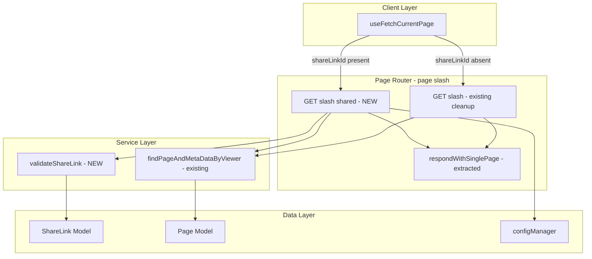
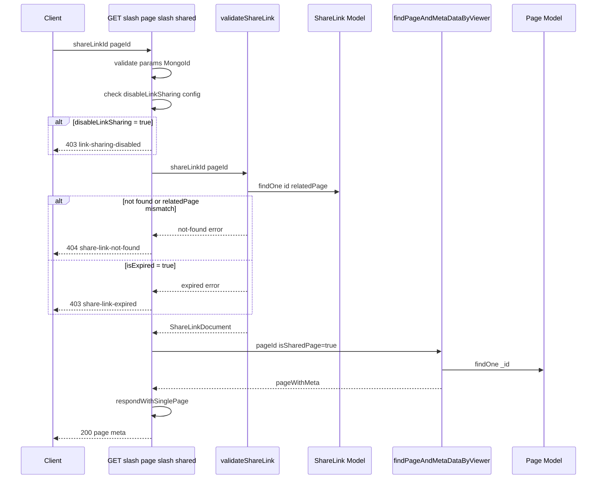

# Technical Design: sharelink-page-api

## Overview

本機能は、share link 経由のページ取得を専用の API エンドポイント `GET /_api/v3/page/shared` として分離する。現行の `GET /_api/v3/page` ルートは、通常認証アクセスと share link アクセスの両方をミドルウェアフラグ（`req.isSharedPage`）と条件分岐で処理しており、責務が混在している。専用エンドポイントを設けることで、各ルートの責務を明確化し、コードの可読性と保守性を向上させる。

既存のサービス関数（`findPageAndMetaDataByViewer`、`respondWithSinglePage`）を共有ユーティリティとして抽出・再利用することで、ロジックの重複を排除する。さらに、現行実装で未対応だった `security:disableLinkSharing` 設定のチェックをページ取得 API レイヤーに追加し、セキュリティギャップを解消する。

### Goals

- share link アクセス専用の `GET /_api/v3/page/shared` エンドポイントを実装する
- 認証ミドルウェア（`accessTokenParser`、`loginRequired`、`certifySharedPage`）を使用せず、公開エンドポイントとして設計する
- `findPageAndMetaDataByViewer` および `respondWithSinglePage` を共有ユーティリティとして再利用し、コード重複を排除する
- `security:disableLinkSharing` 設定を新エンドポイントで正しく適用する
- 既存の `GET /page` ルートから share link 関連のコードを除去してシンプル化する

### Non-Goals

- `GET /_api/v3/page/info`（`get-page-info.ts`）の share link 対応リファクタリング（別スコープ）
- `certifySharedPage` ミドルウェアの削除（`get-page-info.ts` が引き続き使用するため）
- share link の特定リビジョン指定（`revisionId`）対応（初期スコープ外）
- SSR share ページ（`/share/[[...path]]/page-data-props.ts`）の変更

---

## Architecture

### Existing Architecture Analysis

現行の `GET /page` ルートのミドルウェアチェーン：

```
accessTokenParser → certifySharedPage → loginRequired → validator.getPage → handler
```

ハンドラー内の条件分岐：
1. `req.isSharedPage === true` → ShareLink 二次検索 + `findPageAndMetaDataByViewer({ isSharedPage: true })`
2. `findAll` → `Page.findByPathAndViewer`
3. デフォルト → `findPageAndMetaDataByViewer`

**既存の設計課題**：
- `certifySharedPage` は `disableLinkSharing` を未チェック（既存バグ）
- ShareLink に対して 2 回の DB クエリを実行（ミドルウェアとハンドラーで各 1 回）
- `certifySharedPage` は期限切れ・無効リンクでもエラーを返さずサイレントにパス

### Architecture Pattern & Boundary Map



**Architecture Integration**:
- Selected pattern: Handler Factory（`getPageInfoHandlerFactory` と同一パターン）
- Domain boundary: share link バリデーションは `server/service/share-link/` に分離
- Existing patterns preserved: `RequestHandler[]` 返却型、`apiV3FormValidator`、`res.apiv3()`
- New components: `validateShareLink` サービス、`respondWithSinglePage` ユーティリティ（抽出）、`getPageByShareLinkHandlerFactory` ハンドラー
- Steering compliance: サーバー・クライアント境界の維持、純粋関数の抽出、命名規約（camelCase）

### Technology Stack

| Layer | Choice / Version | Role in Feature | Notes |
|-------|------------------|-----------------|-------|
| Backend | Express.js (既存) | ルート登録・ミドルウェアチェーン | 新規依存なし |
| Data | MongoDB / Mongoose ^6.13.6 (既存) | ShareLink・Page ドキュメント取得 | ShareLink.findOne 一本化 |
| Type Safety | TypeScript (既存) | 全インターフェース定義 | `any` 使用禁止 |
| Validation | express-validator (既存) | `shareLinkId`・`pageId` 入力バリデーション | 既存バリデーター再利用 |

---

## System Flows

### 新エンドポイント リクエストフロー



フロー上の重要決定事項：
- `disableLinkSharing` チェックはバリデーション前のファーストゲートとして配置し、DB アクセスを不要にする
- `validateShareLink` は `findOne({ _id, relatedPage })` の単一クエリで存在確認と page 照合を同時実施（旧実装の二重クエリを解消）
- share link が有効である場合のみ `findPageAndMetaDataByViewer` を呼び出し、`isSharedPage: true` で page grant チェックをスキップする

---

## Requirements Traceability

| Requirement | Summary | Components | Interfaces | Flows |
|-------------|---------|------------|------------|-------|
| 1.1 | 専用エンドポイントの提供 | `getPageByShareLinkHandlerFactory` | `GET /page/shared` API Contract | リクエストフロー全体 |
| 1.2 | 認証ミドルウェアからの独立 | `getPageByShareLinkHandlerFactory` | ミドルウェアなし | ハンドラー直接実行 |
| 1.3 | `shareLinkId` と `pageId` 必須パラメータ | `getPageByShareLinkHandlerFactory` | validator 定義 | params バリデーション |
| 1.4 | 既存と同一レスポンス構造 | `respondWithSinglePage` | `{ page, meta }` | respondWithSinglePage |
| 2.1–2.2 | ShareLink 存在確認・relatedPage 照合 | `validateShareLink` | Service Interface | validateShareLink フロー |
| 2.3 | 不一致時 404 | `validateShareLink`, Handler | エラーレスポンス | not-found ブランチ |
| 2.4 | 期限切れ時 403 | `validateShareLink`, Handler | エラーレスポンス | expired ブランチ |
| 2.5 | `disableLinkSharing` 時 403 | Handler | エラーレスポンス | config チェック |
| 3.1 | 最新リビジョン付きページ返却 | `findPageAndMetaDataByViewer`, `respondWithSinglePage` | `IDataWithMeta` | FPAMDBV + respond |
| 3.2–3.3 | isMovable 等 false・bookmarkCount 0 | `findPageAndMetaDataByViewer` | `IPageInfoExt.isSharedPage` | FPAMDBV 内の分岐 |
| 3.4 | ページ未存在時 404 | `respondWithSinglePage` | `IPageNotFoundInfo` | not-found メタ |
| 4.1–4.3 | 認証不要 | `getPageByShareLinkHandlerFactory` | ミドルウェアチェーン | 認証ミドルウェアなし |
| 5.1 | `findPageAndMetaDataByViewer` 再利用 | `getPageByShareLinkHandlerFactory` | 既存関数呼び出し | FPAMDBV 呼び出し |
| 5.2 | バリデーション共通化 | `validateShareLink` | 新サービス関数 | validateShareLink |
| 5.3 | シリアライズロジック非複製 | `respondWithSinglePage` | 抽出ユーティリティ | respondWithSinglePage |
| 5.4 | `pageId` バリデーター共有 | `getPageByShareLinkHandlerFactory` | express-validator | params バリデーション |

---

## Components and Interfaces

### コンポーネント一覧

| Component | Domain/Layer | Intent | Req Coverage | Key Dependencies | Contracts |
|-----------|--------------|--------|--------------|------------------|-----------|
| `validateShareLink` | Service | ShareLink の DB バリデーション | 2.1, 2.2, 2.3, 2.4 | ShareLink Model (P0) | Service |
| `respondWithSinglePage` | Route Utility | ページデータ → API レスポンス変換 | 1.4, 3.1, 3.2, 3.3, 3.4 | ApiV3Response (P0) | Service |
| `getPageByShareLinkHandlerFactory` | Route Handler | `GET /page/shared` エンドポイント実装 | 全要件 | validateShareLink (P0), findPageAndMetaDataByViewer (P0), respondWithSinglePage (P0) | API |
| `useFetchCurrentPage` update | Client State | 新エンドポイントへのクライアント移行 | 1.1, 1.3 | apiv3Get (P0) | State |

---

### Server Layer

#### validateShareLink

| Field | Detail |
|-------|--------|
| Intent | ShareLink の存在・pageId 一致・有効期限を DB で検証し、有効な ShareLinkDocument を返す |
| Requirements | 2.1, 2.2, 2.3, 2.4 |

**Responsibilities & Constraints**
- `shareLinkId` と `pageId` の両方を条件とした単一の `findOne` クエリで照合（二重クエリ排除）
- 失敗時は呼び出し元がマッピング可能な型付きエラーオブジェクトを返す
- `disableLinkSharing` の確認は呼び出し元（ハンドラー）に委ねる

**Dependencies**
- Outbound: `ShareLink` Model — `findOne` によるドキュメント取得 (P0)

**Contracts**: Service [x] / API [ ] / Event [ ] / Batch [ ] / State [ ]

##### Service Interface

```typescript
// apps/app/src/server/service/share-link/validate-share-link.ts

type ValidateShareLinkSuccess = { readonly shareLink: ShareLinkDocument };
type ValidateShareLinkFailure =
  | { readonly type: 'not-found' }
  | { readonly type: 'expired' };
export type ValidateShareLinkResult =
  | ValidateShareLinkSuccess
  | ValidateShareLinkFailure;

export async function validateShareLink(
  shareLinkId: string,
  pageId: string,
): Promise<ValidateShareLinkResult>;
```

- Preconditions: `shareLinkId` と `pageId` は有効な MongoDB ObjectId 文字列
- Postconditions: 成功時は `{ shareLink }` を返す。`relatedPage` 不一致・未存在時は `{ type: 'not-found' }`、期限切れ時は `{ type: 'expired' }` を返す
- Invariants: `shareLink.relatedPage` が `pageId` と一致する場合のみ `shareLink` を返す

**Implementation Notes**
- Integration: `ShareLink.findOne({ _id: { $eq: shareLinkId }, relatedPage: { $eq: pageId } })` の単一クエリで存在確認と relatedPage 照合を同時実施。`isExpired()` メソッドを呼び出して期限確認
- Validation: ObjectId 形式の検証はハンドラー側の `express-validator` が担当
- Risks: 型付き結果を使用することで呼び出し元でのステータスコードマッピングが明示的になる

---

#### respondWithSinglePage

| Field | Detail |
|-------|--------|
| Intent | ページデータと meta 情報を `ApiV3Response` 形式に変換して返す共有ユーティリティ |
| Requirements | 1.4, 3.1, 3.2, 3.3, 3.4 |

**Responsibilities & Constraints**
- `IPageNotFoundInfo` メタの場合に 403/404 を返す
- `security:disableUserPages` 設定に基づくユーザーページの制限
- ページが存在する場合の `populateDataToShowRevision` 呼び出し
- 既存の `page/index.ts` インライン実装を抽出・置き換え。**新ロジックを追加しない**

**Dependencies**
- Inbound: `GET /page` handler — 既存ハンドラーからの呼び出し (P0)
- Inbound: `getPageByShareLinkHandlerFactory` — 新ハンドラーからの呼び出し (P0)
- External: `@growi/core` `isIPageNotFoundInfo`, `isUserPage`, `isUsersTopPage` (P1)

**Contracts**: Service [x] / API [ ] / Event [ ] / Batch [ ] / State [ ]

##### Service Interface

```typescript
// apps/app/src/server/routes/apiv3/page/respond-with-single-page.ts

import type { HydratedDocument } from 'mongoose';
import type { IDataWithMeta, IPageInfoExt, IPageNotFoundInfo } from '@growi/core';
import type { PageDocument } from '~/server/models/page';
import type { ApiV3Response } from '../interfaces/apiv3-response';

type RespondWithSinglePageOpts = {
  readonly revisionId?: string;
  readonly disableUserPages: boolean;
};

export const respondWithSinglePage = async (
  res: ApiV3Response,
  pageWithMeta:
    | IDataWithMeta<HydratedDocument<PageDocument>, IPageInfoExt>
    | IDataWithMeta<null, IPageNotFoundInfo>,
  opts: RespondWithSinglePageOpts,
): Promise<void>;
```

- Preconditions: `res` は有効な Express レスポンスオブジェクト
- Postconditions: `res.apiv3()` または `res.apiv3Err()` のいずれか一方を必ず 1 回呼び出す
- Invariants: share link ページの meta（`isMovable: false` 等）は `findPageAndMetaDataByViewer` が設定済みであり、このユーティリティは meta を変更しない

**Implementation Notes**
- Integration: `page/index.ts` の既存クロージャを `opts` を受け取るモジュール関数に変換。`page/index.ts` は抽出後にこの関数を import して使用する
- Validation: `disableUserPages` はハンドラーが `configManager` から取得して渡す
- Risks: 抽出時に `revisionId` の型（`string | undefined`）と `page.initLatestRevisionField()` の挙動を確認する

---

#### getPageByShareLinkHandlerFactory

| Field | Detail |
|-------|--------|
| Intent | `GET /page/shared` エンドポイントのミドルウェア配列を生成するファクトリー |
| Requirements | 1.1, 1.2, 1.3, 1.4, 2.1–2.5, 3.1–3.4, 4.1–4.3, 5.1–5.4 |

**Responsibilities & Constraints**
- 認証ミドルウェア（`accessTokenParser`、`loginRequired`、`certifySharedPage`）を使用しない
- `security:disableLinkSharing` チェックを最初のゲートとして実施
- `validateShareLink` を呼び出して ShareLink バリデーション結果をハンドリング
- `findPageAndMetaDataByViewer({ isSharedPage: true })` でページデータ取得
- `respondWithSinglePage` で統一レスポンスを返す

**Dependencies**
- Inbound: `page/index.ts` — ルーター登録 (P0)
- Outbound: `validateShareLink` — share link バリデーション (P0)
- Outbound: `findPageAndMetaDataByViewer` — ページデータ取得 (P0)
- Outbound: `respondWithSinglePage` — レスポンス生成 (P0)
- External: `configManager` — `disableLinkSharing`・`disableUserPages` 設定取得 (P0)
- External: `express-validator` — `shareLinkId`・`pageId` 入力バリデーション (P1)

**Contracts**: Service [ ] / API [x] / Event [ ] / Batch [ ] / State [ ]

##### API Contract

| Method | Endpoint | Request | Response | Errors |
|--------|----------|---------|----------|--------|
| GET | `/_api/v3/page/shared` | `{ shareLinkId: MongoId, pageId: MongoId }` (query) | `{ page: IPagePopulatedToShowRevision, meta: IPageInfo }` | 400, 403, 404, 500 |

**Request Parameters**:

| Parameter | Type | Required | Description |
|-----------|------|----------|-------------|
| `shareLinkId` | MongoId (string) | ✅ | ShareLink の ObjectId |
| `pageId` | MongoId (string) | ✅ | 参照先ページの ObjectId |

**Handler TypeScript Interface**:

```typescript
// apps/app/src/server/routes/apiv3/page/get-page-by-share-link.ts

import type { RequestHandler } from 'express';
import type Crowi from '~/server/crowi';

export const getPageByShareLinkHandlerFactory = (
  crowi: Crowi,
): RequestHandler[];
```

**Handler Execution Order**:
1. `query('shareLinkId').isMongoId()` バリデーター（必須）
2. `query('pageId').isMongoId()` バリデーター（必須）
3. `apiV3FormValidator`
4. async handler:
   - `disableLinkSharing` チェック → 403
   - `validateShareLink(shareLinkId, pageId)` → 結果に応じて 403/404
   - `findPageAndMetaDataByViewer(pageService, pageGrantService, { pageId, path: null, isSharedPage: true })`
   - `respondWithSinglePage(res, pageWithMeta, { disableUserPages })`

**Validator sharing**: `pageId` のフォーマットルール（`isMongoId()`）は `validator.getPage` と共通だが、**新エンドポイントでは `optional()` を付けず必須扱いとする**。`validator.getPage` の `query('pageId').isMongoId().optional()` をそのまま流用してはならない。

**Implementation Notes**:
- Integration: `page/index.ts` で `router.get('/shared', getPageByShareLinkHandlerFactory(crowi))` として登録
- Validation: handler 内で `configManager.getConfig('security:disableLinkSharing')` および `configManager.getConfig('security:disableUserPages')` を取得
- Risks: `validateShareLink` 結果の型ガード（`'shareLink' in result`）で成功/失敗を分岐。`shareLink` は取得後に未使用だが、将来のレスポンス拡張（ShareLink メタ情報返却）に備えて保持可能

---

#### page/index.ts クリーンアップ

| Field | Detail |
|-------|--------|
| Intent | `GET /page` ルートから share link 関連コードを除去し、`respondWithSinglePage` を抽出ユーティリティに置き換え |
| Requirements | 5.2, 5.3 |

**変更内容**:
1. `respondWithSinglePage` クロージャを削除 → `respond-with-single-page.ts` を import
2. `certifySharedPage` をミドルウェアチェーンから除去
3. `isSharedPage` 条件分岐をハンドラーから除去
4. `validator.getPage` から `shareLinkId` バリデーターを除去
5. `getPageByShareLinkHandlerFactory` を import し `router.get('/shared', ...)` を追加

**後方互換性**: `GET /page?shareLinkId=xxx&pageId=yyy` への既存リクエストは、クライアント移行後に `shareLinkId` パラメータを無視するのみ（400 は返さない）。

**デプロイ順序（必須）**: `certifySharedPage` の除去とクライアントの `/page/shared` 切り替えは**同一デプロイ**で実施すること。分割デプロイが必要な場合は、クライアント移行を先にデプロイし、`certifySharedPage` 除去を後にする。逆順にすると、クライアントがまだ `/page?shareLinkId=xxx` を呼んでいる状態で `certifySharedPage` がなくなり、`loginRequired` が未認証の share link ユーザーをブロックして share ページが閲覧不能になる。

---

### Client Layer

#### useFetchCurrentPage update

| Field | Detail |
|-------|--------|
| Intent | share link アクセス時の API エンドポイントを `/page` から `/page/shared` に変更 |
| Requirements | 1.1, 1.3 |

**Responsibilities & Constraints**
- `shareLinkId` が存在する場合に `apiv3Get('/page/shared', ...)` を呼び出す
- `shareLinkId` が存在しない場合は `apiv3Get('/page', ...)` を引き続き使用
- レスポンス処理ロジックは変更なし

**Contracts**: Service [ ] / API [ ] / Event [ ] / Batch [ ] / State [x]

##### State Management

**変更箇所**: `apps/app/src/states/page/use-fetch-current-page.ts`

```typescript
// Before
const { data } = await apiv3Get<FetchedPageResult>('/page', params);

// After
const endpoint = shareLinkId != null && shareLinkId.length > 0
  ? '/page/shared'
  : '/page';
const { data } = await apiv3Get<FetchedPageResult>(endpoint, params);
```

- Persistence: Jotai atoms（`currentPageDataAtom` 等）への書き込みは変更なし
- Concurrency: 変更なし

**Implementation Notes**:
- Integration: `buildApiParams` の戻り値（`params`）は `/page/shared` で必要な `shareLinkId` と `pageId` を既に含んでいるため、パラメータ構造の変更は不要
- Validation: `/page/shared` では `shareLinkId` と `pageId` の両方が必須。`buildApiParams` の priority B 分岐（`shareLinkId != null && currentPageId != null` の場合に `params.pageId = currentPageId`）が既にこれを保証している
- Risks: `currentPageId` が未解決の状態（undefined）で share link ページにアクセスした場合、`buildApiParams` の priority B が機能しないケースを確認する（`shouldSkip` フラグで対処済みの可能性が高い）

---

## Error Handling

### Error Strategy

全バリデーションエラーはリクエストの早い段階で検出し、DB アクセスを最小化する。エラーレスポンスは既存の `ErrorV3` / `res.apiv3Err()` パターンに準拠する。

### Error Categories and Responses

| Category | Scenario | Error Code | HTTP Status |
|----------|----------|------------|-------------|
| User Errors (4xx) | `shareLinkId` / `pageId` 未指定・不正形式 | `validation-failed` | 400 |
| Business Logic (4xx) | `disableLinkSharing=true` | `link-sharing-disabled` | 403 |
| Business Logic (4xx) | ShareLink 未存在または `relatedPage` 不一致 | `share-link-not-found` | 404 |
| Business Logic (4xx) | ShareLink 期限切れ | `share-link-expired` | 403 |
| Business Logic (4xx) | ページ未存在 | `page-not-found` | 404 |
| Business Logic (4xx) | `disableUserPages` でユーザーページへのアクセス | `page-is-forbidden` | 403 |
| System Errors (5xx) | DB エラー・populate 失敗 | `get-page-failed` | 500 |

### Monitoring

- logger: `loggerFactory('growi:routes:apiv3:page:get-page-by-share-link')` を使用
- 403/404 は業務上正常な範囲として `logger.debug` レベル、5xx は `logger.error` レベルでログ出力

---

## Testing Strategy

### Unit Tests

`validateShareLink` のユニットテスト（`validate-share-link.spec.ts`）：
- 有効な ShareLink（存在・relatedPage 一致・未期限）→ `{ shareLink }` を返す
- ShareLink が存在しない → `{ type: 'not-found' }` を返す
- `relatedPage` が `pageId` と不一致 → `{ type: 'not-found' }` を返す
- `isExpired() === true` → `{ type: 'expired' }` を返す

`respondWithSinglePage` のユニットテスト（`respond-with-single-page.spec.ts`）：
- `IPageNotFoundInfo` メタかつ `isForbidden=true` → 403
- `IPageNotFoundInfo` メタかつ `isForbidden=false` → 404
- `disableUserPages=true` でユーザーページ → 403
- 正常ページ → `res.apiv3({ page, meta })` が呼ばれる

### Security Considerations

- **認証不要エンドポイントのデータ保護**: `validateShareLink` が全ての DB チェックを完了した後にのみ `findPageAndMetaDataByViewer` を呼び出す。バリデーション失敗時はページデータに一切アクセスしない。
- **`disableLinkSharing` の適用**: 新エンドポイントは既存の未適用バグを修正し、設定が `true` の場合に確実に 403 を返す。
- **ページ権限のスキップ**: `isSharedPage: true` による `findPageAndMetaDataByViewer` の権限チェックスキップは、ShareLink バリデーション完了後のみ実行されるため、不正アクセスのリスクはない。
- **入力サニタイズ**: `shareLinkId` と `pageId` は `express-validator` で MongoId 形式を強制し、NoSQL インジェクションを防止する。
