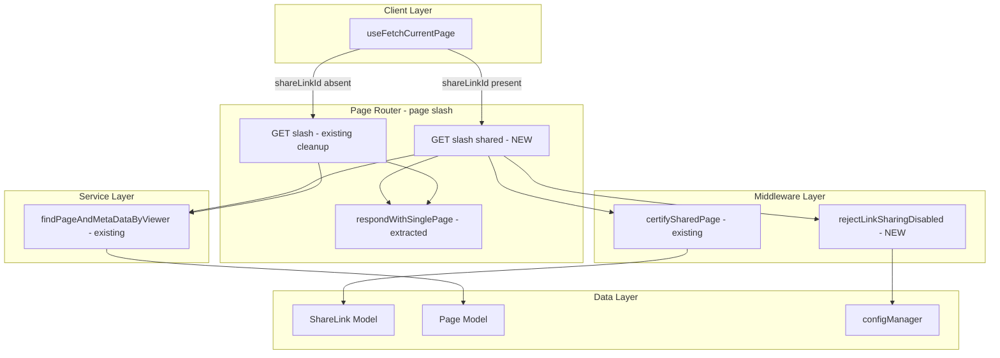
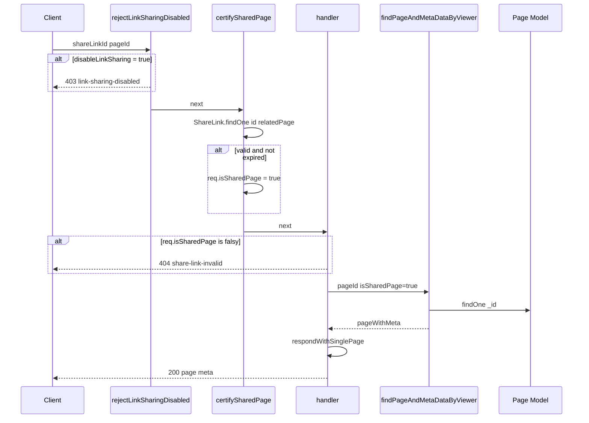

# Technical Design: sharelink-page-api

## Overview

本機能は、share link 経由のページ取得を専用の API エンドポイント `GET /_api/v3/page/shared` として分離する。現行の `GET /_api/v3/page` ルートは、通常認証アクセスと share link アクセスの両方をミドルウェアフラグ（`req.isSharedPage`）と条件分岐で処理しており、責務が混在している。専用エンドポイントを設けることで、各ルートの責務を明確化し、コードの可読性と保守性を向上させる。

既存のミドルウェア（`certifySharedPage`）とサービス関数（`findPageAndMetaDataByViewer`）を再利用し、`respondWithSinglePage` を共有ユーティリティとして抽出することで、ロジックの重複を排除する。さらに、現行実装で未対応だった `security:disableLinkSharing` 設定のチェックを `rejectLinkSharingDisabled` ミドルウェアとして新設し、セキュリティギャップを解消する。

### Goals

- share link アクセス専用の `GET /_api/v3/page/shared` エンドポイントを実装する
- 既存の `certifySharedPage` ミドルウェアを再利用して ShareLink バリデーションを行う
- `rejectLinkSharingDisabled` ミドルウェアを新設し、`security:disableLinkSharing` 設定を正しく適用する
- `respondWithSinglePage` を共有ユーティリティとして抽出し、`GET /page` と `GET /page/shared` で共用する
- 既存の `GET /page` ルートから share link 関連のコードを除去してシンプル化する

### Non-Goals

- `GET /_api/v3/page/info`（`get-page-info.ts`）の share link 対応リファクタリング（別スコープ）
- `certifySharedPage` ミドルウェアの削除（`get-page-info.ts`・`revisions.js` が引き続き使用するため）
- share link の特定リビジョン指定（`revisionId`）対応（初期スコープ外）
- SSR share ページ（`/share/[[...path]]/page-data-props.ts`）の変更

---

## Architecture

### Architecture Pattern & Boundary Map



**Architecture Integration**:
- Selected pattern: Handler Factory（`getPageInfoHandlerFactory` と同一パターン）
- Existing patterns preserved: `RequestHandler[]` 返却型、`apiV3FormValidator`、`res.apiv3()`
- New components: `rejectLinkSharingDisabled` ミドルウェア、`respondWithSinglePage` ユーティリティ（抽出）、`getPageByShareLinkHandlerFactory` ハンドラー
- Reused components: `certifySharedPage` ミドルウェア、`findPageAndMetaDataByViewer` サービス

---

## System Flows

### 新エンドポイント リクエストフロー



フロー上の重要決定事項：
- `rejectLinkSharingDisabled` を `certifySharedPage` の前段に配置し、設定無効時は DB アクセスをスキップする
- `certifySharedPage` は既存ミドルウェアをそのまま再利用。`req.isSharedPage` フラグで有効性を伝達する
- share link が有効である場合のみ `findPageAndMetaDataByViewer` を呼び出し、`isSharedPage: true` で page grant チェックをスキップする

---

## Requirements Traceability

| Requirement | Summary | Components | Flows |
|-------------|---------|------------|-------|
| 1.1 | 専用エンドポイントの提供 | `getPageByShareLinkHandlerFactory` | リクエストフロー全体 |
| 1.2 | 認証ミドルウェアからの独立 | `getPageByShareLinkHandlerFactory` | `accessTokenParser`・`loginRequired` を使用しない |
| 1.3 | `shareLinkId` と `pageId` 必須パラメータ | validator 定義 | params バリデーション |
| 1.4 | 既存と同一レスポンス構造 | `respondWithSinglePage` | respondWithSinglePage |
| 2.1–2.2 | ShareLink 存在確認・relatedPage 照合 | `certifySharedPage` | certifySharedPage 内部 |
| 2.3–2.4 | 不一致・期限切れ時エラー | Handler（`!req.isSharedPage` チェック） | 404 share-link-invalid |
| 2.5 | `disableLinkSharing` 時 403 | `rejectLinkSharingDisabled` | config チェック |
| 3.1 | 最新リビジョン付きページ返却 | `findPageAndMetaDataByViewer`, `respondWithSinglePage` | FPAMDBV + respond |
| 3.2–3.3 | isMovable 等 false・bookmarkCount 0 | `findPageAndMetaDataByViewer` | FPAMDBV 内の分岐 |
| 3.4 | ページ未存在時 404 | `respondWithSinglePage` | not-found メタ |
| 4.1–4.3 | 認証不要 | `getPageByShareLinkHandlerFactory` | 認証ミドルウェアなし |
| 5.1 | `findPageAndMetaDataByViewer` 再利用 | `getPageByShareLinkHandlerFactory` | FPAMDBV 呼び出し |
| 5.2 | バリデーション共通化 | `certifySharedPage` 再利用 | ミドルウェアチェーン |
| 5.3 | シリアライズロジック非複製 | `respondWithSinglePage` | 抽出ユーティリティ |
| 5.4 | `pageId` バリデーター共有 | express-validator | params バリデーション |

---

## Components and Interfaces

### コンポーネント一覧

| Component | Domain/Layer | Intent | Req Coverage | Key Dependencies |
|-----------|--------------|--------|--------------|------------------|
| `rejectLinkSharingDisabled` | Middleware | `disableLinkSharing` 設定チェック | 2.5 | configManager (P0) |
| `respondWithSinglePage` | Route Utility | ページデータ → API レスポンス変換 | 1.4, 3.1, 3.2, 3.3, 3.4 | ApiV3Response (P0) |
| `getPageByShareLinkHandlerFactory` | Route Handler | `GET /page/shared` エンドポイント実装 | 全要件 | certifySharedPage (P0), findPageAndMetaDataByViewer (P0), respondWithSinglePage (P0) |
| `useFetchCurrentPage` update | Client State | 新エンドポイントへのクライアント移行 | 1.1, 1.3 | apiv3Get (P0) |

---

### Server Layer

#### rejectLinkSharingDisabled

| Field | Detail |
|-------|--------|
| File | `apps/app/src/server/middlewares/reject-link-sharing-disabled.ts` |
| Intent | `security:disableLinkSharing` が有効な場合にリクエストを 403 で拒否するガードミドルウェア |
| Requirements | 2.5 |

**Implementation**: `configManager.getConfig('security:disableLinkSharing')` を確認し、`true` の場合は `res.apiv3Err(ErrorV3('Link sharing is disabled', 'link-sharing-disabled'), 403)` を返す。それ以外は `next()` を呼ぶ。

---

#### respondWithSinglePage

| Field | Detail |
|-------|--------|
| File | `apps/app/src/server/routes/apiv3/page/respond-with-single-page.ts` |
| Intent | ページデータと meta 情報を `ApiV3Response` 形式に変換して返す共有ユーティリティ |
| Requirements | 1.4, 3.1, 3.2, 3.3, 3.4 |

**Responsibilities & Constraints**
- `IPageNotFoundInfo` メタの場合に 403/404 を返す
- `security:disableUserPages` 設定に基づくユーザーページの制限
- ページが存在する場合の `populateDataToShowRevision` 呼び出し
- 既存の `page/index.ts` インライン実装を抽出・置き換え。**新ロジックを追加しない**

```typescript
export async function respondWithSinglePage(
  res: ApiV3Response,
  pageWithMeta:
    | IDataWithMeta<HydratedDocument<PageDocument>, IPageInfoExt>
    | IDataWithMeta<null, IPageNotFoundInfo>,
  options?: RespondWithSinglePageOptions,
): Promise<void>;
```

---

#### getPageByShareLinkHandlerFactory

| Field | Detail |
|-------|--------|
| File | `apps/app/src/server/routes/apiv3/page/get-page-by-share-link.ts` |
| Intent | `GET /page/shared` エンドポイントのミドルウェア配列を生成するファクトリー |
| Requirements | 1.1, 1.2, 1.3, 1.4, 2.1–2.5, 3.1–3.4, 4.1–4.3, 5.1–5.4 |

**Middleware Execution Order**:
1. `query('shareLinkId').isMongoId()` バリデーター（必須）
2. `query('pageId').isMongoId()` バリデーター（必須）
3. `apiV3FormValidator`
4. `rejectLinkSharingDisabled` — `disableLinkSharing` 設定チェック → 403
5. `certifySharedPage` — ShareLink 存在確認・期限チェック → `req.isSharedPage = true`
6. async handler:
   - `!req.isSharedPage` → 404 `share-link-invalid`
   - `findPageAndMetaDataByViewer(pageService, pageGrantService, { pageId, path: null, isSharedPage: true })`
   - `respondWithSinglePage(res, pageWithMeta, { disableUserPages })`

##### API Contract

| Method | Endpoint | Request | Response | Errors |
|--------|----------|---------|----------|--------|
| GET | `/_api/v3/page/shared` | `{ shareLinkId: MongoId, pageId: MongoId }` (query) | `{ page: IPagePopulatedToShowRevision, meta: IPageInfo }` | 400, 403, 404, 500 |

---

#### page/index.ts クリーンアップ

| Field | Detail |
|-------|--------|
| Intent | `GET /page` ルートから share link 関連コードを除去し、`respondWithSinglePage` を抽出ユーティリティに置き換え |
| Requirements | 5.2, 5.3 |

**変更内容**:
1. `respondWithSinglePage` クロージャを削除 → `respond-with-single-page.ts` を import
2. `certifySharedPage` をミドルウェアチェーンから除去
3. `isSharedPage` 条件分岐をハンドラーから除去
4. `validator.getPage` から `shareLinkId` バリデーターを除去
5. `getPageByShareLinkHandlerFactory` を import し `router.get('/shared', ...)` を追加

---

### Client Layer

#### useFetchCurrentPage update

| Field | Detail |
|-------|--------|
| File | `apps/app/src/states/page/use-fetch-current-page.ts` |
| Intent | share link アクセス時の API エンドポイントを `/page` から `/page/shared` に変更 |
| Requirements | 1.1, 1.3 |

```typescript
const endpoint = params.shareLinkId != null ? '/page/shared' : '/page';
const { data } = await apiv3Get<FetchedPageResult>(endpoint, params);
```

---

## Error Handling

### Error Categories and Responses

| Category | Scenario | Error Code | HTTP Status |
|----------|----------|------------|-------------|
| User Errors (4xx) | `shareLinkId` / `pageId` 未指定・不正形式 | `validation-failed` | 400 |
| Business Logic (4xx) | `disableLinkSharing=true` | `link-sharing-disabled` | 403 |
| Business Logic (4xx) | ShareLink 未存在・relatedPage 不一致・期限切れ | `share-link-invalid` | 404 |
| Business Logic (4xx) | ページ未存在 | `page-not-found` | 404 |
| Business Logic (4xx) | `disableUserPages` でユーザーページへのアクセス | `page-is-forbidden` | 403 |
| System Errors (5xx) | DB エラー・populate 失敗 | `get-page-failed` | 500 |

---

## Testing Strategy

### Unit Tests

`respondWithSinglePage` のユニットテスト（`respond-with-single-page.spec.ts`）：
- `IPageNotFoundInfo` メタかつ `isForbidden=true` → 403
- `IPageNotFoundInfo` メタかつ `isForbidden=false` → 404
- `disableUserPages=true` でユーザーページ → 403
- 正常ページ → `res.apiv3({ page, meta })` が呼ばれる

### Security Considerations

- **認証不要エンドポイントのデータ保護**: `certifySharedPage` が ShareLink の DB チェックを完了し `req.isSharedPage` をセットした後にのみ `findPageAndMetaDataByViewer` を呼び出す。バリデーション失敗時はページデータに一切アクセスしない。
- **`disableLinkSharing` の適用**: `rejectLinkSharingDisabled` ミドルウェアを `certifySharedPage` の前段に配置し、設定が `true` の場合に確実に 403 を返す。DB アクセスも不要。
- **ページ権限のスキップ**: `isSharedPage: true` による `findPageAndMetaDataByViewer` の権限チェックスキップは、`certifySharedPage` による ShareLink バリデーション完了後のみ実行されるため、不正アクセスのリスクはない。
- **入力サニタイズ**: `shareLinkId` と `pageId` は `express-validator` で MongoId 形式を強制し、NoSQL インジェクションを防止する。
