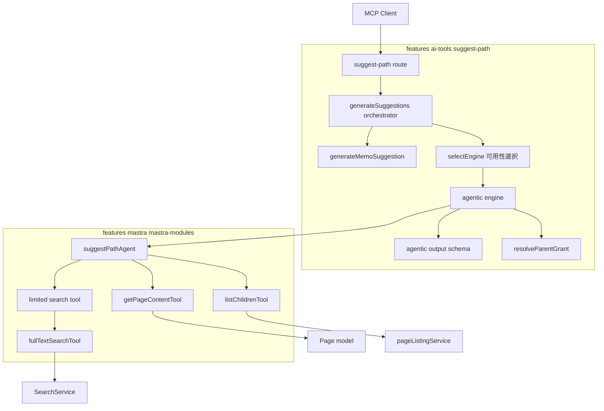
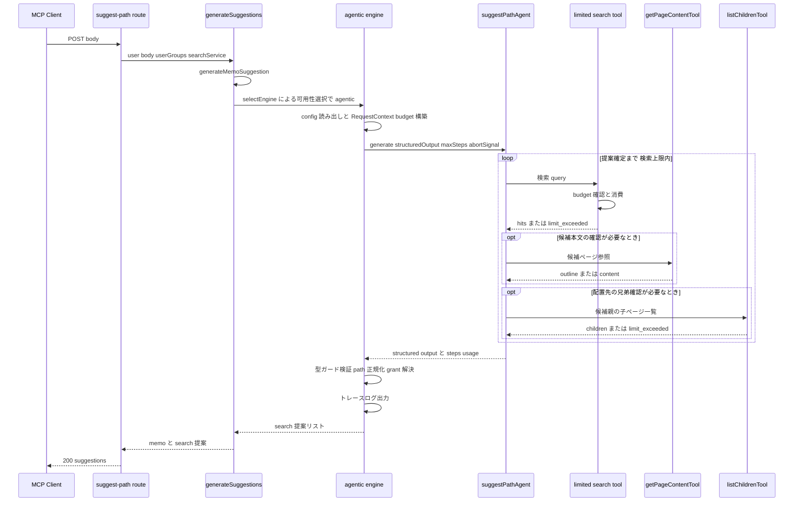

# Technical Design: suggest-path-agentic

> **アーキテクチャの現状（実装完了 / PR #11293）**: パス提案エンジンは Mastra Agent による agentic search 単一。`generateSuggestions` は「memo 生成 → 可用性ベースのエンジン選択 → フォールバック」のオーケストレータで、エンジン選択は **Mastra AI 設定済み（`isAiConfigured()`）→ agentic / 未設定 → memo のみ** の 2 分岐（ルートガード `aiReadyGuard` が未設定を 501 で弾く）。モデルは provider 非依存の `resolveMastraModel()`（support/mastra の AI レイヤ、openai / anthropic / google / azure-openai 対応）で解決し、推論強度は provider 汎用の `ai:providerOptions:suggestPathAgent` overlay で制御する。AI を使わず Elasticsearch だけで動くフォールバックエンジンは将来計画（末尾「将来のロードマップ」節・tasks.md F.1〜F.4）。

## Overview

**Purpose**: suggest-path API のパス提案を、Mastra Agent による agentic search（検索結果を元文書と照らして検索語・条件を変えながら複数回探索する挙動）で生成する。最初の検索が語彙ミスマッチで外れても API 単体で妥当な保存先候補に辿り着けるようにし、MCP クライアント側の検索肩代わりを不要にする（Redmine #184610）。

**Users**: MCP クライアント（GROWI MCP の suggestPath ツール利用者）は従来通りの API 契約で改善された提案を受け取る。運用者は設定（検索回数上限・モデル・タイムアウト・推論強度）でレスポンス時間と精度のトレードオフを制御する。エンジンは実行環境の可用性で自動選択される。

**Impact**: `generate-suggestions.ts` は「memo 生成 + 可用性ベースのエンジン選択 + フォールバック」のオーケストレータ。パス提案の実体は agentic エンジンで、Mastra AI 未設定時は memo のみに縮退する。API の外部契約（エンドポイント・リクエスト形式・レスポンス型・認証）は維持する。

### Goals

- agentic search エンジン: 複数回検索 + 候補ページ本文参照による試行錯誤で保存先提案を生成する
- フロー/ストック判定を探索の誘導（候補妥当性判断・再検索の方向付け）に反映する
- 検索回数上限・タイムアウト・モデルを設定で制御可能にする
- 可用性ベースのエンジン選択（Mastra AI 設定済み → agentic / 未設定 → memo のみ）。A/B 測定（ベースライン 41/60 との比較）は完了済み

### Non-Goals

- HTC によるリランク（別ストーリー）、セマンティック検索の導入
- MCP クライアント側の挙動変更、チャット機能・`growiAgent` の改修
- AI なし・Elasticsearch のみのフォールバックエンジンの実装（将来計画。末尾「将来のロードマップ」節）
- `fullTextSearchTool` / `getPageContentTool` の機能改修（必要が生じた場合は agentic-search spec のフォローアップ）

## Boundary Commitments

### This Spec Owns

- suggest-path のエンジン選択機構: `SuggestPathEngine` インターフェース、可用性ベースのエンジン選択（selectEngine）、フォールバックポリシー
- agentic エンジン一式: `suggestPathAgent`（Agent 定義 + instructions）、budget 付き検索 wrapper tool、suggest-path 専用 RequestContext 拡張型、structured output の JSON Schema と型ガード、エンジンアダプタ（タイムアウト・出力マッピング・grant 解決・トレースログ）
- 新設定キー（検索回数上限・タイムアウト・子ページ一覧上限・providerOptions overlay）の定義と既定値
- 探索過程の記録（トレースログ）の形式と出力
- `suggestPathAgent` の Mastra インスタンスへの登録（`mastra-modules/index.ts` への additive な 1 行。レジストリ機構自体は agentic-search spec の所有）

### Out of Boundary

- チャット向け `growiAgent` の挙動（agentic-search spec が所有）
- 共有 tool（`fullTextSearchTool` / `getPageContentTool`）の本体改修
- 温存した非AIサービス（`retrieve-search-candidates` / `generate-category-suggestion`）の内部変更 — 将来の Elasticsearch-only エンジン用に据え置き、本 PR では呼び出さない
- **AIなし・Elasticsearch のみのフォールバックエンジンの新規実装**（将来タスク F.1〜F.4。末尾「将来のロードマップ」節）
- 評価環境そのもの（#183968 の成果物を利用するのみ）
- 既存 suggest-path spec の記録の書き換え

### Allowed Dependencies

- `features/mastra` の mastra-modules（`fullTextSearchTool` / `getPageContentTool` / `listChildrenTool` / `MastraRequestContextShape` / Mastra インスタンスレジストリ）— **依存方向は ai-tools → mastra の一方向のみ**。mastra 側ファイルが suggest-path の型・モジュールを import することは禁止
- `features/mastra` の AI レイヤ `resolveMastraModel`（support/mastra 所有。マルチプロバイダ設定 `ai:providers` / `ai:providerApiKeys` / `ai:allowedModels` に依拠。旧単一プロバイダ設定 `ai:provider` / `ai:apiKey` / `ai:azureOpenaiSettings` は廃止済み）
- `features/mastra` の可用性判定 `isAiConfigured` と、そこへ移設したマスタートグル `isAiEnabled`（`app:aiEnabled` を読む。`features/openai` 全廃に伴い 2026-07-17 に `features/mastra/server/services/is-ai-enabled.ts` へ移動）
- suggest-path のエンジン非依存共通基盤: `generate-memo-suggestion` / `resolve-parent-grant` / `suggest-path-types` / API ルート
- `configManager`（設定読み出し）、`@growi/logger`（pino）
- `SearchService.searchKeyword` / `Page.findByIdAndViewer` / `pageListingService.findChildrenByParentPathOrIdAndViewer`（tool 経由の間接利用。権限フィルタはこれらに委譲）
- #183964 / #183967 / #183968 の評価器・ユースケース・ベースライン測定値

**禁止依存**: mastra 側から ai-tools/suggest-path への逆 import（一方向依存の維持）。温存した非AIサービスは agentic エンジンから import しない（将来の Elasticsearch-only エンジンが利用する）。

### Revalidation Triggers

以下の変更が生じた場合、依存元（MCP クライアント・評価器）または本設計の再検証が必要:

- `PathSuggestion` / `SuggestPathResponse` 型の形状変更（API 契約変更）
- エンドポイント・リクエスト形式（`body` フィールド）・認証要件の変更
- `MastraRequestContextShape` の形状変更、または `fullTextSearchTool` / `getPageContentTool` の入出力スキーマ変更（support/mastra 側の変動を含む）
- エンジン可用性の判定基準（`isAiConfigured`）またはルートガード（`aiReadyGuard` = enabled かつ configured）の意味変更
- `isAiEnabled` の実装・所在の変更（現在 `features/mastra/server/services/is-ai-enabled.ts`。mastra ガード・model-catalog-refresh・suggest-path ルートが依存）
- support/mastra ブランチの rebase / 上流マージによる Mastra バージョン変動（既知バグ回避方針の再確認が必要）

## Architecture

### Architecture Analysis

- `generateSuggestions` はエンジン非依存の責務（memo 生成・可用性ベースのエンジン選択・フォールバック）を持つオーケストレータ。memo 生成（`generateMemoSuggestion`）と grant 解決（`resolveParentGrant`）はエンジンに依存しない共通基盤
- graceful degradation（提案生成が不能なら memo のみ返却）はオーケストレータのフォールバックポリシーとして実装。agentic の失敗・タイムアウトは memo に縮退し、API は常に 200 + memo を保証する
- Mastra 基盤（support/mastra）には per-request `RequestContext` パターン・「tool は throw せず discriminated union を値で返す」規約・権限フィルタの `SearchService` / `Page` モデル委譲が確立済み（agentic-search spec）。本設計はこれらをすべて踏襲する

### Architecture Pattern & Boundary Map



**Architecture Integration**:

- **Selected pattern**: オーケストレータ + 可用性ベースのエンジン選択。`generateSuggestions` がエンジン非依存の責務（memo・エンジン選択・フォールバック）を持ち、`SuggestPathEngine` インターフェースを実装する agentic エンジンが提案生成を担う。`SuggestPathEngineRecord` と非対称フォールバックポリシーは複数エンジンを想定した汎用構造で、将来の Elasticsearch-only エンジンを記録 1 件の追加で受けられる
- **Domain boundaries**: agent 定義と tool は `features/mastra/.../agents/suggest-path/`（Mastra プラットフォーム層）、エンジンアダプタと出力スキーマは `features/ai-tools/suggest-path/.../engines/`（feature 層）。structured output スキーマを feature 層に置くことで mastra 側は suggest-path の型を知らない
- **Existing patterns preserved**: per-request RequestContext、tool の discriminated union 返却（throw 禁止）、権限フィルタ委譲、pino logger
- **New components rationale**: budget 付き wrapper tool は「検索回数の正確なカウント + 上限到達時の graceful 手仕舞い」（Requirement 3.1/3.2）を共有 tool 無改変で実現する唯一の位置
- **Steering compliance**: server-side のみの変更（server-client 境界に影響なし）、barrel による module public surface 最小化、pino logger 使用

**依存方向**（違反はエラーとして扱う）:

```
interfaces（types） → services（engines → 既存サービス） → routes
features/ai-tools/suggest-path → features/mastra（一方向。逆方向 import 禁止）
```

### Technology Stack

| Layer | Choice / Version | Role in Feature | Notes |
|-------|------------------|-----------------|-------|
| Agent runtime | `@mastra/core` 1.45.0（installed。宣言 `^1.32.1`。設計・スパイク時は 1.41.0） | agent ループ・structured output・requestContext | `generateVNext` は使用しない（mastra-ai/mastra#7662）。スパイク結論（steps/usage 形状・p-map ESM 回避）は 1.41.0 時点の確認であり 1.45.0 での再検証は未実施 |
| LLM provider | provider 非依存の `resolveMastraModel()`（support/mastra の AI レイヤ。openai / anthropic / google / azure-openai に対応） | suggestPathAgent のモデル解決 | モデルはアプリ全体のマルチプロバイダ設定（`ai:providers` / `ai:allowedModels`）の既定モデルで決まり、memoize + AI 設定保存時の cache clear で再起動なし反映。suggestPath 専用のモデル選択は持たない（下記 Config Keys 参照） |
| Schema / validation | JSON Schema 直接記述 + 手書き型ガード | structured output の契約 | Zod 自動変換は OpenAI strict mode 非互換のため不使用（mastra-ai/mastra#16383）。tool 入力は既存どおり zod ^4.1.9 |
| Search / Data | `SearchService`（Elasticsearch）、`Page` model（MongoDB） | 検索・本文参照・grant 解決 | すべて既存共有 tool / サービス経由。権限フィルタは委譲 |
| Config | `configManager`（config-definition.ts） | エンジン・上限・タイムアウト・モデルの設定化 | 新キー 4 つ。per-request 読み出しで再起動なし反映 |
| Logging | `@growi/logger`（pino） | 探索過程トレース・測定メトリクス | logger 名 `growi:ai-tools:suggest-path:agentic-engine` |

## File Structure Plan

### Directory Structure

```
apps/app/src/features/ai-tools/suggest-path/
├── interfaces/
│   └── suggest-path-types.ts                  # SearchService に isReachable（可用性シグナル、client-safe）。現状は未使用で将来の ES-only エンジン用に据え置き
└── server/
    ├── routes/apiv3/
    │   └── index.ts                           # ガードは aiReadyGuard（enabled かつ configured。未設定は 501）
    └── services/
        ├── generate-suggestions.ts            # オーケストレータ（memo + 可用性選択 + fallback）
        ├── generate-suggestions-orchestration.spec.ts
        ├── engines/
        │   ├── index.ts                       # barrel: selectEngine のみ再エクスポート（ロジックを持たない）
        │   ├── select-engine.ts               # selectEngine 実装（可用性 → engine record の解決。現状 agentic / undefined の 2 択）
        │   ├── select-engine.spec.ts
        │   ├── engine-types.ts                # SuggestPathEngine / SuggestPathEngineInput / SuggestPathEngineRecord（server 専用型）
        │   ├── agentic-engine.ts              # agent 呼び出し・タイムアウト・出力マッピング・grant
        │   ├── agentic-engine.spec.ts
        │   ├── agentic-trace-log.ts           # トレースログ整形（agentic-engine から抽出）
        │   ├── agentic-trace-log.spec.ts
        │   ├── agentic-output-schema.ts       # JSON Schema 定数 + AgenticEngineOutput 型 + 型ガード
        │   ├── agentic-output-schema.spec.ts
        │   ├── agentic-provider-options.ts    # providerOptions overlay の解決（catalog options への deep merge）
        │   ├── agentic-request-context.ts     # per-request RequestContext + budget 構築
        │   └── agentic-suggestion-mapper.ts   # 出力の正規化・dedupe・cap・grant 付与
        └── （generate-memo-suggestion / resolve-parent-grant: エンジン非依存の共通基盤。
             retrieve-search-candidates / generate-category-suggestion: AI 非依存。現状 agentic からは未使用で、将来の ES-only エンジン用に据え置き）

apps/app/src/features/ai-tools/suggest-path/server/integration-tests/
├── suggest-path-route-integration.spec.ts
└── suggest-path-agentic-integration.spec.ts

apps/app/src/features/mastra/server/services/mastra-modules/
├── index.ts                                   # 変更: Mastra インスタンスに suggestPathAgent を登録（1 行 additive）
├── tools/
│   ├── list-children-tool.ts                  # 追加(#185213): 子ページ一覧 tool（childListingBudget 執行・pageListingService 委譲）
│   └── list-children-tool.spec.ts             #   ※共有 tools/ 配下だが実質 suggest-path 専用（配置は要再考の余地あり）
└── agents/suggest-path/
    ├── index.ts                               # barrel: suggestPathAgent と SuggestPathRequestContextShape のみ公開
    ├── suggest-path-agent.ts                  # Agent 定義（resolveMastraModel・tools 3 構成・memory なし）
    ├── suggest-path-agent.spec.ts
    ├── instructions.ts                        # agent instructions（フロー/ストック判定・探索戦略・提案ルール）
    ├── limited-search-tool.ts                 # budget 執行 wrapper tool（fullTextSearchTool へ委譲）
    ├── limited-search-tool.spec.ts
    └── request-context.ts                     # SuggestPathRequestContextShape / SearchBudget / ChildListingBudget 型
```

### Modified Files

- `apps/app/src/features/ai-tools/suggest-path/server/services/generate-suggestions.ts` — memo 生成 + 可用性ベースのエンジン選択 + agentic フォールバックポリシーのオーケストレータ
- `apps/app/src/features/ai-tools/suggest-path/server/routes/apiv3/index.ts` — ガードは `aiReadyGuard`（enabled かつ configured。未設定は 501）。リクエストは `{ body }` のみ（旧 `engine` フィールドは送られても無視）。レスポンス形式は無変更
- `apps/app/src/features/ai-tools/suggest-path/interfaces/suggest-path-types.ts` — `SearchService` に `isReachable`（可用性シグナル）を追加（現状未使用・将来の ES-only エンジン用）
- `apps/app/src/features/mastra/server/services/mastra-modules/index.ts` — `agents` マップに `suggestPathAgent` を追加（additive のみ）
- `apps/app/src/server/service/config-manager/config-definition.ts` — 新設定キーを追加（下記 Config Keys 参照）

## System Flows

agentic エンジン選択時のリクエストフロー:



**フローレベルの決定**:

- **フォールバック（4.5）**: エンジン record の `degradeToMemoOnFailure` に従う非対称ポリシー。true を宣言するエンジン（agentic）の例外・タイムアウト（`AbortController` による中断）はオーケストレータが捕捉して memo 提案のみの 200 レスポンスを返す。false のエンジンの例外は route まで伝播（500）する。現状 agentic のみ（true）で、false 側は将来の Elasticsearch-only エンジン用に予約
- **budget 手仕舞い（3.2）**: 上限到達時、limited search tool が `limit_exceeded` を**値で**返し（throw しない）、instructions の指示によりエージェントは収集済み情報から提案を確定する。listChildren tool も独立した budget（childListingBudget）で同じ手仕舞い規約に従う（#185213）。ループ暴走への多層防御として `maxSteps`（searchLimit / childListingLimit から算出）とタイムアウトを併用する
- **memo 提案（4.3）**: エンジン選択・成否にかかわらずオーケストレータが常に先頭に含める

## Requirements Traceability

| Requirement | Summary | Components | Interfaces | Flows |
|-------------|---------|------------|------------|-------|
| 1.1 | 文書に基づく検索と候補妥当性判断 | SuggestPathAgent, AgenticEngine | `agent.generate` 呼び出し契約, instructions | System Flows |
| 1.2 | 不十分なら検索語・条件を変えて再検索 | SuggestPathAgent（instructions の再検索戦略）, LimitedSearchTool | tool 入力スキーマ（query 可変） | System Flows の loop |
| 1.3 | 候補ページ本文の参照 | SuggestPathAgent（tools 構成） | `getPageContentTool`（既存契約） | System Flows の opt |
| 1.4 | 探索完了時に提案を生成 | AgenticEngine, AgenticOutputSchema | `AgenticEngineOutput` + 型ガード | System Flows |
| 1.5 | 検索・本文参照を閲覧権限内に限定 | SuggestPathRequestContext, LimitedSearchTool | `SuggestPathRequestContextShape`（user 伝搬） | — |
| 2.1 | フロー/ストック判定 | SuggestPathAgent（instructions）, AgenticOutputSchema | `informationType` フィールド | — |
| 2.2 | 判定結果を検索誘導に反映 | SuggestPathAgent（instructions） | instructions（誘導規則） | System Flows の loop |
| 2.3 | informationType をレスポンスに含める | AgenticEngine（マッピング） | `PathSuggestion.informationType` | — |
| 2.4 | 判定と探索過程の記録 | AgenticEngine（トレースログ）, LimitedSearchTool（query 記録） | トレースログスキーマ | — |
| 3.1 | 検索回数上限 | LimitedSearchTool, SuggestPathRequestContext | `SearchBudget` | System Flows の budget 確認 |
| 3.2 | 上限到達時は収集済み情報で提案 | LimitedSearchTool（limit_exceeded）, SuggestPathAgent（instructions） | tool 出力 union | System Flows |
| 3.3 | 上限の設定変更反映 | Config Keys, AgenticEngine（per-request 読み出し） | `aiTools:suggestPathAgenticSearchLimit` | — |
| 3.4 | モデルの設定変更反映 | SuggestPathAgent（`resolveMastraModel`。アプリ全体設定・memoize + cache clear で再起動なし反映） | `ai:provider` / `ai:model`（support/mastra 所有） | — |
| 3.5 | 推論強度の設定変更反映 | Config Keys, AgenticEngine（per-request 読み出し → providerOptions） | `ai:providerOptions:suggestPathAgent`, `generate` の `providerOptions`（catalog options への deep merge） | — |
| 3.6 | 推論強度未指定時は既定挙動 | AgenticEngine（null なら catalog options のみ透過） | `generate` 呼び出し契約 | — |
| 4.1 | エンドポイント・リクエスト形式・認証の維持 | Route（validator は additive のみ） | API Contract | — |
| 4.2 | レスポンス形状と trailing-slash 親パス | AgenticEngine（正規化・検証）, AgenticOutputSchema | `PathSuggestion` | — |
| 4.3 | memo 提案を常に含める | SuggestPathOrchestrator | `generateSuggestions` | System Flows |
| 4.4 | grant に親ページ grant 値 | AgenticEngine → resolveParentGrant（既存） | `resolveParentGrant` | — |
| 4.5 | エンジン失敗・タイムアウト時は memo のみ | SuggestPathOrchestrator（フォールバック）, AgenticEngine（AbortController） | フォールバックポリシー | フローレベルの決定 |
| 5.1 | AI 有効かつ Mastra 設定済み時は agentic | EngineSelection（isAiConfigured）, AgenticEngine | `selectEngine` | System Flows |
| 5.2 | AI 無効・未設定時は 501 | Route（aiReadyGuard） | `aiReadyGuard` | — |
| 5.3 | リクエスト毎の可用性評価・再起動なし反映 | EngineSelection（per-request 判定） | `selectEngine` | — |
| 5.4 | 温存した非AIサービスに非依存 | AgenticEngine（import 制約）, File Structure Plan | 依存方向規則 | — |
| 6.1 | 同一条件での A/B 測定（実施済み。当時の `engine` override は 2026-07-17 に削除） | 検証ワークフロー | — | Testing Strategy |
| 6.2 | レスポンス時間・検索回数・トークン記録 | AgenticEngine（サマリログ） | トレースログスキーマ | — |
| 6.3 | フロー/ストック誘導の反映確認 | AgenticEngine（トレースログ詳細） | トレースログスキーマ | — |
| 6.4 | 未達時の原因分析と受け入れ判断 | 検証ワークフロー（プロセス） | — | Testing Strategy |

## Components and Interfaces

| Component | Domain/Layer | Intent | Req Coverage | Key Dependencies (P0/P1) | Contracts |
|-----------|--------------|--------|--------------|--------------------------|-----------|
| SuggestPathOrchestrator | ai-tools / service | memo + エンジン実行 + フォールバック | 4.3, 4.5 | EngineSelection (P0), generateMemoSuggestion (P0) | Service |
| EngineSelection | ai-tools / service | 可用性 → engine record の解決 | 5.1, 5.3 | AgenticEngine (P0), is-ai-configured (P0) | Service |
| AgenticEngine | ai-tools / service | agent 呼び出し・出力マッピング・観測 | 1.1, 1.4, 2.3, 3.3, 4.2, 4.4, 4.5, 5.4, 6.2, 6.3 | SuggestPathAgent (P0), resolveParentGrant (P0), configManager (P0) | Service |
| AgenticOutputSchema | ai-tools / service | structured output の契約と検証 | 1.4, 2.1, 4.2 | — | State |
| SuggestPathAgent | mastra / agent | 探索の実行主体（instructions + tools） | 1.1, 1.2, 1.3, 2.1, 2.2, 3.2, 3.4 | LimitedSearchTool (P0), getPageContentTool (P0), ListChildrenTool (P0), resolveMastraModel (P0) | Service |
| LimitedSearchTool | mastra / tool | 検索回数 budget の執行 + 委譲 | 1.5, 2.4, 3.1, 3.2 | fullTextSearchTool (P0), SuggestPathRequestContext (P0) | Service |
| ListChildrenTool | mastra / tool | 子ページ一覧 budget の執行 + 委譲（#185213 で追加） | 1.5, 2.4 | pageListingService (P0), SuggestPathRequestContext (P0) | Service |
| SuggestPathRequestContext | mastra / types | per-request の user・budget 伝搬 | 1.5, 3.1 | MastraRequestContextShape (P0) | State |
| Route | ai-tools / route | aiReadyGuard（enabled かつ configured。未設定は 501） | 4.1, 5.2 | SuggestPathOrchestrator (P0) | API |
| Config Keys | infra / config | 運用パラメータの設定化 | 3.3, 3.4, 3.5, 3.6 | config-definition (P0) | State |

### ai-tools / suggest-path サービス層

#### SuggestPathOrchestrator（`generate-suggestions.ts`・変更）

| Field | Detail |
|-------|--------|
| Intent | memo 提案を常に含め、可用性選択されたエンジンの提案を合成し、agentic 失敗時のフォールバックを司る |
| Requirements | 4.3, 4.5, 5.3 |

**Responsibilities & Constraints**

- memo 提案の生成（既存 `generateMemoSuggestion` を呼ぶ）を常に実行し、レスポンス先頭に含める
- エンジンの決定: `selectEngine()`（可用性評価。リクエスト毎に呼ぶ）。undefined なら memo のみ返す（HTTP 経路では未設定を `aiReadyGuard` が先に 501 で弾くため、この縮退は防御的経路）
- **フォールバックポリシーの非対称性**: record が `degradeToMemoOnFailure: true` を宣言するエンジン（agentic）の reject（例外・タイムアウト）は捕捉して memo のみ返す（4.5）。false を宣言するエンジンの例外は route まで伝播（500）させる。オーケストレータは engine id で分岐しない。現状 agentic のみ（true）で、false 側は将来の Elasticsearch-only エンジン用に予約
- 公開シグネチャは既存引数列 4 つ

##### Service Interface

```typescript
import type { IUserHasId } from '@growi/core';
import type { ObjectIdLike } from '~/server/interfaces/mongoose-utils';
import type { PathSuggestion, SearchService } from '../../interfaces/suggest-path-types';

declare function generateSuggestions(
  user: IUserHasId,
  body: string,
  userGroups: ObjectIdLike[],
  searchService: SearchService,
): Promise<PathSuggestion[]>;
```

- Preconditions: `body` は validator 検証済み（非空・100,000 文字以下）。`user` は認証済み
- Postconditions: 戻り値の先頭は常に `type: 'memo'` の提案。agentic エンジン失敗時・エンジン不在時は memo のみの配列
- Invariants: エンジン選択にかかわらず memo 提案の生成ロジックは共通（エンジン非依存の共通基盤）

#### EngineSelection（`engines/index.ts`）

| Field | Detail |
|-------|--------|
| Intent | 実行環境の可用性から engine record を解決する唯一の窓口（barrel） |
| Requirements | 5.1, 5.3 |

**Responsibilities & Constraints**

- 判定（`select-engine.ts` に実装）: `isAiConfigured()`（Mastra AI に利用可能なモデルが 1 つ以上）→ agentic record / それ以外 → undefined（オーケストレータが memo のみ返却）。レジストリ等の拡張機構は作らない。**将来の Elasticsearch-only エンジンは、この分岐に「未設定だが検索到達可 → ES-only record」を 1 段追加するだけで足りる構造**（record と非対称フォールバックポリシーは残してある）
- record は各エンジンの縮退ポリシー（`degradeToMemoOnFailure`）と id（ログ用）を自己申告する
- barrel（`index.ts`）は `selectEngine` のみ再エクスポートする（ロジックを持たない）。エンジン実装ファイルへの直接 import を禁じる

##### Service Interface

```typescript
import type { IUserHasId } from '@growi/core';
import type { ObjectIdLike } from '~/server/interfaces/mongoose-utils';
import type { PathSuggestion, SearchService } from '../../../interfaces/suggest-path-types';

// engine-types.ts
interface SuggestPathEngineInput {
  readonly user: IUserHasId;
  readonly body: string;
  readonly userGroups: ObjectIdLike[];
  readonly searchService: SearchService;
}

type SuggestPathEngine = (input: SuggestPathEngineInput) => Promise<PathSuggestion[]>;

interface SuggestPathEngineRecord {
  readonly id: string;
  readonly run: SuggestPathEngine;
  readonly degradeToMemoOnFailure: boolean;
}

// select-engine.ts（barrel index.ts から再エクスポート）
declare function selectEngine(): SuggestPathEngineRecord | undefined;
```

- Postconditions: エンジンの戻り値は `type: 'search'` の提案のみ（memo はオーケストレータの責務）。全提案の `grant` は解決済み、`path` は末尾スラッシュ付き

#### AgenticEngine（`engines/agentic-engine.ts`）

| Field | Detail |
|-------|--------|
| Intent | suggestPathAgent の呼び出し・タイムアウト制御・structured output の検証とマッピング・grant 解決・観測ログ |
| Requirements | 1.1, 1.4, 2.3, 3.3, 3.5, 3.6, 4.2, 4.4, 4.5, 5.4, 6.2, 6.3 |

**Responsibilities & Constraints**

- config（searchLimit / childListingLimit / timeoutMs / providerOptions overlay）を**リクエスト毎に** `configManager.getConfig()` で読む（3.3, 3.5）。`ai:providerOptions:suggestPathAgent` は null なら未指定として扱う（3.6）
- per-request の `RequestContext<SuggestPathRequestContextShape>` を構築（user / searchService / searchBudget / childListingBudget）。module-scope 共有は禁止（並行リクエストの user 漏れ防止）
- `AbortController` + `setTimeout(timeoutMs)` で `abortSignal` を渡し、中断時は例外として reject（オーケストレータの memo フォールバックへ）
- agent 呼び出し契約:

```typescript
const result = await suggestPathAgent.generate(buildUserPrompt(body), {
  structuredOutput: { schema: AGENTIC_OUTPUT_JSON_SCHEMA },
  // 2 * searchLimit + 2 * childListingLimit + 2 * searchLimit (page-read
  // allowance: one getPageContent per search hit) + 4
  maxSteps,
  abortSignal: controller.signal,
  requestContext,
  // Always present: the effective model's catalog-declared providerOptions
  // (getProviderOptionsForModel — the same per-model source the chat route
  // uses), deep-merged per provider namespace with the suggest-path overlay
  // `ai:providerOptions:suggestPathAgent` when it is set (3.5, 3.6).
  // Resolution lives in engines/agentic-provider-options.ts.
  providerOptions: resolveAgentProviderOptions(),
});
```

- overlay の値検証はエンジン層では行わない（3.5）。null 判定のみ行い、非 null なら名前空間単位で deep merge してプロバイダにそのまま透過する。未対応モデル × 非対応値の組み合わせはプロバイダ側のエラーとして表面化し、既存のエンジン失敗フォールバック（4.5）が memo 提案で受け止める

- 出力マッピング規則（4.2）:
  1. `result.object` を型ガード `isAgenticEngineOutput` で検証。不合格は例外（memo フォールバック）
  2. 各 suggestion の `path` を正規化: 先頭 `/` 必須・末尾 `/` を保証。正規化不能なエントリは破棄
  3. 重複 path を除去し、最大 20 件に制限（当初 3 件。A-6 #185211 で候補集合の質を計測可能にするため 20 件に拡張）
  4. 各 path に `resolveParentGrant` を並列適用して `grant` を付与（4.4）
  5. `type: 'search'`、`informationType` は structured output のトップレベル値を全 search 提案に付与（2.3）
- **category 提案は生成しない**（設計決定。浅い親が妥当な場合はエージェントが search 提案として出せるため機能的に包含。research.md 参照）
- 温存した非AIサービス（`retrieve-search-candidates` / `generate-category-suggestion`）への import 禁止（5.4。将来の Elasticsearch-only エンジンが利用する）

##### Service Interface

`SuggestPathEngine` 型に適合（EngineSelection 参照）。

- Preconditions: `aiTools:suggestPathAgenticSearchLimit` / `aiTools:suggestPathAgenticTimeoutMs` が定義済み（既定値あり）
- Postconditions: 成功時は 0〜20 件の `type: 'search'` 提案（grant 解決済み・informationType 付き）。失敗・タイムアウト時は reject
- Invariants: 1 リクエスト中の検索 tool 実行回数 ≤ searchLimit（budget による執行）

##### State Management（観測ログ）

- logger: `growi:ai-tools:suggest-path:agentic-engine`（整形ロジックは `agentic-trace-log.ts` に抽出）
- **サマリ（info、リクエスト毎 1 行）**: `{ durationMs, searchCount, listChildrenCount, pageReadCount, stopReason, informationType, suggestionCount, tokenUsage }`（6.2。`listChildrenCount` は #185213 で追加、childListingBudget から集計）
  - `pageReadCount` は `result.steps` 中の getPageContent 呼び出し数から集計（レイテンシ分析用の観測値。要件上の上限はなし）
  - `tokenUsage` は入力・出力・合計トークン。**フィールド名はスパイク（1.41.0 時点）で確定済み**: AI SDK v5 命名（`inputTokens` / `outputTokens`）の `totalUsage` を採用（research.md「Spike Results」参照）
  - `stopReason` の判定規則: `timeout` = AbortSignal による中断、`budget_exhausted` = 正常完了かつ `searchBudget.used >= limit`、`error` = その他の例外・structured output 検証不合格、`completed` = 上記以外の正常完了。reject 経路（timeout / error）はエンジン内で catch してサマリログを出力してから rethrow する
- **詳細（debug）**: 実行した検索クエリ列（budget の記録）と各ヒット概要、一覧参照した親パス列（`listedPaths`、childListingBudget の記録）、`result.steps` から再構成した tool 呼び出しシーケンス（2.4, 6.3）
- プライバシー制約: 文書本文・検索クエリ（本文由来）は debug レベルのみに出力。info レベルには件数・時間・トークンなどメタ情報のみ

**Implementation Notes**

- Integration: `result.steps` / usage の形状は @mastra/core の generate 戻り値に依存。スパイク（1.41.0）で実形状を確認しログ整形を確定済み。installed が 1.45.0 に上がったため形状変化がないかは Mastra バージョン変動時の再確認対象（Revalidation Triggers）
- Validation: 型ガードのユニットテストで JSON Schema と TS 型の乖離を防ぐ
- Risks: tool 併用 + structured output の両立（mastra-ai/mastra#3139 系統）→ 実装フェーズ最初のスパイクで実機確認。壊れる場合は `structuredOutput.model` に同一モデルを明示指定して structuring パスを分離する（research.md の Mitigation）
- Open Question: `buildUserPrompt` に渡す本文の長さの扱い。validator 上限（100,000 文字）の本文がそのまま渡ると入力トークンが過大になり得る。トリミング戦略（要約・先頭優先等）の要否は、スパイクと A/B 測定のトークン実測（6.2）を踏まえて検証フェーズで確定する

#### AgenticOutputSchema（`engines/agentic-output-schema.ts`）

| Field | Detail |
|-------|--------|
| Intent | agent の structured output 契約（JSON Schema・TS 型・型ガード）の単一定義 |
| Requirements | 1.4, 2.1, 4.2 |

##### State Management

```typescript
export type AgenticEngineOutput = {
  readonly informationType: 'flow' | 'stock';
  readonly suggestions: ReadonlyArray<{
    readonly path: string;        // 末尾スラッシュ付き親ディレクトリパス
    readonly label: string;
    readonly description: string;
  }>;
};

export const AGENTIC_OUTPUT_JSON_SCHEMA: JSONSchema7; // 下記 Data Models 参照
export function isAgenticEngineOutput(value: unknown): value is AgenticEngineOutput;
```

- OpenAI strict mode 互換のため、全レベルで `additionalProperties: false`・全プロパティ `required` とする
- Zod からの変換は行わない（mastra-ai/mastra#16383 回避。JSON Schema を直接記述）

### mastra / agents 層

#### SuggestPathAgent（`agents/suggest-path/suggest-path-agent.ts` + `instructions.ts`）

| Field | Detail |
|-------|--------|
| Intent | 保存先探索の実行主体。instructions が探索戦略・フロー/ストック誘導・提案ルールを規定する |
| Requirements | 1.1, 1.2, 1.3, 2.1, 2.2, 3.2, 3.4 |

**Responsibilities & Constraints**

- Agent 構成:

```typescript
export const suggestPathAgent = new Agent({
  id: 'suggestPathAgent',
  name: 'Suggest Path Agent',
  instructions: SUGGEST_PATH_INSTRUCTIONS,
  // Provider-agnostic model resolution (support/mastra AI layer).
  // Lazily resolved; memoized and cleared on AI-settings save (3.4).
  model: () => resolveMastraModel(),
  tools: {
    fullTextSearch: limitedSearchTool,
    getPageContent: getPageContentTool,
    listChildren: listChildrenTool, // peer-placement verification (#185213)
  },
  // memory は接続しない（ステートレス。スレッド永続化が不要なため）
});
```

- instructions が規定する内容（実装時に英語で記述。プロンプトチューニングは検証フェーズの作業）:
  1. **役割**: 与えられた文書の保存先として妥当な「親ディレクトリパス（末尾スラッシュ）」を wiki 内の探索に基づいて提案する
  2. **フロー/ストック判定（2.1）**: 最初に文書がフロー情報（時限的・時系列）かストック情報（蓄積・参照）かを判定する
  3. **判定の検索誘導への反映（2.2）**: フローなら時系列・日付・記録系の場所を、ストックなら仕様・ガイドライン等の蓄積系の場所を優先して探索し、候補の妥当性判断にも判定を使う
  4. **探索戦略（1.1, 1.2）**: 検索結果を元文書と照らして判断し、不十分なら語彙を変える（同義語・言語の切り替え・抽象度の変更）、`prefix:` / `tag:` / 除外等の演算子で条件を変える
  5. **本文参照（1.3）**: パス・スニペットで判断できないときは getPageContent で候補ページの内容を確認する
  6. **budget 手仕舞い（3.2）**: 検索 tool が `limit_exceeded` を返したら、それ以上検索せず収集済み情報から提案を確定する
  7. **出力ルール**: 提案は最大 20 件（確からしい順）。それぞれ既存ページ木に整合する親ディレクトリパス（新設パスも可）・簡潔な label・提案理由 description。label / description は文書の言語に合わせる
- **実装後の拡張**（チューニングラウンド 302d974819 / 066d1776de + #185213。現行 instructions.ts に反映済み）:
  - **grep 型クエリ生成**: topic の言い換えではなく path スラッグ・日付・コード識別子など低頻度の具体トークンを優先して撃つ。言語切替（日英）の明示指導を含む（4 の探索戦略の強化）
  - **listChildren 検証プロトコル**: 候補親を提案する前に子ページ一覧で兄弟の実在・命名を確認する（peer-placement verification）。専用 budget の手仕舞い規則も 6 と同型
  - **peer-vs-sub 配置ドクトリン**: 「PARENT DIRECTORY」表現がリーフページ配下の提案を妨げていた A/B 測定の敗因（4/60）への修正。既存リーフの配下（sub）か兄弟（peer）かを内容関係で判断する
  - **出力の下限目標**: 確からしい候補を最低 5 件目指す（7 の補強）
- スキーマ（structured output）は Agent 定義に持たせず、AgenticEngine が generate 呼び出し時に渡す（依存方向: mastra 側が suggest-path の型を知らないため）

**Dependencies**

- Outbound: LimitedSearchTool — 検索（P0）
- Outbound: getPageContentTool — 本文参照（P0・既存共有 tool 無改変）
- Outbound: ListChildrenTool — 子ページ一覧（P0・#185213 で追加。`mastra-modules/tools/` 配下だが実質 suggest-path 専用）
- External: `resolveMastraModel`（support/mastra AI レイヤ）— モデル解決（P0。旧 `getOpenaiProvider` + configManager から置換）

**Implementation Notes**

- Integration: `mastra-modules/index.ts` の Mastra インスタンスに登録（logger / observability の恩恵を受ける）。AgenticEngine からの取得は **`mastra.getAgent('suggestPathAgent')` に統一する**（Agent インスタンスの直接 import は不可。registry 経由に統一することでプラットフォーム設定の一貫性を保証し、チャット側ハンドラと同じ取得パターンに揃える）
- Validation: モデル解決が lazy（import 時に resolver を呼ばない）であること・resolver のモデルをそのまま転送することをユニットテストで検証（provider-agnostic 化後の形。当初のスパイクでは dynamic model の per-generate 評価を確認していた）
- Risks: instructions の品質が命中率を左右する → A/B 測定（6.1〜6.4）+ 探索過程ログ（2.4）で反復改善

#### LimitedSearchTool（`agents/suggest-path/limited-search-tool.ts`）

| Field | Detail |
|-------|--------|
| Intent | 検索回数 budget を執行しつつ `fullTextSearchTool` に委譲する suggest-path 専用 wrapper |
| Requirements | 1.5, 2.4, 3.1, 3.2 |

**Responsibilities & Constraints**

- 入力スキーマは `fullTextSearchTool` と同一（query / limit / sort / order）
- 出力スキーマは元 tool の discriminated union に `{ result: 'limit_exceeded', reason: string }` を追加した union
- 実行規則:
  1. requestContext から `searchBudget` を取得。欠落時は `context_error` を返す（throw しない）
  2. `used >= limit` なら委譲せず `limit_exceeded` を返す
  3. それ以外は `used` をインクリメントし、query を `queries` に記録してから `fullTextSearchTool.execute` へ委譲（権限フィルタは委譲先で `SearchService` に委譲される — 1.5）
- 共有 tool（fullTextSearchTool）は無改変。本 tool は suggestPathAgent のみが使用する

##### Service Interface（tool 出力 union の追加分）

```typescript
type LimitedSearchToolOutput =
  | FullTextSearchToolOutput                          // 既存 union（ok / error / context_error）
  | { result: 'limit_exceeded'; reason: string };     // budget 超過（3.2 の手仕舞いシグナル）
```

**Implementation Notes**

- Integration: 元 tool の `execute` への委譲シグネチャ（context の引き回し）はスパイクで確認。不成立時の代替は wrapper 内で `SearchService.searchKeyword` を直接呼ぶ（research.md の Mitigation）
- Validation: budget 境界（残 1 回・ちょうど上限・超過）のユニットテスト
- Risks: エージェントが `limit_exceeded` 後も検索を試み続ける可能性 → instructions の手仕舞い指示 + maxSteps + タイムアウトの多層防御

#### SuggestPathRequestContext（`agents/suggest-path/request-context.ts`）

| Field | Detail |
|-------|--------|
| Intent | 共有 RequestContext shape を拡張し、検索 budget を per-request で伝搬する |
| Requirements | 1.5, 3.1 |

##### State Management

```typescript
import type { MastraRequestContextShape } from '../../types/request-context';

export type SearchBudget = {
  readonly limit: number;
  used: number;              // per-request スコープの消費カウンタ
  readonly queries: string[]; // 実行クエリの記録（2.4 のトレース用）
};

// #185213 で追加: listChildren tool 用の第二 budget（SearchBudget と同じ規約）
export type ChildListingBudget = {
  readonly limit: number;
  used: number;
  readonly paths: string[];  // 一覧参照した親パスの記録（トレース用）
};

export type SuggestPathRequestContextShape = MastraRequestContextShape & {
  searchBudget: SearchBudget;
  childListingBudget: ChildListingBudget;
};
```

- 共有 shape（`MastraRequestContextShape`）は無改変。追加キーのみの拡張型のため、共有 tool（getPageContentTool 等）は従来どおり user / searchService を読める
- `used` / `queries` はリクエスト内に閉じた累積状態（意図的な mutable。リクエスト境界を越えて共有しない）

### ai-tools / route 層

#### Route（`suggest-path/server/routes/apiv3/index.ts`・変更）

| Field | Detail |
|-------|--------|
| Intent | ガードは `aiReadyGuard`（enabled かつ configured。未設定は 501）。既存契約は不変 |
| Requirements | 4.1, 5.2 |

**Responsibilities & Constraints**

- ミドルウェアチェーン: accessTokenParser AI scope → loginRequiredStrictly → aiReadyGuard → validator → apiV3FormValidator → handler（4.1）
- ガードは `aiReadyGuard`（`isAiEnabled()` かつ `isAiConfigured()`）で統一。未設定（未 configured）は 501 を返す。マウント側 (`features/ai-tools/server/routes/apiv3/index.ts`) も同じ `aiReadyGuard` を適用し、両層の整合を取る（oneshot 撤去前は「未設定でも縮退レスポンス」を狙って `aiEnabledGuard`（enabled のみ）に緩めていたが、縮退先の oneshot が無くなったため 501 へ統一。冒頭ノート第2段）
- ハンドラは `generateSuggestions` を既存 4 引数で呼ぶのみ

##### API Contract

| Method | Endpoint | Request | Response | Errors |
|--------|----------|---------|----------|--------|
| POST | /_api/v3/ai-tools/suggest-path | `{ body: string }` | `{ suggestions: PathSuggestion[] }`（形状は現行と同一） | 400（validation）, 401/403（認証）, 501（AI 機能無効）, 500（オーケストレータ外の予期しない例外） |

- リクエスト・レスポンスは現行と完全互換（4.1）。agentic 失敗時も 200 + memo のみで応答する（4.5。5xx にしない）
- 旧 `engine` フィールド（2 エンジン明示切り替え期の内部パラメータ）は削除済み。旧クライアントが送っても validation エラーにせず無視する（後方互換）

### infra / config 層

#### Config Keys（`config-manager/config-definition.ts`・変更）

| Field | Detail |
|-------|--------|
| Intent | 上限・タイムアウト・推論強度の運用設定化 |
| Requirements | 3.3, 3.4, 3.5, 3.6 |

| Key | Type | Default | Env Var | 用途 |
|-----|------|---------|---------|------|
| `aiTools:suggestPathAgenticSearchLimit` | `number` | `5` | `AI_TOOLS_SUGGEST_PATH_AGENTIC_SEARCH_LIMIT` | 1 リクエストの検索回数上限（3.1, 3.3。合意レンジ 3〜5 の上限を初期値とし、A/B 実測で確定） |
| `aiTools:suggestPathAgenticTimeoutMs` | `number` | `60000` | `AI_TOOLS_SUGGEST_PATH_AGENTIC_TIMEOUT_MS` | agentic エンジンの総時間セーフティネット（4.5。暫定値。A/B 実測とレスポンス時間上限の別途合意を経て確定） |
| `aiTools:suggestPathAgenticChildListingLimit` | `number` | `5` | `AI_TOOLS_SUGGEST_PATH_AGENTIC_CHILD_LISTING_LIMIT` | listChildren tool の 1 リクエスト呼び出し上限（#185213 で追加。検索 budget とは独立の第二 budget） |
| `ai:providerOptions:suggestPathAgent` | `ModelProviderOptions \| null`（JSON Record） | `null`（未指定） | `AI_SUGGEST_PATH_AGENT_PROVIDER_OPTIONS` | agentic エンジン専用の providerOptions 上書き（3.5, 3.6）。`ai:allowedModels[].providerOptions` と同じ provider 名前空間付き Record（例 `{"openai":{"reasoningEffort":"minimal"}}`）で、有効モデルの catalog 宣言 options に名前空間単位で deep merge される。null は「未指定」＝ catalog options のみ透過。値の妥当性（対応モデル・許容値）はプロバイダ側が判定し、本キーは Record をそのまま透過する |

- searchLimit / childListingLimit / timeoutMs / providerOptions overlay は利用箇所で per-request に `configManager.getConfig()` を呼ぶことで、再起動なしの変更反映（3.3, 3.5）を保証する
- モデル（3.4）の再起動なし反映は per-request 読みではなく、`resolveMastraModel` の memoize + AI 設定保存（および s2s メッセージ）時の `clearResolvedMastraModelCache()` で実現される（support/mastra レイヤの機構。設計当初の DynamicArgument per-request 解決から変更）
- `ai:providerOptions:suggestPathAgent` は null を既定とすることで、設定しない限り現行挙動（catalog options のみ）を変えない（3.6）。provider 名前空間付き Record にしたのは、reasoning 制御の表現がプロバイダごとに異なるため（`openai.reasoningEffort` 文字列 / `anthropic.thinking` オブジェクト / `google.thinkingConfig` オブジェクト）— 文字列 1 個のキーでは汎用化できない。有効モデルの provider と異なる名前空間は catalog options と同じ扱いで AI SDK 側が無視するため、複数 provider 分を先行宣言してモデル切替に耐えられる。merge は `ModelProviderOptions` の宣言形（provider 名前空間 → option 名 → 値）に一致する深さ 2: 名前空間内は option 単位で overlay が勝ち、option の値自体は丸ごと置換（`thinking` のような自己完結オブジェクトの内部を merge して断片を作らない）
- **撤去済みキー（再追加しないこと）**: `openai:reasoningEffort:suggestPathAgent`（provider 固定の文字列。provider 汎用の `ai:providerOptions:suggestPathAgent` へ移行）／`openai:assistantModel:suggestPathAgent`（読み手が存在しない dead key）／`aiTools:suggestPathEngine`（明示エンジン切り替え。可用性ベース化で不要）

## Data Models

### Data Contracts & Integration

**API レスポンス（変更なし）**: `PathSuggestion` / `SuggestPathResponse`（`suggest-path-types.ts`）の形状は不変。agentic エンジン由来の提案は `type: 'search'` のみで、`informationType` を必ず持つ。

**リクエスト（変更なし）**: `{ body: string }` のみ。明示切り替え期の `engine?: 'oneshot' | 'agentic'` は削除済み（送られても無視）。

**Agent structured output（新規契約）** — `AGENTIC_OUTPUT_JSON_SCHEMA`:

```json
{
  "type": "object",
  "additionalProperties": false,
  "required": ["informationType", "suggestions"],
  "properties": {
    "informationType": {
      "type": "string",
      "enum": ["flow", "stock"],
      "description": "Whether the document is flow (time-bound) or stock (reference) information"
    },
    "suggestions": {
      "type": "array",
      "maxItems": 20,
      "items": {
        "type": "object",
        "additionalProperties": false,
        "required": ["path", "label", "description"],
        "properties": {
          "path": { "type": "string", "description": "Parent directory path with trailing slash" },
          "label": { "type": "string" },
          "description": { "type": "string" }
        }
      }
    }
  }
}
```

- スキーマ検証は二重: Mastra の structuring パス（schema 指定）+ AgenticEngine の型ガード（defense in depth）。`maxItems` がモデル側で無視された場合もアダプタが 20 件に切り詰める

**トレースログ（新規・運用契約）**: AgenticEngine の State Management 節に定義（info サマリ + debug 詳細）。#183968 評価器はサマリ行から検索回数・レスポンス時間・トークン消費を収集する（6.2）

## Error Handling

### Error Strategy

「エージェントループ内は値で返す・エンジン境界は例外で返す・API 境界は memo フォールバックで吸収する」の 3 層。

### Error Categories and Responses

| 層 | エラー | 振る舞い | Requirement |
|----|--------|----------|-------------|
| Route（4xx） | `body` 欠落・空・100k 超過 | 400（express-validator、現行パターン） | 4.1 |
| Route | 未認証 / AI scope なし | 401 / 403（既存ミドルウェア、無変更）。AI 無効・未設定は 501（`aiReadyGuard`） | 4.1, 5.2 |
| Tool 層 | 検索失敗・ページ不可視・コンテキスト欠落・budget 超過 | discriminated union を**値で**返す（throw 禁止）。エージェントは再検索（1.2）または手仕舞い（3.2）で回復 | 1.2, 3.2 |
| AgenticEngine | agent 例外・structured output 検証不合格・タイムアウト（AbortController） | reject → オーケストレータが捕捉 | 4.5 |
| AgenticEngine | `ai:provider` / `ai:model` の誤設定・未設定で agentic が選択された | `resolveMastraModel` がリクエスト時に throw → reject → memo フォールバック。（2026-06 の provider-agnostic 化により旧記述「Azure OpenAI 構成では利用不可」は解消: azure-openai は一級プロバイダとして解決される） | 4.5 |
| Orchestrator | agentic エンジンの reject | **memo 提案のみの 200 レスポンス**（5xx にしない） | 4.3, 4.5 |
| Orchestrator | 非 degrade エンジン（`degradeToMemoOnFailure: false`）の例外 | route まで伝播（500）。現状 agentic（true）のみで該当エンジンなし。将来の Elasticsearch-only 用に予約 | — |
| Route（5xx） | 上記以外の予期しない例外（memo 生成失敗等） | 500 + 汎用メッセージ（現行パターン） | — |

### Monitoring

- AgenticEngine のサマリログ（info）に `stopReason` を含め、timeout / error / budget_exhausted の発生率を運用観測できるようにする（6.2 の測定にも利用）
- 失敗時のエラー詳細は `logger.error` で記録（スタック含む）。レスポンスには内部情報を含めない

## Testing Strategy

> 共通規約は steering（tdd.md / testing rule / essential-test-design / essential-test-patterns）に従う。以下は本機能固有の検証項目。

### Unit Tests

1. **agentic-output-schema**: 型ガードの正常系 / informationType 不正 / path 欠落 / 余剰プロパティ拒否。JSON Schema 定数と TS 型の整合（required・enum 値）
2. **limited-search-tool**: budget 残あり → 委譲 + used 増加 + query 記録 / ちょうど上限 → `limit_exceeded` / searchBudget 欠落 → `context_error`。いずれも throw しないこと
3. **agentic-engine**: Agent モック（`mock<T>()`）で (a) 正常出力 → path 正規化・dedupe・20 件制限・grant 付与・informationType 付与、(b) 不正出力 → reject、(c) タイムアウト → reject、(d) searchLimit / timeoutMs が config から per-request に読まれること
4. **engine selection / orchestrator**: Mastra AI 設定済み → agentic / 未設定 → selectEngine が undefined → memo のみ返却（防御的経路）/ agentic reject → memo のみ返却 / memo が常に先頭
5. **suggest-path-agent**: tools 構成（fullTextSearch = limited wrapper, getPageContent, listChildren）と memory 不接続、model が `resolveMastraModel` を lazy に転送すること

### Integration Tests

1. **route**（`suggest-path-route-integration.spec.ts`）: 実 `factory`（`aiReadyGuard` 込み）＋実 orchestrator ＋実 agentic アダプタ（agent はモック）で、Mastra 設定済み → agentic 経路が 200 + 契約準拠レスポンス、未設定 → 501 を返すこと / 旧 `engine` フィールドは無視されること
2. **agentic 経路の統合**（`suggest-path-agentic-integration.spec.ts`）: モック agent が limit_exceeded を経て出力するシナリオで、レスポンスに informationType 付き search 提案 + memo が含まれること

### 実機検証（実装フェーズ冒頭のスパイク）

1. @mastra/core 1.41.0 実機で「limited search tool 複数回呼び出し → structured output 取得」の両立確認（mastra-ai/mastra#3139 系統の再発検知。壊れた場合は `structuredOutput.model` 明示指定に切り替え）
2. wrapper tool → `fullTextSearchTool.execute` 委譲の成立確認
3. dynamic model（関数指定）が config 変更を再起動なしで反映することの確認（3.4）

### Performance / A/B 測定（検証フェーズ・Requirement 6 の実施手順）

1. **A/B 測定（6.1・実施済み）**: #183968 評価環境（ローカル GROWI + dev wiki データ、6 ユースケース × 10 回）で、リクエストの `engine` フィールド（当時。2026-07-17 に削除）を切り替えて両エンジンを同一プロセス・同一条件で測定。指標は正解親配下出現率。ベースライン 41/60 と比較
2. **メトリクス記録（6.2）**: サマリログから 1 リクエスト毎のレスポンス時間・実検索回数・トークン消費を収集して記録
3. **誘導反映の確認（6.3）**: debug トレース（クエリ列・tool シーケンス）でフロー/ストック判定が検索誘導に反映されていることをユースケース毎に確認
4. **受け入れ判断（6.4）**: ベースライン未達の場合は探索過程ログに基づく原因分析を記録し、改善継続 / 方針転換を判断。結果は #183967 / #183968 と同じ GROWI 検証ページ群に記録する

## Security Considerations

- **認証・認可**: ミドルウェアチェーン（AI scope の accessTokenParser + loginRequiredStrictly + aiReadyGuard）を維持（4.1）。`aiReadyGuard` は AI 機能有効かつ Mastra 設定済みを要求し、未設定は 501（マウント側とハンドラ側の両層で同一ガードを適用）
- **権限スコープ（1.5）**: 検索・本文参照はリクエストユーザーの `IUserHasId` を per-request RequestContext で伝搬し、`SearchService.searchKeyword` / `Page.findByIdAndViewer` の既存権限フィルタに委譲。tool 側での再実装はしない（agentic-search spec の確立済み決定の踏襲）。RequestContext の module-scope 共有禁止により並行リクエスト間の user 漏れを防ぐ
- **プロンプトインジェクション**: 文書本文は信頼できない入力としてエージェントに渡る。エージェントが持つ tool は**読み取り専用かつ要求ユーザーの権限内**に限定されており、本文の細工による権限昇格・書き込みは構造的に不可能。出力は JSON Schema + 型ガード + path 正規化で検証され、任意文字列がレスポンス契約を壊すことはない
- **ログのプライバシー**: 本文・本文由来の検索クエリは debug レベル限定。info サマリはメタ情報（件数・時間・トークン）のみ
- **エンジン明示指定の濫用（解消済み）**: 旧 `engine` フィールドによる明示指定は削除された（2026-07-17）。エンジンは可用性で自動選択され、agentic のコストは検索 budget・maxSteps・タイムアウトで構造的に制御される

## Performance & Scalability

- **応答時間の構造**: agentic エンジンは LLM ステップ × (検索 ≤ searchLimit + 本文参照 + 最終整形) で、単発 LLM 呼び出し（数秒）と比べ大幅に長い（searchLimit=5 で p50 15〜40 秒を想定）。これは精度とのトレードオフとして要件上合意済み（3 系・brief）。絶対上限は `aiTools:suggestPathAgenticTimeoutMs`（既定 60s）で保証し、超過時は memo フォールバック（4.5）
- **制御ノブ**: searchLimit（3〜5）・モデル・timeoutMs。すべて設定で運用調整可能。既定値は A/B 測定の実測（6.2）を経て確定し、レスポンス時間上限の別途合意（Redmine #184610）に反映する
- **エンジンは可用性で自動選択**: Mastra AI が設定済みの環境では agentic が常用。レスポンス時間・コストは検索 budget・maxSteps・timeoutMs で制御する。AI 未設定環境は route の `aiReadyGuard` が 501 で弾くため、agentic のコストは発生しない
- **トークンコスト**: サマリログで毎リクエスト記録（6.2）

## 将来のロードマップ: Elasticsearch のみ（AIなし）フォールバックエンジン（本PRスコープ外）

### 背景（2026-07-17 の方針転換）

`features/openai`（旧 OpenAI 連携）への依存を全廃する方針に伴い、本PRで旧 oneshot エンジンを撤去した。旧 oneshot は「AIなし・ES のみ」の実装ではなく、キーワード抽出（analyze-content）と候補評価（evaluate-candidates）で `features/openai` の LLM を呼ぶパイプラインであり、ES は候補取得の1ステップだけだった。したがって `features/openai` を消すと旧 oneshot は成立しないため、`analyze-content` / `evaluate-candidates` / `call-llm-for-json` / `oneshot-engine` を削除した。

現状のエンジン選択は「Mastra AI が設定済み→agentic／未設定→memo のみ（ルートの `aiReadyGuard` が未設定を 501 で弾く）」に縮小している。

### 最終形の目標

Mastra AI が使えない環境向けに、**LLM を一切使わず Elasticsearch だけで動く oneshot フォールバックエンジン**を整備する。これにより「AI 未設定でも、全文検索が使えれば保存先候補を返せる」状態を取り戻す。

### 温存した再利用資産（本PRで削除していない）

将来の非AI oneshot の土台として、AI に依存しない以下のサービスを残してある。

- `retrieve-search-candidates.ts` — Elasticsearch 全文検索で候補ページを取得（AIなし）
- `generate-category-suggestion.ts` — ES 候補の上位パスからカテゴリ提案を導出（AIなし）
- `resolve-parent-grant.ts` — MongoDB で親ページの grant を解決（AIなし。agentic 側でも使用中）

### 実装方針（将来タスク）

1. **キーワード抽出の非AI化**: 旧 `analyze-content` の LLM 呼び出しを、非AI手段に置き換える（例: ページ本文・タイトル・見出しからの素朴なキーワード抽出、または本文をそのまま ES 全文検索に投げる）。flow/stock 分類が必要なら簡易ヒューリスティックで代替するか、この段では省く。
2. **評価の非AI化**: 旧 `evaluate-candidates` の LLM ランキングを撤去し、ES スコア順＋カテゴリ導出でパスを提案する。
3. **エンジン再結線**: 新しい非AI oneshot を `engines/` に追加し、`select-engine` を「Mastra 設定済み→agentic／未設定だが ES 到達可→非AI oneshot／どちらも不可→memo」に拡張する（`SuggestPathEngineRecord` と非対称フォールバック方針は撤去せず残してあるため、記録を1件追加するだけで済む構造）。
4. **ガードの扱い**: 未設定時に非AI oneshot を通すには、ルートのガードを見直す必要がある。現状は `aiReadyGuard`（`isAiConfigured` 必須）で未設定を 501 にしているため、`isAiEnabled` のみ要求する形へ緩めるか、ES 到達性で分岐する。あわせて、重い `@mastra` スタックを未設定環境で読み込まない遅延ロード導線（現状の lazy import）と両立させること。

### 未確定事項

- 非AIキーワード抽出の品質（旧 oneshot は miss 14%。非AI版はさらに落ちる可能性があり、許容ラインの合意が必要）
- flow/stock 分類を非AIでどこまで行うか（省略も選択肢）
- ガードを緩める場合の副作用（未設定環境で ES のみのフォールバックを本当に提供するかのプロダクト判断）
