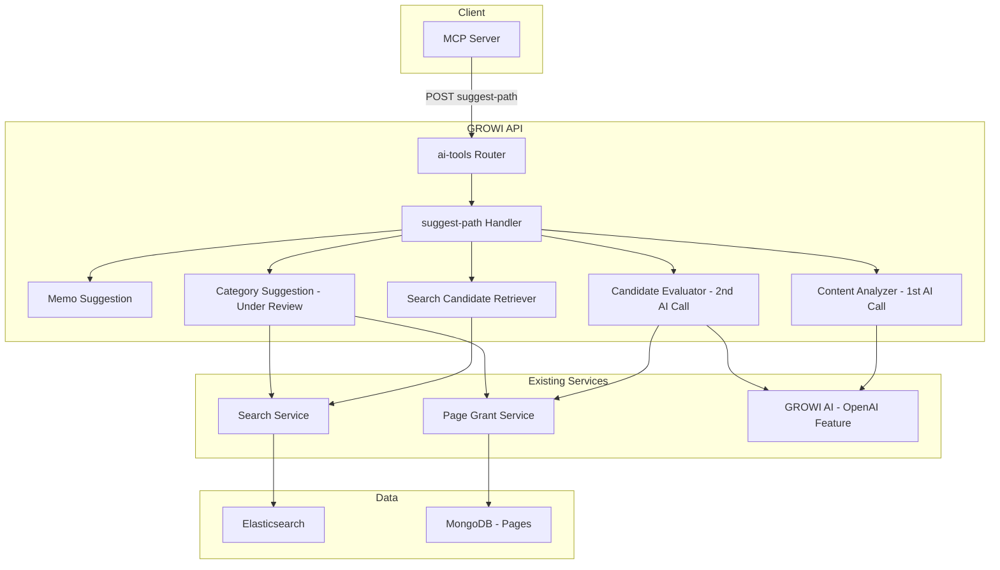
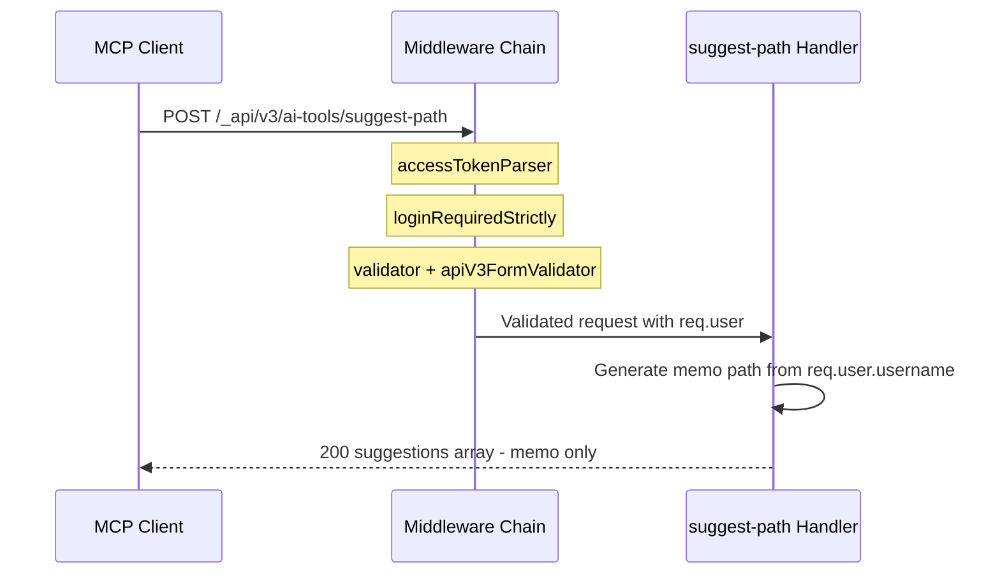
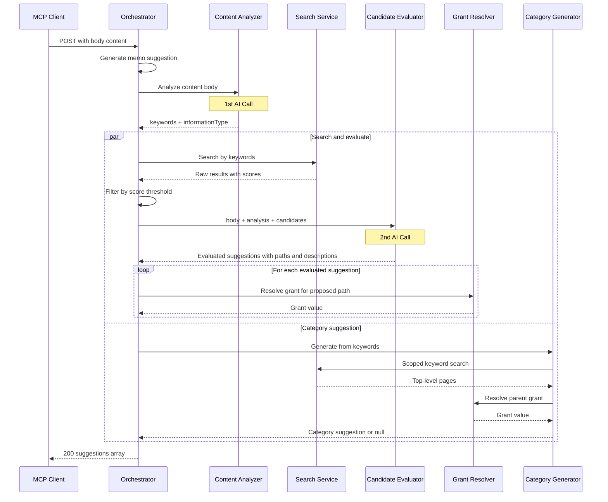

# Design Document

## Overview

**Purpose**: The suggest-path feature delivers an AI-powered path suggestion API that helps AI clients (e.g., Claude via MCP) determine optimal save locations for page content in GROWI. Users no longer need to manually decide where to save — the system analyzes content and returns directory path candidates with metadata.

**Users**: AI clients (Claude via MCP) call this endpoint on behalf of GROWI users during the "save to GROWI" workflow. The endpoint is part of the broader Smart Save architecture.

**Impact**: Adds a new API namespace (`ai-tools`) and a new endpoint (`suggest-path`) to the GROWI backend. No changes to existing endpoints or data models.

### Goals

- Provide a single POST endpoint that returns path suggestions with metadata (type, path, label, description, grant)
- Phase 1 (MVP): Return personal memo path with fixed metadata — zero external dependencies. **Implemented.**
- Phase 2: Add AI-powered search-based suggestions with flow/stock information classification, multi-candidate evaluation, and intelligent path proposals including new paths
- Enable independent access control via separate namespace from `/page`

### Design Principles

- **Client LLM independence**: Heavy reasoning (content analysis, candidate evaluation, path proposal, description generation) is centralized in GROWI AI on the server side. The API response includes structured data fields (`informationType`, `type`, `grant`) alongside natural language (`description`) so that even less capable LLM clients can make correct decisions through simple field access, without requiring advanced reasoning to interpret the response.

### Non-Goals

- Page creation or saving (existing `POST /_api/v3/page` handles this)
- Page title suggestion (Claude handles this via user dialogue)
- Client-side "enter manually" option (Agent Skill responsibility)

### Phase 2 Revision Summary

Phase 2 design was revised based on reviewer feedback. Key architectural changes from the prior revision:

1. **AI calls: 1 → 2**: Content analysis (keyword extraction + flow/stock classification) followed by candidate evaluation. Elasticsearch sits between the two calls, making consolidation structurally impossible.
2. **Candidate selection: mechanical → AI-evaluated**: Instead of top-1 by ES score, multiple candidates are passed to GROWI AI for content-destination fit evaluation.
3. **Path proposals: 3 patterns**: Parent directory, subdirectory, sibling page (including new paths that don't yet exist).
4. **Descriptions: mechanical → AI-generated**: Phase 2 descriptions are generated by the candidate evaluator as part of the evaluation.
5. **Category type: under review**: The existing `category` implementation is retained, but may be merged into the AI evaluation approach after implementation and reviewer discussion.

## Architecture

### Existing Architecture Analysis

The suggest-path endpoint integrates with GROWI's existing API infrastructure:

- **Route layer**: Express Router with handler factory pattern (`(crowi: Crowi) => RequestHandler[]`)
- **Middleware chain**: `accessTokenParser` → `loginRequiredStrictly` → validators → `apiV3FormValidator` → handler
- **Response format**: `res.apiv3(data)` for success, `res.apiv3Err(error, status)` for errors
- **AI features**: Existing `features/openai/` module with `certifyAiService` middleware for AI-enabled gating
- **Search**: `searchService.searchKeyword()` for full-text search with permission scoping
- **Flow/stock classification**: Existing `instructionsForInformationTypes` in `features/openai/server/services/assistant/instructions/commons.ts`

No existing architecture needs modification. The endpoint adds a new route namespace alongside existing ones.

### Architecture Pattern & Boundary Map



**Architecture Integration**:

- **Selected pattern**: Layered handler following existing GROWI route conventions. Phase 1 uses inline logic in handler; Phase 2 adds function components called by the handler (see [Implementation Paradigm](#implementation-paradigm))
- **Domain boundaries**: Route layer (`ai-tools/`) owns the endpoint. Suggestion logic delegates to existing services (search, grant, AI) without modifying them
- **Existing patterns preserved**: Handler factory pattern, middleware chain, `res.apiv3()` response format
- **New components**: ContentAnalyzer and CandidateEvaluator wrap GROWI AI calls with suggest-path-specific prompting
- **Steering compliance**: Feature-based separation, named exports, TypeScript strict typing

### Implementation Paradigm

**Default**: All components are implemented as pure functions with immutable data. No classes unless explicitly justified.

**Class adoption criteria** — a class is permitted only when at least one of the following applies AND a function-based alternative would be clearly inferior:

1. **Shared dependency management**: Multiple exported functions within a module depend on the same external services, making argument passing verbose.
2. **Singleton state/cache management**: The module must maintain mutable state or cached data.

**Component assessment**:

| Component | Paradigm | Rationale |
| --- | --- | --- |
| MemoSuggestionGenerator | Function | No external service dependencies beyond `user`. Single function. |
| ContentAnalyzer (Phase 2) | Function | Single function delegating to OpenAI Feature. |
| SearchCandidateRetriever (Phase 2) | Function | Single function. SearchService passed as argument. |
| CandidateEvaluator (Phase 2) | Function | Single function delegating to OpenAI Feature. GrantResolver passed as argument. |
| CategorySuggestionGenerator (Phase 2) | Function | Single function. SearchService and GrantResolver passed as arguments. Under review. |
| GrantResolver | Function | Single function. Page Model accessed via argument. |
| SuggestPathOrchestrator (Phase 2) | Function | Single public function. Dependencies as arguments. |

No component currently meets the class adoption criteria.

### Technology Stack

| Layer | Choice / Version | Role in Feature | Notes |
|-------|------------------|-----------------|-------|
| Backend | Express.js (existing) | Route handling, middleware | No new dependencies |
| Validation | express-validator (existing) | Request body validation | Existing pattern |
| Search | Elasticsearch via searchService (existing) | Phase 2 candidate retrieval | Score threshold filtering added |
| AI | OpenAI feature module (existing) | Phase 2: 1st call (content analysis), 2nd call (candidate evaluation) | Existing `features/openai/` infrastructure |
| Data | MongoDB via Mongoose (existing) | Page grant lookup | For parent page grant resolution |

No new dependencies introduced. All technology is already in the GROWI stack.

## System Flows

### Phase 1 (MVP) Flow



### Phase 2 Flow (Revised)



**Key decisions**:

- Content analysis (1st AI call) and candidate evaluation (2nd AI call) are structurally sequential — Elasticsearch sits between them
- Search-evaluate flow and category generation run in parallel where possible
- If content analysis fails, handler falls back to memo-only response (Phase 1 behavior)
- If candidate evaluation fails, handler falls back to memo-only response
- If search returns no results above the score threshold, search-based suggestions are omitted
- Category generator runs independently as existing implementation (under review)

## Requirements Traceability

| Requirement | Summary | Components | Interfaces | Flows |
|-------------|---------|------------|------------|-------|
| 1.1 | POST endpoint returns suggestions array | SuggestPathRouter, Orchestrator | API Contract | Phase 1, Phase 2 |
| 1.2 | Suggestion fields: type, path, label, description, grant | Orchestrator | PathSuggestion type | — |
| 1.3 | Path values as directory paths with trailing slash | Orchestrator | PathSuggestion type | — |
| 1.4 | Separate namespace from /page | SuggestPathRouter | Route registration | — |
| 2.1 | Include memo type suggestion | MemoSuggestionGenerator | PathSuggestion type | Phase 1 |
| 2.2 | Memo path under user home directory | MemoSuggestionGenerator | — | Phase 1 |
| 2.3 | Memo path under alternative namespace (user pages disabled) | MemoSuggestionGenerator | — | Phase 1 |
| 2.4 | Memo grant = 4 when user pages enabled | MemoSuggestionGenerator, GrantResolver | — | — |
| 2.5 | Fixed description for memo | MemoSuggestionGenerator | — | — |
| 3.1 | Search related pages by keywords | SearchCandidateRetriever | SearchService | Phase 2 |
| 3.2 | Filter candidates by ES score threshold | SearchCandidateRetriever | — | Phase 2 |
| 3.3 | Pass candidates to AI evaluation | Orchestrator, CandidateEvaluator | — | Phase 2 |
| 3.4 | Include parent page grant for search-based suggestions | GrantResolver | — | — |
| 3.5 | Omit search-based suggestions if no results | SearchCandidateRetriever, Orchestrator | — | — |
| 4.1 | Search top-level directories by keywords | CategorySuggestionGenerator | SearchService | Phase 2 |
| 4.2 | Extract top-level path segment | CategorySuggestionGenerator | — | Phase 2 |
| 4.3 | Include parent page grant for category type | CategorySuggestionGenerator, GrantResolver | — | — |
| 4.4 | Omit category type if no results | CategorySuggestionGenerator | — | — |
| 5.1 | Delegate content analysis to GROWI AI (single call: keywords + flow/stock) | ContentAnalyzer | GROWI AI interface | Phase 2 |
| 5.2 | Extract 3-5 keywords prioritizing proper nouns | ContentAnalyzer | — | Phase 2 |
| 5.3 | Use extracted keywords for search, not raw body | SearchCandidateRetriever, CategorySuggestionGenerator | — | Phase 2 |
| 5.4 | Classify content as flow or stock | ContentAnalyzer | ContentAnalysis type | Phase 2 |
| 5.5 | Fallback to memo if analysis fails | Orchestrator | — | Phase 2 |
| 6.1 | Description provides selection rationale | MemoSuggestionGenerator, CandidateEvaluator | — | — |
| 6.2 | Fixed text for memo in Phase 1 | MemoSuggestionGenerator | — | — |
| 6.3 | AI-generated description for search-based suggestions | CandidateEvaluator | — | Phase 2 |
| 7.1 | Grant field = parent page grant value | GrantResolver | PageGrant type | — |
| 7.2 | Grant = upper bound constraint | GrantResolver | — | — |
| 8.1 | Require valid API token or login session | SuggestPathRouter | Middleware chain | — |
| 8.2 | Return auth error if unauthenticated | SuggestPathRouter | — | — |
| 8.3 | Use authenticated user for user-specific suggestions | Orchestrator | — | — |
| 9.1 | Validation error if body missing/empty | SuggestPathRouter | Validator | — |
| 9.2 | No internal details in error responses | Orchestrator | ErrorV3 | — |
| 10.1 | Consider flow/stock alignment in candidate evaluation | CandidateEvaluator | ContentAnalysis type | Phase 2 |
| 10.2 | Identify flow characteristics in candidate locations | CandidateEvaluator | — | Phase 2 |
| 10.3 | Identify stock characteristics in candidate locations | CandidateEvaluator | — | Phase 2 |
| 10.4 | Flow/stock as ranking factor, not hard filter | CandidateEvaluator | — | Phase 2 |
| 11.1 | Evaluate candidates by passing body + path + snippet to AI | CandidateEvaluator | GROWI AI interface | Phase 2 |
| 11.2 | Rank by content-destination fit and flow/stock alignment | CandidateEvaluator | — | Phase 2 |
| 11.3 | Generate description per suggestion as part of evaluation | CandidateEvaluator | EvaluatedSuggestion type | Phase 2 |
| 11.4 | Fallback to memo-only if evaluation fails | Orchestrator | — | Phase 2 |
| 12.1 | Consider 3 structural patterns: parent, subdirectory, sibling | CandidateEvaluator | — | Phase 2 |
| 12.2 | Generate new directory names for sibling pattern | CandidateEvaluator | — | Phase 2 |
| 12.3 | Determine appropriate pattern based on content-destination fit | CandidateEvaluator | — | Phase 2 |
| 12.4 | Sibling pattern paths at same hierarchy level as candidate | CandidateEvaluator | — | Phase 2 |
| 13.1 | Include informationType field in search-based suggestions | CandidateEvaluator, Orchestrator | PathSuggestion type | Phase 2 |
| 13.2 | Provide both structured metadata and natural language context | Orchestrator | PathSuggestion type | Phase 2 |
| 13.3 | All reasoning-intensive operations server-side | ContentAnalyzer, CandidateEvaluator | — | Phase 2 |

## Components and Interfaces

| Component | Domain/Layer | Intent | Req Coverage | Key Dependencies | Contracts |
|-----------|-------------|--------|--------------|------------------|-----------|
| SuggestPathRouter | Route | Route registration and middleware | 1.4, 8.1, 8.2, 9.1 | Express Router (P0) | API |
| SuggestPathOrchestrator | Service | Orchestrate all suggestion generators | 1.1-1.3, 3.3, 3.5, 5.5, 8.3, 9.2, 11.4, 13.2 | All generators (P0) | Service |
| MemoSuggestionGenerator | Service | Generate memo path suggestion | 2.1-2.5, 6.2 | req.user (P0) | Service |
| ContentAnalyzer | Service | Extract keywords + classify flow/stock (1st AI call) | 5.1-5.4 | OpenAI Feature (P0) | Service |
| SearchCandidateRetriever | Service | Search ES and filter by score threshold | 3.1, 3.2, 3.5 | SearchService (P0) | Service |
| CandidateEvaluator | Service | AI-evaluate candidates, propose paths, generate descriptions (2nd AI call) | 3.3, 6.3, 10.1-10.4, 11.1-11.3, 12.1-12.4, 13.1 | OpenAI Feature (P0), GrantResolver (P1) | Service |
| CategorySuggestionGenerator | Service | Generate category suggestion (under review) | 4.1-4.4 | SearchService (P0), GrantResolver (P1) | Service |
| GrantResolver | Service | Resolve parent page grant for a path | 7.1, 7.2, 3.4, 4.3 | Page Model (P0) | Service |

### Route Layer

#### SuggestPathRouter

| Field | Detail |
|-------|--------|
| Intent | Register `POST /suggest-path` under `ai-tools` namespace with authentication and validation middleware |
| Requirements | 1.4, 8.1, 8.2, 9.1 |

**Responsibilities & Constraints**

- Register route at `/_api/v3/ai-tools/suggest-path`
- Apply standard authentication middleware chain
- Validate request body before handler execution
- Gate on AI-enabled configuration (reuse or replicate `certifyAiService` pattern)

**Dependencies**

- Inbound: MCP Client — HTTP POST requests (P0)
- Outbound: SuggestPathOrchestrator — request processing (P0)
- External: Express Router, express-validator — routing and validation (P0)

**Contracts**: API [x]

##### API Contract

| Method | Endpoint | Request | Response | Errors |
|--------|----------|---------|----------|--------|
| POST | `/_api/v3/ai-tools/suggest-path` | `SuggestPathRequest` | `SuggestPathResponse` | 400, 401, 403, 500 |

**Implementation Notes**

- Route registered in `apps/app/src/server/routes/apiv3/index.js` as `router.use('/ai-tools', ...)`
- Middleware chain: `accessTokenParser` → `loginRequiredStrictly` → `certifyAiService` → validators → `apiV3FormValidator` → handler
- Namespace `ai-tools` is tentative pending yuki confirmation; change requires single line edit in `index.js`

### Service Layer

#### SuggestPathOrchestrator

| Field | Detail |
|-------|--------|
| Intent | Orchestrate all suggestion generators, handle failures with graceful degradation |
| Requirements | 1.1, 1.2, 1.3, 3.3, 3.5, 5.5, 8.3, 9.2, 11.4 |

**Responsibilities & Constraints**

- Always generate memo suggestion first (guaranteed fallback)
- Invoke ContentAnalyzer, then pass results to SearchCandidateRetriever and CandidateEvaluator
- Run category generation in parallel with the search-evaluate pipeline
- Collect non-null results into suggestions array
- On any Phase 2 failure, fall back to memo-only response

**Dependencies**

- Inbound: SuggestPathRouter — validated request (P0)
- Outbound: All service layer components — suggestion generation (P0)

**Contracts**: Service [x]

##### Service Interface

```typescript
interface SuggestPathDependencies {
  analyzeContent: (body: string) => Promise<ContentAnalysis>;
  retrieveSearchCandidates: (
    keywords: string[],
    user: IUserHasId,
    userGroups: PopulatedGrantedGroup[],
  ) => Promise<SearchCandidate[]>;
  evaluateCandidates: (
    body: string,
    analysis: ContentAnalysis,
    candidates: SearchCandidate[],
  ) => Promise<EvaluatedSuggestion[]>;
  generateCategorySuggestion: (
    keywords: string[],
    user: IUserHasId,
    userGroups: PopulatedGrantedGroup[],
  ) => Promise<PathSuggestion | null>;
  resolveParentGrant: (path: string) => Promise<number>;
}

function generateSuggestions(
  user: IUserHasId,
  body: string,
  deps: SuggestPathDependencies,
): Promise<PathSuggestion[]>;
```

- Preconditions: `user` is authenticated, `body` is non-empty string
- Postconditions: Returns array with at least one suggestion (memo type)
- Invariants: Memo suggestion is always present regardless of Phase 2 failures

**Implementation Notes**

- Phase 1: Logic is inline in handler (memo generation is ~10 lines). The `body` field is required but unused in Phase 1 — this maintains API contract stability
- Phase 2: Orchestration function calls content analyzer, then fans out to search-evaluate pipeline and category generator in parallel. Dependencies injected for testability
- Error handling: Catch Phase 2 failures at orchestration level, log, return memo-only
- informationType mapping: When building `PathSuggestion` from `EvaluatedSuggestion`, the orchestrator attaches `ContentAnalysis.informationType` to each search-type suggestion (Req 13.1)

#### MemoSuggestionGenerator

| Field | Detail |
|-------|--------|
| Intent | Generate personal memo area path suggestion |
| Requirements | 2.1, 2.2, 2.3, 2.4, 2.5, 6.2 |

**Responsibilities & Constraints**

- Check `disableUserPages` configuration via `crowi.configManager`
- When user pages are enabled (default): Generate path `/user/{username}/memo/` using `userHomepagePath(user)` utility, set grant to `PageGrant.GRANT_OWNER` (4)
- When user pages are disabled: Generate path under alternative namespace (e.g., `/memo/{username}/`), resolve grant from parent page
- Set fixed description and label text
- Always succeeds

**Contracts**: Service [x]

##### Service Interface

```typescript
function generateMemoSuggestion(user: IUserHasId): PathSuggestion;
```

- Preconditions: `user` has valid `username` field
- Postconditions: Returns `PathSuggestion` with `type: 'memo'`, `grant: 4` when user pages enabled

#### ContentAnalyzer (Phase 2)

| Field | Detail |
|-------|--------|
| Intent | Extract keywords and classify content information type via GROWI AI (1st AI call) |
| Requirements | 5.1, 5.2, 5.3, 5.4 |

**Responsibilities & Constraints**

- Accept content body string
- Delegate to GROWI AI (existing OpenAI feature) for a single AI call that performs:
  - Keyword extraction: 3-5 keywords, prioritizing proper nouns and technical terms
  - Flow/stock classification: Determine if content is flow information (time-bound: meeting notes, diaries, reports) or stock information (reference: documentation, knowledge base)
- Return structured `ContentAnalysis` result
- Existing `instructionsForInformationTypes` in commons.ts serves as reference for AI prompting but is not the sole classification criterion (per reviewer feedback)

**Dependencies**

- External: OpenAI Feature module — AI inference (P0)

**Contracts**: Service [x]

##### Service Interface

```typescript
interface ContentAnalysis {
  keywords: string[];
  informationType: 'flow' | 'stock';
}

function analyzeContent(body: string): Promise<ContentAnalysis>;
```

- Preconditions: `body` is non-empty string
- Postconditions: Returns `ContentAnalysis` with 1-5 keywords and informationType
- Error behavior: Throws on failure; caller handles fallback

#### SearchCandidateRetriever (Phase 2)

| Field | Detail |
|-------|--------|
| Intent | Search for related pages using keywords and filter by score threshold |
| Requirements | 3.1, 3.2, 3.5 |

**Responsibilities & Constraints**

- Call `searchService.searchKeyword()` with extracted keywords
- Filter results by Elasticsearch score threshold to retain only sufficiently relevant candidates
- Return array of `SearchCandidate` objects with page path, snippet, and score
- Return empty array if no results pass the threshold
- Score threshold value is tunable (determined during implementation with real data)

**Dependencies**

- Outbound: SearchService — keyword search (P0)

**Contracts**: Service [x]

##### Service Interface

```typescript
interface SearchCandidate {
  pagePath: string;
  snippet: string;
  score: number;
}

function retrieveSearchCandidates(
  keywords: string[],
  user: IUserHasId,
  userGroups: PopulatedGrantedGroup[],
): Promise<SearchCandidate[]>;
```

- Preconditions: `keywords` is non-empty array
- Postconditions: Returns array of `SearchCandidate` (may be empty). All candidates have scores above the configured threshold
- Note: Replaces the prior `SearchSuggestionGenerator` which performed top-1 selection and description generation. Those responsibilities moved to `CandidateEvaluator`

#### CandidateEvaluator (Phase 2)

| Field | Detail |
|-------|--------|
| Intent | Evaluate search candidates via GROWI AI for content-destination fit, propose paths, generate descriptions (2nd AI call) |
| Requirements | 3.3, 6.3, 10.1, 10.2, 10.3, 10.4, 11.1, 11.2, 11.3, 12.1, 12.2, 12.3, 12.4, 13.1 |

**Responsibilities & Constraints**

- Accept content body, content analysis (from 1st AI call), and search candidates
- Delegate to GROWI AI for a single AI call that performs:
  - **Candidate evaluation**: Assess each candidate's suitability considering content relevance and flow/stock alignment
  - **Path proposal**: For each suitable candidate, propose a save location using one of 3 structural patterns:
    - (a) Parent directory of the matching page
    - (b) Subdirectory under the matching page
    - (c) Sibling directory alongside the matching page (may generate new path)
  - **Description generation**: Generate a description for each suggestion explaining why the location is suitable
  - **Ranking**: Order suggestions by content-destination fit
- Flow/stock alignment is a ranking factor, not a hard filter (10.4)
- Sibling pattern (c) may generate paths that don't yet exist in GROWI (12.2). Generated paths must be at the same hierarchy level as the matching search candidate page (12.4)
- AI context budget: Pass candidate paths + ES snippets, NOT full page bodies (see architecture doc)
- Resolve grant for each proposed path via GrantResolver after AI evaluation returns

**Dependencies**

- External: OpenAI Feature module — AI inference (P0)
- Outbound: GrantResolver — grant resolution for proposed paths (P1)

**Contracts**: Service [x]

##### Service Interface

```typescript
interface EvaluatedSuggestion {
  path: string;        // Proposed directory path with trailing /
  label: string;       // Display label
  description: string; // AI-generated rationale
}

function evaluateCandidates(
  body: string,
  analysis: ContentAnalysis,
  candidates: SearchCandidate[],
): Promise<EvaluatedSuggestion[]>;
```

- Preconditions: `candidates` is non-empty array, `analysis` contains valid informationType
- Postconditions: Returns array of `EvaluatedSuggestion` ordered by fit score (best first). May return empty array if no candidates are suitable. All paths end with `/`
- Error behavior: Throws on failure; caller handles fallback
- Note: Grant resolution is performed by the orchestrator after this function returns, not inside this function

**Implementation Notes**

- The 2nd AI call receives: POST body, informationType (from 1st call), and for each candidate: pagePath + ES snippet
- The AI is instructed to consider the 3 path proposal patterns and select the most appropriate for each candidate
- Existing `instructionsForInformationTypes` from commons.ts is referenced in the AI prompt as guidance for flow/stock assessment of candidate locations
- AI prompt design details are deferred to implementation phase

#### CategorySuggestionGenerator (Phase 2 — Under Review)

| Field | Detail |
|-------|--------|
| Intent | Find matching top-level category directory for content |
| Requirements | 4.1, 4.2, 4.3, 4.4 |

> **Note**: This component has an existing implementation from the prior Phase 2 design. With the introduction of AI-based candidate evaluation, this component may overlap with CandidateEvaluator's path proposal capabilities. Whether to retain, merge, or remove is deferred to post-implementation reviewer discussion. The existing implementation is maintained as-is.

**Responsibilities & Constraints**

- Call `searchService.searchKeyword()` with keywords scoped to top-level (`prefix:/`)
- Select the top-1 result by Elasticsearch score; extract top-level path segment
- Generate description from top-level segment name (mechanical, no AI)
- Resolve parent page grant via GrantResolver
- Return `null` if no matching top-level pages found

**Dependencies**

- Outbound: SearchService — scoped keyword search (P0)
- Outbound: GrantResolver — parent page grant lookup (P1)

**Contracts**: Service [x]

##### Service Interface

```typescript
function generateCategorySuggestion(
  keywords: string[],
  user: IUserHasId,
  userGroups: PopulatedGrantedGroup[],
): Promise<PathSuggestion | null>;
```

- Preconditions: `keywords` is non-empty array
- Postconditions: Returns `PathSuggestion` with `type: 'category'` or `null` if no results

#### GrantResolver

| Field | Detail |
|-------|--------|
| Intent | Look up the effective grant value for a parent directory path |
| Requirements | 7.1, 7.2, 3.4, 4.3 |

**Responsibilities & Constraints**

- Given a directory path, find the corresponding page in MongoDB
- Return its `grant` value as the upper bound for child pages
- For memo path: always returns `PageGrant.GRANT_OWNER` (4)
- For search/category/evaluated paths (Phase 2): query Page model for the parent page's grant
- For new paths (sibling pattern): traverse upward to find the nearest existing ancestor page's grant

**Dependencies**

- External: Page Model (Mongoose) — page grant lookup (P0)

**Contracts**: Service [x]

##### Service Interface

```typescript
function resolveParentGrant(path: string): Promise<number>;
```

- Preconditions: `path` is a valid directory path (trailing `/`)
- Postconditions: Returns PageGrant numeric value (1, 2, 4, or 5)
- Error behavior: Returns `PageGrant.GRANT_OWNER` (4) as safe default if page not found

## Data Models

### Domain Model

No new database entities. The endpoint reads from existing models only.

**Existing entities used**:

- **Page**: Queried for parent page grant resolution (Phase 2). Fields: `path`, `grant`, `grantedGroups`
- **User**: Available via `req.user`. Fields: `username`, `_id`

### Data Contracts & Integration

#### Request Schema

```typescript
interface SuggestPathRequest {
  body: string; // Page content for analysis
}
```

**Validation rules**:

- `body`: Required, non-empty string
- No endpoint-specific maximum length. Body size is governed by GROWI's global Express body-parser configuration

#### Response Schema

```typescript
type SuggestionType = 'memo' | 'search' | 'category';
type InformationType = 'flow' | 'stock';

interface PathSuggestion {
  type: SuggestionType;
  path: string;              // Directory path with trailing '/'
  label: string;             // Display label for the suggestion
  description: string;       // Selection rationale (fixed for memo, AI-generated for search)
  grant: number;             // Parent page grant (PageGrant value)
  informationType?: InformationType; // Content's information type as classified by GROWI AI (Phase 2, search-based only)
}

interface SuggestPathResponse {
  suggestions: PathSuggestion[];
}
```

**Invariants**:

- `suggestions` array always contains at least one element (memo type)
- `path` always ends with `/`
- `grant` is a valid PageGrant value (1, 2, 4, or 5)
- `type` is one of the defined SuggestionType values

> **Resolved**: The `informationType` field has been added to `PathSuggestion` as an optional field for search-based suggestions. This supports the Client LLM Independence design principle (Requirement 13) by providing structured metadata that any client can use regardless of reasoning capability.

#### Internal Types (Phase 2)

```typescript
interface ContentAnalysis {
  keywords: string[];
  informationType: 'flow' | 'stock';
}

interface SearchCandidate {
  pagePath: string;
  snippet: string;
  score: number;
}

interface EvaluatedSuggestion {
  path: string;        // Proposed directory path with trailing /
  label: string;
  description: string; // AI-generated rationale
}
```

#### Phase 1 Response Example

```json
{
  "suggestions": [
    {
      "type": "memo",
      "path": "/user/alice/memo/",
      "label": "Save as memo",
      "description": "Save to your personal memo area",
      "grant": 4
    }
  ]
}
```

#### Phase 2 Response Example

```json
{
  "suggestions": [
    {
      "type": "memo",
      "path": "/user/alice/memo/",
      "label": "Save as memo",
      "description": "Save to your personal memo area",
      "grant": 4
    },
    {
      "type": "search",
      "path": "/tech-notes/React/state-management/",
      "label": "Save near related pages",
      "description": "This area contains pages about React state management including Jotai and Redux. Your stock content fits well alongside this existing reference material.",
      "grant": 1,
      "informationType": "stock"
    },
    {
      "type": "search",
      "path": "/tech-notes/React/backend/",
      "label": "New section for backend topics",
      "description": "Related frontend pages exist nearby. This new section organizes your backend content as a sibling to the existing frontend knowledge.",
      "grant": 1,
      "informationType": "stock"
    },
    {
      "type": "category",
      "path": "/tech-notes/",
      "label": "Save under category",
      "description": "Top-level category: tech-notes",
      "grant": 1
    }
  ]
}
```

Note: Phase 2 may return multiple `search`-type suggestions (one per evaluated candidate). The `category` suggestion appears if the CategorySuggestionGenerator finds a match (component under review).

## Error Handling

### Error Categories and Responses

**User Errors (4xx)**:

| Error | Status | Response | Requirement |
|-------|--------|----------|-------------|
| Missing or empty `body` field | 400 | Validation error with field details | 9.1 |
| No authentication token/session | 401 | Authentication required | 8.2 |
| AI service not enabled | 403 | GROWI AI is not enabled | 1.4 |

**System Errors — Graceful Degradation (returns 200)**:

| Error | Behavior | Fallback | Requirement |
|-------|----------|----------|-------------|
| Content analysis failure (1st AI call) | Log error, skip search pipeline | Memo suggestion only | 5.5 |
| Search service failure | Log error, skip search-based suggestions | Memo + category (if available) | 3.5 |
| Candidate evaluation failure (2nd AI call) | Log error, skip search-based suggestions | Memo + category (if available) | 11.4 |
| Category generation failure | Log error, skip category suggestion | Memo + search-based (if available) | 4.4 |

**System Errors (5xx)**:

| Error | Status | Response | Requirement |
|-------|--------|----------|-------------|
| Unexpected error | 500 | Generic error, no internal details | 9.2 |

**Key decision**: Phase 2 failures degrade gracefully rather than returning errors. The memo suggestion is generated first and acts as guaranteed fallback. Each Phase 2 component fails independently — content analysis failure skips the entire search pipeline, but category generation can still proceed if it runs independently.

## Testing Strategy

### Unit Tests

- `MemoSuggestionGenerator`: Correct path, grant, description for both user-pages-enabled and disabled cases
- `ContentAnalyzer`: Correct keyword extraction, flow/stock classification, error propagation
- `SearchCandidateRetriever`: Score threshold filtering, empty result handling, candidate structure
- `CandidateEvaluator`: Path proposal patterns (parent/subdirectory/sibling), description generation, ranking, flow/stock consideration, error propagation
- `CategorySuggestionGenerator`: Top-level extraction, description, grant, empty result handling
- `GrantResolver`: Returns correct grant from page, default grant when page not found, ancestor traversal for new paths
- `PathSuggestion` type validation: Trailing slash enforcement, required fields present
- Request validation: Missing body, empty body, valid body

### Integration Tests

- `POST /suggest-path` with valid auth: Returns 200 with memo suggestion (Phase 1)
- `POST /suggest-path` without auth: Returns 401
- `POST /suggest-path` with empty body: Returns 400
- `POST /suggest-path` with AI disabled: Returns 403
- Phase 2: Full pipeline — content analysis → search → candidate evaluation → response with multiple suggestion types
- Phase 2: Content analysis fails → memo-only fallback
- Phase 2: Search returns nothing → search-based suggestions omitted, category may still appear
- Phase 2: Candidate evaluation fails → memo + category fallback
- Phase 2: All Phase 2 components fail → memo-only response

### Performance (Phase 2)

- Content analysis (1st AI call) latency under typical content sizes
- Candidate evaluation (2nd AI call) latency with varying numbers of candidates
- Total end-to-end latency for the 2-AI-call flow
- Parallel execution: search-evaluate pipeline vs category generation

## Security Considerations

- **Authentication**: All requests require valid API token or login session (standard middleware)
- **Authorization**: User can only see suggestions based on their own identity and permissions. Search results are permission-scoped via `searchKeyword()` user/group parameters
- **Input safety**: Content body is passed to GROWI AI, not directly to Elasticsearch. No NoSQL injection risk from body content
- **AI prompt injection**: Content body is user-provided and passed to AI. AI prompts should be structured to minimize prompt injection risk (system prompt + user content separation)
- **Information leakage**: Error responses use generic messages per requirement 9.2. No stack traces or internal paths exposed
