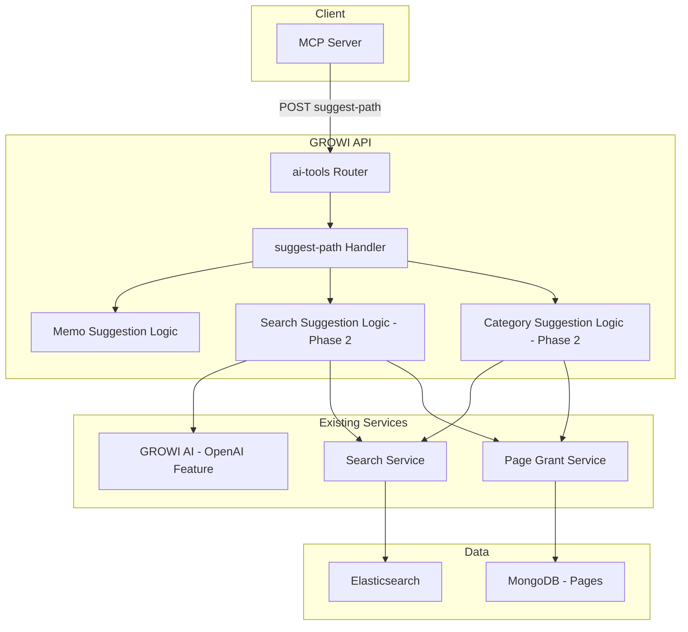
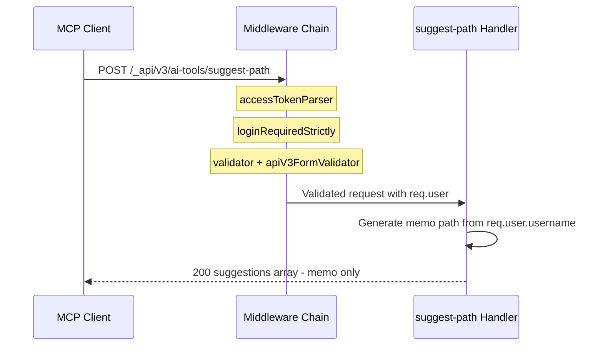
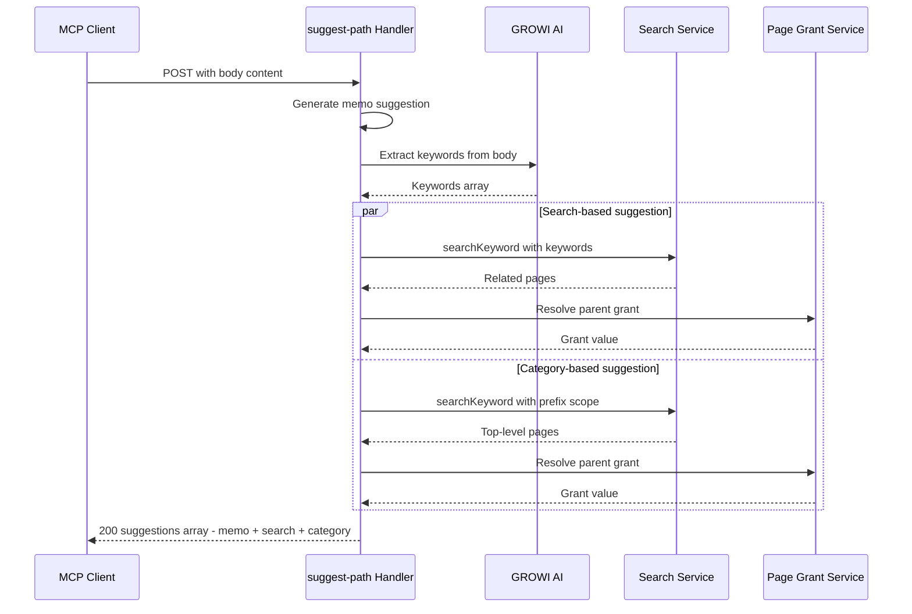

# Design Document

## Overview

**Purpose**: The suggest-path feature delivers an AI-powered path suggestion API that helps AI clients (e.g., Claude via MCP) determine optimal save locations for page content in GROWI. Users no longer need to manually decide where to save — the system analyzes content and returns directory path candidates with metadata.

**Users**: AI clients (Claude via MCP) call this endpoint on behalf of GROWI users during the "save to GROWI" workflow. The endpoint is part of the broader Smart Save architecture.

**Impact**: Adds a new API namespace (`ai-tools`) and a new endpoint (`suggest-path`) to the GROWI backend. No changes to existing endpoints or data models.

### Goals

- Provide a single POST endpoint that returns path suggestions with metadata (type, path, label, description, grant)
- Phase 1 (MVP): Return personal memo path with fixed metadata — zero external dependencies
- Phase 2: Add search-based and category-based suggestions using GROWI AI keyword extraction and search service
- Enable independent access control via separate namespace from `/page`

### Non-Goals

- Page creation or saving (existing `POST /_api/v3/page` handles this)
- Page title suggestion (Claude handles this via user dialogue)
- Client-side "enter manually" option (Agent Skill responsibility)
- GROWI AI keyword extraction implementation details (separate design)

## Architecture

### Existing Architecture Analysis

The suggest-path endpoint integrates with GROWI's existing API infrastructure:

- **Route layer**: Express Router with handler factory pattern (`(crowi: Crowi) => RequestHandler[]`)
- **Middleware chain**: `accessTokenParser` → `loginRequiredStrictly` → validators → `apiV3FormValidator` → handler
- **Response format**: `res.apiv3(data)` for success, `res.apiv3Err(error, status)` for errors
- **AI features**: Existing `features/openai/` module with `certifyAiService` middleware for AI-enabled gating
- **Search**: `searchService.searchKeyword()` for full-text search with permission scoping

No existing architecture needs modification. The endpoint adds a new route namespace alongside existing ones.

### Architecture Pattern & Boundary Map



**Architecture Integration**:

- **Selected pattern**: Layered handler following existing GROWI route conventions. Phase 1 uses inline logic in handler; Phase 2 adds generator functions called by the handler (see [Implementation Paradigm](#implementation-paradigm) for function vs class rationale)
- **Domain boundaries**: Route layer (`ai-tools/`) owns the endpoint. Suggestion logic delegates to existing services (search, grant, AI) without modifying them
- **Existing patterns preserved**: Handler factory pattern, middleware chain, `res.apiv3()` response format
- **New components**: `ai-tools/` route directory (new namespace), `suggest-path.ts` handler
- **Steering compliance**: Feature-based separation, named exports, TypeScript strict typing

### Implementation Paradigm

**Default**: All components are implemented as pure functions with immutable data. No classes unless explicitly justified.

**Class adoption criteria** — a class is permitted only when at least one of the following applies AND a function-based alternative would be clearly inferior:

1. **Shared dependency management**: Multiple exported functions within a module depend on the same external services (e.g., SearchService), making argument passing across all functions verbose. A class with dependency fields reduces repetition.
2. **Singleton state/cache management**: The module must maintain mutable state or cached data in a singleton instance, where immutability is not feasible.

**Component assessment**:

| Component                             | Paradigm | Rationale                                                                                                                                                                                                        |
| ------------------------------------- | -------- | ---------------------------------------------------------------------------------------------------------------------------------------------------------------------------------------------------------------- |
| MemoSuggestionGenerator               | Function | No external service dependencies beyond `user`. Single function.                                                                                                                                                 |
| DescriptionGenerator                  | Function | Stateless, no dependencies. Pure transformation functions.                                                                                                                                                       |
| GrantResolver                         | Function | Single function. Page Model accessed via argument.                                                                                                                                                               |
| KeywordExtractor (Phase 2)            | Function | Single function delegating to OpenAI Feature.                                                                                                                                                                    |
| SearchSuggestionGenerator (Phase 2)   | Function | Single function. SearchService and GrantResolver passed as arguments.                                                                                                                                            |
| CategorySuggestionGenerator (Phase 2) | Function | Single function. Same dependency pattern as SearchSuggestionGenerator.                                                                                                                                           |
| SuggestPathService (Phase 2)          | Function | Single public function. No state or cache. Dependencies as arguments. May adopt class if public functions grow and shared dependency passing becomes verbose.                                                    |

No component currently meets the class adoption criteria. All are implemented as exported functions.

### Technology Stack

| Layer | Choice / Version | Role in Feature | Notes |
|-------|------------------|-----------------|-------|
| Backend | Express.js (existing) | Route handling, middleware | No new dependencies |
| Validation | express-validator (existing) | Request body validation | Existing pattern |
| Search | Elasticsearch via searchService (existing) | Phase 2 keyword search | Used for `search` and `category` suggestions |
| AI | OpenAI feature module (existing) | Phase 2 keyword extraction | Existing `features/openai/` infrastructure |
| Data | MongoDB via Mongoose (existing) | Page grant lookup | For parent page grant resolution |

No new dependencies introduced. All technology is already in the GROWI stack.

## System Flows

### Phase 1 (MVP) Flow



### Phase 2 Flow



**Key decisions**:

- Search-based and category-based suggestions are generated in parallel where possible
- If keyword extraction fails, handler falls back to memo-only response (Phase 1 behavior)
- If search returns no results for a suggestion type, that type is omitted from the response

## Requirements Traceability

| Requirement | Summary | Components | Interfaces | Flows |
|-------------|---------|------------|------------|-------|
| 1.1 | POST endpoint returns suggestions array | SuggestPathRouter, SuggestPathHandler | API Contract | Phase 1, Phase 2 |
| 1.2 | Suggestion fields: type, path, label, description, grant | SuggestPathHandler | PathSuggestion type | — |
| 1.3 | Path values as directory paths with trailing slash | SuggestPathHandler | PathSuggestion type | — |
| 1.4 | Separate namespace from /page | SuggestPathRouter | Route registration | — |
| 2.1 | Include memo type suggestion | MemoSuggestionGenerator | PathSuggestion type | Phase 1 |
| 2.2 | Memo path under user home directory (user pages enabled) | MemoSuggestionGenerator | — | Phase 1 |
| 2.3 | Memo path under alternative namespace (user pages disabled) | MemoSuggestionGenerator | — | Phase 1 |
| 2.4 | Memo grant = 4 when user pages enabled; resolve from parent when disabled | MemoSuggestionGenerator, GrantResolver | — | — |
| 2.5 | Fixed description for memo | MemoSuggestionGenerator, DescriptionGenerator | — | — |
| 3.1 | Search related pages by keywords | SearchSuggestionGenerator | SearchService | Phase 2 |
| 3.2 | Return parent directory of most relevant page | SearchSuggestionGenerator | — | Phase 2 |
| 3.3 | Include related page titles in description | SearchSuggestionGenerator, DescriptionGenerator | — | — |
| 3.4 | Include parent page grant for search type | SearchSuggestionGenerator, GrantResolver | — | — |
| 3.5 | Omit search type if no results | SearchSuggestionGenerator | — | — |
| 4.1 | Search top-level directories by keywords | CategorySuggestionGenerator | SearchService | Phase 2 |
| 4.2 | Extract top-level path segment | CategorySuggestionGenerator | — | Phase 2 |
| 4.3 | Include parent page grant for category type | CategorySuggestionGenerator, GrantResolver | — | — |
| 4.4 | Omit category type if no results | CategorySuggestionGenerator | — | — |
| 5.1 | Delegate keyword extraction to GROWI AI | KeywordExtractor | GROWI AI interface | Phase 2 |
| 5.2 | Use extracted keywords for search, not raw body | SearchSuggestionGenerator, CategorySuggestionGenerator | — | Phase 2 |
| 5.3 | Fallback to memo if extraction fails | SuggestPathHandler | — | Phase 2 |
| 6.1 | Description provides selection rationale | DescriptionGenerator | — | — |
| 6.2 | Fixed text for memo in Phase 1 | DescriptionGenerator | — | — |
| 6.3 | List page titles for search type in Phase 2 | DescriptionGenerator | — | — |
| 6.4 | Path segment name for category type in Phase 2 | DescriptionGenerator | — | — |
| 6.5 | Phase 2 descriptions mechanical, no AI | DescriptionGenerator | — | — |
| 7.1 | Grant field = parent page grant value | GrantResolver | PageGrant type | — |
| 7.2 | Grant = upper bound constraint, not recommendation | GrantResolver | — | — |
| 8.1 | Require valid API token or login session | SuggestPathRouter | Middleware chain | — |
| 8.2 | Return auth error if unauthenticated | SuggestPathRouter | — | — |
| 8.3 | Use authenticated user for user-specific suggestions | SuggestPathHandler | — | — |
| 9.1 | Validation error if body missing/empty | SuggestPathRouter | Validator | — |
| 9.2 | No internal details in error responses | SuggestPathHandler | ErrorV3 | — |

## Components and Interfaces

| Component | Domain/Layer | Intent | Req Coverage | Key Dependencies | Contracts |
|-----------|-------------|--------|--------------|------------------|-----------|
| SuggestPathRouter | Route | Route registration and middleware composition | 1.4, 8.1, 8.2, 9.1 | Express Router (P0) | API |
| SuggestPathHandler | Route | Orchestrate suggestion generation and response | 1.1, 1.2, 1.3, 5.3, 8.3, 9.2 | SuggestionGenerators (P0) | API, Service |
| MemoSuggestionGenerator | Service | Generate memo path suggestion from user identity | 2.1, 2.2, 2.3, 2.4 | req.user (P0) | Service |
| SearchSuggestionGenerator | Service | Generate search-based suggestion from keywords (Phase 2) | 3.1-3.5, 5.2 | SearchService (P0), GrantResolver (P1) | Service |
| CategorySuggestionGenerator | Service | Generate category-based suggestion from keywords (Phase 2) | 4.1-4.4, 5.2 | SearchService (P0), GrantResolver (P1) | Service |
| KeywordExtractor | Service | Extract keywords from content via GROWI AI (Phase 2) | 5.1, 5.2 | OpenAI Feature (P0) | Service |
| DescriptionGenerator | Service | Generate description text per suggestion type | 6.1-6.5 | None | Service |
| GrantResolver | Service | Resolve parent page grant for a given path | 7.1, 7.2, 3.4, 4.3 | Page Model (P0) | Service |

### Route Layer

#### SuggestPathRouter

| Field | Detail |
|-------|--------|
| Intent | Register `POST /suggest-path` under `ai-tools` namespace with authentication and validation middleware |
| Requirements | 1.4, 8.1, 8.2, 9.1 |

**Responsibilities & Constraints**

- Register route at `/_api/v3/ai-tools/suggest-path`
- Apply standard authentication middleware chain
- Validate request body before handler execution
- Gate on AI-enabled configuration (reuse or replicate `certifyAiService` pattern)

**Dependencies**

- Inbound: MCP Client — HTTP POST requests (P0)
- Outbound: SuggestPathHandler — request processing (P0)
- External: Express Router, express-validator — routing and validation (P0)

**Contracts**: API [x]

##### API Contract

| Method | Endpoint | Request | Response | Errors |
|--------|----------|---------|----------|--------|
| POST | `/_api/v3/ai-tools/suggest-path` | `SuggestPathRequest` | `SuggestPathResponse` | 400, 401, 403, 500 |

**Implementation Notes**

- Route registered in `apps/app/src/server/routes/apiv3/index.js` as `router.use('/ai-tools', ...)`
- Middleware chain follows existing pattern: `accessTokenParser` → `loginRequiredStrictly` → `certifyAiService` → validators → `apiV3FormValidator` → handler
- Namespace `ai-tools` is tentative pending yuki confirmation; change requires single line edit in `index.js`

#### SuggestPathHandler

| Field | Detail |
|-------|--------|
| Intent | Orchestrate suggestion generation, collect results, return unified response |
| Requirements | 1.1, 1.2, 1.3, 5.3, 8.3, 9.2 |

**Responsibilities & Constraints**

- Invoke suggestion generators (memo always; search and category in Phase 2)
- Collect non-null results into suggestions array
- Handle errors gracefully: if Phase 2 logic fails, fall back to memo-only
- Format response using `res.apiv3()`

**Dependencies**

- Inbound: SuggestPathRouter — validated request (P0)
- Outbound: MemoSuggestionGenerator, SearchSuggestionGenerator, CategorySuggestionGenerator, KeywordExtractor — suggestion generation (P0)

**Contracts**: Service [x]

##### Service Interface

```typescript
// Phase 1: Handler contains inline logic
// Phase 2: Handler calls generateSuggestions with explicit dependencies

function generateSuggestions(
  user: IUserHasId,
  body: string,
  deps: {
    searchService: SearchService;
    extractKeywords: (body: string) => Promise<string[]>;
    resolveParentGrant: (path: string) => Promise<number>;
  },
): Promise<PathSuggestion[]>;
```

- Preconditions: `user` is authenticated, `body` is non-empty string
- Postconditions: Returns array with at least one suggestion (memo type)
- Invariants: Memo suggestion is always present regardless of Phase 2 failures

**Implementation Notes**

- Phase 1: Logic is inline in handler (memo generation is ~10 lines). The `body` field is required but unused in Phase 1 — this maintains API contract stability so the transition to Phase 2 introduces no breaking changes. The MCP client always has content body available in the save workflow
- Phase 2: Extract orchestration logic to a `generateSuggestions` function. Dependencies (SearchService, KeywordExtractor, GrantResolver) are passed as arguments. See [Implementation Paradigm](#implementation-paradigm) for class adoption criteria
- Error handling: Catch Phase 2 failures, log, return memo-only response

### Service Layer

#### MemoSuggestionGenerator

| Field | Detail |
|-------|--------|
| Intent | Generate personal memo area path suggestion |
| Requirements | 2.1, 2.2, 2.3, 2.4, 2.5 |

**Responsibilities & Constraints**

- Check `disableUserPages` configuration via `crowi.configManager`
- When user pages are enabled (default): Generate path `/user/{username}/memo/` using `userHomepagePath(user)` utility, set grant to `PageGrant.GRANT_OWNER` (4)
- When user pages are disabled: Generate path under alternative namespace (e.g., `/memo/{username}/`), resolve grant from parent page. The exact alternative path is subject to confirmation
- Set fixed description and label text
- Always succeeds (path can be determined from either configuration)

**Contracts**: Service [x]

##### Service Interface

```typescript
function generateMemoSuggestion(user: IUserHasId): PathSuggestion {
  // Returns memo suggestion with type 'memo'
}
```

- Preconditions: `user` has valid `username` field
- Postconditions: Returns a `PathSuggestion` with `type: 'memo'`. When user pages are enabled, `grant: 4`; when disabled, grant is resolved from the parent page

#### SearchSuggestionGenerator (Phase 2)

| Field | Detail |
|-------|--------|
| Intent | Find related pages via keyword search and suggest their parent directory |
| Requirements | 3.1, 3.2, 3.3, 3.4, 3.5, 5.2 |

**Responsibilities & Constraints**

- Call `searchService.searchKeyword()` with extracted keywords
- Select the top-1 result by Elasticsearch score; extract parent directory from its path
- Generate description listing up to 3 related page titles (top results by score)
- Resolve parent page grant via GrantResolver
- Return `null` if no search results found
- Note: Selection heuristic (top-1 by score) is the initial approach; may be refined with real-world data during Phase 2 implementation

**Dependencies**

- Outbound: SearchService — keyword search (P0)
- Outbound: GrantResolver — parent page grant lookup (P1)

**Contracts**: Service [x]

##### Service Interface

```typescript
function generateSearchSuggestion(
  keywords: string[],
  user: IUserHasId,
  userGroups: PopulatedGrantedGroup[],
): Promise<PathSuggestion | null>;
```

- Preconditions: `keywords` is non-empty array
- Postconditions: Returns `PathSuggestion` with `type: 'search'` or `null` if no results

#### CategorySuggestionGenerator (Phase 2)

| Field | Detail |
|-------|--------|
| Intent | Find matching top-level category directory for content |
| Requirements | 4.1, 4.2, 4.3, 4.4, 5.2 |

**Responsibilities & Constraints**

- Call `searchService.searchKeyword()` with keywords scoped to top-level (`prefix:/`)
- Select the top-1 result by Elasticsearch score; extract top-level path segment (e.g., `/tech-notes/React/hooks` → `/tech-notes/`)
- Generate description from top-level segment name
- Resolve parent page grant via GrantResolver
- Return `null` if no matching top-level pages found
- Note: Selection heuristic (top-1 by score) is the initial approach; may be refined with real-world data during Phase 2 implementation

**Dependencies**

- Outbound: SearchService — scoped keyword search (P0)
- Outbound: GrantResolver — parent page grant lookup (P1)

**Contracts**: Service [x]

##### Service Interface

```typescript
function generateCategorySuggestion(
  keywords: string[],
  user: IUserHasId,
  userGroups: PopulatedGrantedGroup[],
): Promise<PathSuggestion | null>;
```

- Preconditions: `keywords` is non-empty array
- Postconditions: Returns `PathSuggestion` with `type: 'category'` or `null` if no results

#### KeywordExtractor (Phase 2)

| Field | Detail |
|-------|--------|
| Intent | Extract search-relevant keywords from content body via GROWI AI |
| Requirements | 5.1, 5.2 |

**Responsibilities & Constraints**

- Accept content body string
- Delegate to GROWI AI (existing OpenAI feature) for keyword extraction
- Return 3-5 keywords prioritizing proper nouns and technical terms
- Avoid generic/common words
- Implementation details are out of scope for this spec (handled in separate GROWI AI design)

**Dependencies**

- External: OpenAI Feature module — AI inference (P0)

**Contracts**: Service [x]

##### Service Interface

```typescript
function extractKeywords(body: string): Promise<string[]>;
```

- Preconditions: `body` is non-empty string
- Postconditions: Returns array of 0-5 keyword strings
- Error behavior: Throws on failure; caller handles fallback

#### DescriptionGenerator

| Field | Detail |
|-------|--------|
| Intent | Generate human-readable description for each suggestion type |
| Requirements | 6.1, 6.2, 6.3, 6.4, 6.5 |

**Responsibilities & Constraints**

- `memo` type: Return fixed descriptive text (e.g., "Save to your personal memo area")
- `search` type (Phase 2): List up to 3 related page titles from top search results by score. No AI usage — purely mechanical
- `category` type (Phase 2): Generate from top-level path segment name. No AI usage — purely mechanical

**Contracts**: Service [x]

##### Service Interface

```typescript
function generateMemoDescription(): string;

// Phase 2
function generateSearchDescription(relatedPageTitles: string[]): string; // accepts up to 3 titles
function generateCategoryDescription(topLevelSegment: string): string;
```

#### GrantResolver

| Field | Detail |
|-------|--------|
| Intent | Look up the effective grant value for a parent directory path |
| Requirements | 7.1, 7.2, 3.4, 4.3 |

**Responsibilities & Constraints**

- Given a directory path, find the corresponding page in MongoDB
- Return its `grant` value as the upper bound for child pages
- For memo path: always returns `PageGrant.GRANT_OWNER` (4) — can be hardcoded in Phase 1
- For search/category paths (Phase 2): query Page model for the parent page's grant

**Dependencies**

- External: Page Model (Mongoose) — page grant lookup (P0)

**Contracts**: Service [x]

##### Service Interface

```typescript
function resolveParentGrant(path: string): Promise<number>;
```

- Preconditions: `path` is a valid directory path (trailing `/`)
- Postconditions: Returns PageGrant numeric value (1, 2, 4, or 5)
- Error behavior: Returns `PageGrant.GRANT_OWNER` (4) as safe default if page not found

## Data Models

### Domain Model

No new database entities. The endpoint reads from existing models only.

**Existing entities used**:

- **Page**: Queried for parent page grant resolution (Phase 2). Fields: `path`, `grant`, `grantedGroups`
- **User**: Available via `req.user`. Fields: `username`, `_id`

### Data Contracts & Integration

#### Request Schema

```typescript
interface SuggestPathRequest {
  body: string; // Page content for keyword extraction
}
```

**Validation rules**:

- `body`: Required, non-empty string
- No endpoint-specific maximum length. Body size is governed by GROWI's global Express body-parser configuration. The KeywordExtractor (Phase 2) handles truncation internally if content exceeds its processing capacity

#### Response Schema

```typescript
type SuggestionType = 'memo' | 'search' | 'category';

interface PathSuggestion {
  type: SuggestionType;
  path: string;        // Directory path with trailing '/'
  label: string;       // Display label for the suggestion
  description: string; // Selection rationale
  grant: number;       // Parent page grant (PageGrant value)
}

interface SuggestPathResponse {
  suggestions: PathSuggestion[];
}
```

**Invariants**:

- `suggestions` array always contains at least one element (memo type)
- `path` always ends with `/`
- `grant` is a valid PageGrant value (1, 2, 4, or 5)
- `type` is one of the defined SuggestionType values

#### Phase 1 Response Example

```json
{
  "suggestions": [
    {
      "type": "memo",
      "path": "/user/alice/memo/",
      "label": "Save as memo",
      "description": "Save to your personal memo area",
      "grant": 4
    }
  ]
}
```

#### Phase 2 Response Example

```json
{
  "suggestions": [
    {
      "type": "memo",
      "path": "/user/alice/memo/",
      "label": "Save as memo",
      "description": "Save to your personal memo area",
      "grant": 4
    },
    {
      "type": "search",
      "path": "/tech-notes/React/",
      "label": "Save near related pages",
      "description": "Related pages under this directory: React Hooks Guide, Jotai State Management",
      "grant": 1
    },
    {
      "type": "category",
      "path": "/tech-notes/",
      "label": "Save under category",
      "description": "Top-level category: tech-notes",
      "grant": 1
    }
  ]
}
```

## Error Handling

### Error Categories and Responses

**User Errors (4xx)**:

| Error | Status | Response | Requirement |
|-------|--------|----------|-------------|
| Missing or empty `body` field | 400 | Validation error with field details | 9.1 |
| No authentication token/session | 401 | Authentication required | 8.2 |
| AI service not enabled | 403 | GROWI AI is not enabled | 1.4 |

**System Errors (5xx)**:

| Error | Status | Response | Behavior |
|-------|--------|----------|----------|
| Search service failure (Phase 2) | 200 | Memo suggestion only | Graceful degradation, log error |
| GROWI AI failure (Phase 2) | 200 | Memo suggestion only | Graceful degradation, log error |
| Unexpected error | 500 | Generic error, no internal details | Requirement 9.2 |

**Key decision**: Phase 2 failures degrade to Phase 1 behavior (memo-only) rather than returning errors. The memo suggestion is always generated first and acts as guaranteed fallback.

## Testing Strategy

### Unit Tests

- `MemoSuggestionGenerator`: Generates correct path from username, correct grant value, correct description
- `DescriptionGenerator`: Fixed text for memo, page title listing for search, segment name for category
- `GrantResolver`: Returns correct grant from page, default grant when page not found
- `PathSuggestion` type validation: Trailing slash enforcement, required fields present
- Request validation: Missing body, empty body, valid body

### Integration Tests

- `POST /suggest-path` with valid auth: Returns 200 with memo suggestion (Phase 1)
- `POST /suggest-path` without auth: Returns 401
- `POST /suggest-path` with empty body: Returns 400
- `POST /suggest-path` with AI disabled: Returns 403
- Phase 2: Search returns results → includes search/category suggestions
- Phase 2: Search returns nothing → memo-only response
- Phase 2: AI extraction fails → memo-only fallback

### Performance (Phase 2)

- Keyword extraction latency under typical content sizes
- Search query performance with extracted keywords
- Parallel generation of search + category suggestions

## Security Considerations

- **Authentication**: All requests require valid API token or login session (standard middleware)
- **Authorization**: User can only see suggestions based on their own identity and permissions. Search results are permission-scoped via `searchKeyword()` user/group parameters
- **Input safety**: Content body is passed to GROWI AI, not directly to Elasticsearch. No NoSQL injection risk from body content
- **Information leakage**: Error responses use generic messages per requirement 9.2. No stack traces or internal paths exposed
