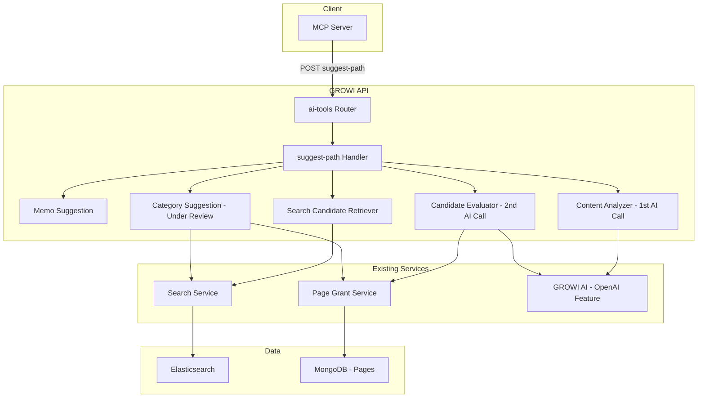
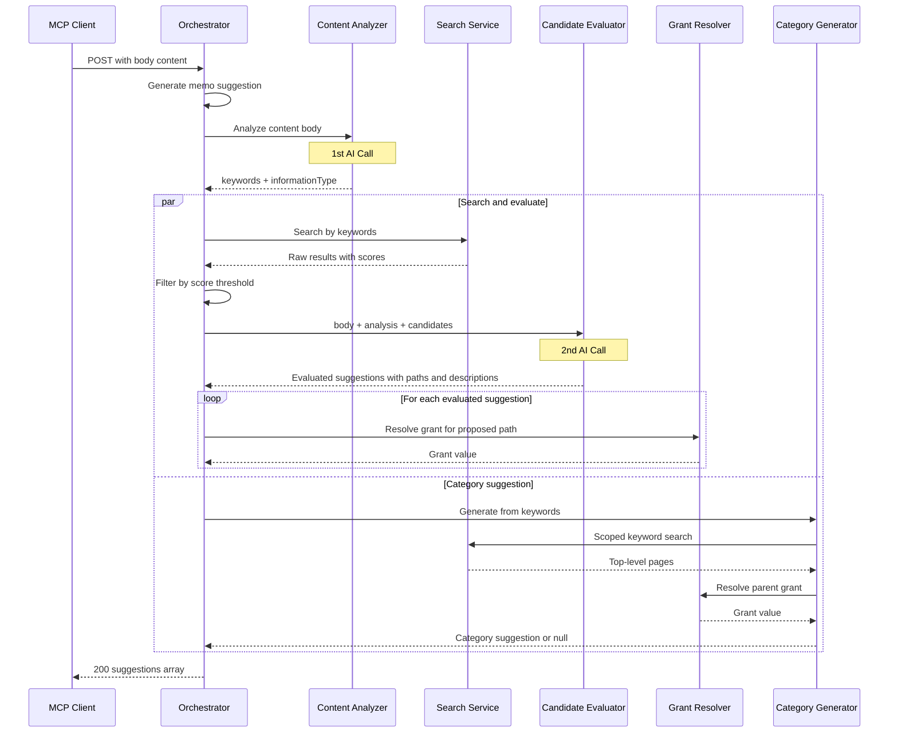

# Design Document

## Overview

**Purpose**: AI-powered path suggestion API that helps AI clients (e.g., Claude via MCP) determine optimal save locations for page content in GROWI. The system analyzes content, searches for related pages, evaluates candidates, and returns directory path suggestions with metadata.

**Users**: AI clients (Claude via MCP) call this endpoint on behalf of GROWI users during the "save to GROWI" workflow.

### Goals

- Single POST endpoint returning path suggestions with metadata (type, path, label, description, grant)
- Memo path: guaranteed fallback with fixed metadata
- Search-based suggestions: AI-powered with flow/stock classification, multi-candidate evaluation, and intelligent path proposals (including new paths)
- Independent access control via separate `ai-tools` namespace from `/page`

### Design Principles

- **Client LLM independence**: Heavy reasoning (content analysis, candidate evaluation, path proposal, description generation) is centralized in GROWI AI on the server side. The API response includes structured data fields (`informationType`, `type`, `grant`) alongside natural language (`description`) so that even less capable LLM clients can make correct decisions.

### Non-Goals

- Page creation/saving (existing `POST /_api/v3/page` handles this)
- Page title suggestion (Claude handles this via user dialogue)
- Client-side "enter manually" option (Agent Skill responsibility)

## Architecture

### Boundary Map


```mermaid
graph TB
    subgraph Client
        MCP[MCP Server]
    end

    subgraph GROWI_API[GROWI API]
        Router[ai-tools Router]
        Handler[suggest-path Handler]
        MemoGen[Memo Suggestion]
        Analyzer[Content Analyzer - 1st AI Call]
        Retriever[Search Candidate Retriever]
        Evaluator[Candidate Evaluator - 2nd AI Call]
        CategoryGen[Category Suggestion - Under Review]
    end

    subgraph Existing[Existing Services]
        SearchSvc[Search Service]
        GrantSvc[Page Grant Service]
        AIFeature[GROWI AI - OpenAI Feature]
    end

    subgraph Data
        ES[Elasticsearch]
        Mongo[MongoDB - Pages]
    end

    MCP -->|POST suggest-path| Router
    Router --> Handler
    Handler --> MemoGen
    Handler --> Analyzer
    Analyzer --> AIFeature
    Handler --> Retriever
    Retriever --> SearchSvc
    Handler --> Evaluator
    Evaluator --> AIFeature
    Handler --> CategoryGen
    CategoryGen --> SearchSvc
    SearchSvc --> ES
    Evaluator --> GrantSvc
    CategoryGen --> GrantSvc
    GrantSvc --> Mongo
```

**Integration notes**:

- Layered handler following existing GROWI route conventions
- Domain boundaries: Route layer owns the endpoint, delegates to existing services (search, grant, AI) without modifying them
- Existing patterns preserved: Handler factory pattern, middleware chain, `res.apiv3()` response format

### Code Organization

All suggest-path code resides in `features/ai-tools/suggest-path/` following the project's feature-based architecture pattern.

```text
apps/app/src/features/ai-tools/
├── server/routes/apiv3/
│   └── index.ts                              # Aggregation router for ai-tools namespace
└── suggest-path/
    ├── interfaces/
    │   └── suggest-path-types.ts              # Shared types (PathSuggestion, ContentAnalysis, etc.)
    └── server/
        ├── routes/apiv3/
        │   ├── index.ts                       # Route factory, handler + middleware chain
        │   └── index.spec.ts
        ├── services/
        │   ├── generate-suggestions.ts        # Orchestrator
        │   ├── generate-memo-suggestion.ts
        │   ├── analyze-content.ts             # AI call #1: keyword extraction + flow/stock
        │   ├── retrieve-search-candidates.ts  # ES search with score filtering
        │   ├── evaluate-candidates.ts         # AI call #2: candidate evaluation + path proposal
        │   ├── call-llm-for-json.ts           # Shared LLM call utility
        │   ├── generate-category-suggestion.ts # Under review
        │   ├── resolve-parent-grant.ts
        │   └── *.spec.ts                      # Co-located tests
        └── integration-tests/
            └── suggest-path-integration.spec.ts
```

**Key decisions**:

- **No barrel export**: Consumers import directly from subpaths (following `features/openai/` convention)
- **Aggregation router retained**: The `ai-tools` router at `features/ai-tools/server/routes/apiv3/` imports the suggest-path route factory. This allows future ai-tools features to register under the same namespace
- **R4 (CategorySuggestionGenerator)**: Under review — may be merged into AI evaluation approach post-discussion

### Implementation Paradigm

All components are pure functions with immutable data. No classes — no component currently meets class adoption criteria (shared dependency management or singleton state).

### Request Flow


```mermaid
sequenceDiagram
    participant Client as MCP Client
    participant Handler as Orchestrator
    participant AI1 as Content Analyzer
    participant Search as Search Service
    participant AI2 as Candidate Evaluator
    participant Grant as Grant Resolver
    participant CatGen as Category Generator

    Client->>Handler: POST with body content
    Handler->>Handler: Generate memo suggestion

    Handler->>AI1: Analyze content body
    Note over AI1: 1st AI Call
    AI1-->>Handler: keywords + informationType

    par Search and evaluate
        Handler->>Search: Search by keywords
        Search-->>Handler: Raw results with scores
        Handler->>Handler: Filter by score threshold
        Handler->>AI2: body + analysis + candidates
        Note over AI2: 2nd AI Call
        AI2-->>Handler: Evaluated suggestions with paths and descriptions
        loop For each evaluated suggestion
            Handler->>Grant: Resolve grant for proposed path
            Grant-->>Handler: Grant value
        end
    and Category suggestion
        Handler->>CatGen: Generate from keywords
        CatGen->>Search: Scoped keyword search
        Search-->>CatGen: Top-level pages
        CatGen->>Grant: Resolve parent grant
        Grant-->>CatGen: Grant value
        CatGen-->>Handler: Category suggestion or null
    end

    Handler-->>Client: 200 suggestions array
```

**Key decisions**:

- Content analysis and candidate evaluation are structurally sequential — Elasticsearch sits between them
- Search-evaluate flow and category generation run in parallel
- If content analysis fails → memo-only response
- If candidate evaluation fails → memo + category (if available)
- Category generator runs independently (under review)

## Component Interfaces

### Orchestrator

```typescript
function generateSuggestions(
  user: IUserHasId,
  body: string,
  userGroups: ObjectIdLike[],
  searchService: SearchService,
): Promise<PathSuggestion[]>;
```

- **No DI pattern**: Imports service functions directly; only `searchService` is passed as a parameter (the sole external dependency that cannot be statically imported)
- **Invariant**: Returns array with at least one suggestion (memo type), regardless of failures
- **informationType mapping**: Attaches `ContentAnalysis.informationType` to each search-type suggestion (Req 13.1)

### Content Analyzer (1st AI Call)

```typescript
type ContentAnalysis = {
  keywords: string[];            // 1-5 keywords, proper nouns prioritized
  informationType: 'flow' | 'stock';
};

function analyzeContent(body: string): Promise<ContentAnalysis>;
```

### Search Candidate Retriever

```typescript
type SearchCandidate = {
  pagePath: string;
  snippet: string;
  score: number;
};

function retrieveSearchCandidates(
  keywords: string[],
  user: IUserHasId,
  userGroups: ObjectIdLike[],
  searchService: SearchService,
): Promise<SearchCandidate[]>;
```

- `searchService` is a direct positional argument (not wrapped in an options object)
- Score threshold is a module-level constant (`SCORE_THRESHOLD = 5.0`)
- Filters by ES score threshold; returns empty array if no results pass

### Candidate Evaluator (2nd AI Call)

```typescript
type EvaluatedSuggestion = {
  path: string;        // Proposed directory path with trailing /
  label: string;
  description: string; // AI-generated rationale
};

function evaluateCandidates(
  body: string,
  analysis: ContentAnalysis,
  candidates: SearchCandidate[],
): Promise<EvaluatedSuggestion[]>;
```

- Proposes paths using 3 structural patterns: (a) parent directory, (b) subdirectory, (c) sibling (may generate new paths at same hierarchy level)
- Flow/stock alignment is a ranking factor, not a hard filter
- Grant resolution performed by orchestrator after this returns

### Category Suggestion Generator

```typescript
function generateCategorySuggestion(
  candidates: SearchCandidate[],
): Promise<PathSuggestion | null>;
```

- Under review — may be merged into AI evaluation approach post-discussion
- Returns `null` when no matching top-level pages are found

### Grant Resolver

```typescript
function resolveParentGrant(dirPath: string): Promise<number>;
```

- Traverses upward through ancestors for new paths (sibling pattern)
- Returns `GRANT_OWNER` (4) as safe default if no ancestor found

## Data Contracts

### API Contract

| Method | Endpoint | Request | Response | Errors |
|--------|----------|---------|----------|--------|
| POST | `/_api/v3/ai-tools/suggest-path` | `SuggestPathRequest` | `SuggestPathResponse` | 400, 401, 403, 500 |

### Request / Response Types

```typescript
// Request
interface SuggestPathRequest {
  body: string; // Page content for analysis (required, non-empty)
}

// Response
type SuggestionType = 'memo' | 'search' | 'category';
type InformationType = 'flow' | 'stock';

interface PathSuggestion {
  type: SuggestionType;
  path: string;                        // Directory path with trailing '/'
  label: string;
  description: string;                 // Fixed for memo, AI-generated for search
  grant: number;                       // Parent page grant (PageGrant value)
  informationType?: InformationType;   // Search-based only
}

interface SuggestPathResponse {
  suggestions: PathSuggestion[];       // Always ≥1 element (memo)
}
```

**Invariants**: `path` ends with `/`, `grant` is a valid PageGrant value (1, 2, 4, or 5)

### Response Example

```json
{
  "suggestions": [
    {
      "type": "memo",
      "path": "/user/alice/memo/",
      "label": "Save as memo",
      "description": "Save to your personal memo area",
      "grant": 4
    },
    {
      "type": "search",
      "path": "/tech-notes/React/state-management/",
      "label": "Save near related pages",
      "description": "This area contains pages about React state management. Your stock content fits well alongside this existing reference material.",
      "grant": 1,
      "informationType": "stock"
    },
    {
      "type": "category",
      "path": "/tech-notes/",
      "label": "Save under category",
      "description": "Top-level category: tech-notes",
      "grant": 1
    }
  ]
}
```

## Error Handling & Graceful Degradation

### User Errors (4xx)

| Error | Status | Requirement |
|-------|--------|-------------|
| Missing or empty `body` | 400 | 9.1 |
| No authentication | 401 | 8.2 |
| AI service not enabled | 403 | 1.4 |

### Graceful Degradation (returns 200)

| Failure | Fallback |
|---------|----------|
| Content analysis (1st AI call) | Memo only (skips entire search pipeline) |
| Search service | Memo + category (if available) |
| Candidate evaluation (2nd AI call) | Memo + category (if available) |
| Category generation | Memo + search-based (if available) |

Each component fails independently. Memo is always generated first as guaranteed fallback.

## Security Considerations

- **Authentication**: All requests require valid API token or login session (standard middleware)
- **Authorization**: Search results are permission-scoped via `searchKeyword()` user/group parameters
- **Input safety**: Content body is passed to GROWI AI, not directly to Elasticsearch — no NoSQL injection risk
- **AI prompt injection**: System prompt and user content are separated to minimize prompt injection risk
- **Information leakage**: Error responses use generic messages (Req 9.2)

## Performance Considerations

- Content analysis and candidate evaluation are sequential (ES sits between) — 2 AI roundtrips minimum
- Search-evaluate pipeline and category generation run in parallel to minimize total latency
- ES snippets (not full page bodies) are passed to AI to manage context budget
- Score threshold filtering reduces the number of candidates passed to the 2nd AI call
