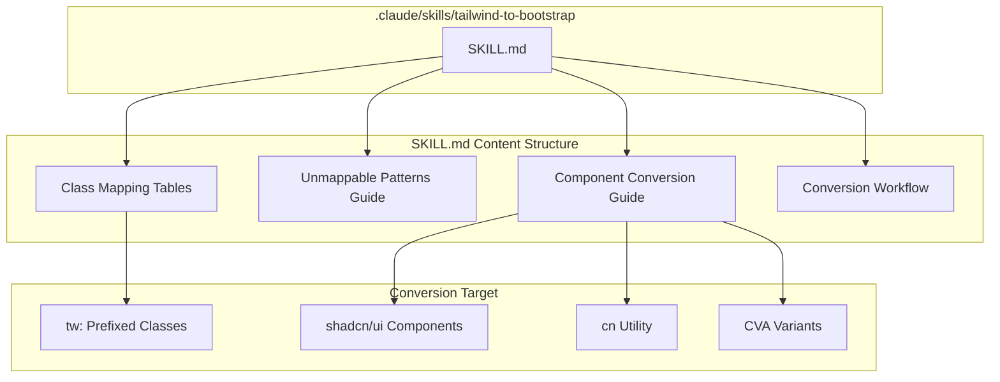

# Design Document

## Overview

**Purpose**: Tailwind (`tw:` プレフィックス付き) ユーティリティクラスを Bootstrap 5 の等価クラスに変換するためのリファレンス Skill を提供する。AI エージェントがコード変換作業を行う際の知識ベースとして機能する。

**Users**: Claude Code の AI エージェントおよび GROWI 開発者が、Tailwind から Bootstrap へのマイグレーション作業時に参照する。

**Impact**: `apps/app/src/components/ui/` 配下の 12 個の shadcn/ui コンポーネントおよび `tw:` プレフィックス付きクラスを使用する全ファイルの変換を支援する。

### Goals
- Tailwind ユーティリティクラスと Bootstrap 5 クラスの包括的なマッピングリファレンスを提供する
- Bootstrap に直接対応しないパターンに対する代替実装ガイダンスを提供する
- shadcn/ui コンポーネントの Bootstrap ベース変換パターンを示す
- 既存の Claude Skills フォーマットに準拠した SKILL.md を作成する
- 体系的な変換ワークフロー手順を提供する

### Non-Goals
- Tailwind や shadcn/ui の自動削除ツールの作成
- Bootstrap コンポーネントライブラリの新規構築
- Radix UI プリミティブの置換（スタイリングのみ変換）
- `packages/` 配下の共有パッケージへの変更

## Architecture

### Existing Architecture Analysis

現在の Claude Skills アーキテクチャ:
- `.claude/skills/{skill-name}/SKILL.md` にスキルファイルを配置
- YAML フロントマター（`name`, `description`, `user-invocable`）で識別
- Markdown 形式でコード例・テーブル・ガイダンスを記述
- `settings.json` による自動検出（明示的な登録不要）

GROWI のスタイリングアーキテクチャ:
- Bootstrap 5.3.8 が主要 CSS フレームワーク（`apps/app/package.json` の `dependencies`）
- Tailwind CSS v4.1.14 が `tw:` プレフィックスで部分導入（`apps/app` のみ）
- shadcn/ui の 12 コンポーネントが `apps/app/src/components/ui/` に存在
- CSS 読み込み順: vendor.css → style-app.scss (Bootstrap) → tailwind.css (Tailwind)

### Architecture Pattern & Boundary Map



**Architecture Integration**:
- Selected pattern: 単一 SKILL.md ファイル（既存スキルパターンに準拠）
- Domain boundary: スタイリング変換のリファレンスのみ。コード自動変換ロジックは含まない
- Existing patterns preserved: YAML フロントマター、Markdown セクション構造、テーブル形式
- New components rationale: 新規ディレクトリ `tailwind-to-bootstrap/` のみ追加
- Steering compliance: 既存ディレクトリ構造と慣例に完全準拠

### Technology Stack

| Layer | Choice / Version | Role in Feature | Notes |
|-------|------------------|-----------------|-------|
| Documentation | Markdown (SKILL.md) | スキルコンテンツ記述 | YAML フロントマター付き |
| Target CSS Framework | Bootstrap 5.3.8 | 変換先クラスの基盤 | `apps/app` で使用中 |
| Source CSS Framework | Tailwind CSS v4.1.14 | 変換元クラスの基盤 | `tw:` プレフィックス |
| UI Components | shadcn/ui (New York style) | 変換対象コンポーネント | Radix UI ベース |

## Requirements Traceability

| Requirement | Summary | Components | Interfaces |
|-------------|---------|------------|------------|
| 1.1-1.7 | クラスマッピングリファレンス | ClassMappingSection | テーブル形式のマッピング定義 |
| 2.1-2.4 | 変換不可能クラスのガイダンス | UnmappableSection | カスタム CSS 代替パターン定義 |
| 3.1-3.5 | shadcn/ui コンポーネント変換ガイド | ComponentConversionSection | コンポーネント別変換パターン定義 |
| 4.1-4.5 | Skill フォーマットと構成 | SKILL.md ファイル全体 | YAML フロントマター + Markdown 構造 |
| 5.1-5.5 | 変換ワークフロー手順 | WorkflowSection | ステップバイステップ手順定義 |

## Components and Interfaces

| Component | Domain/Layer | Intent | Req Coverage | Key Dependencies | Contracts |
|-----------|--------------|--------|--------------|------------------|-----------|
| SKILL.md File | Documentation | Tailwind→Bootstrap 変換リファレンス全体 | 1-5 全要件 | 既存 Skills 構造 (P0) | なし（静的ドキュメント） |
| ClassMappingSection | Documentation/Section | ユーティリティクラスの対応表 | 1.1-1.7 | Bootstrap 5.3 API (P0) | なし |
| UnmappableSection | Documentation/Section | 変換不可能パターンのガイダンス | 2.1-2.4 | shadcn/ui CSS Variables (P1) | なし |
| ComponentConversionSection | Documentation/Section | shadcn/ui コンポーネント変換方針 | 3.1-3.5 | Radix UI (P1), CVA (P1) | なし |
| WorkflowSection | Documentation/Section | 変換手順のガイド | 5.1-5.5 | grep/検索ツール (P2) | なし |

### Documentation Layer

本機能の成果物は静的な Markdown ドキュメント（SKILL.md）であるため、従来のサービスインターフェースや API コントラクトは不要。以下にドキュメント構造の設計を記載する。

#### SKILL.md File Structure

| Field | Detail |
|-------|--------|
| Intent | Tailwind→Bootstrap 変換の包括的リファレンスを AI エージェントに提供する |
| Requirements | 1.1-1.7, 2.1-2.4, 3.1-3.5, 4.1-4.5, 5.1-5.5 |

**Responsibilities & Constraints**
- Tailwind ユーティリティクラス → Bootstrap 5 クラスのマッピング提供
- Bootstrap に等価がないパターンの代替実装ガイダンス提供
- shadcn/ui コンポーネント単位の変換方針提供
- 変換ワークフロー手順の提供
- 制約: 500 行以内を目標（既存スキルの最大長を参考）

**Dependencies**
- Inbound: Claude Code Skills 自動検出機構 — SKILL.md の読み込み (P0)
- External: Bootstrap 5.3 ドキュメント — マッピング正確性の担保 (P0)
- External: Tailwind CSS v4 ドキュメント — 変換元クラスの仕様確認 (P0)

##### SKILL.md セクション設計

```markdown
---
name: tailwind-to-bootstrap
description: Tailwind CSS (tw: prefix) to Bootstrap 5 class conversion reference. Use when converting shadcn/ui components or tw:-prefixed styles to Bootstrap.
---

# Tailwind to Bootstrap Conversion Guide

## Quick Reference — Class Mapping Tables
### Layout & Display
### Spacing
### Typography
### Sizing
### Colors & Backgrounds
### Borders & Radius
### Responsive Breakpoints

## Unmappable Patterns
### Patterns Without Bootstrap Equivalent
### Custom CSS Alternatives
### CSS Variable Migration (shadcn/ui → Bootstrap)
### Animation Alternatives

## shadcn/ui Component Conversion
### Conversion Strategy Overview
### Per-Component Conversion Guide
### CVA → Bootstrap Variant Conversion
### cn() Utility Replacement
### Radix UI + Bootstrap Approach
### Dark Mode Migration

## Conversion Workflow
### Step-by-Step Procedure
### Finding tw: Classes
### Dependency Cleanup
### Conversion Order for Dependent Components
```

**Implementation Notes**
- YAML フロントマター: `user-invocable` は省略（デフォルト true、手動呼び出し前提）
- テーブル形式: 3 列（Tailwind, Bootstrap, Notes）を基本構造とする
- コード例: Before/After を並置（変換前は `tw:` 付き、変換後は Bootstrap クラス）
- GROWI 固有コンテキスト: `tw:` プレフィックスの説明、`apps/app` へのスコープ、既存 Bootstrap テーマとの整合性を冒頭で記載

#### ClassMappingSection — マッピングテーブル設計

| Field | Detail |
|-------|--------|
| Intent | カテゴリ別の Tailwind→Bootstrap クラスマッピングを提供する |
| Requirements | 1.1-1.7 |

各カテゴリのテーブル構造:

```markdown
| Tailwind | Bootstrap | Notes |
|----------|-----------|-------|
| tw:flex | d-flex | |
| tw:hidden | d-none | |
| tw:grid | d-grid | |
```

**カテゴリと主要マッピング**:

1. **Layout & Display** (1.1): `tw:flex`→`d-flex`, `tw:grid`→`d-grid`, `tw:block`→`d-block`, `tw:hidden`→`d-none`, `tw:inline-flex`→`d-inline-flex`
2. **Flexbox Alignment** (1.1): `tw:items-center`→`align-items-center`, `tw:justify-between`→`justify-content-between`, `tw:flex-col`→`flex-column`
3. **Spacing** (1.2): `tw:p-{n}`→`p-{n}`, `tw:m-{n}`→`m-{n}`, `tw:gap-{n}`→`gap-{n}`（スケール差異の注意を Notes に記載）
4. **Typography** (1.3): `tw:text-sm`→`small`/`fs-6`, `tw:font-semibold`→`fw-semibold`, `tw:text-center`→`text-center`
5. **Sizing** (1.4): `tw:w-full`→`w-100`, `tw:h-auto`→`h-auto`（Bootstrap には限定的なサイズユーティリティのみ、カスタム CSS 推奨を Notes に記載）
6. **Colors** (1.5): `tw:bg-primary`→`bg-primary`（セマンティック名の差異注意: shadcn の primary はダークグレー、Bootstrap は青）、`tw:text-muted-foreground`→`text-muted`
7. **Borders** (1.6): `tw:border`→`border`, `tw:rounded-md`→`rounded`, `tw:rounded-full`→`rounded-circle`
8. **Responsive** (1.7): `tw:sm:`→`-sm-`, `tw:md:`→`-md-`, `tw:lg:`→`-lg-`（プレフィックス位置の違いを説明）

#### UnmappableSection — 変換不可能パターン設計

| Field | Detail |
|-------|--------|
| Intent | Bootstrap に等価がないパターンの代替実装を提供する |
| Requirements | 2.1-2.4 |

**変換不可能パターン一覧** (2.1):

| Pattern Category | Examples | Recommended Alternative |
|-----------------|----------|----------------------|
| Ring ユーティリティ | `tw:ring-*`, `tw:ring-ring/50` | `box-shadow` によるカスタム CSS |
| `:has()` セレクタ | `tw:has-[>svg]`, `tw:group-has-*` | カスタム CSS セレクタまたは JS による条件付きクラス |
| `data-[state=*]` | `tw:data-[state=open]:*` | カスタム CSS 属性セレクタ |
| Arbitrary values | `tw:[calc(...)]` | インライン `style` またはカスタム CSS |
| Named groups | `tw:group/input-group` | カスタム CSS セレクタ |

**CSS 変数移行指針** (2.3):

| shadcn/ui Variable | Bootstrap Variable | Notes |
|--------------------|--------------------|-------|
| `--primary` | `--bs-secondary` | shadcn primary はダークグレー系 |
| `--destructive` | `--bs-danger` | 近似色 |
| `--background` | `--bs-body-bg` | |
| `--foreground` | `--bs-body-color` | |
| `--muted` | `--bs-light` | |
| `--border` | `--bs-border-color` | |

**アニメーション代替** (2.4):

| shadcn/ui Animation | Bootstrap/CSS Alternative |
|---------------------|--------------------------|
| `tw:animate-in` / `tw:animate-out` | CSS `@keyframes` + `animation` プロパティ |
| `tw:fade-in-0` / `tw:fade-out-0` | Bootstrap `.fade` + `.show` |
| `tw:zoom-in-95` / `tw:zoom-out-95` | カスタム `@keyframes` (`transform: scale()`) |
| `tw:slide-in-from-*` | カスタム `@keyframes` (`transform: translate()`) |

#### ComponentConversionSection — コンポーネント変換設計

| Field | Detail |
|-------|--------|
| Intent | shadcn/ui コンポーネントの Bootstrap ベース変換パターンを提供する |
| Requirements | 3.1-3.5 |

**変換方針テーブル** (3.1):

| Component | Bootstrap Equivalent | Radix UI Maintained | Complexity |
|-----------|---------------------|---------------------|------------|
| button | `.btn` + バリアントクラス | No（Bootstrap ネイティブ） | Low |
| input | `.form-control` | No | Low |
| textarea | `.form-control` | No | Low |
| dialog | `.modal` | Yes（Portal 管理） | Medium |
| dropdown-menu | `.dropdown-menu` | Yes（状態管理） | High |
| select | `.form-select` | Yes（アクセシビリティ） | High |
| tooltip | Bootstrap Tooltip JS | Optional | Medium |
| avatar | カスタム CSS | N/A | Low |
| collapsible | `.collapse` | Yes（アニメーション） | Medium |
| command | カスタム実装 | Yes（検索/キーボード操作） | High |
| hover-card | Bootstrap Popover | Optional | Medium |
| input-group | `.input-group` | No | Medium |

**CVA → Bootstrap バリアント変換** (3.2):

```typescript
// Before: CVA with Tailwind
const buttonVariants = cva('tw:inline-flex tw:items-center ...', {
  variants: {
    variant: {
      default: 'tw:bg-primary tw:text-primary-foreground',
      destructive: 'tw:bg-destructive tw:text-white',
    },
  },
});

// After: Bootstrap class mapping
const variantClassMap = {
  default: 'btn btn-dark',
  destructive: 'btn btn-danger',
  outline: 'btn btn-outline-dark',
  secondary: 'btn btn-secondary',
  ghost: 'btn btn-link text-decoration-none',
  link: 'btn btn-link',
} as const;
```

**cn() 代替パターン** (3.3):

```typescript
// Before: cn() with tailwind-merge
import { cn } from '~/utils/shadcn-ui';
<div className={cn('tw:flex tw:gap-2', className)} />

// After: clsx only (tailwind-merge 不要)
import clsx from 'clsx';
<div className={clsx('d-flex gap-2', className)} />
```

**Radix UI 維持アプローチ** (3.4):
- Radix UI プリミティブは headless（スタイルなし）のため、スタイリングレイヤーのみ Bootstrap に置換可能
- `className` プロップを Tailwind クラスから Bootstrap クラスに変更
- `data-[state=*]` に依存するスタイルはカスタム CSS で対応

**ダークモード対応** (3.5):
- Bootstrap 5.3 の `data-bs-theme="dark"` 属性を活用
- shadcn/ui の `.dark` クラスセレクタから Bootstrap の `[data-bs-theme=dark]` セレクタに移行
- カスタムプロパティは Bootstrap の dark mode 変数にマッピング

#### WorkflowSection — 変換ワークフロー設計

| Field | Detail |
|-------|--------|
| Intent | 体系的な変換手順を AI エージェントに提供する |
| Requirements | 5.1-5.5 |

**変換手順** (5.1):

```
1. tw: クラスの検索・特定
2. マッピングテーブル参照
3. 変換不可能パターンの確認
4. Bootstrap クラスへの置換
5. cn() / CVA の置換（該当する場合）
6. ビルド・lint 検証
```

**検索パターン** (5.2):

```bash
# tw: プレフィックス付きクラスの検索
grep -r "tw:" apps/app/src/ --include="*.tsx" --include="*.ts"

# cn() 使用箇所の検索
grep -r "cn(" apps/app/src/ --include="*.tsx" --include="*.ts"

# shadcn/ui コンポーネントのインポート
grep -r "from '~/components/ui/" apps/app/src/ --include="*.tsx"
```

**依存パッケージ除去手順** (5.4):

```bash
# 全ファイルの変換完了後に実行
# 1. Tailwind 関連パッケージの削除
pnpm remove tailwindcss @tailwindcss/postcss tailwind-merge tw-animate-css --filter @growi/app

# 2. CVA の削除（全コンポーネントで代替済みの場合）
pnpm remove class-variance-authority --filter @growi/app

# 3. 設定ファイルの削除
#    - apps/app/postcss.config.js
#    - apps/app/src/styles/tailwind.css
#    - apps/app/components.json

# 4. ユーティリティの削除
#    - apps/app/src/utils/shadcn-ui.ts
```

**変換順序の指針** (5.5):

```
1. 基盤ユーティリティ: cn() の代替実装
2. リーフコンポーネント: input, textarea, avatar（依存なし）
3. 中間コンポーネント: button, collapsible, hover-card
4. 複合コンポーネント: dialog, dropdown-menu, select, tooltip
5. 高複雑度コンポーネント: command, input-group
6. 消費側コンポーネント: shadcn/ui をインポートしている各 feature コンポーネント
7. クリーンアップ: パッケージ依存・設定ファイルの除去
```

## Testing Strategy

本機能はドキュメント（SKILL.md）の作成であり、従来のコードテストは適用外。代わりに以下の検証を行う:

### Content Validation
- マッピングテーブルの全エントリが Bootstrap 5.3 ドキュメントと整合していること
- コード例（Before/After）が構文的に正しいこと
- YAML フロントマターが既存スキルのフォーマットに準拠していること

### Integration Validation
- SKILL.md が Claude Code によって正常に認識・読み込みされること
- ファイルパスが `.claude/skills/tailwind-to-bootstrap/SKILL.md` に配置されていること

### Practical Validation
- 実際の shadcn/ui コンポーネント（例: `button.tsx`）に対してマッピングを適用し、変換結果が機能すること
- 変換後のコンポーネントが `turbo run lint --filter @growi/app` を通過すること
