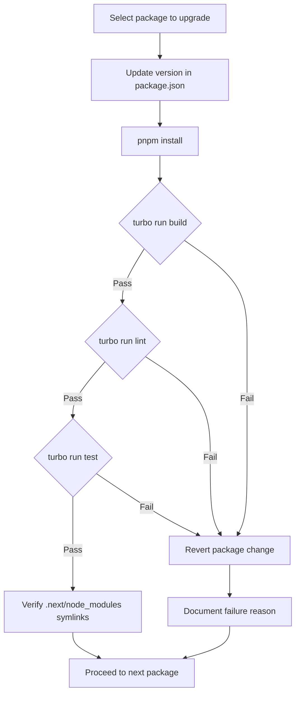
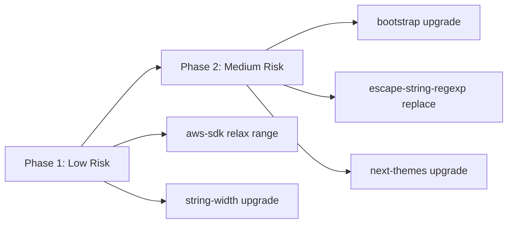

# Design Document: upgrade-fixed-packages

## Overview

**Purpose**: This feature audits and upgrades version-pinned packages in `apps/app/package.json` that were frozen due to upstream bugs, ESM-only migrations, or licensing constraints. The build environment has shifted from webpack to Turbopack, and the runtime now targets Node.js 24 with stable `require(esm)` support, invalidating several original pinning reasons.

**Users**: Maintainers and developers benefit from up-to-date dependencies with bug fixes, security patches, and reduced technical debt.

**Impact**: Modifies `apps/app/package.json` dependency versions and comment blocks; touches source files where `escape-string-regexp` is replaced by native `RegExp.escape()`.

### Goals
- Verify each pinning reason against current upstream status
- Upgrade packages where the original constraint no longer applies
- Replace `escape-string-regexp` with native `RegExp.escape()` (Node.js 24)
- Update or remove comment blocks to reflect current state
- Produce audit documentation for future reference

### Non-Goals
- Replacing handsontable with an alternative library (license constraint remains; replacement is a separate initiative)
- Upgrading `@keycloak/keycloak-admin-client` to v19+ (significant API breaking changes; deferred to separate task)
- Major version upgrades of unrelated packages
- Modifying the build pipeline or Turbopack configuration

## Architecture

This is a dependency maintenance task, not a feature implementation. No new components or architectural changes are introduced.

### Existing Architecture Analysis

The pinned packages fall into distinct categories by their usage context:

| Category | Packages | Build Context |
|----------|----------|---------------|
| Server-only (tsc → CJS) | `escape-string-regexp`, `@aws-sdk/*`, `@keycloak/*` | Express server compiled by tsc |
| Client-only (Turbopack) | `string-width` (via @growi/editor), `bootstrap` | Bundled by Turbopack/Vite |
| Client + SSR | `next-themes` | Turbopack + SSR rendering |
| License-pinned | `handsontable`, `@handsontable/react` | Client-only |

Key enabler: Node.js ^24 provides stable `require(esm)` support, removing the fundamental CJS/ESM incompatibility that caused several pins.

### Technology Stack

| Layer | Choice / Version | Role in Feature | Notes |
|-------|------------------|-----------------|-------|
| Runtime | Node.js ^24 | Enables `require(esm)` and `RegExp.escape()` | ES2026 Stage 4 features available |
| Build (client) | Turbopack (Next.js 16) | Bundles ESM-only packages without issues | No changes needed |
| Build (server) | tsc (CommonJS output) | `require(esm)` handles ESM-only imports | Node.js 24 native support |
| Package manager | pnpm v10 | Manages dependency resolution | No changes needed |

## System Flows

### Upgrade Verification Flow



Each package is upgraded and verified independently. Failures are isolated and reverted without affecting other upgrades.

## Requirements Traceability

| Requirement | Summary | Components | Action |
|-------------|---------|------------|--------|
| 1.1 | Bootstrap bug investigation | PackageAudit | Verify #39798 fixed in v5.3.4 |
| 1.2 | next-themes issue investigation | PackageAudit | Verify #122 resolved; check v0.4.x compatibility |
| 1.3 | @aws-sdk constraint verification | PackageAudit | Confirm mongodb constraint is on different package |
| 1.4 | Document investigation results | AuditReport | Summary table in research.md |
| 2.1 | ESM compatibility per package | PackageAudit | Assess escape-string-regexp, string-width, @keycloak |
| 2.2 | Server build ESM support | PackageAudit | Verify Node.js 24 require(esm) for server context |
| 2.3 | Client build ESM support | PackageAudit | Confirm Turbopack handles ESM-only packages |
| 2.4 | Compatibility matrix | AuditReport | Table in research.md |
| 3.1 | Handsontable license check | PackageAudit | Confirm v7+ still non-MIT |
| 3.2 | Document pinning requirement | AuditReport | Note in audit summary |
| 4.1 | Update package.json versions and comments | UpgradeExecution | Modify versions and comment blocks |
| 4.2 | Build verification | UpgradeExecution | `turbo run build --filter @growi/app` |
| 4.3 | Lint verification | UpgradeExecution | `turbo run lint --filter @growi/app` |
| 4.4 | Test verification | UpgradeExecution | `turbo run test --filter @growi/app` |
| 4.5 | Revert on failure | UpgradeExecution | Git revert per package |
| 4.6 | Update comment blocks | UpgradeExecution | Remove or update comments |
| 5.1 | Audit summary table | AuditReport | Final summary with decisions |
| 5.2 | Document continued pinning | AuditReport | Reasons for remaining pins |
| 5.3 | Document upgrade rationale | AuditReport | What changed upstream |

## Components and Interfaces

| Component | Domain | Intent | Req Coverage | Key Dependencies |
|-----------|--------|--------|--------------|------------------|
| PackageAudit | Investigation | Research upstream status for each pinned package | 1.1–1.4, 2.1–2.4, 3.1–3.2 | GitHub issues, npm registry |
| UpgradeExecution | Implementation | Apply version changes and verify build | 4.1–4.6 | pnpm, turbo, tsc |
| SourceMigration | Implementation | Replace escape-string-regexp with RegExp.escape() | 4.1 | 9 source files |
| AuditReport | Documentation | Produce summary of all decisions | 5.1–5.3 | research.md |

### Investigation Layer

#### PackageAudit

| Field | Detail |
|-------|--------|
| Intent | Investigate upstream status of each pinned package and determine upgrade feasibility |
| Requirements | 1.1, 1.2, 1.3, 1.4, 2.1, 2.2, 2.3, 2.4, 3.1, 3.2 |

**Responsibilities & Constraints**
- Check upstream issue trackers for bug fix status
- Verify ESM compatibility against Node.js 24 `require(esm)` and Turbopack
- Confirm license status for handsontable
- Produce actionable recommendation per package

**Audit Decision Matrix**

| Package | Current | Action | Target | Risk | Rationale |
|---------|---------|--------|--------|------|-----------|
| `bootstrap` | `=5.3.2` | Upgrade | `^5.3.4` | Low | Bug #39798 fixed in v5.3.4 |
| `next-themes` | `^0.2.1` | Upgrade | `^0.4.4` | Medium | Original issue was misattributed; v0.4.x works with Pages Router |
| `escape-string-regexp` | `^4.0.0` | Replace | Remove dep | Low | Native `RegExp.escape()` in Node.js 24 |
| `string-width` | `=4.2.2` | Upgrade | `^7.0.0` | Low | Used only in ESM context (@growi/editor) |
| `@aws-sdk/client-s3` | `3.454.0` | Relax | `^3.454.0` | Low | Pinning comment was misleading |
| `@aws-sdk/s3-request-presigner` | `3.454.0` | Relax | `^3.454.0` | Low | Same as above |
| `@keycloak/keycloak-admin-client` | `^18.0.0` | Defer | No change | N/A | API breaking changes; separate task |
| `handsontable` | `=6.2.2` | Keep | No change | N/A | License constraint (non-MIT since v7) |
| `@handsontable/react` | `=2.1.0` | Keep | No change | N/A | Requires handsontable >= 7 |

### Implementation Layer

#### UpgradeExecution

| Field | Detail |
|-------|--------|
| Intent | Apply version changes incrementally with build verification |
| Requirements | 4.1, 4.2, 4.3, 4.4, 4.5, 4.6 |

**Responsibilities & Constraints**
- Upgrade one package at a time to isolate failures
- Run full verification suite (build, lint, test) after each change
- Revert and document any package that causes failures
- Update `// comments for dependencies` block to reflect new state

**Upgrade Order** (lowest risk first):
1. `@aws-sdk/*` — relax version range (no code changes)
2. `string-width` — upgrade in @growi/editor (isolated ESM package)
3. `bootstrap` — upgrade to ^5.3.4 (verify SCSS compilation)
4. `escape-string-regexp` → `RegExp.escape()` — source code changes across 9 files
5. `next-themes` — upgrade to ^0.4.x (review API changes across 12 files)

**Implementation Notes**
- After each upgrade, verify `.next/node_modules/` symlinks for Turbopack externalisation compliance (per `package-dependencies` rule)
- For bootstrap: run `pnpm run pre:styles-commons` and `pnpm run pre:styles-components` to verify SCSS compilation
- For next-themes: review v0.3.0 and v0.4.0 changelogs for breaking API changes before modifying code

#### SourceMigration

| Field | Detail |
|-------|--------|
| Intent | Replace all `escape-string-regexp` usage with native `RegExp.escape()` |
| Requirements | 4.1 |

**Files to Modify**:

`apps/app/src/` (6 files):
- `server/models/page.ts`
- `server/service/page/index.ts`
- `server/service/page-grant.ts`
- `server/routes/apiv3/users.js`
- `server/models/obsolete-page.js`
- `features/openai/server/services/openai.ts`

`packages/` (3 files):
- `packages/core/src/utils/page-path-utils/` (2 files)
- `packages/remark-lsx/src/server/routes/list-pages/index.ts`

**Migration Pattern**:
```typescript
// Before
import escapeStringRegexp from 'escape-string-regexp';
const pattern = new RegExp(escapeStringRegexp(input));

// After
const pattern = new RegExp(RegExp.escape(input));
```

**Implementation Notes**
- Remove `escape-string-regexp` from `apps/app/package.json` dependencies after migration
- Remove from `packages/core/package.json` and `packages/remark-lsx/package.json` if listed
- Verify `RegExp.escape()` TypeScript types are available (may need `@types/node` update or lib config)

### Documentation Layer

#### AuditReport

| Field | Detail |
|-------|--------|
| Intent | Document all audit decisions for future maintainers |
| Requirements | 5.1, 5.2, 5.3 |

**Deliverables**:
- Updated `// comments for dependencies` in package.json (only retained pins with current reasons)
- Updated `// comments for defDependencies` (handsontable entries unchanged)
- Summary in research.md with final decision per package

**Updated Comment Blocks** (target state):

```json
{
  "// comments for dependencies": {
    "@keycloak/keycloak-admin-client": "19.0.0 or above exports only ESM. API breaking changes require separate migration effort.",
    "next-themes": "(if upgrade fails) Document specific failure reason here"
  },
  "// comments for defDependencies": {
    "@handsontable/react": "v3 requires handsontable >= 7.0.0.",
    "handsontable": "v7.0.0 or above is no longer MIT license."
  }
}
```

Note: The exact final state depends on which upgrades succeed. If all planned upgrades pass, only `@keycloak` and `handsontable` entries remain.

## Testing Strategy

### Build Verification (per package)
- `turbo run build --filter @growi/app` — Turbopack client build + tsc server build
- `ls apps/app/.next/node_modules/ | grep <package>` — Externalisation check
- `pnpm run pre:styles-commons` — SCSS compilation (bootstrap only)

### Lint Verification (per package)
- `turbo run lint --filter @growi/app` — TypeScript type check + Biome

### Unit/Integration Tests (per package)
- `turbo run test --filter @growi/app` — Full test suite
- For `RegExp.escape()` migration: run tests for page model, page service, page-grant service specifically

### Regression Verification (final)
- Full build + lint + test after all upgrades applied together
- Verify `.next/node_modules/` symlink integrity via `check-next-symlinks.sh` (if available locally)

## Migration Strategy



- **Phase 1** (low risk): @aws-sdk range relaxation, string-width upgrade — minimal code changes
- **Phase 2** (medium risk): bootstrap, escape-string-regexp replacement, next-themes — requires code review and/or source changes
- Each upgrade is independently revertible
- Deferred: @keycloak (high risk, separate task)
- No change: handsontable (license constraint)
