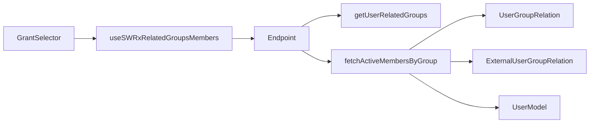
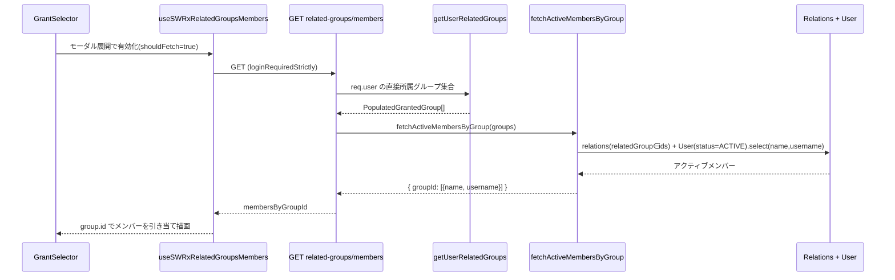

# Technical Design: user-group-member-visibility

対象要件: [requirements.md](./requirements.md) / 事前調査: [research.md](./research.md)

## Overview

**Purpose**: ページの公開範囲を「グループ限定」に設定する際の GrantSelector グループ選択 UI 上で、選択肢として並ぶ「自分が直接所属するグループ」それぞれのメンバー(氏名・ユーザー名)を表示する。これにより、どのグループに公開するかをメンバー構成を見て判断できるようにする。

**Users**: 一般ログインユーザー(管理者権限不要)。

**Impact**: 既存の GrantSelector(エディタの公開範囲選択モーダル)に、グループ名の下へメンバー一覧を追加表示する。既存の grant 判定フロー(`/api/v3/page/grant-data`)には手を入れず、メンバー情報は独立した新規エンドポイントから遅延取得する。

### Goals
- 自分が直接所属する UserGroup / ExternalUserGroup のメンバーを GrantSelector 上で確認できる
- 表示はアクティブユーザーの氏名・ユーザー名のみに限定し、それ以外の情報を露出しない
- 既存 grant 判定の責務・性能に影響を与えない(関心分離・遅延取得)

### Non-Goals
- FixPageGrantModal(grant 不整合修正モーダル, 既存 TODO あり)へのメンバー表示
- 未所属グループ(`nonUserRelatedGrantedGroups`)のメンバー表示
- 親・子孫グループのメンバー展開
- グループメンバーシップの編集、管理者向け機能、機能 ON/OFF 設定の追加

## Boundary Commitments

### This Spec Owns
- 新規 API `GET /api/v3/user/related-groups/members` とそのレスポンス契約
- サーバサービス関数 `fetchActiveMembersByGroup`(グループ集合 → グループ別アクティブメンバー)
- メンバー DTO 型(`IUserGroupMember` / `RelatedGroupsMembers`)
- GrantSelector の **userRelatedGroups** セクションにおけるメンバー一覧描画([GrantSelector.tsx:338](../../../apps/app/src/client/components/PageEditor/EditorNavbarBottom/GrantSelector.tsx) の TODO 箇所)と、メンバーが自分のみの場合の提示

### Out of Boundary
- FixPageGrantModal のメンバー表示 TODO([FixPageGrantModal.tsx:328](../../../apps/app/src/components/PageView/PageAlerts/FixPageGrantAlert/FixPageGrantModal.tsx)) — 変更しない
- GrantSelector の **nonUserRelatedGrantedGroups**(未所属の既付与グループ)セクション — メンバーを描画しない
- 既存 `/api/v3/page/grant-data` フロー(`getPageGroupGrantData`)の改変
- 管理者向けメンバー一覧 API(`/api/v3/user-groups/:id/users`)
- グループ所属関係の作成・更新・削除

### Allowed Dependencies
- `pageGrantService.getUserRelatedGroups(user)` — 直接所属グループ(両種別)の取得元(読み取りのみ)
- `UserGroupRelation` / `ExternalUserGroupRelation` モデルの所属関係クエリ
- `User` モデルと `UserStatus.STATUS_ACTIVE` 定数(active 絞り込み)
- 既存の認可ミドルウェア(`accessTokenParser` / `loginRequiredStrictly`)、SWR(`stores/user.tsx`)

### Revalidation Triggers
- `getUserRelatedGroups` の戻り値型(`PopulatedGrantedGroup`)の変更
- 所属関係モデルのメンバー取得ロジックの変更
- レスポンス DTO(`RelatedGroupsMembers`)の形状変更
- GrantSelector が表示するグループ一覧の供給元(`useSWRxCurrentGrantData`)の変更

## Architecture

### Existing Architecture Analysis
- GrantSelector は `useSWRxCurrentGrantData(pageId)` → `GET /api/v3/page/grant-data` → `getPageGroupGrantData` で `GroupGrantData`(`userRelatedGroups` / `nonUserRelatedGrantedGroups`)を取得し、グループ名のみ描画している。メンバー表示の TODO が [GrantSelector.tsx:338](../../../apps/app/src/client/components/PageEditor/EditorNavbarBottom/GrantSelector.tsx) に存在。
- 「自分の所属グループ」を返す既存 API `GET /api/v3/user/related-groups`([get-related-groups.ts](../../../apps/app/src/server/routes/apiv3/user/get-related-groups.ts))は `pageGrantService.getUserRelatedGroups(req.user)` を `loginRequiredStrictly` + `SCOPE.READ.USER_SETTINGS.INFO` で公開。本設計はこれと同じパターン・同じ認可で**兄弟エンドポイント**を追加する。
- `getUserRelatedGroups` は内部/外部の `findAllGroupsForUser` を直接所属ベースで結合して返す(再帰なし)。これを work-set の供給元とすることで「直接所属のみ(2.1)」「親子非展開(2.2)」を構造的に満たす。

### Architecture Pattern & Boundary Map



**Key Decisions**:
- **グループ集合はサーバがセッションから導出**する(`getUserRelatedGroups(req.user)`)。クライアントから group id を受け取らないため、他人のグループを問い合わせる経路が存在せず、3.2/3.3 を構造的に担保(IDOR 不成立)。
- **メンバー情報は grant-data とは別契約・遅延取得**。GrantSelector のモーダルが開かれたときのみ取得(SWR キーを条件付き有効化)し、既存 grant 判定の責務肥大と無駄な eager 取得を回避。
- **DTO は name/username のみ**。DB クエリ段階で `.select('name username')` し、email 等を一切取得しない。`serializeUserSecurely` は email を条件付きで含めうるため本機能では用いず、より厳格な射影で 1.2/3.4 を構造的に担保。

**Dependency Direction**: Types → Service → Route → Store(hook) → UI(各層は左方向のみ依存)。

### Technology Stack

| Layer | Choice / Version | Role in Feature | Notes |
|-------|------------------|-----------------|-------|
| Frontend | React 18 / SWR | GrantSelector でのメンバー描画と遅延取得 | 既存 `stores/user.tsx` に hook 追加 |
| Backend | Express(apiv3) | 新規 GET エンドポイント | 既存 `get-related-groups` と同パターン |
| Data | Mongoose ^6 | 所属関係・User の active 射影クエリ | 新規スキーマ・移行なし |

新規依存ライブラリなし。スキーマ変更・データ移行なし。

## File Structure Plan

### New Files
```
apps/app/src/
├── interfaces/
│   └── user-group-member.ts                         # IUserGroupMember, RelatedGroupsMembers, IResRelatedGroupsMembers
├── server/
│   ├── service/user-group/
│   │   └── fetch-active-members-by-group.ts          # work-set(グループ集合)→ groupId別アクティブメンバー
│   └── routes/apiv3/user/
│       └── get-related-groups-members.ts             # GET /related-groups/members ハンドラ(factory)
```

### Modified Files
- `apps/app/src/server/routes/apiv3/user/index.ts` — `router.get('/related-groups/members', ...)` を登録
- `apps/app/src/stores/user.tsx` — `useSWRxRelatedGroupsMembers(shouldFetch)` を追加(`useSWRxUserRelatedGroups` の隣)
- `apps/app/src/client/components/PageEditor/EditorNavbarBottom/GrantSelector.tsx` — userRelatedGroups 描画にメンバー一覧を追加(L338 TODO)、モーダル表示時に hook を有効化、自分のみ時の提示
- i18n リソース — メンバー見出し / 「自分のみ」表示用のラベルキーを追加

> 各ファイルは単一責務。型 → サービス → ルート → ストア → UI の依存方向に一致。

## System Flows



ゲーティング: hook はモーダル非表示時はキー `null`(取得しない)。取得失敗時はメンバー非表示のままグループ名は描画(graceful degradation)。

## Requirements Traceability

| Requirement | Summary | Components | Interfaces |
|-------------|---------|------------|------------|
| 1.1 | 所属グループごとにメンバー提示 | GrantSelector, hook, Endpoint, Service | `IResRelatedGroupsMembers` |
| 1.2 | 氏名・ユーザー名を表示 | Service(射影), GrantSelector | `IUserGroupMember` |
| 1.3 | UserGroup と ExternalUserGroup 両方 | Service(両 relation モデル) | — |
| 1.4 | 自分のみのグループの提示 | GrantSelector(自分判定) | — |
| 2.1 | 直接所属グループのみ | Endpoint(`getUserRelatedGroups`) | — |
| 2.2 | 親子グループを含めない | Service(該当グループの relation のみ, 再帰なし) | — |
| 2.3 | アクティブユーザーのみ | Service(`status: STATUS_ACTIVE`) | — |
| 3.1 | ログイン必須 | Endpoint(`loginRequiredStrictly`) | — |
| 3.2 | 未所属グループのメンバー非表示 | Endpoint(集合をセッション導出), GrantSelector(nonUserRelated に非描画) | — |
| 3.3 | 管理者権限不要 | Endpoint(`SCOPE.READ.USER_SETTINGS.INFO`) | — |
| 3.4 | 氏名・ユーザー名以外を非公開 | Service(`.select('name username')`) | `IUserGroupMember` |
| 3.5 | 常時有効(設定なし) | Endpoint(無条件公開, フラグなし) | — |

## Components and Interfaces

| Component | Domain/Layer | Intent | Req Coverage | Key Dependencies | Contracts |
|-----------|--------------|--------|--------------|------------------|-----------|
| `fetchActiveMembersByGroup` | Backend/Service | グループ集合→アクティブメンバー射影 | 1.2,1.3,2.2,2.3,3.4 | UserGroupRelation, ExternalUserGroupRelation, User (P0) | Service |
| related-groups/members route | Backend/API | 認可・集合導出・整形 | 1.1,2.1,3.1,3.2,3.3,3.5 | getUserRelatedGroups, fetchActiveMembersByGroup (P0) | API |
| `useSWRxRelatedGroupsMembers` | Frontend/Store | 遅延取得 | 1.1 | SWR (P0) | State |
| GrantSelector(改修) | Frontend/UI | メンバー描画・自分のみ提示 | 1.1,1.2,1.4,3.2 | hook, current user state (P1) | — |

### Backend / Service

#### fetchActiveMembersByGroup

| Field | Detail |
|-------|--------|
| Intent | 与えられたグループ集合の、グループ別アクティブメンバー(氏名・ユーザー名)を返す |
| Requirements | 1.2, 1.3, 2.2, 2.3, 3.4 |

**Responsibilities & Constraints**
- 入力のグループ集合(work-set)を**呼び出し側から受け取る**(自分でデータセットを import しない / coding-style の executor 規約)。
- グループを `type`(internal / external)で分割し、各 relation モデルで `relatedGroup ∈ ids` の所属関係を取得(`relatedGroup` と `relatedUser` のみ select、populate しない)。
- 収集した user id を `User.find({ _id: { $in }, status: UserStatus.STATUS_ACTIVE }).select('name username')` で一括取得(N+1 回避、active 絞り込み、最小射影)。非アクティブユーザーは結果に現れず自然に除外。
- 親・子孫グループへ展開しない(入力グループの relation のみ参照)。
- 戻り値は `groupId`(文字列) → メンバー配列の写像。メンバーが居ないグループは空配列。

**Contracts**: Service [x]

```typescript
// 入力は getUserRelatedGroups の戻り値型
function fetchActiveMembersByGroup(
  groups: PopulatedGrantedGroup[],
): Promise<RelatedGroupsMembers>;
```
- Preconditions: `groups` は呼び出しユーザーが直接所属するグループのみ(ルート層が保証)。
- Postconditions: 各メンバーは `status === STATUS_ACTIVE`、フィールドは `name`/`username` のみ。
- Invariants: 入力に無い groupId はキーに現れない。

### Backend / API

#### GET /api/v3/user/related-groups/members

| Field | Detail |
|-------|--------|
| Intent | セッションユーザーの直接所属グループのメンバー写像を返す |
| Requirements | 1.1, 2.1, 3.1, 3.2, 3.3, 3.5 |

**Responsibilities & Constraints**
- 認可: `accessTokenParser([SCOPE.READ.USER_SETTINGS.INFO], { acceptLegacy: true })` + `loginRequiredStrictly`(兄弟 `get-related-groups` と同一)。管理者不要(3.3)、未ログインは拒否(3.1)。
- グループ集合は `crowi.pageGrantService.getUserRelatedGroups(req.user)` から**サーバ側で導出**(クライアント入力を受け取らない → 3.2)。
- `fetchActiveMembersByGroup(groups)` の結果を `res.apiv3({ membersByGroupId })` で返す。失敗時は `apiv3Err`(ErrorV3)。
- ハンドラは factory 形式(`get-related-groups.ts` と同構造)、`index.ts` に `/related-groups/members` を登録。

**Contracts**: API [x]

| Method | Endpoint | Request | Response | Errors |
|--------|----------|---------|----------|--------|
| GET | /api/v3/user/related-groups/members | (なし; user はセッション由来) | `IResRelatedGroupsMembers` | 401(未ログイン), 500 |

### Frontend / Store

#### useSWRxRelatedGroupsMembers

| Field | Detail |
|-------|--------|
| Intent | モーダル表示時のみメンバー写像を遅延取得 | 
| Requirements | 1.1 |

**Contracts**: State [x]
```typescript
function useSWRxRelatedGroupsMembers(
  shouldFetch: boolean,
): SWRResponse<RelatedGroupsMembers, Error>;
```
- `shouldFetch` が false の間はキー `null`(取得しない)。`stores/user.tsx` に追加し、キーは `['/user/related-groups/members']`。

### Frontend / UI

#### GrantSelector(改修・summary)

**Implementation Notes**
- Integration: `useSWRxCurrentGrantData` の `userRelatedGroups` 描画([GrantSelector.tsx:338](../../../apps/app/src/client/components/PageEditor/EditorNavbarBottom/GrantSelector.tsx))で、各 `group.id` に対応するメンバーを `membersByGroupId` から引き当て、氏名・ユーザー名のリストを表示。hook はモーダル表示状態で有効化。
- Validation(1.4): メンバーが現在ユーザー(`username` 一致)のみの場合は「自分のみ」を示す表示にする。
- Validation(3.2): `nonUserRelatedGrantedGroups` セクションにはメンバーを描画しない(写像にも含まれない)。
- Risks: メンバー多数時の縦長化。要件に上限はないため初版は全件表示とし、UX 上の上限/「ほか N 名」は将来課題(Open Questions)。

## Data Models

新規コレクション・スキーマ変更なし。読み取り専用で既存モデルを利用。

### Data Contracts
```typescript
// apps/app/src/interfaces/user-group-member.ts
export type IUserGroupMember = {
  username: string;
  name: string;
};

// key: group _id (string) → members
export type RelatedGroupsMembers = Record<string, IUserGroupMember[]>;

export type IResRelatedGroupsMembers = {
  membersByGroupId: RelatedGroupsMembers;
};
```

## Error Handling
- **401**(未ログイン): `loginRequiredStrictly` が拒否(3.1)。
- **500**: サービス例外時は `apiv3Err(new ErrorV3(...))` を返し、サーバはログ出力(`get-related-groups` と同様)。クライアントはメンバー非表示のままグループ選択は継続可能(graceful degradation)。
- 入力グループにメンバーが居ない/全員非アクティブ: 空配列を返し、UI は「自分のみ」または空表示(1.4)。

## Testing Strategy

### Unit Tests(`fetch-active-members-by-group.spec.ts`)
- internal + external 混在のグループ集合で、両種別のメンバーが groupId 別に正しく束ねられる(1.3)
- 非アクティブユーザーが結果から除外される(2.3)
- 返却フィールドが `name`/`username` のみで email 等を含まない(1.2, 3.4)
- 入力グループの relation のみ参照し、親子グループのメンバーを含めない(2.2)
- メンバー不在グループは空配列(1.4)

### Integration Tests(route)
- 未ログインで 401(3.1)
- 一般(非管理者)ユーザーで 200 かつ自分の所属グループのみが写像に含まれる(2.1, 3.3)
- クライアントが他グループを指定する手段が無く、写像にセッション外グループが現れない(3.2)

### E2E/UI Tests(GrantSelector)
- 公開範囲=グループ限定でモーダルを開くと、各所属グループ下にメンバー(氏名・ユーザー名)が表示される(1.1, 1.2)
- メンバーが自分のみのグループで「自分のみ」表示になる(1.4)
- nonUserRelatedGrantedGroups にメンバーが表示されない(3.2)

## Security Considerations
- **認可の構造的担保**: グループ集合をセッションから導出しクライアント id を受理しないため、他者グループのメンバー取得経路が存在しない(3.2/3.3)。
- **最小情報露出**: DB 射影段階で `name`/`username` のみ取得。email/`apiToken`/`password` 等はそもそもメモリに載らない(1.2/3.4)。
- **アクティブ限定**: 退会・無効化ユーザーを除外(2.3)。

## Open Questions / Risks
- メンバー多数グループの表示上限・「ほか N 名」UX(要件に上限規定なし。初版は全件、必要なら follow-up)。
- 「自分も一覧に含める」か「他メンバーのみ」か: 本設計はメンバー全件を返し、UI が `username` 一致で自分を判定して 1.4 を満たす方針。表示上で自分をハイライト/除外するかは UI 実装時に確定。
